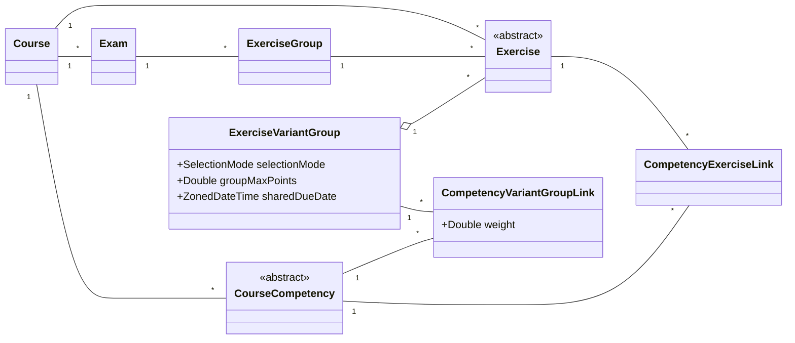
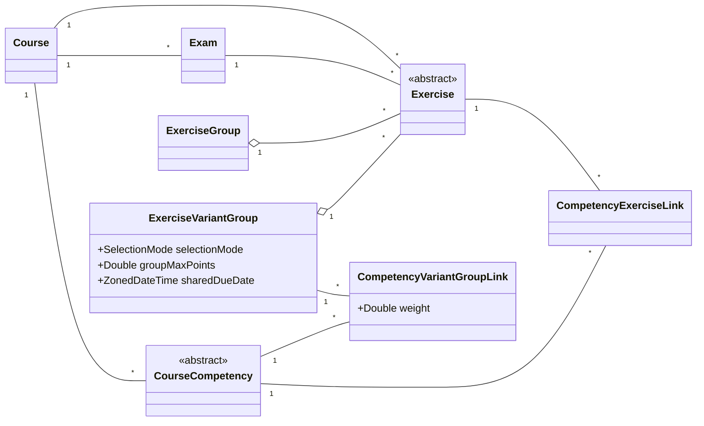

# Exercise Variant Group: Object Model

This document describes the data model for exercise variant groups and their relationship to
competencies. Both diagrams below are **proposed** states, not the current Artemis model:

- **Iteration 1** introduces exercise-variant support. The exam `ExerciseGroup` stays wired exactly
  as it is today.
- **Iteration 2** additionally restructures the exam `ExerciseGroup` so it is consistent with the
  new `ExerciseVariantGroup`.

Only the **new** elements (`ExerciseVariantGroup`, `CompetencyVariantGroupLink`) are explained in
detail; the surrounding classes are shown with the minimal attributes needed for clarity.

---

## Iteration 1 — Introduce exercise variants (exam group unchanged)

An `Exercise` belongs to **either** a `Course` **or** an exam `ExerciseGroup` (mutually exclusive);
exam exercises reach their course via `ExerciseGroup → Exam → Course`.

---

## Iteration 2 — Restructure exam groups for consistency

Identical to iteration 1, except the exam `ExerciseGroup` now mirrors `ExerciseVariantGroup`: it
becomes a pure grouping construct that only aggregates `Exercise`s, and exercises connect to the
`Exam` directly instead of through the group.

Both `ExerciseGroup` and `ExerciseVariantGroup` are now symmetric: each only aggregates exercises,
while the `Exercise` keeps its direct links to `Course` and `Exam`.

---

## What's new

**ExerciseVariantGroup** holds the shared settings for a group of exercise variants: how the
group's score is capped (`groupMaxPoints`), a common due date (`sharedDueDate`), and a
`selectionMode` that controls how many variants count towards a student's score. It only aggregates
`Exercise`s — it has no relation to `Course`; exercises keep their existing `Course` link.

**CompetencyVariantGroupLink** is the group-level analogue of the existing `CompetencyExerciseLink`.
It bridges an `ExerciseVariantGroup` to a `CourseCompetency` with a `weight` that controls how much
the group contributes to mastery of that competency.
