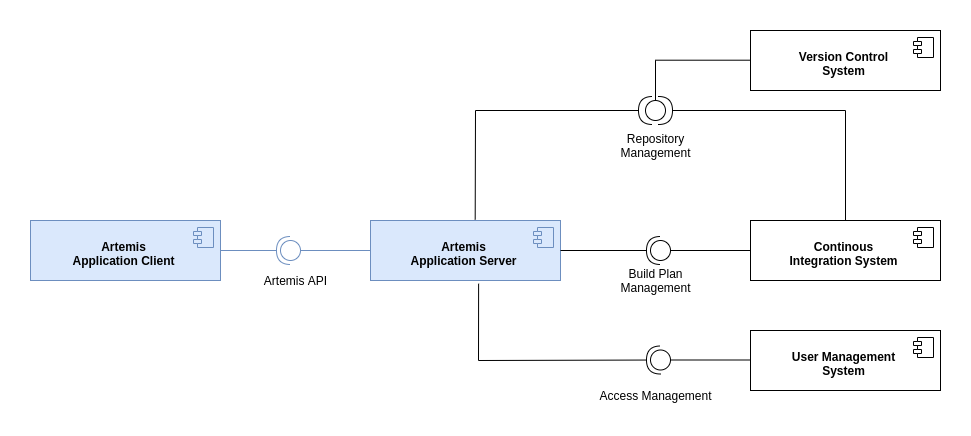
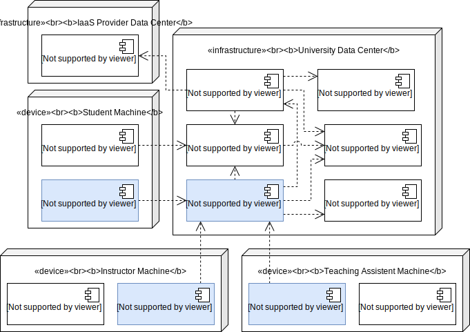
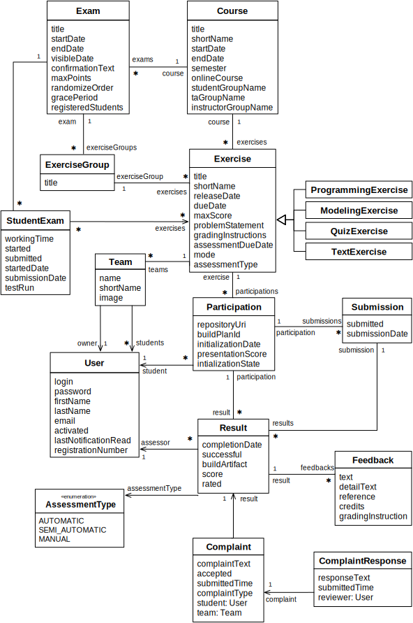

# Artemis: Interactive Learning with Individual Feedback 

[](https://github.com/ls1intum/Artemis/actions/workflows/build-deploy.yml)
[](https://github.com/ls1intum/Artemis/actions/workflows/test.yml)
[](https://docs.artemis.ase.in.tum.de)
[](https://www.codacy.com/gh/ls1intum/Artemis?utm_source=github.com&amp;utm_medium=referral&amp;utm_content=ls1intum/Artemis&amp;utm_campaign=Badge_Grade)
[](https://www.codacy.com/gh/ls1intum/Artemis?utm_source=github.com&utm_medium=referral&utm_content=ls1intum/Artemis&utm_campaign=Badge_Coverage)
[](https://github.com/ls1intum/Artemis/releases/latest)

## Main features

1. **[Programming exercises](https://docs.artemis.ase.in.tum.de/user/exercises/programming/)** with version control, automatic individual feedback (and assessment) based on test cases and static code analysis (executed using continuous integration). 
   * **Instant**: Students receive immediate and individual feedback on submissions. Instructors can customize feedback messages easily, hide feedback during the working time (e.g., with hidden tests)
   * **Interactive:** Instructors integrate interactive instructions based on tasks and UML diagrams directly into the dynamic problem statements. They can define hints for difficult exercise parts.
   * **Independent**: Instructors can customize programming exercises to support any programming language. To simplify the setup, Artemis includes sophisticated templates for the most common languages (e.g., Java, Python, C, Haskell, Kotlin, VHDL, Assembler, Swift, Ocaml, ...)
   * **Local and online**: Students can participate locally in their preferred IDE or in the online code editor (without any setup)
   * **Manual reviews** are possible directly in the online code editor or in [Orion](https://github.com/ls1intum/Orion)
   * **Policies**: Instructors can define submission policies (e.g., penalties after 10 attempts) to prevent that students try out all possibilities without thinking.
   * **Grading**: Instructors have many options to configure grading, analyze the results based on tests and static code analysis categories and re-evaluate the results
   * **Secure**: Test cases and student code run in Docker environments on build agents. Test frameworks such as [Ares](https://github.com/ls1intum/Ares) simplify the creation of structural and dynamic tests and prevent that students can cheat. 
2. **[Quiz exercises](https://docs.artemis.ase.in.tum.de/user/exercises/quiz/)** with multiple choice, drag and drop, and short answer questions
    * **Modeling quizzes**: Instructors can easily create drag and drop quizzes based on UML models
    * **Different modes**: Quizzes support a live mode (rated) during lectures, a practice mode for students to repeat the quiz as often as they want, and an exam mode (see below)
3. **[Modeling exercises](https://docs.artemis.ase.in.tum.de/user/exercises/modeling/)** based on the easy-to-use online modeling editor [Apollon](https://apollon.ase.in.tum.de) with semi-automatic assessment using machine learning concepts
   * **Multiple diagram types**: Artemis supports 7 UML diagram types (e.g. class diagrams) and 4 additional diagrams (e.g. flow charts)
   * **Easy to use**: Students can create models easily using drag and drop, they can explain the models using additional text.
   * **Integrated feedback**: Reviews can provide feedback and points directly next to the model elements.
4. **[Text exercises](https://docs.artemis.ase.in.tum.de/user/exercises/textual/)** with manual, semi-automatic assessment based on supervised machine learning and natural language processing (NLP) using [Athena](https://github.com/ls1intum/Athena)
   * **Integrated feedback**: Reviews can provide feedback and points directly next to the text segments.
   * **Language detection**: Artemis detects the language of the submission and shows the word and character count. 
5. **[File upload exercises](https://docs.artemis.ase.in.tum.de/user/exercises/file-upload/)** with manual assessment
6. **[Exam mode](https://docs.artemis.ase.in.tum.de/user/exam_mode/)**: Instructors can create online exams with exercise variants, integrated plagiarism checks, test runs and student reviews. You can find more information on [Exam mode student features](https://artemis.ase.in.tum.de/features/students) and on [Exam mode instructor features](https://artemis.ase.in.tum.de/features/instructors).
7. **Grading**: Instructors can configure grade keys for courses and exams to automatically calculate grades and display them to students. Grades can be easily exported as csv files to upload them into university systems (such as Campus online)
8. **Assessment**: Artemis uses double-blind grading and structured grading criteria to improve consistency and fairness. It integrates an assessment training process (based on example submissions and example assessments defined by the instructor), has a grading leader board, and allows students to rate the assessments. Students can complain or ask for more feedback.   
9. **[Communication](https://docs.artemis.ase.in.tum.de/user/communication/)**: Instructors can post announcements. Students can ask questions, post comments, and react to other posts. Tutors can filter unanswered questions.
10. **[Notifications](https://docs.artemis.ase.in.tum.de/user/notifications)**: Artemis supports customizable web and email notifications. Users can enable and disable different notification types.
11. **[Team Exercises](https://docs.artemis.ase.in.tum.de/user/exercises/team-exercises/)**: Instructors can configure team exercises with real time collaboration and dedicated tutors per team.
12. **[Lectures](https://docs.artemis.ase.in.tum.de/user/lectures/)**: Instructors can upload lecture slides, divide lectures into units, integrate video streams, lecture recordings, and exercises into lectures, and define learning goals.
13. **[Integrated Markdown Editor](https://docs.artemis.ase.in.tum.de/user/markdown-support/)**: Markdown is used to format text content across the platform using an integrated markdown editor.
14. **Plagiarism checks**: Artemis integrates plagiarism checks for programming exercises (based on [JPlag](https://github.com/jplag/JPlag)), text exercises, and modeling exercises. It allows notifying students about identified plagiarism. Students can review and comment on the allegation. 
15. **[Learning analytics](https://docs.artemis.ase.in.tum.de/user/learning-analytics/)**: Artemis integrated different statistics for students to compare themselves to the course average. It allows instructors to evaluate the average student performance based on exercises and learning goals.
16. **Scalable**: Artemis scales to multiple courses with thousands of students. In fact, the largest course had 2,400 students. Administrators can easily scale Artemis with additional build agents in the continuous integration environment.
17. **[High user satisfaction](https://docs.artemis.ase.in.tum.de/user/user-experience/)**: Artemis is easy to use, provides guided tutorials. Developers focus on usability, user experience, and performance.
18. **Customizable**: It supports multiple instructors, editors, and tutors per course and allows instructors to customize many course settings
19. **[Open-source](https://docs.artemis.ase.in.tum.de/dev/open-source/)**: Free to use with a large community and many active maintainers.

## Roadmap

The Artemis development team prioritizes the following issues in the future. We welcome feature requests from students, tutors, instructors, and administrators. We are happy to discuss any suggestions for improvements.

* **Short term**: Further enhance the usability and user experience in different places based on best practices
* **Short term**: Further increase the coverage of automatic tests to secure the quality of Artemis releases and to prevent bugs 
* **Medium term**: Further improve discussions and provide communication channels
* **Medium term**: Develop grading strategies (e.g., homework counts as bonus to an exam)
* **Medium term**: Improve semi-automatic assessment by reusing knowledge from previous exercises and by offering it for the manual assessment of programming exercises
* **Medium term**: Improve the integration of learning analytics for students and instructors
* **Medium term**: Microservices, Kubernetes based deployment, and micro frontends
* **Long term**: Allow students to take notes on lecture slides and support the automatic updates of lecture slides
* **Long term**: Develop an exchange platform for exercises
* **Long term**: Integrate adaptive learning with different exercise difficulties and the automatic generation of hints

## Setup, guides, and contributing

### Development setup, coding, and design guidelines

* [How to set up your local development environment](https://docs.artemis.ase.in.tum.de/dev/setup/)
* [Server coding and design guidelines](https://docs.artemis.ase.in.tum.de/dev/guidelines/server/)
* [Client coding and design guidelines](https://docs.artemis.ase.in.tum.de/dev/guidelines/client/)
* [Code Review Guidelines](https://docs.artemis.ase.in.tum.de/dev/guidelines/code-review/)

### Documentation

The Artemis documentation is available [here](https://docs.artemis.ase.in.tum.de/).
You can find a guide on [how to write documentation](docs/README.md).

### Server setup

You can set up Artemis in conjunction with either [`GitLab and Jenkins`](https://docs.artemis.ase.in.tum.de/dev/setup/jenkins-gitlab) or with [`Jira, Bitbucket and Bamboo`](https://docs.artemis.ase.in.tum.de/dev/setup/bamboo-bitbucket-jira).
Artemis uses these external tools for user management and the configuration of programming exercises.

### Administration setup

If needed, you can configure self service [user registration](https://docs.artemis.ase.in.tum.de/admin/registration).

### Contributing 

Please read the guide on [how to contribute](/CONTRIBUTING.md) to Artemis.

### Building for production

To build and optimize the Artemis application for production, run:

```shell
./gradlew -Pprod -Pwar clean bootWar
```

This will create a Artemis-<version>.war file in the folder `build/libs`. The build command compiles the TypeScript into JavaScript files, concatenates and minifies the created files (including HTML and CSS files). It will also modify `index.html` so it references these new files. To ensure everything worked, run the following command to start the application on your local computer:

```shell
java -jar build/libs/*.war --spring.profiles.active=dev,artemis,bamboo,bitbucket,jira
```

(You might need to copy a yml file into the folder build/libs before, also see [development setup](https://docs.artemis.ase.in.tum.de/dev/setup/))

Then navigate to [http://localhost:8080](http://localhost:8080) in your browser.

Refer to [Using JHipster in production](http://www.jhipster.tech/production) for more details.

The following command can automate the deployment to a server. The example shows the deployment to the main Artemis test server (which runs a virtual machine):

```shell
./artemis-server-cli deploy username@artemistest.ase.in.tum.de -w build/libs/Artemis-4.4.5.war
```

## Architecture

The following diagram shows the top level design of Artemis which is decomposed into an application client (running as Angular web app in the browser) and an application server (based on Spring Boot). For programming exercises, the application server connects to a version control system (VCS) and a continuous integration system (CIS). Authentication is handled by an external user management system (UMS).



While Artemis includes generic adapters to these three external systems with a defined protocol that can be instantiated to connect to any VCS, CIS, or UMS, it also provides 3 concrete implementations for these adapters to connect to:

1. **VCS:** Atlassian Bitbucket Server
2. **CIS:** Atlassian Bamboo Server
3. **UMS:** Atlassian JIRA Server (more specifically Atlassian Crowd on the JIRA Server)

### Server architecture

The following UML component diagram shows more details of the Artemis application server architecture and its REST interfaces to the application client.


### Deployment

The following UML deployment diagram shows a typical deployment of Artemis application server and application client. Student, Instructor, and Teaching Assistant (TA) computers are all equipped equally with the Artemis application client being displayed in the browser.

The Continuous Integration Server typically delegates the build jobs to local build agents within the university infrastructure or to remote build agents, e.g., hosted in the Amazon Cloud (AWS).



### Data model

The Artemis application server uses the following (simplified) data model in the MySQL database. It supports multiple courses with multiple exercises. Each student in the participating student group can participate in the exercise by clicking the **Start Exercise** button. 
Then a repository and a build plan for the student (User) will be created and configured. The initialization state helps to track the progress of this complex operation and allows recovering from errors. 
A student can submit multiple solutions by committing and pushing the source code changes to a given example code into the version control system or using the user interface. The continuous integration server automatically tests each submission and notifies the Artemis application server when a new result exists. 
In addition, teaching assistants can assess student solutions and "manually" create results.



Please note that the actual database model is more complex. The UML class diagram above omits some details for readability (e.g., lectures, student questions, exercise details, static code analysis, quiz questions, exam sessions, submission subclasses, etc.)

### Artemis Community

There is a growing community of university instructors who are using Artemis.

#### Communication
    
[](https://matrix.to/#/#artemis:in.tum.de)

We communicate using GitHub issues and pull requests. Additionally, you can join us on Slack to ask questions and get support. If you are interested, please send an email to [Stephan Krusche](mailto:krusche@in.tum.de).

#### Universities with Artemis in Use

The following universities are actively using Artemis or are currently evaluating Artemis.

##### Technical University of Munich

* https://artemis.ase.in.tum.de 
* Main contact person: [Stephan Krusche](mailto:krusche@in.tum.de)

##### LFU Innsbruck, Uni Salzburg, JKU Linz, AAU Klagenfurt, TU Wien

* https://artemis.codeability.uibk.ac.at
* [codeAbility project](https://codeability.uibk.ac.at)
* Main contact person: [Michael Breu](mailto:Michael.Breu@uibk.ac.at)

##### University of Stuttgart

* https://artemis.sqa.ddnss.org
* Main contact person: [Steffen Becker](mailto:steffen.becker@informatik.uni-stuttgart.de)

##### Universität Passau

* https://artemis.se2.fim.uni-passau.de
* Main contact person: [Benedikt Fein](mailto:fein@fim.uni-passau.de)

##### Karlsruhe Institute of Technology

* https://artemis.praktomat.cs.kit.edu
* Main contact person: [Dominik Fuchß](mailto:dominik.fuchss@kit.edu)

##### Hochschule München

* https://artemis.cs.hm.edu
* Main contact person: [Michael Eggers](mailto:michael.eggers@hm.edu)

##### Interested universities

* TU Dresden
* HU Berlin
