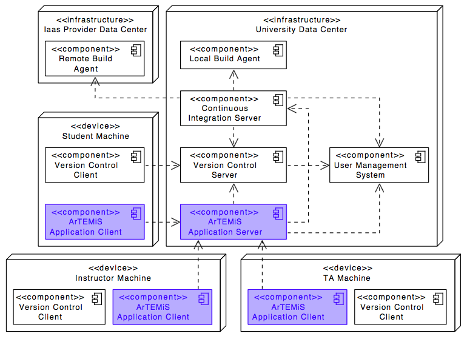
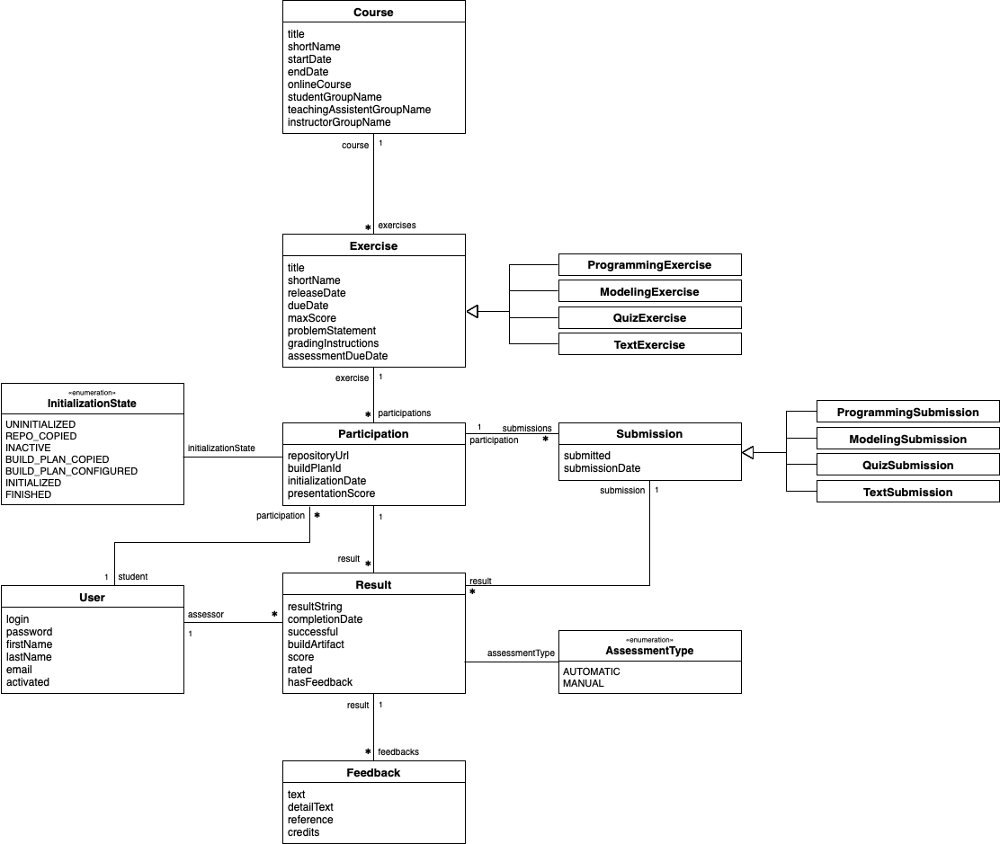

# Artemis: Automated Assessment Management System 
This application was generated using JHipster 5.7.0, you can find documentation and help at [http://www.jhipster.tech/documentation-archive/v5.7.0](http://www.jhipster.tech/documentation-archive/v5.7.0).

**Current version:** 2.3.1

## Main features
Artemis supports the following exercises:
1. **Programming exercises** with version control and automatic assessment with test cases and continuous integration
2. **Quiz exercises** with multiple choice questions and drag and drop questions 
3. **Modeling exercises** with semi-automatic assessment using machine learning concepts (beta)
4. **Text exercises** with manual assessment (beta)

All these exercises are supposed to be run either live in-class with instant feedback or as homework. Students can submit their solutions multiple times within the due date and use the (semi-)automatically provided feedback to improve their solution.

## Top-Level Design

The following UML diagram shows the top-level design of Artemis which is decomposed into an application client and an application server. The application server then connects to a version control system (VCS), a continuous integration system (CIS) and a user management system (UMS).


While Artemis includes generic adapters to these three external systems with a defined protocol which can be instantiated to connect to any VCS, CIS or UMS, it also provides 3 concrete implementations for these adapters to connect to:

1. **VCS:** Atlassian Bitbucket Server
2. **CIS:** Atlassian Bamboo Server
3. **UMS:** Atlassian JIRA Server (more specifically Atlassian Crowd on the JIRA Server)

## Programming Exercise Workflow

Conducting a programming exercise consists of 7 steps distributed among instructor, Artemis and students:

1. **Instructor prepares exercise:** Set up a repository containing the exercise code and test cases, build instructions on the CI server, and configures the exercise in Artemis.
2. **Student starts exercise:** Click on start exercise on Artemis which automatically generates a copy of the repository with the exercise code and configures a build plan accordingly.
3. **Optional: Student clones repository:** Clone the personalized repository from the remote VCS to the local machine.
4. **Student solves exercise:** Solve the exercise with an IDE of choice on the local computer or in the online editor.
5. **Student uploads solution:** Upload changes of the source code to the VCS by committing and pushing them to the remote server (or by clicking submit in the online editor).
6. **CI server verifies solution:** verify the student's submission by executing the test cases (see step 1) and provide feedback which parts are correct or wrong.
7. **Student reviews personal result:** Reviews build result and feedback using Artemis. In case of a failed build, reattempt to solve the exercise (step 4).
8. **Instructor reviews course results:** Review overall results of all students, and react to common errors and problems.

The following activity diagram shows this exercise workflow. 


## Online Editor

The following screenshot shows the online editor with interactive and dynamic exercise instructions on the right side.
Tasks and UML diagram elements are referenced by test cases and update their color from red to green after students submit a new version and all test cases associated with a task or diagram element pass.
This allows the students to immediately recognize which tasks are already fulfilled and is particularly helpful for programming beginners.


## Development Setup

Artemis is based on [JHipster](https://jhipster.github.io), i.e. [Spring Boot](http://projects.spring.io/spring-boot) development on the application server using Java 8, and TypeScript development on the application client in the browser using [Angular 7](https://angular.io) and Webpack. To get an overview of the used technology, have a look at [https://jhipster.github.io/tech-stack](https://jhipster.github.io/tech-stack) and other tutorials on the JHipster homepage.  

You can find tutorials how to setup JHipster in an IDE ([IntelliJ](https://www.jetbrains.com/idea) is recommended, but it also runs in other IDEs as well) on [https://jhipster.github.io/configuring-ide](https://jhipster.github.io/configuring-ide).
Before you can build Artemis, you must install and configure the following dependencies/tools on your machine:

1. [Java 8 JDK](http://www.oracle.com/technetwork/java/javase/downloads/jdk8-downloads-2133151.html): Java is the main development language for the server application of Artemis. (Please note that newer versions of Java might work, but are not yet supported)
2. [MySQL Database Server 5.7.x](https://dev.mysql.com/downloads/mysql): Artemis uses Hibernate to store entities in a MySQL database. Download and install the MySQL Community Server (5.7.x) and configure the 'root' user with an empty password. (In case you want to use a different password, make sure to change the value in application-dev.yml and in liquibase.gradle). The required Artemis scheme will be created / updated automatically at startup time of the server application. (Please note that MySQL 8 is not yet supported)
3. [Node.js](https://nodejs.org): We use Node (>=6.9.0 and <= 10.x) to run a development web server and build the project. Depending on your system, you can install Node either from source or as a pre-packaged bundle. (Please note that Node 11 has an annoying bug, so it is recommended to use the latest version of Node 10.x)
4. [Yarn 1.9.x](https://yarnpkg.com): We use Yarn to manage Node dependencies.
Depending on your system, you can install Yarn either from source or as a pre-packaged bundle.

### Server Setup

To start the Artemis application server from the development environment, first import the project into IntelliJ and then make sure to install the Spring Boot plugins to run the main class de.tum.in.www1.artemis.ArTEMiSApp. Before the application runs, you have to configure the file `application-artemis.yml` in the folder `src/main/resources/config`. 

```
artemis:
  repo-clone-path: ./repos/
  encryption-password: <encrypt-password>
  result-retrieval-delay: 5000
  jira:
    url: https://jirabruegge.in.tum.de
    user: <username>
    password: <password>
    admin-group-name: tumuser
  bitbucket:
    url: https://repobruegge.in.tum.de
    user: <username>
    password: <password>
  bamboo:
    url: https://bamboobruegge.in.tum.de
    bitbucket-application-link-id: de1bf2e0-eb40-3a2d-9494-93cbe2e22d08
    user: <username>
    password: <password>
    empty-commit-necessary: true
  lti:
    id: artemis_lti
    oauth-key: artemis_lti_key
    oauth-secret: <secret>
    user-prefix: edx_
    user-group-name: edx
  git:
    name: artemis
    email: artemis@in.tum.de
```
Change all entries with ```<...>``` with proper values, e.g. your TUM Online account credentials to connect to the given instances of JIRA, Bitbucket and Bamboo. Alternatively, you can connect to your local JIRA, Bitbucket and Bamboo instances.
Be careful that you don't commit changes in this file. Best practice is to specify that your local git repository ignores this file or assumes that this file is unchanged. 

The Artemis server should startup by running the main class ```de.tum.in.www1.artemis.ArTEMiSApp``` using Spring Boot.

One typical problem in the development setup is that an exception occurs during the database initialization. Artemis uses [Liquibase](https://www.liquibase.org) to automatically upgrade the database scheme after changes to the data model. This ensures that the changes can also be applied to the production server. In some development environments, it can be the case that the liquibase migration from an empty database scheme to the current version of the database scheme fails, e.g. due to the fact that the asynchronous migration is too slow. In these cases, it can help to manually import an existing database scheme using e.g. MySQL Workbench or Sequel Pro into the `Artemis` database scheme in your MySQL server. You can find a recent scheme in the `data` folder in this git repository. If you then start the application server, liquibase will recognize that all migration steps have already been executed. In case you encounter errors with liquibase checksum values, run the following command in your terminal / command line:

```
java -jar liquibase-core-3.5.3.jar --url=jdbc:mysql://localhost:3306/ArTEMiS --username=root --password='' --classpath=mysql-connector-java-5.1.43.jar  clearCheckSums
```
You can download the required jar files here:

* [liquibase-core-3.5.3.jar](http://central.maven.org/maven2/org/liquibase/liquibase-core/3.5.3/liquibase-core-3.5.3.jar)
* [mysql-connector-java-5.1.43.jar](http://central.maven.org/maven2/mysql/mysql-connector-java/5.1.43/mysql-connector-java-5.1.43.jar)


**Please note:** Artemis uses Spring profiles to segregate parts of the application configuration and make it only available in certain environments. For development purposes, the following program arguments can be used to enable the `dev` profile and the profiles for JIRA, Bitbucket and Bamboo:

    --spring.profiles.active=dev,bamboo,bitbucket,jira,artemis

### Client Setup

After installing Node, you should be able to run the following command to install development tools. You will only need to run this command when dependencies change in [package.json](package.json).

```
yarn install
```

To start the client application in the browser, use the following command:

```
yarn start
```

This compiles TypeScript code to JavaScript code, starts the hot module replacement feature in Webpack (i.e. whenever you change a TypeScript file and save, the client is automatically reloaded with the new code) and will start the client application in your browser on `http://localhost:9000`. If you have activated the JIRA profile (see above in Server Setup) and if you have configured `application-artemis.yml` correctly, then you should be able to login with your TUM Online account.

For more information, review [Working with Angular](https://www.jhipster.tech/development/#working-with-angular). For further instructions on how to develop with JHipster, have a look at [Using JHipster in development](http://www.jhipster.tech/development).


## Building for production

To optimize the Artemis application for production, run:

```
./gradlew -Pprod bootWar
```

This will compile the TypeScript into JavaScript files, concatenate and minify them and the CSS files. It will also modify `index.html` so it references these new files. To ensure everything worked, run:

```
java -jar build/libs/*.war
```

Then navigate to [http://localhost:8080](http://localhost:8080) in your browser.

Refer to [Using JHipster in production](http://www.jhipster.tech/production) for more details.

## Deployment

The following UML deployment diagram shows a typical deployment of Artemis application server and application client. Student, Instructor and Teaching Assistant (TA) computers are all equipped equally with the Artemis application client being displayed in the browser.

The Continuous Integration Server typically delegates the build jobs to local build agents within the university infrastructure or to remote build agents, e.g. hosted in the Amazon Cloud (AWS).




## Data Model

The Artemis application server used the following (initial) data model in the MySQL database. It supports multiple courses with multiple exercises. Each student in the participating student group can participate in the exercise by clicking the **Start Exercise** button. Then a repository and a build plan for the student (User) will be created and configured. The initialization state variable (Enum) helps to track the progress of this complex operation and allows to recover from errors. A student can submit multiple solutions by committing and pushing the source code changes to a given example code into the version control system. Each submission is automatically tested by the continuous integration server, which notifies the Artemis application server, when a new result exists. In addition, teaching assistants can assess student solutions and "manually" create results.
The current data model is more complex and supports different types of exercises such as programming exercises, modeling exercises and quiz exercises.



In the future, we want to allow different types of exercises, so expect multiple subclasses for programming, modeling and quiz exercises.


## Server Architecture

The following UML component diagram shows more details of the Artemis application server architecture and its REST interfaces to the application client.


## Adapters

The following UML component diagram shows the details of the Version Control Adapter that allows to connect to multiple Version Control Systems. The other adapters for Continuous Integration and User Management have a similar structure


The **Version Control Adapter** includes abstract interface definitions. Among others, concrete connectors have to implement the following methods:

```
+ copyRepository(baseRepository, user)
+ configureRepository(repository, user)
+ deleteRepository(repository)
+ getRepositoryWebUrl(repository)
+ ...
```

The **Continuous Integration Adapter** includes abstract interface definitions. Among others, concrete connectors have to implement the following methods:

```
+ copyBuildPlan(baseBuildPlan, user)
+ configureBuildPlan(buildPlan, repository, user)
+ deleteBuildPlan(buildPlan)
+ onBuildCompleted(buildPlan)
+ getBuildStatus(buildPlan)
+ getBuildDetails(buildPlan)
+ getBuildPlanWebUrl(buildPlan)
+ ...
```
