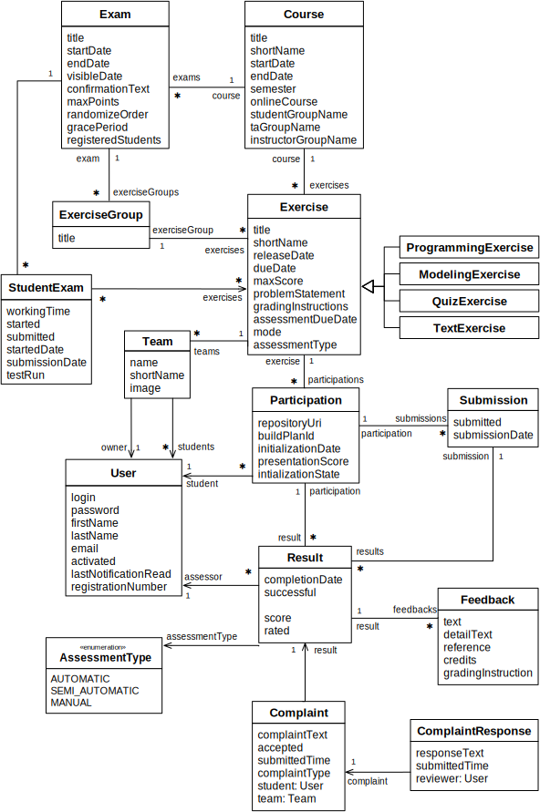

# Artemis: Interactive Learning with Individual Feedback 

[](https://github.com/ls1intum/Artemis/actions/workflows/build-deploy.yml)
[](https://github.com/ls1intum/Artemis/actions/workflows/test.yml)
[](https://docs.artemis.ase.in.tum.de)
[](package.json)
[](package.json)
[](https://www.codacy.com/gh/ls1intum/Artemis?utm_source=github.com&amp;utm_medium=referral&amp;utm_content=ls1intum/Artemis&amp;utm_campaign=Badge_Grade)
[](https://www.codacy.com/gh/ls1intum/Artemis?utm_source=github.com&utm_medium=referral&utm_content=ls1intum/Artemis&utm_campaign=Badge_Coverage)

Artemis was initially generated using JHipster 7.2.0. ([Documentation and help](http://www.jhipster.tech/documentation-archive/v7.2.0))

[](https://github.com/ls1intum/Artemis/releases/latest)

## Main features
Artemis supports the following exercises:
1. **[Programming exercises](https://docs.artemis.ase.in.tum.de/user/exercises/programming/)** with version control and automatic assessment with test cases and continuous integration
2. **[Quiz exercises](https://docs.artemis.ase.in.tum.de/user/exercises/quiz/)** with multiple choice, drag and drop and short answer quiz questions
3. **[Modeling exercises](https://docs.artemis.ase.in.tum.de/user/exercises/modeling/)** with semi-automatic assessment using machine learning concepts
4. **[Text exercises](https://docs.artemis.ase.in.tum.de/user/exercises/textual/)** with manual (and experimental semi-automatic) assessment
5. **[File upload exercises](https://docs.artemis.ase.in.tum.de/user/exercises/file-upload/)** with manual assessment

Artemis supports all these exercises to run either live in the lecture with instant feedback or as homework. Students can submit their solutions multiple times within the due date and use the (semi-)automatically provided feedback to improve their solution.

Artemis also supports an exam mode now. You can find more information on [Exam mode student features](https://artemis.ase.in.tum.de/features/students) and on [Exam mode instructor features](https://artemis.ase.in.tum.de/features/instructors).

## Setup, guides and contributing

### Development setup, coding and design guidelines

* [How to set up your local development environment](https://docs.artemis.ase.in.tum.de/dev/setup/)
* [Server coding and design guidelines](https://docs.artemis.ase.in.tum.de/dev/guidelines/server/)
* [Client coding and design guidelines](https://docs.artemis.ase.in.tum.de/dev/guidelines/client/)
* [Code Review Guidelines](https://docs.artemis.ase.in.tum.de/dev/guidelines/code-review/)

### Documentation

The Artemis documentation is available [here](https://docs.artemis.ase.in.tum.de/).
You can find a guide on [how to write documentation](docs/README.md).

### Server setup

You can set up Artemis in conjunction with either [`GitLab and Jenkins`](https://docs.artemis.ase.in.tum.de/dev/setup/jenkins-gitlab/) or with [`Jira, Bitbucket and Bamboo`](https://docs.artemis.ase.in.tum.de/dev/setup/bamboo-bitbucket-jira/).
Artemis uses these external tools for user management and the configuration of programming exercises.

### Administration setup

If needed, you can configure self-service [user registration](https://docs.artemis.ase.in.tum.de/admin/registration/).

### Contributing 

Please read the guide on [how to contribute](/CONTRIBUTING.md) to Artemis.

### Building for production

To build and optimize the Artemis application for production, run:

```shell
./gradlew -Pprod -Pwar clean bootWar
```

This will create a Artemis-<version>.war file in the folder `build/libs`. The build command compiles the TypeScript into JavaScript files, concatenates and minifies the created files (including HTML and CSS files). It will also modify `index.html` so it references these new files. To ensure everything worked, run the following command to start the application on your local computer:

```shell
java -jar build/libs/*.war --spring.profiles.active=dev,artemis,bamboo,bitbucket,jira
```

(You might need to copy a yml file into the folder build/libs before, also see [development setup](https://docs.artemis.ase.in.tum.de/dev/setup/))

Then navigate to [http://localhost:8080](http://localhost:8080) in your browser.

Refer to [Using JHipster in production](http://www.jhipster.tech/production) for more details.

The following command can automate the deployment to a server. The example shows the deployment to the main Artemis test server (which runs a virtual machine):

```shell
./artemis-server-cli deploy username@artemistest.ase.in.tum.de -w build/libs/Artemis-4.4.5.war
```

## Architecture

The following diagram shows the top level design of Artemis which is decomposed into an application client (running as Angular web app in the browser) and an application server (based on Spring Boot). For programming exercises, the application server connects to a version control system (VCS) and a continuous integration system (CIS). Authentication is handled by an external user management system (UMS).


While Artemis includes generic adapters to these three external systems with a defined protocol that can be instantiated to connect to any VCS, CIS or UMS, it also provides 3 concrete implementations for these adapters to connect to:

1. **VCS:** Atlassian Bitbucket Server
2. **CIS:** Atlassian Bamboo Server
3. **UMS:** Atlassian JIRA Server (more specifically Atlassian Crowd on the JIRA Server)

### Server architecture

The following UML component diagram shows more details of the Artemis application server architecture and its REST interfaces to the application client.


### Deployment

The following UML deployment diagram shows a typical deployment of Artemis application server and application client. Student, Instructor and Teaching Assistant (TA) computers are all equipped equally with the Artemis application client being displayed in the browser.

The Continuous Integration Server typically delegates the build jobs to local build agents within the university infrastructure or to remote build agents, e.g. hosted in the Amazon Cloud (AWS).


### Data model

The Artemis application server uses the following (simplified) data model in the MySQL database. It supports multiple courses with multiple exercises. Each student in the participating student group can participate in the exercise by clicking the **Start Exercise** button. 
Then a repository and a build plan for the student (User) will be created and configured. The initialization state helps to track the progress of this complex operation and allows recovering from errors. 
A student can submit multiple solutions by committing and pushing the source code changes to a given example code into the version control system or using the user interface. The continuous integration server automatically tests each submission, and notifies the Artemis application server, when a new result exists. 
In addition, teaching assistants can assess student solutions and "manually" create results.



Please note, that the actual database model is more complex. The UML class diagram above omits some details for readability (e.g. lectures, student questions, exercise details, static code analysis, quiz questions, exam sessions, submission subclasses, etc.)

### Artemis Community

There is a growing community of university instructors who are using Artemis.

#### Communication

We communicate using Github issues and pull requests. Additionally, you can join us on Slack to ask questions and get support. If you are interested, please send an email to [Stephan Krusche](mailto:krusche@in.tum.de).

#### Universities with Artemis in Use

The following universities are actively using Artemis or are currently evaluating Artemis.

##### Technical University of Munich

* https://artemis.ase.in.tum.de 
* Main contact person: [Stephan Krusche](mailto:krusche@in.tum.de)

##### LFU Innsbruck, Uni Salzburg, JKU Linz, AAU Klagenfurt, TU Wien

* https://artemis.codeability.uibk.ac.at
* [codeAbility project](https://codeability.uibk.ac.at)
* Main contact person: [Michael Breu](mailto:Michael.Breu@uibk.ac.at)

##### University of Stuttgart

* https://artemis.sqa.ddnss.org
* Main contact person: [Steffen Becker](mailto:steffen.becker@informatik.uni-stuttgart.de)

##### Universität Bonn

* https://alpro.besec.uni-bonn.de 
* Main contact person: [Alexander von Trostorff](mailto:s6alvont@uni-bonn.de)

##### Universität Passau

* https://artemis.se2.fim.uni-passau.de
* Main contact person: [Christian Bachmaier](mailto:bachmaier@fim.uni-passau.de)

##### Karlsruhe Institute of Technology

* https://artemis.praktomat.cs.kit.edu
* Main contact person: [Dominik Fuchß](mailto:dominik.fuchss@kit.edu)
