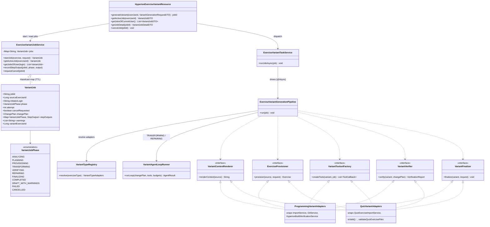
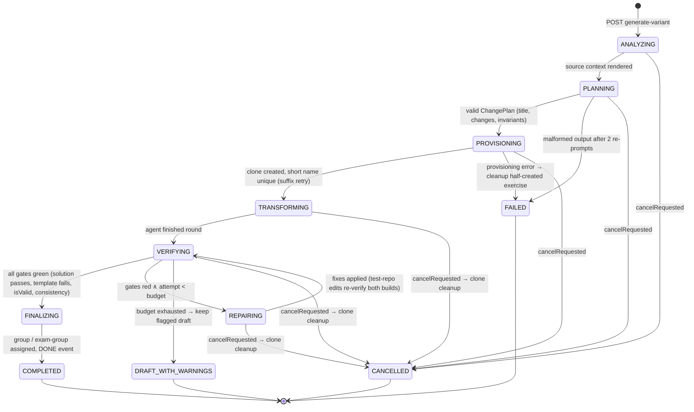
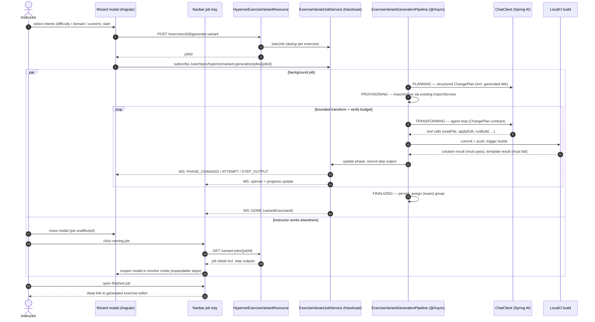

# AI Exercise Variants Generation — Implementation Plan

**Goal:** Make the existing "Create Variant with AI" button (currently a UI-only wizard) generate real, high-quality exercise variants — starting with programming and quiz exercises, with an architecture that extends to modeling, text, and file-upload exercises with minimal effort.

**Team & timeline:** Two master students, one week, AI coding tools. Programming + quiz must be production-quality by the end of the week; other types are architecture-proven stubs / future work.

---

## 1. Goal, Scope, and Quality Bar

### What a "variant" is

A variant is a copy of a source exercise, transformed along instructor-selected dimensions (the wizard already collects these):

- **Difficulty change** — easier or harder while keeping the topic (e.g. remove/add tasks, simplify/extend the required algorithm, adjust test strictness).
- **Domain change** — re-theme the exercise story/domain (e.g. "bank accounts" → "space station inventory") while preserving grading semantics.
- **Custom instructions** — free-text transformation requests.

The variant is placed standalone, in an existing `ExerciseVariantGroup`, or in a newly created group (all three placement paths already exist server-side).

### Quality bar (what "done" means)

| Exercise type | A generated variant MUST |
|---|---|
| Programming | Compile and pass **100% of tests in the solution repository**; **fail tests in the template repository**; have a consistent problem statement (tasks reference real test names); have unique short name / project key |
| Quiz | Pass `QuizExercise.isValid()` (every question valid: correct mappings, ≥1 correct MC option, valid SA spots/solutions); pass `validateQuizExerciseFiles` for DnD |
| Modeling (future work) | Even though full modeling support is future work, the quality bar is fixed now: any generated solution model MUST be a **valid Apollon UML model** — schema-valid JSON for the diagram type, all element/relationship references resolvable, renderable in the Apollon editor without repair. The modeling toolset/verifier stubs (Section 8) enforce this from day one |
| All | Be consistent with the source exercise except for the requested changes; be immediately editable by the instructor through the normal editors |

A variant that fails the final gates is **kept as a clearly flagged draft** (never silently published, never silently deleted) so the instructor can repair it in the editor — this respects the "system must recover from errors" requirement without throwing away expensive LLM work.

### Explicit non-goals for week 1

- Modeling/text/file-upload variants beyond the thin proof-of-extensibility adapter (Section 8).
- Regenerating drag-and-drop background/item **images** (source images are carried over unchanged).

**In scope (cheap win): exam-mode variants.** Exam exercise groups already exist, so exam support is only (a) showing the "Create Variant with AI" button on exam exercise rows and (b) a placement rule: **an exam variant is always placed in the same exam exercise group as its source** (no placement step in the wizard for exam exercises). See Section 5.5.

---

## 2. Architecture

### 2.1 Overview

The feature is a new Hyperion sub-module (`hyperion/service/variants/` + `hyperion/web/HyperionExerciseVariantResource.java`), because Hyperion already owns the Spring AI `ChatClient`, prompt templating, token accounting, the async-job + WebSocket pattern, and — critically — a working **commit → push → trigger CI → wait for result** loop.

```
Wizard (existing UI) ──POST /api/hyperion/exercises/{id}/generate-variant──▶ jobId
        ▲                                                                    │
        │  WebSocket progress events (phase transitions, files, attempts)    ▼
        └──────────  ExerciseVariantGenerationPipeline (async job)  ─────────┘
                                       │
   ┌───────────┬─────────────┬─────────┴────────┬──────────────┬─────────────┐
   ANALYZING   PLANNING      PROVISIONING       TRANSFORMING   VERIFYING     FINALIZING
   render      LLM produces  clone exercise     agent loop     deterministic assign group,
   source      ChangePlan    via existing       edits the      + semantic    publish DONE
   context     (structured)  ImportService      copy via tools gates         event
                                                      ▲              │
                                                      └──REPAIRING◀──┘  (bounded loop)
```

**Naming:** the phase-driving component is `ExerciseVariantGenerationPipeline` (working title in earlier drafts was "orchestrator" — dropped because the term is strongly associated with container orchestration/Kubernetes and means something different there; "pipeline" accurately describes the phased, largely one-directional flow with a single bounded back-edge, and is established thesis vocabulary). The term "orchestrator" is not used anywhere in code, prompts, or the thesis.

Design principle throughout: **the pipeline, planner, agent loop, and job/progress infrastructure are written once and are exercise-type-agnostic; everything type-specific lives behind small capability interfaces.**

### 2.2 Explicit phase state machine (not an implicit call chain)

A variant job advances through typed phases:

```java
enum VariantJobPhase {
    ANALYZING, PLANNING, PROVISIONING, TRANSFORMING, VERIFYING, REPAIRING, FINALIZING,
    COMPLETED, DRAFT_WITH_WARNINGS, FAILED, CANCELLED
}
```

The job record (jobId, exerciseId, initiating user, phase, attempt counter, `ChangePlan`, **per-phase step outputs** (Section 2.4), accumulated verifier findings, token usage) lives in a **Hazelcast map**, exactly like `HyperionCodeGenerationJobService.JobInfo` — distributed-safe, deduplicates concurrent jobs per exercise, survives the request thread, and — because it outlives the wizard — is what makes background generation and the navbar job tray (Section 5.4) possible.

**Why a state machine instead of one long method:** multi-minute jobs need attributable failures ("failed in VERIFYING, attempt 2/3, template build passed when it should fail"), per-phase recovery policies (Section 6), a 1:1 mapping to the wizard's progress steps (which are derived from this enum — Section 5.2), and per-phase telemetry for the thesis evaluation (Section 7).

### 2.3 Ports & adapters for exercise-type variability

**Rejected alternative:** one `VariantGenerationStrategy` per exercise type that owns its whole pipeline. This duplicates phase-sequencing/repair/progress logic N times and makes every cross-cutting quality improvement N-times work.

Instead, the pipeline depends on five small capability interfaces; each exercise type contributes one adapter per capability:

```java
interface VariantContextRenderer  { String renderContext(Exercise source); }
interface ExerciseProvisioner     { Exercise provision(Exercise source, VariantRequest req); }   // clone + uniqueness
interface VariantToolsetFactory   { List<ToolCallback> createTools(Exercise variant, VariantJob job); }
interface VariantVerifier         { VerificationReport verify(Exercise variant, ChangePlan plan); }
interface VariantFinalizer        { void finalize(Exercise variant, VariantRequest req); }        // group assignment, publish
```

A `VariantTypeRegistry` resolves the adapter bundle from Spring-injected lists keyed by `ExerciseType` — the standard Spring idiom (inject `List<T>`, pick by `supports(...)`), applied at the *capability* level rather than the pipeline level. Adding a new exercise type = implementing thin adapters; the pipeline, planner, agent loop, job infra, REST API, and client are untouched.

Most adapters are wrappers around existing, battle-tested services (Section 3/4) — very little new logic.

### 2.4 Structured planner before any edits (plan-then-execute)

The PLANNING phase is a dedicated LLM call with structured output (`BeanOutputConverter`, the established Hyperion pattern):

**Input:** rendered source-exercise context + wizard intent (target difficulty / domain text / custom instructions).

**Output — `ChangePlan` record:**
- the **generated variant title** — the LLM names the variant to fit the transformed exercise (essential for domain changes: "Bank Account Ledger" → "Cargo Bay Inventory"; a copied title would be wrong, and instructors shouldn't have to invent one up front). The short name is derived from it deterministically; collisions are handled by suffix retry (Section 6),
- the rewritten problem statement,
- an ordered list of concrete intended changes ("rename `BankAccount` → `CargoBay` across all repos", "remove task 3 and tests `testSortDescending*`"),
- **invariants to preserve** ("grading semantics unchanged: same number of tasks and weights", "test names referenced in problem statement tasks must exist in test repo").

The plan is stored on the job, and so is the **output of every completed phase** (`Map<VariantJobPhase, StepOutputDTO>`: the rendered plan, provisioned exercise id, per-attempt transform summaries and diffs-of-record, verification reports). In the generation modal each finished step is an **expandable panel** that reveals its output, so instructors can inspect what the LLM planned and did — during the run and after completion (Section 5.4). This is also loggable and directly evaluable for the thesis ("did the executed diff match the plan?"). The `ChangePlan` becomes the agent's contract in the TRANSFORMING phase.

**Why not encode intents as code-level step combinations** (e.g. a `DifficultyTransformation` + `DomainTransformation` class hierarchy): the intent space is open-ended (free-text custom instructions), so this variability belongs in the planner prompt, not the type system. Code-level intent branching adds classes without adding output quality.

### 2.5 Hybrid agentic core: one generic tool-calling loop for Transform + Repair

The deterministic scaffold (cloning, phase sequencing, final gates, group assignment) is classic code. The TRANSFORMING/REPAIRING phases run a **single reusable Spring AI tool-calling agent loop**, parameterized only by:

- the type's toolset (from `VariantToolsetFactory`),
- the `ChangePlan` (system prompt contract),
- an iteration budget (≈3–5 verify cycles) and a token budget (tracked via `LLMTokenUsageService`).

Toolsets per type:

| Programming | Quiz |
|---|---|
| `listFiles(repoType)` | `getQuestions()` |
| `readFile(repoType, path)` | `updateQuestion(index, questionJson)` |
| `applyEdit(repoType, path, search, replace)` / `writeFile` | `validateQuiz()` → wraps `isValid()` + per-question error details |
| `runBuild(repoType)` → commit, push, trigger CI (existing plumbing) | `finish(summary)` |
| `getBuildAndTestResults(repoType)` → compiler output + failed test names/messages | |
| `finish(summary)` | |

**Why an agent with tools instead of fixed prompt sequences:** correct variants require *closed-loop* behavior — reading the real compiler error or the real failing-test message and deciding what to fix. Fixed pipelines approximate this poorly (one hardcoded "repair prompt" per failure class). And because the loop is generic, all quality investment (loop robustness, budget handling, transcript logging) lands in one place and benefits every exercise type.

**Why not fully agentic end-to-end** (agent also clones, sets metadata, assigns groups): unbounded cost/latency, much harder to test deterministically, and the deterministic parts already exist as reliable services — an LLM re-doing them adds risk, not quality.

**Why not an external coding agent** (e.g. invoking a CLI agent on the checked-out repo): highest raw code quality, but a new runtime/ops dependency, credential surface, and deployment story — not appropriate for Artemis core and not needed, since Spring AI tool calling is already in-house (`SpringAIConfiguration.chatClient`).

Spring AI implementation note: register tools as `ToolCallback`s on the `ChatClient` call; Spring AI executes the tool-call loop internally per call — wrap it in an outer loop bounded by the verify-iteration budget, injecting the latest `VerificationReport` into each round's user message.

### 2.6 Composite verification chain — deterministic ground truth first

`VariantVerifier`s run in a fixed order, cheapest and most objective first:

1. **Programming:** solution build passes 100% / template build fails — reusing `HyperionCodeGenerationExecutionService`'s `waitForBuildResult` + `hasReachedTargetResult` semantics (these already encode exactly this rule per `RepositoryType`).
2. **Quiz:** `QuizExercise.isValid()` + `validateQuizExerciseFiles` (structural correctness incl. DnD file references).
3. **All types (semantic gate):** consistency check between problem statement and artifacts, reusing `HyperionConsistencyCheckService` (structural + semantic checks already implemented for programming exercises).

Findings are returned as structured data and fed back into the agent loop as the repair signal. If the budget is exhausted with failures remaining → `DRAFT_WITH_WARNINGS` with the findings attached. **Never silent success.**

### 2.7 UML diagrams (thesis-ready)

Source-of-truth diagrams in Mermaid (render on GitHub; convert for the thesis with `mmdc -i plan.mmd -o fig.pdf` or re-typeset in PlantUML — the element names below are the real class names, so the figures stay valid against the implementation).

#### 2.7.1 Class diagram — pipeline, job infrastructure, and capability adapters



#### 2.7.2 State machine — `VariantJobPhase` lifecycle



*(Cancellation is cooperative: the flag is evaluated at phase transitions and between agent rounds — FINALIZING and later cannot be cancelled.)*

#### 2.7.3 Sequence diagram — generation with wizard close + navbar tray



---

## 3. Programming Exercise Pipeline (Student A focus)

All building blocks exist; the work is composition + prompts.

| Phase | What happens | Existing code reused |
|---|---|---|
| ANALYZING | Render problem statement + template/solution/test repo contents as LLM context | `HyperionProgrammingExerciseContextRendererService.renderContext(exercise)` |
| PLANNING | `ChangePlan` LLM call (Section 2.4); rewritten problem statement produced here | `HyperionPromptTemplateService`, `BeanOutputConverter`; new prompt `prompts/hyperion/variants/plan_programming.st` |
| PROVISIONING | Clone entity + repos + build plans; set title/short name from wizard; on collision retry with suffix (`-V2`, `-V3`) | `ProgrammingExerciseImportService.importProgrammingExercise(...)`, `ProgrammingExerciseValidationService.validateNewProgrammingExerciseSettings` / `checkIfProjectExists` |
| TRANSFORMING | Agent loop edits the **copied** repos (diff-style edits of existing files — *transform, don't regenerate*, this is the main consistency lever) and writes the new problem statement | `GitService.getOrCheckoutRepository` / `commitAndPush`, `RepositoryService.createFile/getFiles/commitChanges`; new prompt `variants/transform_programming_system.st` |
| VERIFYING / REPAIRING | `runBuild` tool: commit+push, trigger build, wait for result; solution must pass, template must fail; failures (compiler output, failed tests) go back to the agent; ≤ N attempts | `ContinuousIntegrationTriggerService.triggerBuild`, `HyperionCodeGenerationExecutionService.waitUntilRemoteHasCommit` / `waitForBuildResult` / `hasReachedTargetResult` / `BuildResultOutcome` (extract into a shared helper both codegen and variants use) |
| FINALIZING | Persist problem statement, assign variant group per placement choice, publish DONE with new exercise id | `ExerciseVariantGroupResource` assignment logic (reuse the service-level path behind `PUT .../variant-group`), existing group-creation endpoint |

**Transformation order that minimizes iterations:** solution repo first (until green), then test repo only if the plan changes tests (then re-verify solution), then template (must fail), problem statement last (agent has final test names in context). The planner is instructed to prefer plans that keep the test surface stable when the intent allows it (domain re-theme ⇒ rename-only test changes).

**Build-dependency constraint (order rationale):** both the template and solution builds compile **against the test repository** — a test-repo change invalidates every previously green build result. Therefore: (1) any TRANSFORMING round that touches the test repo must re-verify **both** solution (green) and template (red) afterwards, never reuse cached results; (2) if the test repo is edited mid-repair, prior "solution green" evidence is discarded from the agent's context and the verifier state; (3) the cheapest plans are those that never touch tests — which is exactly what the planner is biased toward.

**Refactor note:** `waitForBuildResult` & friends currently live privately in `HyperionCodeGenerationExecutionService`. Day-1 task: extract them into e.g. `HyperionBuildVerificationService` used by both features — do not copy-paste the polling loop.

---

## 4. Quiz Exercise Pipeline (Student B focus)

Simpler — no repos, no CI; validation is synchronous and cheap, so agent iterations are fast.

| Phase | What happens | Existing code reused |
|---|---|---|
| ANALYZING | Serialize quiz (questions, options, mappings, scoring types) as LLM context — new small renderer adapter | quiz domain model (`MultipleChoiceQuestion`, `DragAndDropQuestion`, `ShortAnswerQuestion`) |
| PLANNING | `ChangePlan`: per-question intended change + invariants (keep scoring type, keep points, preserve # of correct options unless difficulty change says otherwise) | new prompt `variants/plan_quiz.st`, modeled on `generate_quiz_questions_*` |
| PROVISIONING | Deep-copy the quiz incl. DnD images and batches | `QuizExerciseImportService.importQuizExercise(...)` (handles MC/DnD/SA copies, `copyDragItemFile`, mappings) |
| TRANSFORMING | Agent rewrites questions via `updateQuestion` tool (JSON per question, schema-validated), calls `validateQuiz` as it goes; DnD: only text/mapping edits, images carried over | `HyperionQuizQuestionGenerationService` prompt patterns + refinement prompts; `GeneratedQuizQuestionDTO` as the tool's JSON schema |
| VERIFYING / REPAIRING | `isValid()` + `validateQuizExerciseFiles` + an LLM self-critique pass (reuse the existing quiz refinement prompts as a critique step: "is the distractor set plausible? is exactly the requested change applied?") | `QuizExercise.isValid()`, `QuizExerciseService.validateQuizExerciseFiles`, refinement prompts |
| FINALIZING | Persist, assign group, DONE event | same as programming |

---

## 5. API, Job Infrastructure, and Client Changes

### 5.1 REST API (one endpoint for all types)

```
POST /api/hyperion/exercises/{exerciseId}/generate-variant        → 200 { jobId }
GET  /api/hyperion/exercises/{exerciseId}/generate-variant/active → job status (reconnect/dedup)
GET  /api/hyperion/variant-jobs                                   → current user's jobs (running + finished) for the navbar tray (Section 5.4)
GET  /api/hyperion/variant-jobs/{jobId}                           → full job detail incl. per-phase step outputs (modal re-open)
DELETE /api/hyperion/variant-jobs/{jobId}                         → cancel a running job (cooperative, Section 5.2; only the initiating user)
```

`@EnforceAtLeastEditorInCourse` on the exercise-scoped endpoints; the `variant-jobs` endpoints return only jobs the current user started (per-user scoping, re-checked server-side). Request DTO — intents are expressed by field **presence alone**; a `null`/blank field means "no change on this dimension" (no `changeX` booleans: they can only contradict the field they gate, and "present ⇒ requested" is the invariant-free encoding). There is **no client-supplied title** — the planner generates one to fit the transformed exercise (Section 2.4):

```java
record VariantGenerationRequestDTO(
    @Nullable DifficultyLevel targetDifficulty,   // null = keep difficulty
    @Nullable String domainText,                  // null/blank = keep domain
    @Nullable String additionalInstructions,      // null/blank = none
    PlacementDTO placement /* EXISTING_GROUP(groupId) | NEW_GROUP(fields) | STANDALONE | SAME_EXAM_GROUP (implicit for exam exercises) */) {}
```

Validation: at least one of the three intent fields must be non-empty → otherwise 400. The exercise type is read from the source exercise server-side; the registry resolves the adapters. Unsupported types → 400 with a translatable error key (client hides/disables the button per type anyway).

### 5.2 Job + progress infrastructure

Clone the proven trio, generalized for variants:

- `ExerciseVariantJobService` — Hazelcast map, `startJob` / `getActiveJob` dedup (mirrors `HyperionCodeGenerationJobService`).
- `ExerciseVariantTaskService.runJobAsync(...)` — `@Async`, drives the pipeline (mirrors `HyperionCodeGenerationTaskService`).
- Events over `HyperionWebsocketService` on `/user/topic/hyperion/variant-generation/jobs/{jobId}`:

```java
record VariantGenerationEventDTO(Type type /* PHASE_CHANGED, PROGRESS, ATTEMPT, STEP_OUTPUT, DONE, FAILED, CANCELLED */,
    VariantJobPhase phase, Integer attempt, Integer maxAttempts, String detail,
    Long variantExerciseId, List<String> warnings) {}
```

**Cancellation (cooperative):** `DELETE /variant-jobs/{jobId}` sets a `cancelRequested` flag on the Hazelcast job record — distributed-safe, so it works regardless of which node runs the job. The pipeline checks the flag at every phase transition and between agent-loop rounds/tool calls (never mid-LLM-call or mid-build — those complete and are then discarded). On cancel: any provisioned half-exercise is deleted via the existing exercise deletion service (repos + build plans cleaned up, same path as the hard-failure policy), the job transitions to `CANCELLED`, and a `CANCELLED` event is published. Cancelling a job that already reached FINALIZING is rejected (409) — at that point the variant exists and the instructor deletes it like any exercise.

**Job retention for the tray:** finished jobs (`COMPLETED` / `DRAFT_WITH_WARNINGS` / `FAILED` / `CANCELLED`) are **not removed** from the Hazelcast map on completion — they stay (with `variantExerciseId` and step outputs) under a TTL (e.g. 24 h, Hazelcast per-entry TTL) so the navbar tray can list them and deep-link to the generated exercise's editor. Only the per-exercise *dedup* lock is released on completion; the job record itself remains readable.

**The progress UI reflects the real pipeline, not the old mock:** the wizard's hardcoded `GENERATION_STEPS` are replaced by steps **derived from `VariantJobPhase`** (single source of truth, shared enum via the OpenAPI client) with type-specific sub-labels driven by `PROGRESS`/`ATTEMPT` events ("Building solution repository — attempt 2/3", "Validating quiz questions"). REPAIRING renders as a repeat-visit on the verify step with the attempt counter, not as a fake linear step.

### 5.3 Client changes (small — the wizard already exists)

1. New `ExerciseVariantGenerationService` (Angular) calling the endpoints (via the regenerated OpenAPI client, like `hyperionCodeGenerationApi`); it also holds the signal-based job-tray state (Section 5.4).
2. In `exercise-variant-ai-modal-wizard.component.ts`: replace the `setInterval` mock in `startGeneration()` with the POST + a WebSocket subscription (reuse the `hyperion-websocket.service.ts` `subscribeToJob` pattern); progress steps derived from `VariantJobPhase` (Section 5.2); finished steps render as expandable panels showing the step output (`STEP_OUTPUT` events / job-detail endpoint); on `DONE`, fetch the created exercise and show the real result step (incl. `DRAFT_WITH_WARNINGS` state with the warnings listed). Remove the wizard's title input (the title is planner-generated, Section 5.1) and the per-dimension toggle booleans if present — intents are just the filled-in fields.
3. Delete the mock generation from `exercise-variant-ai-modal.utils.ts`.
4. **Bind `(variantAdded)` in `exercise-actions.component.html`** (currently unbound!) and bubble it to `course-management-exercises.component.ts` to insert the new row / refresh groups via the existing `ExerciseVariantGroupService` load path. Placement in an existing/new group happens server-side in FINALIZING; the client only refreshes.
5. Resume support: on wizard open, call the `active` endpoint to re-attach to a running job.
6. **The wizard is closable during generation** — closing it does not cancel the job (Section 5.4).

### 5.4 Background generation & navbar job tray

Generation is a multi-minute background job; the instructor must not be held hostage by a modal.

**Closable wizard.** Once the job is started, the wizard's close button stays enabled. Closing only detaches the UI — the `@Async` job keeps running server-side (it never depended on the client connection; the Hazelcast job record is the source of truth). No confirmation dialog is needed because nothing is lost.

**Navbar tray button.** A new standalone component (`variant-generation-tray.component.ts`, mounted in `navbar.component.html`) shows an icon button (e.g. `faWandMagicSparkles`):

- Hidden when the user has no variant jobs (running or retained-finished).
- While ≥1 job is running: the icon is overlaid with a **spinner ring** (`p-progressSpinner`-style ring or `fa-spinner fa-spin` badge) — the at-a-glance "AI is generating in the background" signal.
- A count badge shows the number of running jobs.

**Tray dropdown modal.** Clicking the button opens a PrimeNG overlay (`p-popover`) listing the user's jobs from `GET /api/hyperion/variant-jobs`, kept live via the same per-job WebSocket topics:

- **Running jobs**: source exercise title, current phase label, slim progress bar (phase index / total), attempt counter during REPAIRING, and a **cancel action** (confirmation dialog — cancellation discards the LLM work done so far and deletes the provisioned clone). *Otherwise state only — no step outputs here; the tray stays scannable.* Cancel is also available in the generation modal while the job runs.
- **Finished jobs remain listed** (server-side TTL, Section 5.2): `COMPLETED` shows the generated variant's title with a **deep link to the exercise editor** (type-aware route — programming → exercise detail/editor, quiz → quiz editor); `DRAFT_WITH_WARNINGS` shows a warning badge + the same link; `FAILED` shows the failure phase; `CANCELLED` shows a neutral cancelled state (no link — the clone was cleaned up).
- **Clicking any job entry reopens the generation modal** for that job (wizard component in "monitor" mode, initialized from `GET /api/hyperion/variant-jobs/{jobId}`): the full step timeline with each finished step expandable to inspect its output (Section 2.4). So: tray = state at a glance, modal = full inspection.

State handling: the tray service subscribes on login / job start, unsubscribes on completion + tray-dismissal, and re-syncs from the REST list on reconnect (WebSocket events are fire-and-forget; the job record is authoritative). Client tests cover: spinner appears on job start, survives wizard close, entry transitions to finished-with-link, modal re-open restores the step timeline.

### 5.5 Exam-mode variants

Exam exercises already live in exam **exercise groups**, which are exactly the "variant group" concept for exams — so no new grouping model is needed:

- Show the "Create Variant with AI" button on exercise rows in the exam exercise-group view (same visibility condition, `@EnforceAtLeastEditorInCourse` still applies via the exam's course).
- The wizard **skips the placement step** for exam exercises: placement is fixed to `SAME_EXAM_GROUP` — **the variant is always created in the same exam exercise group as its source** (that is what exam variants are for: alternative exercises drawn per student from one group).
- Server-side, the finalizer adapter branches on `exercise.isExamExercise()`: instead of course-variant-group assignment, it sets the exam exercise group on the provisioned exercise — the import services already support exam-context imports.
- Everything else (pipeline, planner, agent, verification, tray) is identical.

---

## 6. Error Handling & Recovery Matrix

| Failure | Phase | Policy |
|---|---|---|
| Short name / project key collision | PROVISIONING | Deterministic retry with suffix (`-V2`…), re-running `checkIfProjectExists`; never ask the LLM |
| Malformed planner/tool output | PLANNING / TRANSFORMING | `BeanOutputConverter` / JSON-schema validation error is returned **to the model** as the tool result; 2 re-prompts, then FAILED |
| Solution build red / template build green | VERIFYING | Structured failure report (compiler output, failing test list) into the agent's next round; ≤ 3–5 attempts |
| Quiz `isValid()` false | VERIFYING | Per-question validation errors into agent's next round (cheap, sync) |
| Budget exhausted, gates still red | REPAIRING | `DRAFT_WITH_WARNINGS`: variant kept, flagged in result step + exercise detail; instructor repairs in editor |
| User closes wizard / navigates away mid-job | any | No effect on the job (server-side `@Async`, Hazelcast-backed); tray keeps tracking; modal re-attaches via job-detail endpoint (Section 5.4) |
| User cancels the job (tray or modal) | < FINALIZING | Cooperative: `cancelRequested` flag checked at phase transitions and between agent rounds; provisioned clone deleted (same cleanup path as hard failure); job → `CANCELLED`. From FINALIZING on → 409, the variant already exists |
| Hard failure before exercise exists (LLM unavailable, provisioning exception) | ≤ PROVISIONING | FAILED event; delete any half-created exercise via the existing exercise deletion service (repos + build plans cleaned up) |
| Server restart mid-job | any | Hazelcast job record marks it stale; `active` endpoint reports FAILED-stale; provisioned exercise (if any) surfaces as draft. (Full resume = future work) |
| CI timeout | VERIFYING | Counts as a failed attempt with a distinct `detail`; reuse `BuildResultState.TIMED_OUT` semantics |

---

## 7. Quality Measures & Evaluation (advisor expectation)

Prompt/design levers for output quality:
- **Plan-then-execute** (Section 2.4): forces the model to commit to changes + invariants before touching files.
- **Transform-not-regenerate:** the agent edits the cloned artifacts; unchanged code stays byte-identical to the source — the single biggest consistency lever.
- **Closed-loop repair on real signals:** compiler output and failing test names, not LLM self-assessment.
- **Deterministic gates the model cannot talk its way past** (builds, `isValid()`, consistency check).
- Per-job telemetry: tokens (`LLMTokenUsageService`), attempts per phase, wall time.

Evaluation protocol (days 6–7, feeds the thesis):
1. Corpus: ~5 real programming exercises (varying language/size) × 3 intents (easier, harder, domain change) + ~5 quizzes × 3 intents.
2. Automatic metrics: first-attempt build pass rate, final pass rate within budget, mean repair iterations, consistency-check issue count, token cost & latency per variant.
3. Manual rubric (both students independently score 1–5): correctness of the requested change, preservation of everything else, problem statement quality, "would I release this to students as-is?".
4. Failure taxonomy for the writeup (planner error vs. transform error vs. verification gap).

---

## 8. Extensibility Proof: Modeling / Text / File-Upload (stretch or future work)

Each needs only thin adapters — the pipeline/planner/agent/API/client are shared:

- **Provisioner:** delegate to `ModelingExerciseImportService` / `TextExerciseImportService` / `FileUploadExerciseImportService` (all extend `ExerciseImportService`; pure DB clones, no repos/CI — the simplest possible adapters).
- **Toolset:** `getProblemStatement`/`setProblemStatement`, `getExampleSolution`/`setExampleSolution`; modeling adds `getSolutionModel`/`setSolutionModel` (Apollon JSON, schema-validated in the tool).
- **Verifier:** schema/structural validation + the semantic consistency gate.
- **Finalizer:** shared implementation already works (group assignment is type-agnostic).

Estimated effort once programming + quiz exist: ~1 day per type including prompts. Recommended as future work in the thesis unless the week runs ahead of schedule.

---

## 9. Work Breakdown — Two Students, One Week

**Days 1–2 (pair, shared skeleton):**
- D1 AM: extract `waitForBuildResult`/`waitUntilRemoteHasCommit`/`hasReachedTargetResult` into a shared `HyperionBuildVerificationService` (pure refactor + existing tests still green).
- D1 PM: job infra (`ExerciseVariantJobService`, `TaskService`, event DTO, WebSocket topic, `cancelRequested` flag + phase-boundary checks), REST endpoints (generate, active, job list/detail, cancel) + request DTO, `VariantTypeRegistry` + capability interfaces, phase machine in `ExerciseVariantGenerationPipeline`.
- D2: generic agent-loop runner (ChatClient + ToolCallbacks + budgets + transcript logging); planner phase with `ChangePlan`; client wiring (service, WebSocket subscription, bind `variantAdded`) against a stub toolset that echoes the source exercise — **end of day 2 milestone: wizard drives a real job end-to-end producing an unmodified clone.**

**Days 3–5 (parallel):**
- **Student A — programming:** provisioner adapter over `ProgrammingExerciseImportService` (+ short-name retry); repo toolset over `GitService`/`RepositoryService`; `runBuild`/`getBuildAndTestResults` tools over the extracted build-verification service; prompts (`plan_programming.st`, `transform_programming_system.st`); transformation-order policy; budget tuning. Milestone D4: "make it easier" variant of a real Java exercise goes green unattended; D5: domain change + custom instructions green.
- **Student B — quiz:** context renderer + provisioner over `QuizExerciseImportService`; question toolset with JSON-schema validation; prompts (plan, transform, self-critique reusing refinement prompts); consistency-gate integration for both types; wizard polish (attempt display, warnings state, resume via `active` endpoint). Milestone D4: MC + SA variants valid unattended; D5: DnD (text-level) variants valid.
- **Student B (client, D5):** navbar tray component + job-list endpoint + closable-wizard/monitor-mode rework (Section 5.4); expandable step-output panels; exam-mode button + `SAME_EXAM_GROUP` placement (Section 5.5 — small, mostly wiring).

**Days 6–7 (pair):** integration + failure-path testing (collision, budget exhaustion, LLM outage); prompt tuning driven by the evaluation corpus; run the evaluation protocol (Section 7); tests + lint; screenshots + PR.

AI coding tools are assumed for: adapter/test scaffolding, prompt iteration, and the evaluation harness script — the plan's estimates already price this in.

---

## 10. Testing Plan

- **Server integration tests** (JUnit, Testcontainers/PostgreSQL, mocked `ChatClient` — the established Hyperion test pattern): pipeline phase transitions incl. failure paths; cooperative cancellation (flag honored at phase boundary, clone cleaned up, 409 from FINALIZING on); provisioning collision retry; scripted agent-loop runs (mock ChatClient returns canned tool calls) asserting repo edits land and builds are triggered; quiz adapter round-trip asserting `isValid()`.
- **Unit tests:** `VariantTypeRegistry` resolution, `ChangePlan` (de)serialization, tool input validation, budget enforcement.
- **Client tests (Vitest):** wizard drives steps from WebSocket events; `DONE`/`DRAFT_WITH_WARNINGS`/`FAILED` rendering; `variantAdded` refresh path; tray: spinner while a job runs, list survives wizard close, finished entry links to the editor, clicking an entry reopens the modal in monitor mode with expandable step outputs, cancel action confirms and transitions the entry to `CANCELLED`.
- **E2E (Playwright, `./run-e2e-tests-local-fast.sh --filter "Variant"`):** full wizard flow against a mocked-LLM profile (deterministic canned plan + edits), asserting the variant appears in the course exercise list / group.
- **Multi-node sanity:** one manual `run-e2e-tests-local-multinode-fast.sh` run before the PR — the job map is Hazelcast-backed and the WebSocket event must reach the user regardless of which node runs the job.

---

## 11. Future Work

- Full modeling/text/file-upload transformation depth (Section 8).
- DnD image regeneration / image-aware re-theming.
- Difficulty calibration using the existing checklist/Bloom analysis (`HyperionChecklistService`) as a planner input and post-hoc difficulty verifier.
- Job resume after server restart; batch generation ("create 4 variants for group X").
- Persisting finished-job history beyond the Hazelcast TTL (DB-backed job audit table).
