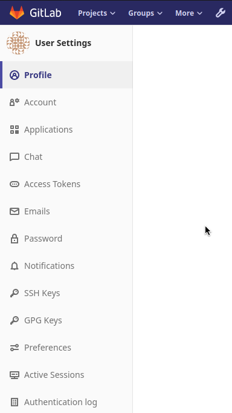
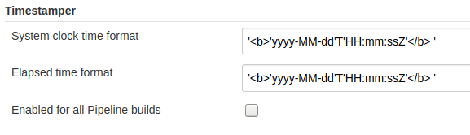
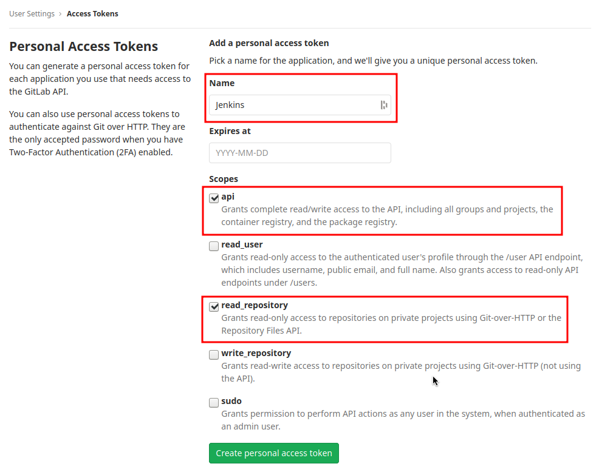
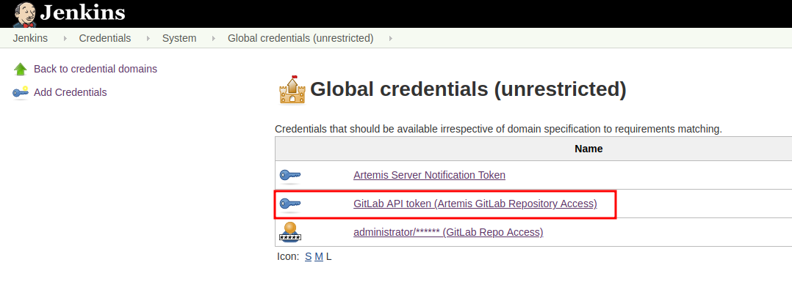
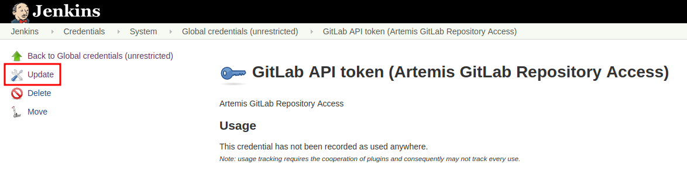
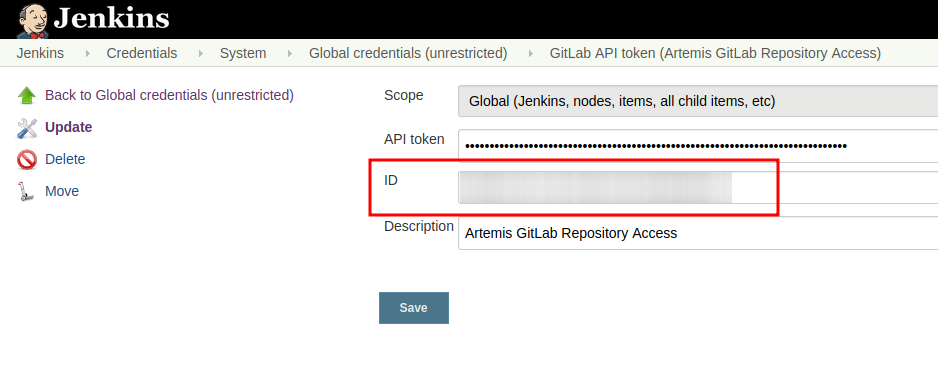

# Setup for Programming Exercises with Jenkins and GitLab

This page describes how to set up a programming exercise environment based on Jenkins and GitLab. 
Optional commands are in curly brackets <code>{}</code>.

<b>The following assumes that all instances run on separate servers. 
If you have one single server, or your own NGINX instance, just skip all NGINX related steps and use the configurations provided under _Separate NGINX Configurations_</b>

1. [GitLab](#gitlab)
2. [Jenkins](#jenkins)
3. [Separate NGINX Configurations](#separate-nginx-configurations)

## GitLab
1. Pull the latest GitLab Docker image

        docker pull gitlab/gitlab:ce-latest
        
2. Run the image

        docker run -itd --name gitlab
            --hostname your.gitlab.domain.com \
            --restart always \
            -p 80:80 -p 443:443 {-p 22:22} \     # If you are NOT running your own NGINX instance
            -p <some port of your choosing>:80    # If you ARE running your own NGINX instance
            -v gitlab_data:/var/opt/gitlab \
            -v gitlab_logs:/var/log/gitlab \
            -v gitlab_config:/etc/gitlab gitlab/gitlab-ce:latest
            
3. Wait a couple of minutes until GitLab is set up, then open the instance in you browser and set a first admin password of your choosing. 
You can then login using the username "root" and you password.

4. We recommend to rename the "root" admin user to "artemis". 
Use the same password in the Artemis configuration file _application-prod.yml_

        artemis:
            version-control:
                user: artemis
                password: the.password.you.chose
            
5. **If you run your own NGINX, then skip the next steps (6-7)**

6. Create the SSL directory in the GitLab Docker image, where you will store the certificate and key of your server and copy the certificate (fullchain) and key

        docker exec gitlab mkdir -p /etc/gitlab/ssl
        docker cp path.to.your.fullchain.cert gitlab:/etc/gitlab/ssl/your.gitlab.domain.crt
        docker cp path.to.your.key gitlab:/etc/gitlab/ssl/your.gitlab.domain.key
        
7. Update the GitLab config file, so that you force https and redirect all http traffic to https

        docker exec -it gitlab /bin/bash
        vim /etc/gitlab/gitlab.rb
        # Now, search for the 'external_url' key (should be in the first 30 lines) and use the following values here:
        external_url 'https://your.gitlab.domain.com'
        nginx['redirect_http_to_https'] = true
        # Save your changes and finally run
        gitlab-ctl reconfigure

8. Login to GitLab using the Artemis admin account and go to the profile settings (upper right corned → _Settings_)

    <details><summary>Screenshot</summary>
   
    
   
    </details>

9. Go to _Access Tokens_

    <details><summary>Screenshot</summary>
   
    
   
    </details>
10. Create a new token named "Artemis" and give it **all** rights.

    <details><summary>Screenshot</summary>
    
    
    
    </details> 

11. Copy the generated token and insert it into the Artemis configuration file _application-prod.yml_
    
        artemis:
            version-control:
                token: your.generated.api.token

## Jenkins

### Jenkins Server Setup
1. Pull the latest Jenkins LTS image

        docker pull jenkins/jenkins:lts
        
2. Create a folder on your host machine containing your fullchain certificate and key

3. Run Jenkins

        docker run -itd --name jenkins \
            --restart always \
            -v jenkins_data:/var/jenkins_home \
            -v /var/run/docker.sock:/var/run/docker.sock \
            -e VIRTUAL_HOST=your.jenkins.domain -e VIRTUAL_PORT=8080 \ # If you are NOT using a separate NGINX instance
            -p 8080:8080                                               # If you ARE using a separate NGINX instance
            jenkins/jenkins:lts
            
4. Run the NGINX proxy docker container, this will automatically setup all reverse proxies and force https on all connections. 
(This image would also setup proxies for all other running containers that have the VIRTUAL_HOST and VIRTUAL_PORT environment variables). 
**Skip this step if you have your own NGINX instance.**

        docker run -itd --name nginx_proxy \
            -p 80:80 -p 443:443 \
            --restart always \
            -v /var/run/docker.sock:/tmp/docker.sock:ro \
            -v path.to.your.cert:/etc/nginx/certs jwilder/nginx-proxy
            
5. Open Jenkins in your browser and setup the admin user account (install all suggested plugins). 
You can get the initial admin password using the following command.

        # Jenkins highlights the password in the logs, you can't miss it
        docker logs -f jenkins

6. Set the chosen credentials in the Artemis configuration _application-prod.yml_

        artemis:
            continuous-integration:
                user: your.chosen.username
                password: your.chosen.password
                
### Required Jenkins Plugins
You will need to install the following plugins (apart from the recommended ones that got installed during the setup process):
* [GitLab](https://plugins.jenkins.io/gitlab-plugin/) for enabling webhooks to and from GitLab
* [Multiple SCMs](https://plugins.jenkins.io/multiple-scms/) for combining the exercise test and assignment repositories in one build
* [Post Build Task](https://plugins.jenkins.io/postbuild-task/) for preparing build results to be exported to Artemis
* [Xvfb](https://plugins.jenkins.io/xvfb/) for exercises based on GUI libraries, for which tests have to have some virtual display
* [Timestamper](https://plugins.jenkins.io/timestamper/) for adding the time to every line of the build output

### Timestamper Configuration
Go to _Manage Jenkins → Configure System_. 
There you will find the Timestamper configuration, use the following value for both formats:

        '<b>'yyyy-MM-dd'T'HH:mm:ssZ'</b> '



### Server Notification Plugin
Artemis needs to receive a notification after every build, which contains the test results and additional commit information.
For that purpose, we developed a Jenkins plugin, that can aggregate and _POST_ JUnit formatted results to any URL.

You can download the current release of the plugin [here](https://github.com/ls1intum/jenkins-server-notification-plugin/releases/tag/v1.0.0) (Download the **.hpi** file).
Go to the Jenkins plugin page (_Manage Jenkins → Manage Plugins_) and install the downloaded file under the _Advanced_ tab under _Upload Plugin_

<details><summary>Screenshot</summary>


</details>

### Jenkins Credentials
Go to _Credentials → Jenkins → Global credentials_ and create the following credentials

#### GitLab API Token
1. Create a new access token in GitLab named "Jenkins" and give it **api** rights and **read_repository** rights.
For detailed instructions on how to create such a token follow the steps 8-9in the GitLab part of this documentation

    <details><summary>Screenshot</summary>
    
    
    
    </details>

2. Copy the generated token and create new Jenkins credentials:\
    a. **Kind**: GitLab API token\
    b. **API token**: _your.copied.token_\
    c. Leave the ID field blank\
    d. The description is up to you
    
3. Go to the Jenkins settings _Manage Jenkins → Configure System_. 
There you will find the GitLab settings.
Fill in the url of your GitLab instance and select the just created API token in the credentials dropdown. 
After you click on "Test Connection", everything should work fine.

    <details><summary>Screenshot</summary>
    
    
    
    </details>

4. Copy the ID of the API token and put it into the Artemis configuration _application-prod.yml_:

        artemis:
            continuous-integration:
                vcs-credentials: the.id.of.the.gitlab.api.token.credential
                
    <details><summary>Where to find the ID</summary>
    
    
    
    
    
    </details>

#### Server Notification Token
1. Create a new Jenkins credential containing the token, which gets send by the server notification plugin to Artemis with every build result:\
    a. **Kind**: Secret text\
    b. **Secret**: _your.secret_token_value_ (choose any value you want, copy it for the nex step)
    c. Leave the ID field blank
    d. The description is up to you

2. Copy the generated ID of the new credentials and put it into the Artemis configuration _application-prod.yml_

        artemis:
            continuous-integration:
                artemis-authentication-token-key: the.id.of.the.notification.token.credential
                
3. Copy the actual value you chose for the token and put it into the Artemis configuration _application-prod.yml_

        artemis:
            continuous-integration:
                artemis-authentication-token-value: the.actual.value.of.the.notification.token
    
#### GitLab Repository Access
1. Create a new Jenkins credentials containing the username and password of the GitLab administrator account:\
    a. **Kind**: Username with password\
    b. **Username**: _the_username_you_chose_for_the_gitlab_admin_user_\
    c. **Password**: _the_password_you_chose_for_the_gitlab_admin_user_\
    d. Leave the ID field blank\
    e. The description is up to you

2. Copy the generated ID of the new credentials and put it into the Artemis configuration file _application-prod.yml_

        artemis:
            continuous-integration:
                vcs-credentials: the.id.of.the.username.and.password.credentials.from.jenkins
                
### GitLab to Jenkins push notification token
GitLab has to notify Jenkins build plans if there are any new commits to the repository. 
The push notification that gets sent here is secured by a by Jenkins generated token. 
In order to get this token, you have to do the following steps:

1. Create a new project in Jenkins (use the Freestyle project type) and name it **TestProject**
2. In the project configuration, go to _Build Triggers → Build when a change is pushed to GitLab_ and activate this option
3. Click on _Advanced_.
4. You will now have a couple of new options here, one of them being a "**Secret token**".
5. Click on the "_Generate_" button right below the text box for that token.
6. Copy the generated value, let's call it **$gitlab-push-token**
7. Apply these change to the plan (i.e. click on _Apply_)
    
    <details><summary>Test Project Screenshot</summary>
    
    
    
    </details>
    
8. Perform a _GET_ request to the following URL (e.g. with Postman) using Basic Authentication and the username and password you chose for the Jenkins admin account:

        GET https://your.jenkins.domain/job/TestProject/config.xml
        
9. You will get the whole configuration XML of the just created build plan, there you will find the following tag:

        <secretToken>{$some-long-encrypted-value}</secretToken>
        
    <details><summary>Job configuration XML</summary>
    
    
    
    </details>

10. Copy the value of **$some-long-encrypted-value without the curly brackets!**. This is the encrypted value of the **$gitlab-push-token** you generated in step 5.
11. Now, you can delete this test project and input the following values into your Artemis configuration _application-prod.yml_ (replace the placeholders with the actual values you wrote down)

        artemis:
            version-control:
                ci-token: $gitlab-push-token
            continuous-integration:
                secret-push-token: $some-long-encrytped-value
                
                
## Separate NGINX Configurations
There are some placeholders in the following configurations. Replace them with your setup specific values
### GitLab
```
server {
    listen 443 ssl http2;
    server_name your.gitlab.domain;
    ssl_session_cache shared:GitLabSSL:10m;
    include /etc/nginx/common/common_ssl.conf;
    add_header Strict-Transport-Security "max-age=63072000; includeSubDomains; preload";
    add_header X-Frame-Options DENY;
    add_header Referrer-Policy same-origin;
    client_max_body_size 10m;
    client_body_buffer_size 1m;
 
    location / {
        proxy_pass              http://localhost:<your exposed GitLab HTTP port (default 80)>;
        proxy_read_timeout      300;
        proxy_connect_timeout   300;
        proxy_http_version      1.1;
        proxy_redirect          http://         https://;
 
        proxy_set_header    Host                $http_host;
        proxy_set_header    X-Real-IP           $remote_addr;
        proxy_set_header    X-Forwarded-For     $proxy_add_x_forwarded_for;
        proxy_set_header    X-Forwarded-Proto   $scheme;
 
        gzip off;
    }
}
```

### Jenkins
```
server {
    listen 443 ssl http2;
    server_name your.jenkins.domain;
    ssl_session_cache shared:JenkinsSSL:10m;
    include /etc/nginx/common/common_ssl.conf;
    add_header Strict-Transport-Security "max-age=63072000; includeSubDomains; preload";
    add_header X-Frame-Options DENY;
    add_header Referrer-Policy same-origin;
    client_max_body_size 10m;
    client_body_buffer_size 1m;
 
    location / {
        proxy_pass              http://localhost:<your exposed Jenkins HTTP port (default 8080)>;
        proxy_set_header        Host                $host:$server_port;
        proxy_set_header        X-Real-IP           $remote_addr;
        proxy_set_header        X-Forwarded-For     $proxy_add_x_forwarded_for;
        proxy_set_header        X-Forwarded-Proto   $scheme;
        proxy_redirect          http://             https://;
 
        # Required for new HTTP-based CLI
        proxy_http_version 1.1;
        proxy_request_buffering off;
        proxy_buffering off; # Required for HTTP-based CLI to work over SSL
 
        # workaround for https://issues.jenkins-ci.org/browse/JENKINS-45651
        add_header 'X-SSH-Endpoint' 'your.jenkins.domain.com:50022' always;
    }
 
    error_page 502 /502.html;
    location /502.html {
        root /usr/share/nginx/html;
        internal;
    }
}
```

### /etc/nginx/common/common_ssl.conf
If you haven't done so, generate the DH param file: `sudo openssl dhparam -out /etc/nginx/dhparam.pem 4096`
```
ssl_certificate     <path to your fullchain certificate>;
ssl_certificate_key <path to the private key of your certificate>;
ssl_protocols       TLSv1.2 TLSv1.3;
ssl_dhparam /etc/nginx/dhparam.pem;
ssl_prefer_server_ciphers   on;
ssl_ciphers ECDH+CHACHA20:EECDH+AESGCM:EDH+AESGCM:!AES128;
ssl_ecdh_curve secp384r1;
ssl_session_timeout  10m;
ssl_session_cache shared:SSL:10m;
ssl_session_tickets off;
ssl_stapling on;
ssl_stapling_verify on;
resolver <if you have any, specify them here> valid=300s;
resolver_timeout 5s;
```
