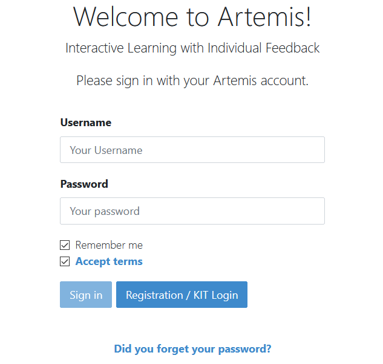
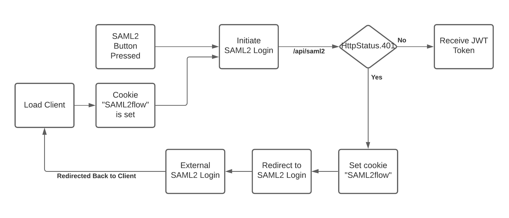
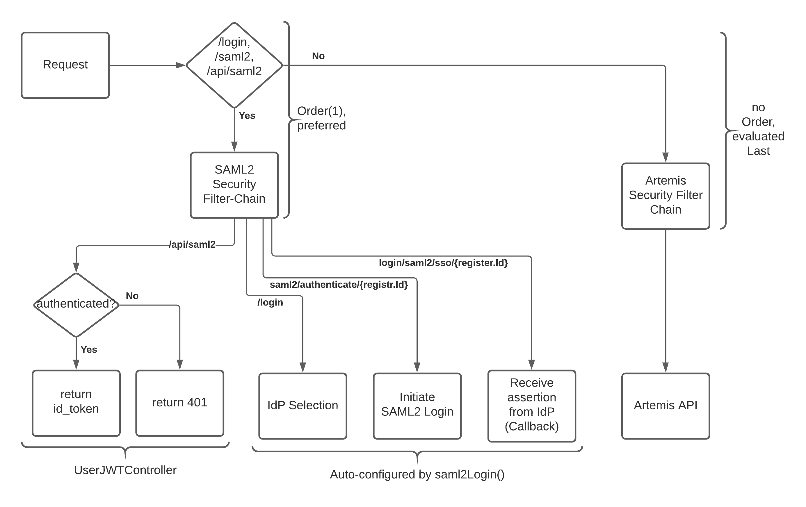

Shibboleth/SAML2 Login & Registration
=====================================
Artemis supports user login and registration using SAML2 / Shibboleth.
The SAML2 feature is intended for use with Artemis' internal user management and primarily serves as a registration mechanism.
With the help of this feature it is possible to store not only the login, name and email, but also the **student's matriculation number** directly in the database.
For each user who registers in the system for the first time, a "normal" artemis user is created and the data is taken from the attributes of the Shibboleth request.

* The feature is activated by the *saml2* profile.
* If you use a **reverse proxy**, you have to redirect the following endpoints to the artemis server: **/login** and **/saml2** .
* For testing you can use a `preconfigured environment <https://github.com/kit-sdq/Artemis-SAML2-Test-Docker>`__.

If you activate the SAML2 Feature an additional login button will be activated (you can set the text of the button as you like):

The workflow of the SAML2 feature is shown in the following picture:

The SAML2 library of Spring Boot is used to create a second security filter chain.
The new (and old) security filter chain is presented in the following figure:

The feature is configured by the application-saml2.yml file.
You can configure multiple identity providers.
In addition, the SAML2 feature allows to decide whether a user can obtain a password (see "info.saml2.enable-password").
This app password allows to use the connected services as VCS and CI as usual with the local user credentials.

You can see the structure of the saml2 configuration in the following:

.. code:: yaml

    spring:
      security:
        saml2:
          relyingparty:
            registration:
              REGISTRATION_ID_HERE:
                signing.credentials: &my-metadata
                  - private-key-location: file:/opt/artemis/config/shibboleth-sp-key.pem
                    certificate-location: file:/opt/artemis/config/shibboleth-sp-cert.crt
                decryption.credentials: *my-metadata
                assertingparty:
                  metadata-uri: URL_TO_METADATA_HERE

    saml2:
        # Define the patterns used when generating users. SAML2 Attributes can be substituted by surrounding them with
        # curly brackets. E.g. username: '{user_attribute}'. Missing attributes get replaced with an empty string.
        # This enables definition of alternative attribute keys when using multiple IdPs. E.g. username: '{uid}{user_id}'.
        # User template pattern:
        username-pattern: '{first_name}_{last_name}'
        first-name-pattern: '{first_name}'
        last-name-pattern: '{last_name}'
        email-pattern: '{email}'
        registration-number-pattern: '{uid}'
        lang-key-pattern: 'en' # can be a pattern or fixed to en/de
        # It is also possible to only extract parts of the attribute values.
        # For each attribute key exactly one regular expression can optionally be defined that is used to extract only parts
        # of the received value. The regular expression must match the whole value. It also has to contain a named capture
        # group with the name 'value'.
        # E.g. when receiving 'pre1234post' from the SAML2 service in the 'uid'-example below, only '1234' will be used when
        # replacing '{uid}' in one of the user attributes defined above.
        value-extraction-patterns:
            #- key: 'registration_number'
            #  value_pattern: 'somePrefix(?<value>.+)someSuffix'
            #- key: 'uid'
            #  value_pattern: 'pre(?<value>\d+)post'

    # String used for the SAML2 login button. E.g. 'Shibboleth Login'
    info:
        saml2:
            # Name of the button to login with SAML2
            button-label: 'SAML2 Login'
            # Name of the identity provider (e.g., University X Account). Only used for the text at login page
            identity-provider-name: 'Shibboleth Account'
            # Hide the password login form. If true, the password login form is hidden and only the SAML2 login button is shown.
            password-login-disabled: false
            # Sends a e-mail to the new user with a link to set the Artemis password. This password allows login to Artemis and its
            # services such as Jenkins. It also allows the users to use password-based Git workflow.
            # It also enables the password reset function in Artemis.
            enable-password: true

Example configuration
^^^^^^^^^^^^^^^^^^^^^

The SAML2 configuration of Artemis could look like this:

.. code:: yaml

    saml2:
        username-pattern: '{uid}'
        first-name-pattern: '{urn:oid:W.X.Y.Z}'
        last-name-pattern: '{urn:oid:W.X.Y.Z}'
        email-pattern: '{mail}'
        registration-number-pattern: '{matriculationNumber}'
        lang-key-pattern: 'de'
    info:
        saml2:
            button-label: 'Shibboleth Login'
            enable-password: false
            password-login-disabled: true
            identity-provider-name: 'Shibboleth Account'
    spring:
      security:
        saml2:
          relyingparty:
            registration:
              scc:
                signing.credentials: &scc-metadata
                  - private-key-location: file:/config/shibboleth-sp-key.pem
                    certificate-location: file:/config/shibboleth-sp-cert.crt
                decryption.credentials: *scc-metadata
                assertingparty:
                  metadata-uri: https://www.aai.dfn.de/fileadmin/metadata/dfn-aai-local-148-metadata.xml

The SAML2 configuration for Artemis at your IT department could look like this:

.. code:: xml

    <?xml version="1.0" encoding="UTF-8"?><md:EntityDescriptor xmlns:md="urn:oasis:names:tc:SAML:2.0:metadata" entityID="https://<<ARTEMIS_URL_HERE>>/saml2/service-provider-metadata/<<REGISTRATION_ID_HERE>>" xmlns:mdui="urn:oasis:names:tc:SAML:metadata:ui">
      <md:SPSSODescriptor AuthnRequestsSigned="false" WantAssertionsSigned="false" protocolSupportEnumeration="urn:oasis:names:tc:SAML:2.0:protocol">
        <md:KeyDescriptor use="signing">
          <ds:KeyInfo xmlns:ds="http://www.w3.org/2000/09/xmldsig#">
            <ds:X509Data>
              <ds:X509Certificate>CERT_HERE</ds:X509Certificate>
            </ds:X509Data>
          </ds:KeyInfo>
        </md:KeyDescriptor>
        <md:KeyDescriptor use="encryption">
          <ds:KeyInfo xmlns:ds="http://www.w3.org/2000/09/xmldsig#">
            <ds:X509Data>
              <ds:X509Certificate>CERT_HERE</ds:X509Certificate>
            </ds:X509Data>
          </ds:KeyInfo>
        </md:KeyDescriptor>
        <md:AssertionConsumerService Binding="urn:oasis:names:tc:SAML:2.0:bindings:HTTP-POST" Location="https://<<ARTEMIS_URL_HERE>>/login/saml2/sso/<<REGISTRATION_ID_HERE>>" index="1"/>
      </md:SPSSODescriptor>
    </md:EntityDescriptor>
