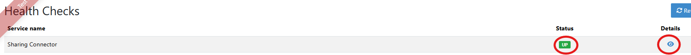
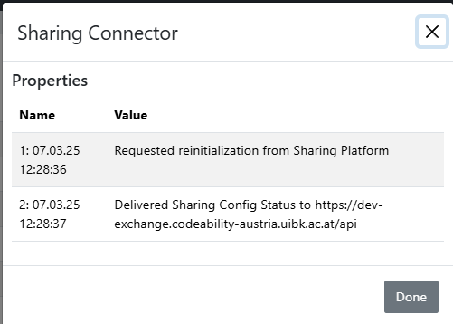

.. _sharing-setup:

Setup Guide for Exchange with the Sharing Platform
==================================================

.. contents::
   :local:

Background
----------

The `Sharing Platform <https://search.sharing-codeability.uibk.ac.at/>`_ is an open platform for sharing teaching materials related to programming. It is operated by the `University of Innsbruck <https://www.uibk.ac.at/en/>`_. While primarily designed as an open exchange platform, it also provides features such as private group exchanges and the ability to restrict public access to certain content, such as the solution repository of an Artemis exercise.

For more details, visit the `help menu <https://search.sharing-codeability.uibk.ac.at/>`_ of the sharing platform.

To facilitate the exchange of programming exercises among instructors, the sharing platform offers a connector to Artemis, enabling any Artemis instance to integrate with the platform for seamless sharing.

The `Sharing Platform` is open source. The source code can be found at https://sharing-codeability.uibk.ac.at/development/sharing/codeability-sharing-platform .

Prerequisites
-------------

To connect to the sharing platform, you need an API key. To request one, contact the platform maintainers at `artemis-support-informatik@uibk.ac.at` and provide the URL of your active Artemis instance.

**Important:** Sharing only works if your Artemis instance is accessible on the internet. If making your instance publicly available is not an option, the maintainers can provide a list of required Artemis URLs that must be accessible to the sharing platform.

**Configuration**
~~~~~~~~~~~~~~~~~

Once you receive your API key, you should add it to the configuration file **``application-core.yml``** or your `.env` file:

**Option 1: application-artemis.yml**
^^^^^^^^^^^^^^^^^^^^^^^^^^^^^^^^^^^^^^

.. code-block:: yaml

  artemis:
    sharing:
      enabled: true
      # Shared common secret
      apikey: <your API Key>
      serverurl: https://search.sharing-codeability.uibk.ac.at/
      actionname: Export to Artemis@myUniversity

**Option 2: .env file for Docker initialization**
^^^^^^^^^^^^^^^^^^^^^^^^^^^^^^^^^^^^^^^^^^^^^^^^^

.. code-block:: bash

  ARTEMIS_SHARING_ENABLED=true
  ARTEMIS_SHARING_SERVERURL=https://search.sharing-codeability.uibk.ac.at/
  ARTEMIS_SHARING_APIKEY=<Enter your API Key here>
  ARTEMIS_SHARING_ACTIONNAME=Export to Artemis@<Enter an ID here>

Once configured, restart your Artemis instance.

**Instructor Access Requirements**
~~~~~~~~~~~~~~~~~~~~~~~~~~~~~~~~~~

For instructors to exchange programming exercises, they need an account on the sharing platform. They can register using one of the following methods:

- **EduID Authentication**: The simplest way is through `EduID (Austria) <https://www.aco.net/federation.html>`_ or `EduID (Germany) <https://doku.tid.dfn.de/de:aai:eduid:start>`_. Forward the necessary connection details to the sharing platform maintainers.
- **GitLab-Based Registration**: If EduID is not an option, users can register via the sharing platform’s GitLab instance. However, for security reasons, self-registration is restricted to certain email domains. To enable access, forward the desired domains to the maintainers for approval.

Troubleshooting
---------------

To assist in troubleshooting, the **sharing profile** includes an additional health indicator, accessible via the **``Administration -> Health``** menu.

|sharing_health1|

Under **Details**, you will typically find the following entries:

|sharing_health2|

- The **first entry** is an initialization request sent after startup.
- The **second entry** reflects the subsequent receipt of the connector configuration from the sharing platform.
- Additional entries represent regular configuration polling requests from the sharing platform.

The **Details** log stores the last 10 entries.

If the health status is not **``up``**, check the error message in the details. If the issue is unclear, feel free to contact the sharing platform maintainers for support.

Conclusion
----------

Once everything is set up correctly, you should see the |sharing_button1| button in the **Programming Exercise Details** dialog in Artemis.

Similarly, the |sharing_button2| button should appear on the sharing platform for any programming exercise available there.

Before testing the import and export functionality, refer to the user documentation at :ref:`sharing` for further details.
