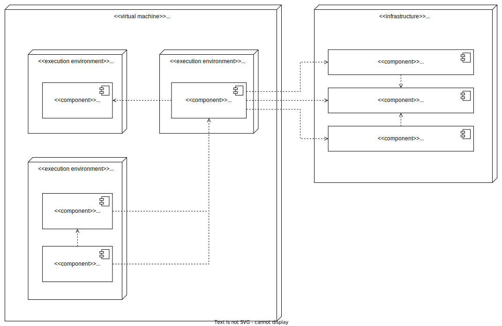
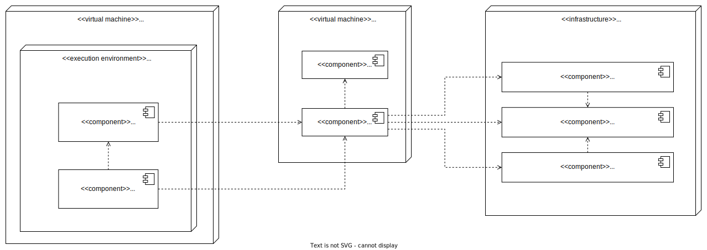

Cypress Bamboo Plans
====================

**Background**

The Cypress test suite contains system tests verifying the most important features of Artemis.
System tests test the whole system and therefore require a complete deployment of Artemis first.
In order to prevent as many faults (bugs) as possible from being introduced into the develop branch,
we want to execute the Cypress test suite whenever new commits are pushed to a Git branch
(just like the unit and integration test suites).

To accomplish this we need to be able to dynamically deploy multiple different instances of Artemis at the same time.
An ideal setup would be to deploy the whole Artemis system using Kubernetes.
However, this setup is too complex at the moment.
The main reason for the complexity is that it is very hard to automatically setup Docker containers for
the external services (Jira, Bitbucket and Bamboo) and connect them directly with Artemis.

Therefore, the current setup only dynamically deploys the Artemis server and configures it to connect to
the prelive system, which is already properly setup in the university data center.

Artemis Deployment on Bamboo Build Agent
----------------------------------------
Every execution of the Cypress test suite requires its own deployment of Artemis.
The easiest way to accomplish this is to deploy Artemis locally on the build agent, which executes the Cypress tests.
Using docker-compose we can start a MySQL database and the Artemis server locally on the build agent and
connect it to the prelive system in the university data center.

   Artemis Deployment on Bamboo Build Agent for Cypress

In total there are three Docker containers started in the Bamboo build agent:

1. MySQL

   This container starts a MySQL database and exposes it on port 3306.
   The container automatically creates a new database 'Artemis' and configures it
   with the recommended settings for Artemis.
   The Cypress setup reuses the already existing
   `MySQL docker image <https://github.com/ls1intum/Artemis/blob/develop/src/main/docker/mysql.yml>`__
   from the standard Artemis Docker setup.

2. Artemis

   The Docker image for the Artemis container is created from the already existing
   `Dockerfile <https://github.com/ls1intum/Artemis/blob/develop/src/main/docker/Dockerfile>`__.
   When the Bamboo build of the Cypress test suite starts, it retrieves the Artemis executable (.war file)
   from the `Artemis build plan <https://bamboo.ase.in.tum.de/browse/ARTEMIS-WEBAPP>`_.
   Upon creation of the Artemis Docker image the executable is copied into the image together with configuration files
   for the Artemis server.

   The main configuration of the Artemis server is contained in the
   `application.yml file <https://github.com/ls1intum/Artemis/blob/develop/src/main/docker/cypress/application.yml>`__.
   However, this file does not contain any security relevant information.
   Security relevant settings like the credentials to the Jira admin account in the prelive system are instead passed to
   the Docker container via environment variables.
   This information is accessible to the Bamboo build agent via
   `Bamboo plan variables <https://confluence.atlassian.com/bamboo/bamboo-variables-289277087.html>`__.

   The Artemis container is also configured to
   `depend on <https://docs.docker.com/compose/compose-file/compose-file-v2/#depends_on>`__
   the MySQL container and uses
   `health checks <https://docs.docker.com/compose/compose-file/compose-file-v2/#healthcheck>`__
   to wait until the MySQL container is up and running.

3. Cypress

   Cypress offers a `variety of docker images <https://github.com/cypress-io/cypress-docker-images>`__
   to execute Cypress tests.
   We use an image which has the Cypress operating system dependencies and a Chrome browser installed.
   However, Cypress itself is not installed in
   `these images <https://github.com/cypress-io/cypress-docker-images/tree/master/browsers>`__.
   This is convenient for us because the image is smaller and the Artemis Cypress project requires
   additional dependencies to fully function.
   Therefore, the Artemis Cypress Docker container is configured to install all dependencies
   (using :code:`npm ci`) upon start. This will also install Cypress itself.
   Afterwards the Artemis Cypress test suite is executed.

   The necessary configuration for the Cypress test suite is also passed in via environment variables.
   Furthermore, the Cypress container depends on the Artemis container and is only started
   once Artemis has been fully booted.

**Bamboo webhook**

The Artemis instance deployed on the build agent is not publicly available to improve the security of this setup.
However, in order to get the build results for programming exercise submissions Artemis relies on a webhook from Bamboo
to send POST requests to Artemis.
To allow this, an extra rule has been added to the firewall allowing only the Bamboo instance in the prelive system
to connect to the Artemis instance in the build agent.

**Timing**

As mentioned above, we want the Cypress test suite to be executed whenever new commits are pushed to a Git branch.
This has been achieved by adding the
`Cypress Github build plan <https://bamboo.ase.in.tum.de/browse/ARTEMIS-AETG>`__
as a `child dependency <https://confluence.atlassian.com/bamboo/setting-up-plan-build-dependencies-289276887.html>`__
to the `Artemis Build build plan <https://bamboo.ase.in.tum.de/browse/ARTEMIS-WEBAPP>`__.
The *Artemis Build* build plan is triggered whenever a new commit has been pushed to a branch.

The Cypress build plan is only triggered after a successful build of the Artemis executable.
This does imply a delay (about 10 minutes on average) between the push of new commits and the execution
of the Cypress test suite, since the new Artemis executable first has to be built.

**NOTE:** The Cypress test suite is only automatically executed for internal branches and pull requests
(requires access to this GitHub repository) **not** for external ones.
In case you need access rights, please contact the maintainer `Stephan Krusche <https://github.com/krusche>`__.

Artemis Deployment in Test Environment
--------------------------------------
There is another build plan on Bamboo which executes the Cypress test suite.
`This build plan <https://bamboo.ase.in.tum.de/chain/viewChain.action?planKey=ARTEMIS-AETBB>`__
deploys the latest Artemis executable of the develop branch on an already configured test environment (test server 3)
and executes the Cypress test suite against it.
This build plan is automatically executed every 8 hours and verifies that test server 3 is working properly.

   Artemis Deployment on test environment for Cypress

The difference of this setup is that the Artemis server is deployed on a separate environment which already contains
the necessary configuration files for the Artemis server to connect to the prelive system.
The Docker image for the Cypress container should be exactly the same as the Cypress image used in
the docker-compose file for the deployment on a Bamboo build agent.

Maintenance
-----------
The Artemis Dockerfile as well as the MySQL image are already maintained because they are used in
other Artemis Docker setups.
Therefore, only Cypress and the Cypress Docker image require active maintenance.
Since the Cypress test suite simulates a real user, it makes sense to execute the test suite with
the latest Chrome browser.
The Cypress Docker image we use always has a specific Chrome version installed.
Therefore, the
`docker-compose file <https://github.com/ls1intum/Artemis/blob/develop/src/main/docker/cypress/docker-compose.yml>`__
as well as the
`build plan configuration for the Cypress tests on test server 3 <https://bamboo.ase.in.tum.de/build/admin/edit/editBuildDocker.action?buildKey=ARTEMIS-AETBB-QE>`__
should be updated every month to make sure that the latest Cypress image for the Chrome browser is used.
