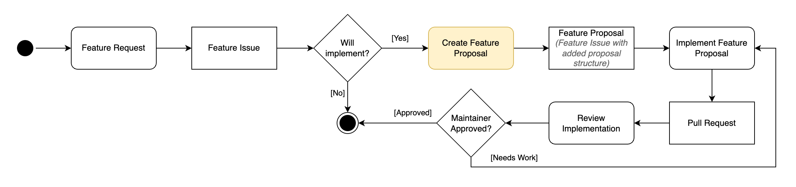
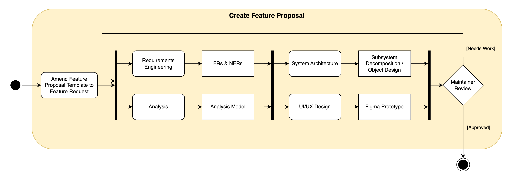
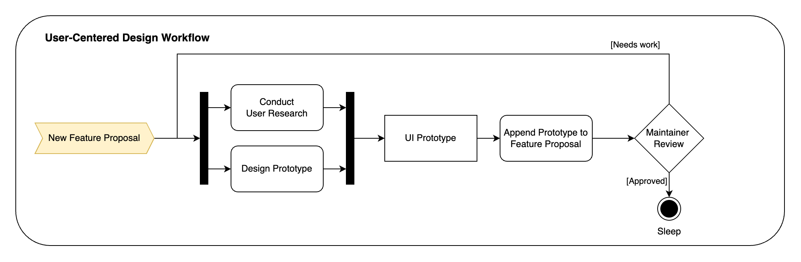

*******************
Development Process
*******************

1. Submit a Feature Request
===========================
The initial step in our development process involves the creation of a feature request, which is accomplished through the submission of a GitHub Issue.
This action can be performed by any stakeholder, including developers, users, or maintainers.
The feature request should include a detailed description of the desired functionality, as well as any relevant information that may be useful to the development team.
This information should include the rationale for the feature, the expected benefits, and any potential risks or challenges that may be associated with the implementation of the feature.

2. Evaluate Feature Request
===========================
Once a feature request has been submitted, the maintainers will evaluate the request together with the development team to determine its feasibility and potential impact on the system.

3. Create a Feature Proposal
===============================
If the feature request is deemed feasible, the development team will create a feature proposal that extensively describes the proposed feature. This step will consist of the artifacts mentioned in the model "Create Feature Proposal" below:

Step 1: Append Feature Proposal Template to Feature Request on GitHub
---------------------------------------------------------------------
The Feature Proposal Template outlines the structure of the feature proposal and provides a guideline for the development team to follow.

We have developed a GitHub Action that automatically appends the feature proposal template to the issue description once the issue is tagged with 'needs-feature-proposal.' Additionally, when someone is assigned to such an issue, an instructional comment is automatically added.
This comment reminds the assignee to fill out the feature proposal and provides a link to the relevant documentation for further guidance.

.. note::
      The GitHub Action will be skipped for issues that are labeled with "bug".

.. literalinclude:: ../../../.github/ISSUE_TEMPLATE/feature-proposal--developer-.md
    :caption: Artemis/.github/ISSUE_TEMPLATE/feature-proposal--developer-.md
    :language: markdown

Step 2: Requirements Engineering
--------------------------------
In this section, the foundation for the feature's development is laid by meticulously defining both functional and non-functional requirements.
Functional requirements detail what the feature will do, covering specific behaviors or functions.
Non-functional requirements, on the other hand, address the feature's operation, such as performance, usability, reliability, and security specifications.

In the Feature Proposal Template, you can find examples for structuring such functional and non-functional requirements

Step 3: Analysis
----------------
Within the analysis section, the emphasis is on understanding and documenting the feature's intended behavior and interactions within the system.
This includes creating an Analysis Object Model, which represents the static structure of the system using class diagrams to identify key entities and their relationships.
Additionally, dynamic aspects of the feature are explored through Activity Diagrams (for workflow representation), State Chart Diagrams (to model the feature's states and transitions), and Communication Diagrams (illustrating how objects interact to achieve the feature's functionality).
These models serve as a blueprint for the development and ensure a shared understanding among all people working on Artemis.

Step 4: System Architecture
---------------------------
In this step, the high-level structure of the system supporting the feature is outlined, focusing on analyzing the system components relevant to the implementation of the feature,
subsystem decomposition, interfaces, persistent data management, and security aspects.
The subsystem decomposition process is used to identify the main components of the system and define their responsibilities, which facilitates modular development and maintenance.
It is important to define the interfaces between these subsystems to ensure seamless interaction and integration.
In addition, the development of a comprehensive data model is important for a clear understanding of how data is securely stored, retrieved, and managed within the system, taking into account both logical and physical data perspectives.
Security aspects, especially access control mechanisms, are considered to ensure data integrity and privacy.

Step 5: UI/UX Design
--------------------
If the proposed feature requires a change to the software's user interface, this section should include a detailed description of the proposed changes, as well as a mockup that illustrates the new user interface.
The mockup should be created using Figma in conjunction with the [Artemis Design System](https://www.figma.com/files/team/1238833580691926997/Artemis) and should be added to the feature proposal as a screenshot.
Furthermore it is important to include a description of the user flow that references the dynamic model created in the analysis section.

.. raw:: html

    

        <iframe src="https://live.rbg.tum.de/w/artemisintro/46233?video_only=1&t=0" allowfullscreen="1" frameborder="0" width="600" height="300">
            Watch this video on TUM-Live.
        </iframe>
    

4. Create a local Branch
========================
We use the following structure for branch names: ``<type>/<area>/<short-description>``
- Possible types are: **feature**, **chore**, and **bugfix**
- Possible areas are all allowed feature tags (see :ref:`pr_naming_conventions`), written kebab-case. For example, ``Programming exercises`` becomes **programming-exercises**.

**Branches that do not follow this structure will get rejected automatically!**

5. Implement the Feature
========================
In this step, the development team converts the detailed plans and designs outlined in the functional proposal into working code.
This step requires careful adherence to the previously defined requirements and system architecture to ensure that the function fits seamlessly into the existing system and fulfills the specified functional and performance criteria.

.. note::
      Make sure to follow the `Artemis Code and Design Guidelines <https://docs.artemis.cit.tum.de/dev/guidelines.html>`_.

6. Create a Pull Request
========================
After the feature implementation is complete, the developer is required to create a pull request for integrating the feature into the develop branch.
The subsequent sections provide guidance on the naming conventions and outline the necessary steps for creating and merging a pull request.

.. _pr_naming_conventions:

Naming Conventions for GitHub Pull Requests
-------------------------------------------

1. The first term is a main feature of Artemis and should use code highlighting, e.g.  ``Programming exercises``:

    1. Possible feature tags are: ``Programming exercises``, ``Integrated code lifecycle``, ``Quiz exercises``, ``Modeling exercises``, ``Text exercises``, ``File upload exercises``, ``Exam mode``,
       ``Grading``, ``Assessment``, ``Communication``, ``Notifications``, ``Team exercises``, ``Lectures``, ``Integrated markdown editor``, ``Plagiarism checks``, ``Learning analytics``,
       ``Adaptive learning``, ``Learning path``, ``Tutorial groups``, ``Iris``, ``Hyperion``, ``Scalability``, ``Usability``, ``Performance``, ``Infrastructure``, ``Mobile apps``.
    2. If the change is not visible to end users, or it is a pure development or test improvement, we use the term ``Development``:.
    3. Everything else belongs to the ``General`` category.

2. The colon is not highlighted.

3. After the colon, there should be a verbal form that is understandable by end users and non-technical persons, because this will automatically become part of the release notes.

    1. The text should be short, non-capitalized (except the first word) and should include the most important keywords. Do not repeat the feature if it is possible.
    2. We generally distinguish between bugfixes (the verb “Fix”) and improvements (all kinds of verbs) in the release notes. This should be immediately clear from the title.
    3. Good examples:

        - “Allow instructors to delete submissions in the participation detail view”
        - “Fix an issue when clicking on the start exercise button”
        - “Add the possibility for instructors to define submission policies”

Steps to Create and Merge a Pull Request
----------------------------------------

0. Preconditions (For Developers Only)
^^^^^^^^^^^^^^^^^^^^^^^^^^^^^^^^^^^^^^
* **Merge fast**: PRs should only be open for a couple of days.
* Limit yourself to one functionality per pull request.
* Split up your task in multiple branches & pull requests if necessary.
* `Commit Early, Commit Often, Perfect Later, Publish Once. <https://speakerdeck.com/lemiorhan/10-git-anti-patterns-you-should-be-aware-of>`_

1. Begin Implementation (For Developers Only)
^^^^^^^^^^^^^^^^^^^^^^^^^^^^^^^^^^^^^^^^^^^^^
* `Open a draft pull request. <https://docs.github.com/en/github/collaborating-with-issues-and-pull-requests/creating-a-pull-request>`_ This allows for code related questions and discussions.

2. Complete Implementation (For Developers Only)
^^^^^^^^^^^^^^^^^^^^^^^^^^^^^^^^^^^^^^^^^^^^^^^^
* Make sure all steps in the `Checklist <https://github.com/ls1intum/Artemis/blob/develop/.github/PULL_REQUEST_TEMPLATE.md>`_ are completed.
* Add or update the "Steps for Testing" in the description of your pull request.
* Make sure that the changes in the pull request are only the ones necessary.
* Make sure that the PR is up-to-date with develop.
* Make sure at least all required checks pass.
* Mark the pull request as `ready for review. <https://docs.github.com/en/github/collaborating-with-issues-and-pull-requests/changing-the-stage-of-a-pull-request>`_

3. Review Process
^^^^^^^^^^^^^^^^^
**For Developers:**

* Organize or join a testing session. Especially for large pull requests this makes testing a lot easier.
* Actively look for reviews. Do not just open the pull request and wait.

**For Reviewers:**

* Perform the "Steps for Testing" and verify that the new functionality is working as expected.
* Verify that related functionality is still working as expected.
* Ensure that the code changes...
    * conform to the code style and code design guidelines.
    * are easily understandable.
    * contain thorough documentation where applicable.
    * maintain reasonable performance (e.g. no excessive/unnecessary database queries or HTTP calls).
* Respect the PR scope: Implementations that are unrelated to the PRs topic should not be enforced in a code review.
* Explain your rationale when requesting changes: E.g., not "Please change X to Y", but "Please change X to Y, because this would improve Z"
* Submit your comments and status (✅ Approve or ❌ Request Changes) using GitHub.
    * Explain what you did (test, review code) and on which test server in the review comment.

4. Address Review Comments
^^^^^^^^^^^^^^^^^^^^^^^^^^
**For Developers:**

* Use the pull request to discuss comments or ask questions.
* Update your code where necessary.
* Revert to draft if the changes will take a while during which review is not needed/possible.
* Set back to ready for review afterwards.
* After making revisions, re-request reviews through GitHub initially. If you receive no response, then follow up with a targeted message on Slack to the relevant reviewers.
* Comment on "inline comments" (e.g. "Done").
* Once all changes are made, ensure that the feature-specific maintainer reviews and approves the changes.
* After maintainer approval, an "Artemis Maintainer" reviews and finalizes the approval process.

**For Reviewers:**

* Respond to questions raised by the developer.
* Mark conversations as resolved if the change is sufficient.
* Feature-specific maintainers should verify changes within their scope and mark them as approved.
* Artemis Maintainers conduct the final review before merging.

.. note::
      Repeat steps 3 & 4 until the pull request is approved by all designated reviewers. It's only ready to merge when it has approvals from at least four reviewers.

5. Merge Changes
^^^^^^^^^^^^^^^^
A project maintainer merges your changes into the ``develop`` branch.

Stale Bot
---------

If the pull request doesn't have any activity for at least 7 days, the Stale Bot will mark the PR as `stale`.
The `stale` status can simply be removed by adding a comment or a commit to the PR.
After 21 total days of inactivity and 14 days after marking the PR as stale, the Stale Bot will close the PR.
Adding activity to the PR will remove the `stale` label again and reset the stale timer.
To prevent the bot from adding the `stale` label to the PR in the first place, the `no-stale` label can be used.
This label should only be utilized if the PR is blocked by another PR or the PR needs help from another developer.

Further documentation on the Stale Bot can be found here:
https://github.com/actions/stale
