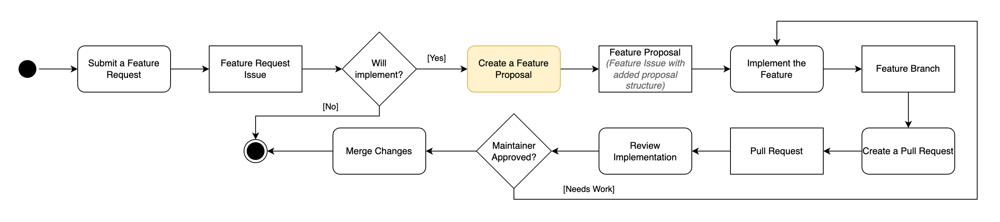

*******************
Development Process
*******************

.. contents:: Content of this document
    :local:
    :depth: 2

The Artemis Development Process Model
===========================================

1. Submit a Feature Request
---------------------------
The initial step in our development process involves the creation of a feature request, which is accomplished through the submission of a GitHub Issue. 
This action can be performed by any stakeholder, including developers, users, or maintainers. 
The feature request should include a detailed description of the desired functionality, as well as any relevant information that may be useful to the development team. 
This information may include the rationale for the feature, the expected benefits, and any potential risks or challenges that may be associated with the implementation of the feature.

2. Evaluate Feature Request
---------------------------
Once a feature request has been submitted, the maintainers will evaluate the request together with the development team to determine its feasibility and potential impact on the system.

3. Formulate a Feature Proposal
-------------------------------
If the feature request is deemed feasible, the development team will create a feature proposal that extensively describes the proposed feature. This step will be performed by the development team and will consist of the artifacts mentioned in the model "Create Feature Proposal" below:

Step 1: Amend Feature Proposal Template to Feature Request on GitHub
^^^^^^^^^^^^^^^^^^^^^^^^^^^^^^^^^^^^^^^^^^^^^^^^^^^^^^^^^^^^^^^^^^^^
The Feature Proposal Template outlines the structure of the feature proposal and provides a guideline for the development team to follow.
It should be added to the respective GitHub Issue's description and filled with the necessary information.

.. literalinclude:: ./feature-proposal-template.md
    :caption: Feature Proposal Template
    :language: markdown

Step 2: Requirements Engineering
^^^^^^^^^^^^^^^^^^^^^^^^^^^^^^^^
This section of the feature proposal includes a description of all Functional and Non-Functional Requirements that the feature should fulfill.
Refer to the template for more details on the format. 

Step 3: Analysis
^^^^^^^^^^^^^^^^
This section should outline the involved Analysis Objects (Analysis Object Model) and the dynamic behavior of the feature (Activity Diagram, State Chart diagram, Communication Diagram).

Step 4: System Architecture
^^^^^^^^^^^^^^^^^^^^^^^^^^^
This step should include all involved subsystems and their interfaces (Subsystem Decomposition), as well as a description of the persistent data management (Data Model), access control / security asepcts and further architectural decisions.

Step 5: UI/UX Design
^^^^^^^^^^^^^^^^^^^^
If the proposed feature requires a change to the software's user interface, this section should include a detailed description of the proposed changes, as well as a mockup that illustrates the new user interface.
The mockup should be created using Figma in conjunction with the Artemis Design System and should be added to the feature proposal as a screenshot. 
Furthermore it is important to include a description of the user flow that references the dynamic model created in the analysis section.

4. Implement the Feature
------------------------
In this step, the development team will implement the feature according to the feature proposal.

5. Create a Pull Request
------------------------
Once the feature has been implemented, the developer will create a pull request to merge the feature into the develop branch.

Naming Conventions for GitHub Pull Requests
^^^^^^^^^^^^^^^^^^^^^^^^^^^^^^^^^^^^^^^^^^^

1. The first term is a main feature of Artemis and is using code highlighting, e.g.  “``Programming exercises``:”.

    1. Possible feature tags are: ``Programming exercises``, ``Quiz exercises``, ``Modeling exercises``, ``Text exercises``, ``File upload exercises``, ``Exam mode``,
       ``Grading``, ``Assessment``, ``Communication``, ``Notifications``, ``Team exercises``, ``Lectures``, ``Plagiarism checks``, ``Learning analytics``,
       ``Adaptive learning``, ``Learning path``, ``Tutorial groups``, ``Iris``.
    2. If the change is not visible to end users, or it is a pure development or test improvement, we use the term “``Development``:”.
    3. Everything else belongs to the ``General`` category.

2. The colon is not highlighted.

3. After the colon, there should be a verbal form that is understandable by end users and non-technical persons, because this will automatically become part of the release notes.

    1. The text should be short, non-capitalized (except the first word) and should include the most important keywords. Do not repeat the feature if it is possible.
    2. We generally distinguish between bugfixes (the verb “Fix”) and improvements (all kinds of verbs) in the release notes. This should be immediately clear from the title.
    3. Good examples:

        - “Allow instructors to delete submissions in the participation detail view”
        - “Fix an issue when clicking on the start exercise button”
        - “Add the possibility for instructors to define submission policies”

Steps to Create and Merge a Pull Request
^^^^^^^^^^^^^^^^^^^^^^^^^^^^^^^^^^^^^^^^

**0. Precondition -> only Developer**

* Limit yourself to one functionality per pull request.
* Split up your task in multiple branches & pull requests if necessary.
* `Commit Early, Commit Often, Perfect Later, Publish Once. <https://speakerdeck.com/lemiorhan/10-git-anti-patterns-you-should-be-aware-of>`_

**1. Start Implementation -> only Developer**

* `Open a draft pull request. <https://docs.github.com/en/github/collaborating-with-issues-and-pull-requests/creating-a-pull-request>`_ This allows for code related questions and discussions.

**2. Implementation is "done" -> only Developer**

* Make sure all steps in the `Checklist <https://github.com/ls1intum/Artemis/blob/develop/.github/PULL_REQUEST_TEMPLATE.md>`_ are completed.
* Add or update the "Steps for Testing" in the description of your pull request.
* Make sure that the changes in the pull request are only the ones necessary.
* Mark the pull request as `ready for review. <https://docs.github.com/en/github/collaborating-with-issues-and-pull-requests/changing-the-stage-of-a-pull-request>`_

**3. Review**

Developer:

* Organize or join a testing session. Especially for large pull requests this makes testing a lot easier.
* Actively look for reviews. Do not just open the pull request and wait.

Reviewer:

* Perform the "Steps for Testing" and verify that the new functionality is working as expected.
* Verify that related functionality is still working as expected.
* Check the changes to
    * conform with the code style.
    * make sure you can easily understand the code.
    * make sure that (extensive) comments are present where deemed necessary.
    * performance is reasonable (e.g. number of database queries or HTTP calls).
* Submit your comments and status (👍 Approve or 👎 Request Changes) using GitHub.
    * Explain what you did (test, review code) and on which test server in the review comment.

**4. Respond to review**

Developer:

* Use the pull request to discuss comments or ask questions.
* Update your code where necessary.
* Revert to draft if the changes will take a while during which review is not needed/possible.
* Set back to ready for review afterwards.
* Notify the reviewer(s) once your revised version is ready for the next review.
* Comment on "inline comments" (e.g. "Done").

Reviewer:

* Respond to questions raised by the reviewer.
* Mark conversations as resolved if the change is sufficient.

.. note::
      Iterate steps 3 & 4 until ready for merge (all reviewers approve 👍)

**5. Merge**

A project maintainer merges your changes into the ``develop`` branch.

Stale Bot
^^^^^^^^^

If the pull request doesn't have any activity for at least 7 days, the stale bot will mark the PR as `stale`.
The `stale` status can simply be removed by adding a comment or a commit to the PR.
After the PR is marked as `stale`, the bot waits another 14 days until the PR will be closed (21 days in total).
Adding activity to the PR will remove the `stale` label again and reset the stale timer.
To prevent the bot from adding the `stale` label to the PR in the first place, the `no-stale` label can be used.
This label should only be utilized if the PR is blocked by another PR or the PR needs help from another developer.

A full documentation on this bit can be found here:
https://github.com/actions/stale
