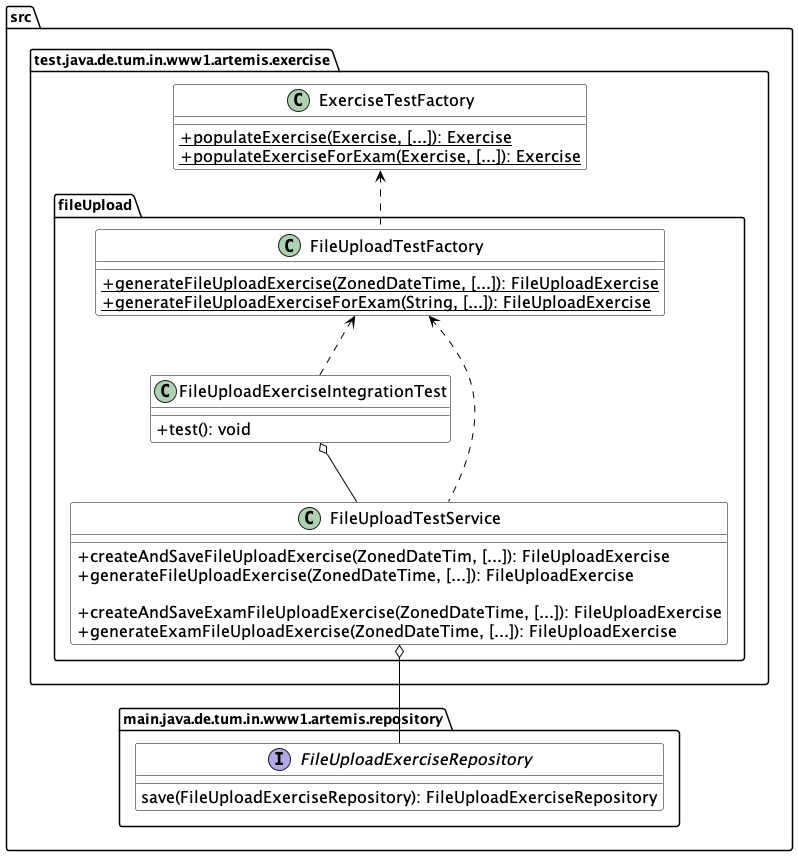

************
Server Tests
************

This section covers recommended practices for writing Artemis server tests. If you want to write tests for Artemis programming exercises to test students' submissions, check out :ref:`this <best_practices_for_test_cases>`.

You can execute server tests with the following commands:

* Execute tests with coverage report:          ``./gradlew test jacocoTestReport -x webapp``
* Execute tests without coverage report:       ``./gradlew test -x webapp``
* Run a single test:                           ``./gradlew test --tests ExamIntegrationTest -x webapp`` or ``./gradlew test --tests ExamIntegrationTest.testGetExamScore -x webapp``

To run the server tests against a real database in a Docker test container, use:

* Execute tests with Postgres container:       ``SPRING_PROFILES_INCLUDE=postgres ./gradlew test -x webapp``
* Execute tests with MySQL container:          ``SPRING_PROFILES_INCLUDE=mysql ./gradlew test -x webapp``

0. General testing tips
========================
Use appropriate and descriptive names for test cases so developers can easily understand what you test without looking deeper into it.
Instead of naming your variables ``int a``, ``double b``, ``String c``, you should use meaningful names that elucidate their purpose.
To increase readability, prefix variable names with ``actual`` and ``expected``.

We want to follow the naming convention ``should<ExpectedBehavior>When<StateUnderTest>``.
For example, if you want to test that an unknown user should not be able to ``borrow`` a ``Book``, ``BookIntegrationTest.shouldReturnForbiddenWhenUserUnknown()`` would be an appropriate name for the test case.
Utilizing a nested class can improve the readability of the test names as well as the structure of the test class.
When comparing two books in the test, use meaningful names such as ``actualBook`` and ``expectedBook``.

.. code-block:: java

    @Nested
    class BorrowBook {

        @Test
        void shouldReturnForbiddenWhenUserUnknown() {
            [...]
            assertThat(actualBook).isEqualTo(expectedBook);
        }

        [...]
    }

Try to follow best practices for Java testing:

* Write small and specific tests by using helper functions with relevant parameters.
* Assert what’s relevant and avoid writing a single test covering all edge cases.
* Write dumb tests by avoiding the reuse of production code and focusing on comparing output values with hard-coded values.
* Invest in a testable implementation by avoiding static access, using constructor injection, and separating business logic from asynchronous execution.
* Instead of using random, use fixed test data to make error messages better understandable.
* Make use of `JUnit 5 <https://junit.org/junit5/docs/current/user-guide/#writing-tests>`__ features such as parameterized tests and nested test classes.
* Follow `best practices <https://www.baeldung.com/spring-tests>`__ related to spring testing.

For a more detailed overview check out `modern best testing practices <https://phauer.com/2019/modern-best-practices-testing-java/>`__.

1. Assert using the most specific overload method
==================================================

When asserting in server tests, use ``assertThat`` from the `AssertJ <https://github.com/assertj/assertj>`__ library. Another assertion statement, such as ``isEqualTo()``, **must**  follow the call. Using specific assertion statements rather than always expecting boolean values is best practice.

For example, instead of

.. code-block:: java

    assertThat(submissions.size()).isEqualTo(1);
    assertThat(submissionInDb.isPresent()).isTrue();
    assertThat(submissionInDb.get().getFilePath().contains("ffile.png")).isTrue();

use the built-in assertions directly:

.. code-block:: java

    assertThat(submissions).hasSize(1);
    assertThat(submissionInDb).isPresent();
    assertThat(submissionInDb.get().getFilePath()).contains("ffile.png");

These assertions provide better error messages when they fail and improve the code readability. However, not all methods are suitable for this type of assertion.
If the ``isTrue`` assertion is unavoidable, specify a custom error message using the ``as`` keyword:

.. code-block:: java

    assertThat(submission.isSubmittedInTime()).as("submission should be in time").isTrue();

For more information, please read `the AssertJ documentation <https://assertj.github.io/doc/#assertj-core-assertions-guide>`__, especially the `section about avoiding incorrect usage <https://assertj.github.io/doc/#assertj-core-incorrect-usage>`__.

2. ArchUnit
===========
Use the `ArchUnit <https://www.archunit.org/>`__ library to prevent the unintentional inclusion of unnecessary packages. We use the library to enforce consistency in the code base.
Here is a simple ArchUnit test using an ArchRule to forbid JUnit assertions (in favor of AssertJ ones).

.. code-block:: java

    @Test
    void testNoJunitJupiterAssertions() {
        ArchRule noJunitJupiterAssertions = noClasses().should().dependOnClassesThat().haveNameMatching("org.junit.jupiter.api.Assertions");

        noJunitJupiterAssertions.check(testClasses);
    }

We first define the ArchRule prohibiting the JUnit assertion package and then enforce it in test classes. Add new general ArchUnit test cases into the existing ``ArchitectureTest`` class or create a new class extending ``AbstractArchitectureTest`` for more specific tests.

3. Counting database query calls within tests
==============================================
It's possible to write tests checking how many database accesses an operation performs. These tests ensure that code changes don't inadvertently decrease performance and remind developers if they do, which is especially important for commonly used functionality.
However, we should carefully consider before adding such assertions as the test becomes more tedious to maintain.

The test below tracks how many database accesses a REST call performs. The custom assert ``assertThatDb`` uses the ``HibernateQueryInterceptor`` to count the number of queries. The assertion checks the number of database accesses and returns the original result of the REST call, which you can continue to use throughout the test.

.. code-block:: java

    class TestClass {

        @Test
        @WithMockUser(username = "instructor1", roles = "INSTRUCTOR")
        void testQueryCount() throws Exception {
            Course course = assertThatDb(() -> request.get("/api/courses/" + courses.get(0).getId() + "/for-dashboard", HttpStatus.OK, Course.class)).hasBeenCalledTimes(3);
            assertThat(course).isNotNull();
        }
    }

4. UtilServices and factories
=============================
When setting up data in tests, use helper functions from corresponding UtilService and Factory classes. We use the factory method pattern to structure test cases, depicted in the simplified class
diagram below. In this example, the ``ExerciseTestFactory`` generates exercises for tests, while the ``FileUploadTestFactory`` specializes in file upload exercises. The ``FileUploadIntegrationTest``
utilizes the services provided by ``FileUploadTestService``. The ``FileUploadTestService`` manages the creation and communication with the database.

In general, **UtilServices** manage the communication with the database, and **Factories** are responsible for object creation and initialization. If you cannot find the correct helper function, add a new one to the most fitting UtilService or Factory and enhance it with JavaDoc.

.. note::
    Make sure to always use the ids returned by the database and to not assume the existence or non-existence of specific values.

5. Test performance tips
========================
Fast tests provide quick feedback, enabling developers to address issues and speed up the development process. We execute test groups (JenkinsGitlab, LocalCILocalVC, GitlabCIGitlabSaml, Unit Tests, Independent Tests) in parallel, trying to balance them out.
When creating a new integration test, keep the test group balance in mind and consider adding the class to any other group, especially LocalCILocalVC, GitlabCIGitlabSaml, or Independent Tests.
Additionally, consider the spring profiles the new test cases need when deciding on the test group.

Follow these tips to write performant tests:

* Avoid database access as much as possible. It is very time-consuming, especially when running tests against MySQL or Postgres.
* Avoid unnecessary mocked requests by directly setting up the data and saving it in the database.
* Use the `Awaitility <https://github.com/awaitility>`__ library for asserting async code.
* Limit object creation in tests and the test setup.

6. Avoid using @MockBean
=========================

Do not use the ``@SpyBean`` or ``@MockBean`` annotation unless absolutely necessary or possibly in an abstract Superclass. `Here <https://www.baeldung.com/spring-tests>`__ you can see why in more detail.
Whenever``@MockBean`` appears in a class, the application context cache gets marked as dirty, meaning the runner will clean the cache after finishing the test class. The application context is restarted, which leads to an additional server start with runtime overhead.
We want to keep the number of server starts minimal.

Below is an example of how to replace a ``@SpyBean``. To test an edge case where an ``IOException`` is thrown, we mocked the service method so it threw an Exception.

.. code-block:: java

    class TestExport extends AbstractSpringIntegrationIndependentTest {
        @SpyBean
        private FileUploadSubmissionExportService fileUploadSubmissionExportService;

        @Test
        @WithMockUser(username = "instructor1", roles = "INSTRUCTOR")
        void testExportAll_IOException() throws Exception {
            doThrow(IOException.class).when(fileUploadSubmissionExportService).export(any(), any());
            request.postWithResponseBodyFile("/api/file-upload-export/" + fileUploadExercise.getId(), HttpStatus.BAD_REQUEST);
        }
    }

To avoid new SpyBeans, we now use `static mocks <https://asolntsev.github.io/en/2020/07/11/mockito-static-methods/>`__. Upon examining the ``export()`` method, we find a ``File.newOutputStream(..)`` call.
Now, instead of mocking the whole service, we can mock the static method:

.. code-block:: java

    class TestExport extends AbstractSpringIntegrationIndependentTest {
        // No beans used anymore
        @Test
        @WithMockUser(username = "instructor1", roles = "INSTRUCTOR")
        void testExportAll_IOException() throws Exception {
            MockedStatic<Files> mockedFiles = mockStatic(Files.class);
            mockedFiles.when(() -> Files.newOutputStream(any(), any())).thenThrow(IOException.class);
            request.postWithResponseBodyFile("/api/file-upload-export/" + fileUploadExercise.getId(), HttpStatus.BAD_REQUEST);

            mockedFiles.close();
        }
    }

We no longer mock the uppermost method but only throw the exception at the place where it could actually happen. At the end of the test, you **need to close** the mock again.
For a real example where we replaced a SpyBean with a static mock, look at the ``SubmissionExportIntegrationTest.java`` `here <https://github.com/ls1intum/Artemis/commit/4843137aa01cfdf27ea019400c48df00df36ed45>`__.

7. Parallel test execution
===========================
We use the `JUnit 5 <https://junit.org/junit5/docs/snapshot/user-guide/#writing-tests-parallel-execution>`__ feature to execute tests in parallel.

The following line in the ``junit-platform.properties`` file enables parallel test execution with JUnit 5. Setting the property to ``false`` disables parallel test execution.

.. code-block:: properties

    junit.jupiter.execution.parallel.enabled = true

To execute a test class and its inheriting classes in parallel, we annotate it with ``@Execution(ExecutionMode.CONCURRENT)``.
Since we need to isolate resources such as
databases and application contexts, we use the ``@ResourceLock`` annotation. By annotating ``abstract`` base classes with it, we group tests into parallel running groups while preserving the sequential execution of tests within each group. For our use case, the ``@ResourceLock`` annotation takes
the name of the test group (matching the ``abstract`` base class name) as a parameter. A unique set of spring profiles, a separate application context, and a separate database characterizes each test group.

.. code-block:: java

    @SpringBootTest
    @AutoConfigureMockMvc
    @ExtendWith(SpringExtension.class)
    @Execution(ExecutionMode.CONCURRENT)
    @ResourceLock("AbstractSpringIntegrationIndependentTest")
    @AutoConfigureEmbeddedDatabase
    @ActiveProfiles({ SPRING_PROFILE_TEST, PROFILE_ARTEMIS, PROFILE_SCHEDULING, PROFILE_IRIS })
    @TestPropertySource(properties = { "artemis.user-management.use-external=false" })
    public abstract class AbstractSpringIntegrationIndependentTest extends AbstractArtemisIntegrationTest { ... }

Note that parallel test execution is only safe if the tests are independent and will lead to flaky tests otherwise. Specific resources, such as the Hazelcast cache, are shared among tests belonging to different groups.
To prevent these tests from running in parallel, we could use the ``@ResourceLock`` annotation. This approach benefits the performance by allowing other tests
that do not share the locked resource to run in parallel.

However, the ``@Isolated`` annotation, which prevents other tests from running parallel to the annotated test, is preferred. The annotation is more explicit and easier to understand. It benefits extensibility and maintainability when it is uncertain what other tests might need the resource now or in the future.

.. code-block:: java

    @Isolated
    class QuizCacheTest extends AbstractSpringIntegrationIndependentTest { ... }

.. note::
    Avoid using ``@Isolated`` whenever possible, as it worsens the test runtime. Try to refactor tests so that the shared resources become exclusive and only use @Isolated if refactoring is not possible.
