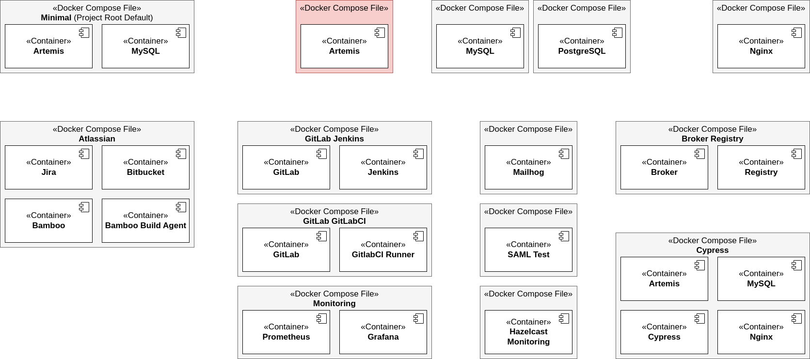

.. _docker_compose_setup_dev:

Alternative: Docker Compose Setup
---------------------------------

Getting Started with Docker Compose
^^^^^^^^^^^^^^^^^^^^^^^^^^^^^^^^^^^

1. Install `Docker Desktop <https://docs.docker.com/desktop/install/mac-install/>`__ or
   `Docker Engine and Docker CLI with the Docker Compose Plugin <https://docs.docker.com/compose/install/>`__
   (``docker compose`` command).

   We **DON'T support** the usage of the **Compose standalone** binary (``docker-compose`` command) as its installation
   method `is no longer supported by Docker <https://docs.docker.com/compose/install/>`__.

   We recommend the latest version of Docker Desktop or Docker Engine and Docker CLI with Docker Compose Plugin.
   The minimum version for Docker Compose is 1.27.0+ as of this version the
   `latest Compose file format is supported <https://docs.docker.com/compose/compose-file/compose-versioning/#versioning>`__.

   .. hint::
     Make sure that Docker Desktop has enough memory (~ 6GB). To adapt it, go to ``Settings -> Resources``.

2. Check that all local network ports used by Docker Compose are free (e.g. you haven't started a local MySQL server
   when you would like to start a Docker Compose instance of mysql)
3. Run ``docker compose pull && docker compose up`` in the directory ``docker/``
4. Open the Artemis instance in your browser at https://localhost
5. Run ``docker compose down`` in the directory ``docker/`` to stop and remove the docker containers

.. tip::
  | The first ``docker compose pull`` command is just necessary the first time as an extra step;
    otherwise, Artemis will be built from source as you don't already have an Artemis Image locally.
  |
  | For Arm-based Macs, Dev boards, etc., you will have to build the Artemis Docker Image first, as we currently do not
    distribute Docker Images for these architectures.

Other Docker Compose Setups
^^^^^^^^^^^^^^^^^^^^^^^^^^^

   Overview of the Artemis Docker / Docker Compose structure

The easiest way to configure a local deployment via Docker is a deployment with a *docker compose* file.
In the directory ``docker/`` you can find the following *docker compose* files for different **setups**:

* ``artemis-dev-mysql.yml``: **Artemis-Dev-MySQL** Setup containing the development build of Artemis and a MySQL DB
* ``artemis-dev-postgres.yml``: **Artemis-Dev-Postgres** Setup containing the development build of Artemis and
  a PostgreSQL DB
* ``artemis-prod-mysql.yml``: **Artemis-Prod-MySQL** Setup containing the production build of Artemis and a MySQL DB
* ``artemis-prod-postgres.yml``: **Artemis-Prod-Postgres** Setup containing the production build of Artemis and
  a PostgreSQL DB
* ``gitlab-gitlabci.yml``: **GitLab-GitLabCI** Setup containing a GitLab and GitLabCI instance
* ``gitlab-jenkins.yml``: **GitLab-Jenkins** Setup containing a GitLab and Jenkins instance
  (see `Gitlab Server Quickstart Guide <#gitlab-server-quickstart>`__ for the configuration of this setup)
* ``monitoring.yml``: **Prometheus-Grafana** Setup containing a Prometheus and Grafana instance
* ``mysql.yml``: **MySQL** Setup containing a MySQL DB instance
* ``nginx.yml``: **Nginx** Setup containing a preconfigured Nginx instance
* ``postgres.yml``: **Postgres** Setup containing a PostgreSQL DB instance

Three example commands to run such setups:

.. code:: bash

  docker compose -f docker/atlassian.yml up
  docker compose -f docker/mysql.yml -f docker/gitlab-jenkins.yml up
  docker compose -f docker/artemis-dev-postgres.yml up

.. tip::
  There is also a single ``docker-compose.yml`` in the directory ``docker/`` which mirrors the setup of ``artemis-prod-mysql.yml``.
  This should provide a quick way, without manual changes necessary, for new contributors to startup an Artemis instance.
  If the documentation just mentions to run ``docker compose`` without a ``-f <file.yml>`` argument, it's
  assumed you are running the command from the ``docker/`` directory.

For each service being used in these *docker compose* files, a **base service** (containing similar settings)
is defined in the following files:

* ``artemis.yml``: **Artemis Service**
* ``mysql.yml``: **MySQL DB Service**
* ``nginx.yml``: **Nginx Service**
* ``postgres.yml``: **PostgreSQL DB Service**
* ``gitlab.yml``: **GitLab Service**
* ``jenkins.yml``: **Jenkins Service**

For testing mails or SAML logins, you can append the following services to any setup with an artemis container:

* ``mailhog.yml``: **Mailhog Service** (email testing tool)
* ``saml-test.yml``: **Saml-Test Service** (SAML Test Identity Provider for testing SAML features)

An example command to run such an extended setup:

.. code:: bash

  docker compose -f docker/artemis-dev-mysql.yml -f docker/mailhog.yml up

.. warning::
  If you want to run multiple *docker compose* setups in parallel on one host, you might have to modify
  volume, container, and network names!

Folder structure
""""""""""""""""

| **Base services** (compose file with just one service) and **setups** (compose files with multiple services)
  should be located directly in ``docker/``.
| Additional files like configuration files, Dockerfile, ...
  should be in a subdirectory with the **base service** or **setup** name (``docker/<base service or setup name>/``).

Artemis Base Service
^^^^^^^^^^^^^^^^^^^^

Everything related to the Docker Image of Artemis (built by the Dockerfile) can be found
`in the Server Setup section <#run-the-server-via-docker>`__.
All Artemis-related settings changed in Docker Compose files are described here.

| The ``artemis.yml`` **base service** (e.g. in the ``artemis-prod-mysql.yml`` setup) defaults to the latest
  Artemis Docker Image tag in your local docker registry.
| If you want to build the checked-out version run ``docker compose build artemis-app`` before starting Artemis.
| If you want a specific version from the GitHub container registry change the ``image:`` value to the desired image
  for the ``artemis-app`` service and run ``docker compose pull artemis-app``.

Debugging with Docker
^^^^^^^^^^^^^^^^^^^^^

See the `Debugging with Docker <#docker-debugging>`__ section for detailed information.
In all development *docker compose* setups like ``artemis-dev-mysql.yml`` Java Remote Debugging is enabled by default.

Service, Container and Volume names
^^^^^^^^^^^^^^^^^^^^^^^^^^^^^^^^^^^

Service names for the usage within *docker compose* are kept short, like ``mysql``, to make it easier
to use them in a CLI.

Container and volume names are prepended with ``artemis-`` in order to not interfere with other container or volume
names on your system.

Get a shell into the containers
^^^^^^^^^^^^^^^^^^^^^^^^^^^^^^^

.. tip::
  To keep the documentation short, we will use the standard form of ``docker compose COMMAND`` from this point on.
  You can use the following commands also with the ``-f docker/<setup to be launched>.yml`` argument pointing
  to a specific setup.

-  app container:
   ``docker compose exec artemis-app bash`` or if the container is not yet running:
   ``docker compose run --rm artemis-app bash``
-  mysql container:
   ``docker compose exec mysql bash`` or directly into mysql ``docker compose exec mysql mysql``

Analog for other services.

Other useful commands
^^^^^^^^^^^^^^^^^^^^^

- Start a setup in the background: ``docker compose up -d``
- Stop and remove containers of a setup: ``docker compose down``
- Stop, remove containers and volumes: ``docker compose down -v``
- Remove Artemis-related volumes/state: ``docker volume rm artemis-data artemis-mysql-data``

  This is helpful in setups where you just want to delete the state of artemis
  but not of Jenkins and GitLab for instance.
- Stop a service: ``docker compose stop <name of the service>`` (restart via
  ``docker compose start <name of the service>``)
- Restart a service: ``docker compose restart <name of the service>``
- Remove all local Docker containers: ``docker container rm $(docker ps -a -q)``
- Remove all local Artemis Docker images: ``docker rmi $(docker images --filter=reference="ghcr.io/ls1intum/artemis:*" -q)``

Using Traefik as a reverse proxy
^^^^^^^^^^^^^^^^^^^^^^^^^^^^^^^^

If you want to use `Traefik <https://doc.traefik.io/traefik/>`_ as a reverse proxy for your Artemis instance, you can configure your setup using a single ``traefik.toml`` file and a ``docker-compose.yml`` file.
The ``traefik.toml`` file should be located in the same directory as the ``docker-compose.yml`` file.
You should also ensure that an ``acme.json`` file exists within your directory.
The ``acme.json`` file is used to store the certificates generated by Traefik.
Thus, the permissions of the ``acme.json`` file should be set to 600 for root.

The ``traefik.toml`` file should be configured as follows:

.. code:: toml

    [global]
      checkNewVersion = true
      sendAnonymousUsage = false

    [log]
      level = "INFO"

    [api]
      dashboard = true
      insecure = false

    [entryPoints]
      [entryPoints.web]
        address = ":80"

      [entryPoints.websecure]
        address = ":443"

    [certificatesResolvers.customresolver.acme]
      email = "your-mail-address-here"
      storage = "/etc/traefik/acme/acme.json"
      [certificatesResolvers.customresolver.acme.httpChallenge]
        # used during the challenge
        entryPoint = "web"
        [entryPoints.web.http.redirections.entrypoint]
          to = "websecure"
          scheme = "https"

    [acme]
    onHostRule = true

    [providers.docker]
      endpoint = "unix:///var/run/docker.sock"
      exposedByDefault = false
      network = "artemis-net" # name of the network in the docker-compose.yml file

    [accessLog]
    [accesslog.fields.names]
      StartUTC = "drop"

The ``docker-compose.yml`` file could look like this for an Artemis, Jenkins and MySQL setup with Traefik as a reverse proxy:

.. code:: yaml

    services:
      traefik:
        image: traefik
        container_name: "traefik"
        restart: always
        ports:
          - "80:80"
          - "443:443"
        volumes:
          - "./traefik.toml:/etc/traefik/traefik.toml:ro"
          - "./acme.json:/etc/traefik/acme/acme.json"
          - "/var/run/docker.sock:/var/run/docker.sock:ro"
        networks:
          - artemis-net
        environment:
          - TZ=Europe/Berlin
        labels:
          - "traefik.enable=true"
          - "traefik.http.routers.api.entrypoints=websecure"
          - "traefik.http.routers.api.tls=true"
            # Manage Access to the Traefik Dashboard. Replace <<USERNAME>> and <<PASSWORD_HASH>> with your credentials.
            # The dashboard will be available at https://<<ARTEMIS_HOST_NAME>>/dashboard/
            # Artemis will be available at another domain: https://<<ARTEMIS_SERVER_NAME>>/
            # If you don't want to use the dashboard, you can remove the following lines and disable the dashboard in the traefik.toml file.
          - "traefik.http.routers.api.rule=Host(`${ARTEMIS_HOST_NAME}`) && (PathPrefix(`/api/`) || PathPrefix(`/dashboard/`)) || Path(`/dashboard`) || Path(`/api`)"
          - "traefik.http.middlewares.api-redirect.redirectregex.regex=^https?://([^/]+)(/[^/]+)$"
          - "traefik.http.middlewares.api-redirect.redirectregex.replacement=https://$$1$$2/"
          - "traefik.http.routers.api.service=api@internal"
          - "traefik.http.routers.api.middlewares=api-redirect,api-auth"
          - "traefik.http.middlewares.api-auth.basicauth.users=<<USERNAME>>:<<PASSWORD_HASH>>"

      jenkins:
        image: jenkins/jenkins:lts
        container_name: "jenkins"
        restart: unless-stopped
        user: root
        volumes:
          - ./data/jenkins/home:/var/jenkins_home
          - /var/run/docker.sock:/var/run/docker.sock
          - /usr/bin/docker:/usr/bin/docker:ro
          - /usr/bin/com.docker.cli:/usr/bin/com.docker.cli:ro
        ports:
          - "50000:50000"
        networks:
          - artemis-net
        labels:
          - "traefik.enable=true"
          - "traefik.http.routers.jenkins.rule=Host(`${JENKINS_SERVER_NAME}`)"
          - "traefik.http.routers.jenkins.entrypoints=websecure"
          - "traefik.http.routers.jenkins.tls=true"
          - "traefik.http.routers.jenkins.tls.certresolver=customresolver"
          - "traefik.http.services.jenkins.loadbalancer.server.port=8080"

      artemis:
        image: ghcr.io/ls1intum/artemis:${ARTEMIS_VERSION}
        container_name: "artemis"
        restart: unless-stopped
        depends_on:
          artemis-db:
            condition: service_started
          jenkins:
            condition: service_started
        volumes:
          - ./data/artemis-be/config:/opt/artemis/config
          - ./data/artemis-be/data:/opt/artemis/data
          - ./branding:/opt/artemis/public/content:ro
        ports:
          - "22:22"
        environment:
          - spring.profiles.active=${PROFILES}
          - SPRING_DATASOURCE_URL=jdbc:mysql://artemis-db:3306/Artemis?createDatabaseIfNotExist=true&allowPublicKeyRetrieval=true&useUnicode=true&characterEncoding=utf8&useSSL=false&useLegacyDatetimeCode=false&serverTimezone=UTC
        networks:
          - artemis-net
        labels:
          - "traefik.enable=true"
          - "traefik.http.routers.artemis.rule=Host(`${ARTEMIS_SERVER_NAME}`)"
          - "traefik.http.routers.artemis.entrypoints=websecure"
          - "traefik.http.routers.artemis.tls=true"
          - "traefik.http.routers.artemis.tls.certresolver=customresolver"
          - "traefik.http.services.artemis.loadbalancer.server.port=8080"

      artemis-db:
        image: mysql:9
        container_name: "mysql"
        restart: unless-stopped
        volumes:
          - ./data/artemis-db:/var/lib/mysql
        environment:
          - MYSQL_ALLOW_EMPTY_PASSWORD=yes
          - MYSQL_DATABASE=Artemis
        command: mysqld --lower_case_table_names=1 --skip-ssl --character_set_server=utf8mb4 --collation-server=utf8mb4_unicode_ci --explicit_defaults_for_timestamp
        networks:
          - artemis-net
        cap_add:
          - SYS_NICE

    networks:
      artemis-net:
        name: artemis-net
