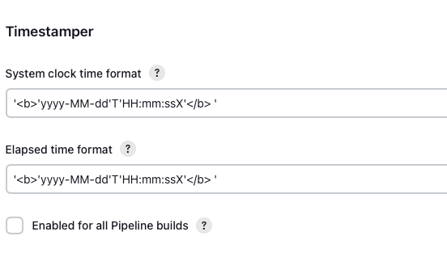
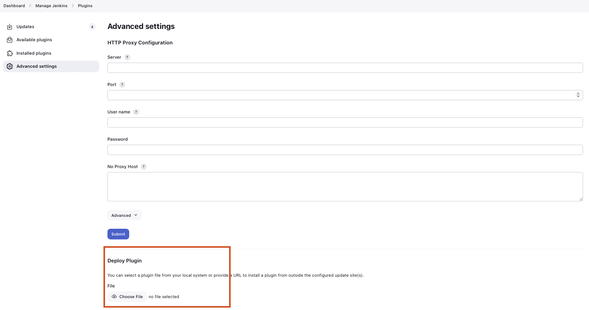

Setup for Programming Exercises with Jenkins and GitLab
=======================================================

This page describes how to set up a programming exercise environment
based on Jenkins and GitLab. Optional commands are in curly brackets ``{}``.

The following assumes that all instances run on separate servers. If you
have one single server, or your own NGINX instance, just skip all NGINX
related steps and use the configurations provided under *Separate NGINX
Configurations*

**If you want to setup everything on your local machine, you can also
just ignore all NGINX related steps.** **Just make sure that you use
unique port mappings for your Docker containers (e.g.** ``80`` **for
GitLab,** ``8080`` **for Jenkins,** ``8081`` **for Artemis)**

**Prerequisites:**

* `Docker <https://docs.docker.com/install>`__

.. contents:: Content of this document
    :local:
    :depth: 2

Artemis
-------

In order to use Artemis with Jenkins as **Continuous Integration**
Server and Gitlab as **Version Control** Server, you have to configure
the file ``application-prod.yml`` (Production Server) or
``application-artemis.yml`` (Local Development) accordingly. Please note
that all values in ``<..>`` have to be configured properly. These values
will be explained below in the corresponding sections.

.. code:: yaml

   artemis:
       repo-clone-path: ./repos/
       repo-download-clone-path: ./repos-download/
       encryption-password: artemis-encrypt     # arbitrary password for encrypting database values
       user-management:
           use-external: false
           internal-admin:
                username: artemis_admin
                password: artemis_admin
       version-control:
           url: <https://gitlab-url>
           user: <gitlab-admin-user>
           password: <gitlab-admin-password>
           token: <token>
           ci-token: <ci-token>
       continuous-integration:
           user: <jenkins-admin-user>
           password: <jenkins-admin-password>
           url: <https://jenkins-url>
           empty-commit-necessary: false
           secret-push-token: <secret push token>
           vcs-credentials: <vcs-credentials>
           artemis-authentication-token-key: <artemis-authentication-token-key>
           artemis-authentication-token-value: <artemis-authentication-token-value>

In addition, you have to start Artemis with the profiles ``gitlab`` and
``jenkins`` so that the correct adapters will be used, e.g.:

::

   --spring.profiles.active=dev,jenkins,gitlab,artemis

Please read :doc:`../setup` for more details.

For a local setup on Windows you can use `http://host.docker.internal` appended
by the chosen ports as the version-control and continuous-integration url.

Make sure to change the ``server.url`` value in ``application-dev.yml``
or ``application-prod.yml`` accordingly. This value will be used for the
communication hooks from Gitlab to Artemis and from Jenkins to Artemis.
In case you use a different port than 80 (http) or 443 (https) for the
communication, you have to append it to the ``server.url`` value,
e.g. \ ``127.0.0.1:8081``.

When you start Artemis for the first time, it will automatically create
an admin user based on the default encryption password specified in the
yml file above. In case you want to use a different encryption password,
you can insert users manually into the ``jhi_user`` table. You can use
`Jasypt Online Encryption
Tool <https://www.devglan.com/online-tools/jasypt-online-encryption-decryption>`__
to generate encryption strings. Use Two Way Encryption (With Secret
Text).

GitLab
------

Gitlab Server Setup
~~~~~~~~~~~~~~~~~~~

1. Pull the latest GitLab Docker image

   ::

       docker pull gitlab/gitlab-ce:latest

Start Gitlab
^^^^^^^^^^^^

2. Run the image (and change the values for hostname and ports). Add
   ``-p 2222:22`` if cloning/pushing via ssh should be possible. As
   Gitlab runs in a docker container and the default port for SSH (22)
   is typically used by the host running Docker, we change the port
   Gitlab uses for SSH to ``2222``. This can be adjusted if needed.

   Make sure to remove the comments from the command before running it and that docker has enough memory (~ 6GB). To adapt it, go to ``Preferecences -> Resources``

   ::

       docker run -itd --name gitlab \
           --hostname your.gitlab.domain.com \   # Specify the hostname
           --restart always \
           -m 3000m \                            # Optional argument to limit the memory usage of Gitlab
           -p 2222:22 \                          # Remove this if cloning via SSH should not be supported
           -p 80:80 -p 443:443 \                 # Alternative 1: If you are NOT running your own NGINX instance
           -p <some port of your choosing>:80 \  # Alternative 2: If you ARE running your own NGINX instance
           -v gitlab_data:/var/opt/gitlab \
           -v gitlab_logs:/var/log/gitlab \
           -v gitlab_config:/etc/gitlab \
           gitlab/gitlab-ce:latest

3. Wait a couple of minutes until the container is deployed and GitLab
   is set up, then open the instance in you browser and set a first
   admin password of your choosing. You can then login using the
   username “root” and you password.

4. We recommend to rename the “root” admin user to “artemis”. To rename
   the user, click on the image on the top right and select “Settings”.
   Now select “Account” on the left and change the username. Use the
   same password in the Artemis configuration file
   *application-artemis.yml*

   .. code:: yaml

       artemis:
           version-control:
               user: artemis
               password: the.password.you.chose

5. **If you run your own NGINX, then skip the next steps (6-7)**

6. Configure Gitlab to automatically generate certificates using
   LetsEncrypt. Edit the Gitlab configuration

   ::

       docker exec -it gitlab /bin/bash
       nano /etc/gitlab/gitlab.rb

   And add the following part

   ::

       letsencrypt['enable'] = true                          # GitLab 10.5 and 10.6 require this option
       external_url "https://your.gitlab.domain.com"         # Must use https protocol
       letsencrypt['contact_emails'] = ['gitlab@your.gitlab.domain.com'] # Optional

       nginx['redirect_http_to_https'] = true
       nginx['redirect_http_to_https_port'] = 80

7. Reconfigure gitlab to generate the certificate.

   ::

       # Save your changes and finally run
       gitlab-ctl reconfigure

   If this command fails, try using

   ::

       gitlab-ctl renew-le-certs

8. Login to GitLab using the Artemis admin account and go to the profile
   settings (upper right corned → *Settings*)

   .. figure:: jenkins-gitlab/gitlab_setting_button.png
      :align: center

Gitlab Access Token
^^^^^^^^^^^^^^^^^^^

9.  Go to *Access Tokens*

   .. figure:: jenkins-gitlab/gitlab_access_tokens_button.png
      :align: center

10. Create a new token named “Artemis” and give it **all** rights.

   .. figure:: jenkins-gitlab/artemis_gitlab_access_token.png
      :align: center

11. Copy the generated token and insert it into the Artemis
    configuration file *application-artemis.yml*

    .. code:: yaml

       artemis:
           version-control:
               token: your.generated.api.token

12. (Optional) Allow outbound requests to local network

    There is a known limitation for the local setup: webhook URLs for the
    communication between Gitlab and Artemis and between Gitlab and Jenkins
    cannot include local IP addresses. This option can be deactivated in
    Gitlab on ``<https://gitlab-url>/admin/application_settings/network`` →
    Outbound requests. Another possible solution is to register a local URL,
    e.g. using `ngrok <https://ngrok.com/>`__, to be available over a domain
    the Internet.

13. Adjust the monitoring-endpoint whitelist. Run the following command

    ::

           docker exec -it gitlab /bin/bash

    Then edit the Gitlab configuration

    ::

           nano /etc/gitlab/gitlab.rb

    Add the following lines

    ::

       gitlab_rails['monitoring_whitelist'] = ['0.0.0.0/0']
       gitlab_rails['gitlab_shell_ssh_port'] = 2222

    This will disable the firewall for all IP addresses. If you only want to
    allow the server that runs Artemis to query the information, replace
    ``0.0.0.0/0`` with ``ARTEMIS.SERVER.IP.ADRESS/32``

    If you use SSH and use a different port than ``2222``, you have to
    adjust the port above.

14. Disable prometheus.
    As we encountered issues with the prometheus log files not being deleted and therefore filling up the disk space, we decided to disable prometheus within Gitlab.
    If you also want to disable prometheus, edit the configuration again using

    ::

        nano /etc/gitlab/gitlab.rb

    and add the following line

    ::

        prometheus_monitoring['enable'] = false

    The issue with more details can be found `here <https://gitlab.com/gitlab-org/omnibus-gitlab/-/issues/4166>`__.


Reconfigure Gitlab

::

   gitlab-ctl reconfigure

Upgrade GitLab
~~~~~~~~~~~~~~

You can upgrade GitLab by downloading the latest Docker image and
starting a new container with the old volumes:

    ::

        docker stop gitlab
        docker rename gitlab gitlab_old
        docker pull gitlab/gitlab-ce:latest

See https://hub.docker.com/r/gitlab/gitlab-ce/ for the latest version.
You can also specify an earlier one.

Start a GitLab container just as described in `Start-Gitlab <#start-gitlab>`__ and wait for a couple of minutes. GitLab
should configure itself automatically. If there are no issues, you can
delete the old container using ``docker rm gitlab_old`` and the olf
image (see ``docker images``) using ``docker rmi <old-image-id>``.
You can also remove all old images using ``docker image prune -a``

Jenkins
-------

Jenkins Server Setup
~~~~~~~~~~~~~~~~~~~~

1. Pull the latest Jenkins LTS Docker image

   ::

       sudo docker pull jenkins/jenkins:lts

2. Create a custom docker image

   Run the following command to get the latest jenkins LTS docker image.

   In order to install and use Maven with Java in the Jenkins container,
   you have to first install maven, then download Java and finally
   configure Maven to use Java instead of the default version.

   To perform all these steps automatically, you can prepare a Docker
   image:

   Create a dockerfile with the content found `here <src/main/docker/jenkins/Dockerfile>`.
   Copy it in a file named ``Dockerfile``, e.g. in
   the folder ``/opt/jenkins/`` using ``vim Dockerfile``.

   Now run the command ``docker build --no-cache -t jenkins-artemis .``

   This might take a while because Docker will download Java, but this
   is only required once.

3. Run steps 4-6 only if you are **not** using a separate instance,
   otherwise continue with `Start-Jenkins <#start-jenkins>`__

4. Create a file increasing the maximum file size for the nginx proxy.
   The nginx-proxy uses a default file limit that is too small for the
   plugin that will be uploaded later. **Skip this step if you have your
   own NGINX instance.**

   ::

       echo "client_max_body_size 16m;" > client_max_body_size.conf

5. Run the NGINX proxy docker container, this will automatically setup
   all reverse proxies and force https on all connections. (This image
   would also setup proxies for all other running containers that have
   the VIRTUAL_HOST and VIRTUAL_PORT environment variables). **Skip this
   step if you have your own NGINX instance.**

   ::

       docker run -itd --name nginx_proxy \
           -p 80:80 -p 443:443 \
           --restart always \
           -v /var/run/docker.sock:/tmp/docker.sock:ro \
           -v /etc/nginx/certs \
           -v /etc/nginx/vhost.d \
           -v /usr/share/nginx/html \
           -v $(pwd)/client_max_body_size.conf:/etc/nginx/conf.d/client_max_body_size.conf:ro \
           jwilder/nginx-proxy

6. The nginx proxy needs another docker-container to generate
   letsencrypt certificates. Run the following command to start it (make
   sure to change the email-address). **Skip this step if you have your
   own NGINX instance.**

   ::

       docker run --detach \
           --name nginx_proxy-letsencrypt \
           --volumes-from nginx_proxy \
           --volume /var/run/docker.sock:/var/run/docker.sock:ro \
           --env "DEFAULT_EMAIL=mail@yourdomain.tld" \
           jrcs/letsencrypt-nginx-proxy-companion

Start Jenkins
^^^^^^^^^^^^^

7.  Run Jenkins by executing the following command (change the hostname
    and choose which port alternative you need)

    ::

        docker run -itd --name jenkins \
            --restart always \
            -v jenkins_data:/var/jenkins_home \
            -v /var/run/docker.sock:/var/run/docker.sock \
            -e VIRTUAL_HOST=your.jenkins.domain -e VIRTUAL_PORT=8080 \    # Alternative 1: If you are NOT using a separate NGINX instance
            -e LETSENCRYPT_HOST=your.jenkins.domain \                     # Only needed if Alternative 1 is used
            -p <some port of your choosing>:8080 \                        # Alternative 2: If you ARE using a separate NGINX instance
            jenkins-artemis

    For jenkins to be able to read data from the volume you might need to allow the jenkins user to read the jenkins_data folder.
    One way to do that is transfer the ownership to the user with id 1000 which is normally the user the jenkins process runs with.
    ::

        sudo chown -R 1000 jenkins_data/

8.  Wait until the docker container has started and Jenkins is running.

9.  Run the following commands to navigate into the docker container and
    check the Maven and JDK version

    ::

        sudo docker exec -it jenkins /bin/bash

        mvn -version

    This should print ``Maven 3.x`` as Maven version, ``Java 15`` as
    Java version and ``/usr/lib/jvm/java-15-openjdk-amd64`` as Java
    home.

10. Open Jenkins in your browser (e.g. ``localhost:8080``) and setup the
    admin user account (install all suggested plugins). You can get the
    initial admin password using the following command.

    ::

       # Jenkins highlights the password in the logs, you can't miss it
       docker logs -f jenkins
       or alternatively
       docker exec jenkins cat /var/jenkins_home/secrets/initialAdminPassword

11. Set the chosen credentials in the Artemis configuration
    *application-artemis.yml*

    .. code:: yaml

       artemis:
           continuous-integration:
               user: your.chosen.username
               password: your.chosen.password

12. Setup JDK 15 in Jenkins Settings

    Navigate in your browser into Jenkins → Manage Jenkins → Global Tool
    Configuration → JDK. Change the existing JDK installation or click
    on Add JDK.

    Use ``OpenJDK 15`` as Name and
    ``/usr/lib/jvm/java-15-openjdk-amd64`` as JAVA_HOME

   .. figure:: jenkins-gitlab/jenkins_jdk_config.png
      :align: center

Required Jenkins Plugins
~~~~~~~~~~~~~~~~~~~~~~~~

You will need to install the following plugins (apart from the
recommended ones that got installed during the setup process):

1.  `GitLab <https://plugins.jenkins.io/gitlab-plugin/>`__ for enabling
    webhooks to and from GitLab

2.  `Multiple SCMs <https://plugins.jenkins.io/multiple-scms/>`__ for combining the
    exercise test and assignment repositories in one build

3.  `Post Build Task <https://plugins.jenkins.io/postbuild-task/>`__ for preparing build
    results to be exported to Artemis

4.  `Xvfb <https://plugins.jenkins.io/xvfb/>`__ for exercises based on GUI
    libraries, for which tests have to have some virtual display

5.  `Timestamper <https://plugins.jenkins.io/timestamper/>`__ for adding the
    time to every line of the build output (Timestamper might already be installed)

Choose “Download now and install after restart” and checking the
“Restart Jenkins when installation is complete and no jobs are running” box

Timestamper Configuration
~~~~~~~~~~~~~~~~~~~~~~~~~

Go to *Manage Jenkins → Configure System*. There you will find the
Timestamper configuration, use the following value for both formats:

::

       '<b>'yyyy-MM-dd'T'HH:mm:ssX'</b> '



Server Notification Plugin
~~~~~~~~~~~~~~~~~~~~~~~~~~

Artemis needs to receive a notification after every build, which
contains the test results and additional commit information. For that
purpose, we developed a Jenkins plugin, that can aggregate and *POST*
JUnit formatted results to any URL.

You can download the current release of the plugin
`here <https://github.com/ls1intum/jenkins-server-notification-plugin/releases>`__
(Download the **.hpi** file). Go to the Jenkins plugin page (*Manage
Jenkins → Manage Plugins*) and install the downloaded file under the
*Advanced* tab under *Upload Plugin*



Jenkins Credentials
~~~~~~~~~~~~~~~~~~~

Go to *Credentials → Jenkins → Global credentials* and create the
following credentials

GitLab API Token
^^^^^^^^^^^^^^^^

1. Create a new access token in GitLab named “Jenkins” and give it
   **api** rights and **read_repository** rights. For detailed
   instructions on how to create such a token follow `Gitlab Access
   Token <#gitlab-access-token>`__.

   .. figure:: jenkins-gitlab/gitlab_jenkins_token_rights.png
      :align: center

2. Copy the generated token and create new Jenkins credentials:

   1. **Kind**: GitLab API token
   2. **API token**: *your.copied.token*
   3. Leave the ID field blank
   4. The description is up to you

3. Go to the Jenkins settings *Manage Jenkins → Configure System*. There
   you will find the GitLab settings. Fill in the URL of your GitLab
   instance and select the just created API token in the credentials
   dropdown. After you click on “Test Connection”, everything should
   work fine. If you have problems finding the right URL for your local docker setup,
   you can try `http://host.docker.internal:80` for Windows or `http://docker.for.mac.host.internal:80` for Mac
   if GitLab is reachable over port 80.

   .. figure:: jenkins-gitlab/jenkins_gitlab_configuration.png
      :align: center

Server Notification Token
^^^^^^^^^^^^^^^^^^^^^^^^^

1. Create a new Jenkins credential containing the token, which gets send
   by the server notification plugin to Artemis with every build result:

   1. **Kind**: Secret text
   2. **Secret**: *your.secret_token_value* (choose any value you want,
      copy it for the nex step)
   3. Leave the ID field blank
   4. The description is up to you

2. Copy the generated ID of the new credentials and put it into the
   Artemis configuration *application-artemis.yml*

   .. code:: yaml

       artemis:
           continuous-integration:
               artemis-authentication-token-key: the.id.of.the.notification.token.credential

3. Copy the actual value you chose for the token and put it into the
   Artemis configuration *application-artemis.yml*

   .. code:: yaml

       artemis:
           continuous-integration:
               artemis-authentication-token-value: the.actual.value.of.the.notification.token

GitLab Repository Access
^^^^^^^^^^^^^^^^^^^^^^^^

1. Create a new Jenkins credentials containing the username and password
   of the GitLab administrator account:

   1. **Kind**: Username with password
   2. Scope: global
   3. **Username**: *the_username_you_chose_for_the_gitlab_admin_user*
   4. **Password**: *the_password_you_chose_for_the_gitlab_admin_user*
   5. Leave the ID field blank
   6. The description is up to you

2. Copy the generated ID (e.g. ``ea0e3c08-4110-4g2f-9c83-fb2cdf6345fa``)
   of the new credentials and put it into the Artemis configuration file
   *application-artemis.yml*

   .. code:: yaml

       artemis:
           continuous-integration:
               vcs-credentials: the.id.of.the.username.and.password.credentials.from.jenkins

GitLab to Jenkins push notification token
~~~~~~~~~~~~~~~~~~~~~~~~~~~~~~~~~~~~~~~~~

GitLab has to notify Jenkins build plans if there are any new commits to
the repository. The push notification that gets sent here is secured by
a token generated by Jenkins. In order to get this token, you have to do
the following steps:

1.  Create a new item in Jenkins (use the Freestyle project type) and
    name it **TestProject**

2.  In the project configuration, go to *Build Triggers → Build when a
    change is pushed to GitLab* and activate this option

3.  Click on *Advanced*.

4.  You will now have a couple of new options here, one of them being a
    “**Secret token**”.

5.  Click on the “*Generate*” button right below the text box for that
    token.

6.  Copy the generated value, let’s call it **$gitlab-push-token**

7.  Apply these change to the plan (i.e. click on *Apply*)

   .. figure:: jenkins-gitlab/jenkins_test_project.png
      :align: center

8.  Perform a *GET* request to the following URL (e.g. with Postman)
    using Basic Authentication and the username and password you chose
    for the Jenkins admin account:

    ::

        GET https://your.jenkins.domain/job/TestProject/config.xml

9.  You will get the whole configuration XML of the just created build
    plan, there you will find the following tag:

    ::

        <secretToken>{$some-long-encrypted-value}</secretToken>

   .. figure:: jenkins-gitlab/jenkins_project_config_xml.png
      :align: center

      Job configuration XML

10. Copy the value of
    **:math:`some-long-encrypted-value without the curly brackets!**. This is the encrypted value of the **`\ gitlab-push-token**
    you generated in step 5.

11. Now, you can delete this test project and input the following values
    into your Artemis configuration *application-artemis.yml* (replace
    the placeholders with the actual values you wrote down)

    .. code:: yaml

       artemis:
           version-control:
               ci-token: $gitlab-push-token
           continuous-integration:
               secret-push-token: $some-long-encrytped-value

12. In a local setup, you might want to disable CSRF by going to:
    “Manage Jenkins” - “Configure Global Security” and uncheck “Prevent
    Cross Site Request Forgery exploits”. Also disable the option
    ``use-crumb`` in ``application-jenkins.yml``.

    Depending on the version this setting might not be available anymore.
    Have a look `here <https://unix.stackexchange.com/questions/444177/how-to-disable-the-csrf-protection-in-jenkins-by-default>`__ on how you can disable CSRF protection.


Installing remote build agents
^^^^^^^^^^^^^^^^^^^^^^^^^^^^^^
You might want to run the builds on additional Jenkins agents, especially if a large amount of students should use the system at the same time.
Jenkins supports remote build agents: The actual compilation of the students submissions happens on these other machines but the whole process is transparent to Artemis.

This setup guide is for setting up a remote agent on an Ubuntu virtual machine that supports docker builds.

Prerequisites:
1. Install Docker on the remote machine: https://docs.docker.com/engine/install/ubuntu/

2. Add a new user to the remote machine that Jenkins will use: ```sudo adduser --disabled-password --gecos "" jenkins```

3. Add the jenkins user to the docker group (This allows the jenkins user to interact with docker): ```sudo usermod -a -G docker jenkins```

4. Generate a new SSH key locally (e.g. using ```ssh-keygen```) and add the public key to the ```.ssh/authorized_keys``` file of the jenkins user on the agent VM.

5. Validate that you can connect to the build agent machine using SSH and the generated private key and validate that you can use docker (`docker ps` should not show an error)

6. Log in with your normal account on the build agent machine and install Java: ```sudo apt install default-jre```

7. Add a new secret in Jenkins, enter private key you just generated and add the passphrase, if set:

   .. figure:: jenkins-gitlab/jenkins_ssh_credentials.png
      :align: center

      Jenkins SSH Credentials

8. Add a new node (select a name and select `Permanent Agent`):
    Set the number of executors so that it matches your machine's specs: This is the number of concurrent builds this agent can handle

    Set the remote root directory to ```/home/jenkins/remote_agent```

    Set the launch method to `Launch via SSH` and add the host of the machine. Select the credentials you just created and select `Manually trusted key Verification Strategy` as Host key verification Strategy.
    Save it.


   .. figure:: jenkins-gitlab/jenkins_node.png
      :align: center

      Add a Jenkins node

9. Wait for some moments while jenkins installs it's remote agent on the agent's machine.
You can track the progress using the `Log` page when selecting the agent. System information should also be available.

10. You are finished, the new agent should now also process builds.


Upgrade Jenkins
~~~~~~~~~~~~~~~

Build the latest version of the ``jenkins-artemis`` Docker image, stop
the running container and mount the Jenkins data volume to the new LTS
container. Make sure to perform this command in the folder where the
``Dockerfile`` was created (e.g. ``/opt/jenkins/``):

    ::

        docker stop jenkins
        docker rename jenkins jenkins_old
        docker build --no-cache -t jenkins-artemis .

Now start a new Jenkins container just as described in `Start-Jenkins <#start-jenkins>`__.

Jenkins should be up and running again. If there are no issues, you can
delete the old container using ``docker rm jenkins_old`` and the old
image (see ``docker images``) using ``docker rmi <old-image-id>``.
You can also remove all old images using ``docker image prune -a``

You should also update the Jenkins plugins regularly due to security
reasons. You can update them directly in the Web User Interface in the
Plugin Manager.

Separate NGINX Configurations
-----------------------------

There are some placeholders in the following configurations. Replace
them with your setup specific values ### GitLab

::

   server {
       listen 443 ssl http2;
       server_name your.gitlab.domain;
       ssl_session_cache shared:GitLabSSL:10m;
       include /etc/nginx/common/common_ssl.conf;
       add_header Strict-Transport-Security "max-age=63072000; includeSubDomains; preload";
       add_header X-Frame-Options DENY;
       add_header Referrer-Policy same-origin;
       client_max_body_size 10m;
       client_body_buffer_size 1m;

       location / {
           proxy_pass              http://localhost:<your exposed GitLab HTTP port (default 80)>;
           proxy_read_timeout      300;
           proxy_connect_timeout   300;
           proxy_http_version      1.1;
           proxy_redirect          http://         https://;

           proxy_set_header    Host                $http_host;
           proxy_set_header    X-Real-IP           $remote_addr;
           proxy_set_header    X-Forwarded-For     $proxy_add_x_forwarded_for;
           proxy_set_header    X-Forwarded-Proto   $scheme;

           gzip off;
       }
   }

.. _jenkins-1:

Jenkins
~~~~~~~

::

   server {
       listen 443 ssl http2;
       server_name your.jenkins.domain;
       ssl_session_cache shared:JenkinsSSL:10m;
       include /etc/nginx/common/common_ssl.conf;
       add_header Strict-Transport-Security "max-age=63072000; includeSubDomains; preload";
       add_header X-Frame-Options DENY;
       add_header Referrer-Policy same-origin;
       client_max_body_size 10m;
       client_body_buffer_size 1m;

       location / {
           proxy_pass              http://localhost:<your exposed Jenkins HTTP port (default 8080)>;
           proxy_set_header        Host                $host:$server_port;
           proxy_set_header        X-Real-IP           $remote_addr;
           proxy_set_header        X-Forwarded-For     $proxy_add_x_forwarded_for;
           proxy_set_header        X-Forwarded-Proto   $scheme;
           proxy_redirect          http://             https://;

           # Required for new HTTP-based CLI
           proxy_http_version 1.1;
           proxy_request_buffering off;
           proxy_buffering off; # Required for HTTP-based CLI to work over SSL

           # workaround for https://issues.jenkins-ci.org/browse/JENKINS-45651
           add_header 'X-SSH-Endpoint' 'your.jenkins.domain.com:50022' always;
       }

       error_page 502 /502.html;
       location /502.html {
           root /usr/share/nginx/html;
           internal;
       }
   }

/etc/nginx/common/common_ssl.conf
~~~~~~~~~~~~~~~~~~~~~~~~~~~~~~~~~

If you haven’t done so, generate the DH param file:
``sudo openssl dhparam -out /etc/nginx/dhparam.pem 4096``

::

   ssl_certificate     <path to your fullchain certificate>;
   ssl_certificate_key <path to the private key of your certificate>;
   ssl_protocols       TLSv1.2 TLSv1.3;
   ssl_dhparam /etc/nginx/dhparam.pem;
   ssl_prefer_server_ciphers   on;
   ssl_ciphers ECDH+CHACHA20:EECDH+AESGCM:EDH+AESGCM:!AES128;
   ssl_ecdh_curve secp384r1;
   ssl_session_timeout  10m;
   ssl_session_cache shared:SSL:10m;
   ssl_session_tickets off;
   ssl_stapling on;
   ssl_stapling_verify on;
   resolver <if you have any, specify them here> valid=300s;
   resolver_timeout 5s;

#Deployment Artemis / GitLab / Jenkins using Docker on Local machine

Execute the following steps in addition to the ones described above:

Preparation
-----------

1. Create a Docker network named “artemis” with
   ``docker network create artemis``

.. _gitlab-1:

Gitlab
------

1. Add the Gitlab container to the created network with
   ``docker network connect artemis gitlab``
2. Get the URL of the Gitlab container with the first IP returned by
   ``docker inspect -f '{{range .NetworkSettings.Networks}}{{.IPAddress}}{{end}}' gitlab``
3. Use this IP in the ``application-artemis.yml`` file at
   ``artemis.version-control.url``

.. _jenkins-2:

Jenkins
-------

1. Add the Jenkins container to the created network with
   ``docker network connect artemis jenkins``
2. Get the URL of the Gitlab container with the first IP returned by
   ``docker inspect -f '{{range .NetworkSettings.Networks}}{{.IPAddress}}{{end}}' jenkins``
3. Use this IP in the ``application-artemis.yml`` file at
   ``artemis.continuous-integration.url``

.. _artemis-1:

Artemis
-------

1. In ``docker-compose.yml``

   1. Change the ``8080:8080`` port to ``8081:8081`` because Jenkins is
      using the port 8080
   2. Change the SPRING_PROFILES_ACTIVE to dev,jenkins,gitlab,artemis

2. In ``src/main/resources/config/application-dev.yml``

   1. At ``spring.profiles.active:`` add ``& gitlab & jenkins``
   2. At ``spring.liquibase:`` add the new property
      ``change-log: classpath:config/liquibase/master.xml``
   3. At ``server:`` change port to 8081 and

3. Run ``docker-compose up``

4. After the container has been deployed run
   ``docker inspect -f '{{range .NetworkSettings.Networks}}{{.IPAddress}}{{end}}' artemis_artemis-server``
   and copy the first resulting IP.

5. In ``src/main/resources/config/application-dev.yml`` at ``server:``
   change the port to 8081 and at ``url:`` paste the copied IP

6. Stop the Artemis docker container with Control-C and re-run
   ``docker-compose up``

