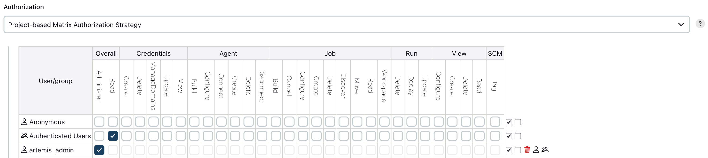

.. _Jenkins and LocalVC Setup:

Jenkins and LocalVC Setup
-------------------------

This section describes how to set up a programming exercise environment
based on Jenkins and LocalVC, which is integrated in Artemis. Optional commands are in curly brackets ``{}``.

The following assumes that all instances run on separate servers. If you
have one single server, or your own NGINX instance, just skip all NGINX
related steps and use the configurations provided under *Separate NGINX
Configurations*

**If you want to setup everything on your local development computer,
ignore all NGINX related steps.** **Just make sure that you use
unique port mappings for your Docker containers (e.g.** ``8081`` **for
Jenkins,** ``8080`` **for Artemis)**

**Prerequisites:**

* `Docker <https://docs.docker.com/install>`__

 Make sure that docker has enough memory (~ 6GB). To adapt it, go to ``Preferences -> Resources`` and restart Docker.

.. contents:: Content of this section
    :local:
    :depth: 3

Artemis
^^^^^^^

In order to use Artemis with Jenkins as **Continuous Integration**
Server and LocalVC as integrated **Version Control** Server, you have to configure
the file ``application-prod.yml`` (Production Server) or
``application-artemis.yml`` (Local Development) accordingly. Please note
that all values in ``<..>`` have to be configured properly. These values
will be explained below in the corresponding sections. If you want to set up a local environment, copy the values
below into your ``application-artemis.yml`` or ``application-local.yml`` file (the latter is recommended).

.. code:: yaml

   artemis:
    course-archives-path: ./exports/courses
    repo-clone-path: ./repos
    repo-download-clone-path: ./repos-download
    bcrypt-salt-rounds: 11  # The number of salt rounds for the bcrypt password hashing. Lower numbers make it faster but more unsecure and vice versa.
                            # Please use the bcrypt benchmark tool to determine the best number of rounds for your system. https://github.com/ls1intum/bcrypt-Benchmark
    user-management:
        use-external: false
        internal-admin:
            username: artemis_admin
            password: artemis_admin
        accept-terms: false
        login:
            account-name: TUM
    version-control:
        url: http://172.17.0.1:8080 # `http://host.docker.internal:8080` for Windows
        user: root
        password: dummy # has to be set, but does not matter for LocalVC
        build-agent-git-username: jenkins
        build-agent-git-password: artemis_admin # choose some strong password and username (gives read access to all repositories)
    continuous-integration:
        user: artemis_admin
        password: artemis_admin
        url: http://localhost:8082
        secret-push-token: AQAAABAAAAAg/aKNFWpF9m2Ust7VHDKJJJvLkntkaap2Ka3ZBhy5XjRd8s16vZhBz4fxzd4TH8Su # pre-generated or replaced in Automated Jenkins Server step 3
        vcs-credentials: artemis_localvc_credentials
        artemis-authentication-token-key: artemis_notification_plugin_token
        artemis-authentication-token-value: artemis_admin
        build-timeout: 30
    git:
        name: Artemis
        email: artemis@xcit.tum.de
   jenkins:
       # only required if Artemis and Jenkins cannot communicate on their public URLs
       # e.g., Jenkins is only available in a local container network
       internal-urls:
           ci-url: http://jenkins:8080
           vcs-url: http://localhost:8080
       use-crumb: false
   server:
        port: 8080
        url: http://172.17.0.1:8080 # `http://host.docker.internal:8080` for Windows

In addition, you have to start Artemis with the profiles ``localvc`` and
``jenkins`` so that the correct adapters will be used, e.g.:

::

   --spring.profiles.active=dev,jenkins,localvc,artemis,scheduling

Please read :ref:`Server Setup` for more details.

For a local setup on Windows you can use `http://host.docker.internal` appended
by the chosen ports as the continuous-integration url and the internal vcs url.

Make sure to change the ``server.url`` and ``artemis.version-control.url`` value in ``application-dev.yml``
or ``application-prod.yml`` accordingly. The ``server.url`` value will be used for the
communication hooks from Jenkins to Artemis.
In case you use a different port than 80 (http) or 443 (https) for the
communication, you have to append it to the both urls value,
e.g. \ ``127.0.0.1:8080``.

When you start Artemis for the first time, it will automatically create
an admin user.

**Note:** Sometimes Artemis does not generate the admin user which may lead to a startup
error. You will have to create the user manually in the MySQL database. Make sure
both are set up correctly and follow these steps:

1.  Use the tool mentioned above to generate a password hash.
2.  Connect to the database via a client like `MySQL Workbench <https://dev.mysql.com/downloads/workbench/>`__
    and execute the following query to create the user. Replace `artemis_admin` and `HASHED_PASSWORD` with your
    chosen username and password:

    .. code:: sql

        INSERT INTO `artemis`.`jhi_user` (`id`,`login`,`password_hash`,`first_name`,`last_name`,`email`,
        `activated`,`lang_key`,`activation_key`,`reset_key`,`created_by`,`created_date`,`reset_date`,
        `last_modified_by`,`last_modified_date`,`image_url`,`last_notification_read`,`registration_number`)
        VALUES (1,"artemis_admin","HASHED_PASSWORD","artemis","administrator","artemis_admin@localhost",
        1,NULL,NULL,NULL,NULL,NULL,NULL,NULL,NULL,NULL,NULL,NULL);
3. Give the user admin and user roles:

    .. code:: sql

        INSERT INTO `artemis`.`jhi_user_authority` (`user_id`, `authority_name`) VALUES (1,"ROLE_ADMIN");
        INSERT INTO `artemis`.`jhi_user_authority` (`user_id`, `authority_name`) VALUES (1,"ROLE_USER");

Starting the Artemis server should now succeed.

Jenkins
^^^^^^^

Automated Jenkins Server Setup
""""""""""""""""""""""""""""""

The following steps describe how to deploy a pre-configured version of the Jenkins server.
This is ideal as a quickstart for developers. For a more detailed setup, see
`Manual Jenkins Server Setup <#manual-jenkins-server-setup>`__.
In a production setup, you have to at least change the user credentials (in the file ``jenkins-casc-config-localvc.yml``) and push tokens.

1. You can now first build and deploy Jenkins, then you can also start the other services which weren't started yet:

    .. code:: bash

       JAVA_OPTS=-Djenkins.install.runSetupWizard=false docker compose -f docker/<Jenkins setup to be launched>.yml up --build -d jenkins
       docker compose -f docker/<Jenkins setup to be launched>.yml up -d

   Jenkins is then reachable under ``http://localhost:8082/`` and you can login using the credentials specified
   in ``jenkins-casc-config-localvc.yml`` (defaults to ``artemis_admin`` as both username and password).

2. The `application-local.yml` must be adapted with the values configured in ``jenkins-casc-config-localvc.yml``:

.. code:: yaml

    artemis:
        user-management:
            use-external: false
            internal-admin:
                username: artemis_admin
                password: artemis_admin
        version-control:
            url: http://172.17.0.1:8080 # `http://host.docker.internal:8080` for Windows
            user: root
            password: dummy # have to be set, but does not matter for LocalVC
            build-agent-git-username: jenkins
            build-agent-git-password: artemis_admin # choose some strong password and username (gives read access to all repositories)
        continuous-integration:
            user: artemis_admin
            password: artemis_admin
            url: http://localhost:8082
            vcs-credentials: artemis_localvc_credentials
            artemis-authentication-token-key: artemis_notification_plugin_token
            artemis-authentication-token-value: artemis_admin

5. Open the ``src/main/resources/config/application-jenkins.yml`` and change the following:
   Again, if you are using a development setup, the template in the beginning of this page already contains the
   correct values.

.. code:: yaml

    jenkins:
        internal-urls:
            ci-url: http://jenkins:8080
            vcs-url: http://localhost:8080

6. You're done. You can now run Artemis with the LocalVC/Jenkins environment.

Manual Jenkins Server Setup
"""""""""""""""""""""""""""

1. Pull the latest Jenkins LTS Docker image

   Run the following command to get the latest jenkins LTS docker image.

   .. code:: bash

       docker pull jenkins/jenkins:lts

2. Create a custom docker image

   In order to install and use Maven with Java in the Jenkins container,
   you have to first install maven, then download Java and finally
   configure Maven to use Java instead of the default version.
   You also need to install Swift and SwiftLint if you want to be able to
   create Swift programming exercises.

   To perform all these steps automatically, you can prepare a Docker
   image:

   Create a Dockerfile with the content found `here <docker/jenkins/Dockerfile>`.
   Copy it in a file named ``Dockerfile``, e.g. in
   the folder ``/opt/jenkins/`` using ``vim Dockerfile``.

   Now run the command ``docker build --no-cache -t jenkins-artemis .``

   This might take a while because Docker will download Java, but this
   is only required once.

Nginx proxy setup
#################

If you run your own NGINX or if you install Jenkins on a local development computer, you can skip this section.

#. Create a file increasing the maximum file size for the Nginx proxy.
   The nginx-proxy uses a default file limit that is too small for the
   plugin that will be uploaded later. **Skip this step if you have your
   own NGINX instance.**

   .. code:: bash

       echo "client_max_body_size 16m;" > client_max_body_size.conf

5. The NGINX default timeout is pretty low. For plagiarism check and unlocking student repos for the exam a higher
   timeout is advisable. Therefore we write our own nginx.conf and load it in the container.

   .. code:: nginx

            user  nginx;
            worker_processes  auto;

            error_log  /var/log/nginx/error.log warn;
            pid        /var/run/nginx.pid;

            events {
                worker_connections  1024;
            }

            http {
                include       /etc/nginx/mime.types;
                default_type  application/octet-stream;

                log_format  main  '$remote_addr - $remote_user [$time_local] "$request" '
                                  '$status $body_bytes_sent "$http_referer" '
                                  '"$http_user_agent" "$http_x_forwarded_for"';

                access_log  /var/log/nginx/access.log  main;

                fastcgi_read_timeout 300;
                proxy_read_timeout 300;

                sendfile        on;
                #tcp_nopush     on;

                keepalive_timeout  65;

                #gzip  on;

                include /etc/nginx/conf.d/*.conf;
            }
            daemon off

6. Run the NGINX proxy docker container, this will automatically setup
   all reverse proxies and force https on all connections. (This image
   would also setup proxies for all other running containers that have
   the VIRTUAL_HOST and VIRTUAL_PORT environment variables). **Skip this
   step if you have your own NGINX instance.**

   .. code:: bash

       docker run -itd --name nginx_proxy \
           -p 80:80 -p 443:443 \
           --restart always \
           -v /var/run/docker.sock:/tmp/docker.sock:ro \
           -v /etc/nginx/certs \
           -v /etc/nginx/vhost.d \
           -v /usr/share/nginx/html \
           -v $(pwd)/client_max_body_size.conf:/etc/nginx/conf.d/client_max_body_size.conf:ro \
           -v $(pwd)/nginx.conf:/etc/nginx/nginx.conf:ro \
           jwilder/nginx-proxy

7. The nginx proxy needs another docker-container to generate
   letsencrypt certificates. Run the following command to start it (make
   sure to change the email-address). **Skip this step if you have your
   own NGINX instance.**

   .. code:: bash

       docker run --detach \
           --name nginx_proxy-letsencrypt \
           --volumes-from nginx_proxy \
           --volume /var/run/docker.sock:/var/run/docker.sock:ro \
           --env "DEFAULT_EMAIL=mail@yourdomain.tld" \
           jrcs/letsencrypt-nginx-proxy-companion

Start Jenkins
#############

8.  Run Jenkins by executing the following command (change the hostname
    and choose which port alternative you need)

    .. code:: bash

        docker run -itd --name jenkins \
            --restart always \
            -v jenkins_data:/var/jenkins_home \
            -v /var/run/docker.sock:/var/run/docker.sock \
            -v /usr/bin/docker:/usr/bin/docker:ro \
            -e VIRTUAL_HOST=your.jenkins.domain -e VIRTUAL_PORT=8080 \    # Alternative 1: If you are NOT using a separate NGINX instance
            -e LETSENCRYPT_HOST=your.jenkins.domain \                     # Only needed if Alternative 1 is used
            -p 8082:8080 \                                                # Alternative 2: If you ARE using a separate NGINX instance OR you ARE installing Jenkins on a local development computer
            -u root \
            jenkins/jenkins:lts

    If you still need the old setup with Python & Maven installed locally, use ``jenkins-artemis`` instead of
    ``jenkins/jenkins:lts``.
    Also note that you can omit the ``-u root``, ``-v /var/run/docker.sock:/var/run/docker.sock`` and
    ``-v /usr/bin/docker:/usr/bin/docker:ro`` parameters, if you do not want to run Docker builds on the Jenkins controller
    (but e.g. use remote agents).

9. Open Jenkins in your browser (e.g. ``localhost:8082``) and setup the
    admin user account (install all suggested plugins). You can get the
    initial admin password using the following command.

    .. code:: bash

       # Jenkins highlights the password in the logs, you can't miss it
       docker logs -f jenkins
       or alternatively
       docker exec jenkins cat /var/jenkins_home/secrets/initialAdminPassword

10. Set the chosen credentials in the Artemis configuration
    *application-artemis.yml*

    .. code:: yaml

       artemis:
           continuous-integration:
               user: your.chosen.username
               password: your.chosen.password

Required Jenkins Plugins
""""""""""""""""""""""""

**Note:** The custom Jenkins Dockerfile takes advantage of the
`Plugin Installation Manager Tool for Jenkins <https://github.com/jenkinsci/plugin-installation-manager-tool>`__
to automatically install the plugins listed below. If you used the Dockerfile, you can skip these steps and
`Server Notification Plugin <#server-notification-plugin>`__.
The list of plugins is maintained in ``docker/jenkins/plugins.yml``.

You will need to install the following plugins (apart from the
recommended ones that got installed during the setup process):

1.  `Timestamper <https://plugins.jenkins.io/timestamper/>`__ for adding the
    time to every line of the build output (Timestamper might already be installed)

2.  `Pipeline <https://plugins.jenkins.io/workflow-aggregator/>`__ for defining the
    build description using declarative files (Pipeline might already be installed)

    **Note:** This is a suite of plugins that will install multiple plugins

3. `Pipeline Maven <https://plugins.jenkins.io/pipeline-maven/>`__ to use maven within the pipelines. If you want to
   use Docker for your build agents you may also need to install
   `Docker Pipeline <https://plugins.jenkins.io/docker-workflow/>`__ .

4. `Matrix Authorization Strategy Plugin <https://plugins.jenkins.io/matrix-auth/>`__ for configuring permissions
   for users on a project and build plan level (Matrix Authorization Strategy might already be installed).

The plugins above (and the pipeline-setup associated with it) got introduced in Artemis 4.7.3.
If you are using exercises that were created before 4.7.3, you also have to install these plugins:

Please note that this setup is **deprecated** and will be removed in the future.
Please migrate to the new pipeline-setup if possible.

1.  `Multiple SCMs <https://plugins.jenkins.io/multiple-scms/>`__ for combining the
    exercise test and assignment repositories in one build

2.  `Post Build Task <https://plugins.jenkins.io/postbuild-task/>`__ for preparing build
    results to be exported to Artemis

3.  `Xvfb <https://plugins.jenkins.io/xvfb/>`__ for exercises based on GUI
    libraries, for which tests have to have some virtual display

Choose “Download now and install after restart” and checking the
“Restart Jenkins when installation is complete and no jobs are running” box

Timestamper Configuration
"""""""""""""""""""""""""

Go to *Manage Jenkins → System Configuration → Configure*. There you will find the
Timestamper configuration, use the following value for both formats:

::

       '<b>'yyyy-MM-dd'T'HH:mm:ssX'</b> '

.. figure:: jenkins-gitlab/timestamper_config.png
   :align: center

Server Notification Plugin
""""""""""""""""""""""""""

Artemis needs to receive a notification after every build, which
contains the test results and additional commit information. For that
purpose, we developed a Jenkins plugin, that can aggregate and *POST*
JUnit formatted results to any URL.

You can download the current release of the plugin
`here <https://github.com/ls1intum/jenkins-server-notification-plugin/releases>`__
(Download the **.hpi** file). Go to the Jenkins plugin page (*Manage
Jenkins → System Configuration → Plugins*) and install the downloaded file under the
*Advanced settings* tab under *Deploy Plugin*

.. figure:: jenkins-gitlab/jenkins_custom_plugin.png
   :align: center

Jenkins Credentials
"""""""""""""""""""

Go to *Manage Jenkins → Security → Credentials → Jenkins → Global credentials* and create the
following credentials

Server Notification Token
#########################

1. Create a new Jenkins credential containing the token, which gets send
   by the server notification plugin to Artemis with every build result:

   1. **Kind**: Secret text
   2. **Scope**: Global
   3. **Secret**: *your.secret_token_value* (choose any value you want,
      copy it for the nex step)
   4. Leave the ID field blank
   5. The description is up to you

2. Copy the generated ID of the new credentials and put it into the
   Artemis configuration *application-artemis.yml*

   .. code:: yaml

       artemis:
           continuous-integration:
               artemis-authentication-token-key: the.id.of.the.notification.token.credential

3. Copy the actual value you chose for the token and put it into the
   Artemis configuration *application-artemis.yml*

   .. code:: yaml

       artemis:
           continuous-integration:
               artemis-authentication-token-value: the.actual.value.of.the.notification.token

LocalVC Repository Access
#########################

1. Create a new Jenkins credentials containing the username and password
   of the build-agent-git-user:

   1. **Kind**: Username with password
   2. **Scope**: Global
   3. **Username**: *the_username_you_chose_at_build-agent-git-username*
   4. **Password**: *the_password_you_chose_at_build-agent-git-password*
   5. Leave the ID field blank
   6. The description is up to you

2. Copy the generated ID (e.g. ``ea0e3c08-4110-4g2f-9c83-fb2cdf6345fa``)
   of the new credentials and put it into the Artemis configuration file
   *application-artemis.yml*

   .. code:: yaml

       artemis:
           continuous-integration:
               vcs-credentials: the.id.of.the.username.and.password.credentials.from.jenkins

Upgrading Jenkins
"""""""""""""""""

In order to upgrade Jenkins to a newer version, you need to rebuild the Docker image targeting the new version.
The stable LTS versions can be viewed through the `changelog <https://www.jenkins.io/changelog-stable/>`__
and the corresponding Docker image can be found on
`dockerhub <https://hub.docker.com/r/jenkins/jenkins/tags?page=1&ordering=last_updated>`__.

1. Open the Jenkins Dockerfile and replace the value of ``FROM`` with ``jenkins/jenkins:lts``.
   After running the command ``docker pull jenkins/jenkins:lts``, this will use the latest LTS version
   in the following steps.
   You can also use a specific LTS version.
   For example, if you want to upgrade Jenkins to version ``2.289.2``, you will need to use the
   ``jenkins/jenkins:2.289.2-lts`` image.

2. If you're using ``docker compose``, you can simply use the following command and skip the next steps.

   .. code:: bash

        docker compose -f docker/<Jenkins setup to be launched>.yml up --build -d

3. Build the new Docker image:

   .. code:: bash

        docker build --no-cache -t jenkins-artemis .

   The name of the image is called ``jenkins-artemis``.

4. Stop the current Jenkins container (change jenkins to the name of your container):

   .. code:: bash

        docker stop jenkins

5. Rename the container to ``jenkins_old`` so that it can be used as a backup:

   .. code:: bash

        docker rename jenkins jenkins_old

6. Run the new Jenkins instance:

   .. code:: bash

        docker run -itd --name jenkins --restart always \
         -v jenkins_data:/var/jenkins_home \
         -v /var/run/docker.sock:/var/run/docker.sock \
         -p 9080:8080 jenkins-artemis \

7. You can remove the backup container if it's no longer needed:

   .. code:: bash

        docker rm jenkins_old

You should also update the Jenkins plugins regularly due to security
reasons. You can update them directly in the Web User Interface in the
Plugin Manager.

.. _jenkins_build_agents:

Build agents
^^^^^^^^^^^^

You can either run the builds locally (that means on the machine that hosts Jenkins) or on remote build agents.

Configuring local build agents
""""""""""""""""""""""""""""""

Go to `Manage Jenkins` → `Nodes` → `Built-In Node` → `Configure`

Configure your master node like this  (adjust the number of executors, if needed). Make sure to add the docker label.

   .. figure:: jenkins-gitlab/jenkins_local_node.png
      :align: center

      Jenkins local node

Alternative local build agents setup using docker
"""""""""""""""""""""""""""""""""""""""""""""""""

An alternative way of adding a build agent that will use docker (similar to the remote agents below) but running
locally, can be done using the jenkins/ssh-agent docker image `docker image <https://hub.docker.com/r/jenkins/ssh-agent>`__.

Prerequisites:

1. Make sure to have Docker `installed <https://docs.docker.com/engine/install/>`__

Agent setup:

1. Create a new SSH key using ``ssh-keygen`` (if a passphrase is added, store it for later)

2. Copy the public key content (e.g. in ~/.ssh/id_rsa.pub)

3. Run:

    .. code:: bash

        docker run -d --name jenkins_agent -v /var/run/docker.sock:/var/run/docker.sock \
        jenkins/ssh-agent:latest "<copied_public_key>"

4. Get the GID of the 'docker' group with ``cat /etc/groups`` and remember it for later

5. Enter the agent's container with ``docker exec -it jenkins_agent bash``

6. Install Docker with ``apt update && apt install docker.io``

7. Check if group 'docker' already exists with ``cat /etc/groups``. If yes, remove it with ``groupdel docker``

8. Add a new 'docker' group with the same GID as seen in point 2 with ``groupadd -g <GID> docker``

9. Add 'jenkins' user to the group with ``usermod -aG docker jenkins``

10. Activate changes with ``newgrp docker``

11. Now check if 'jenkins' has the needed permissions to run docker commands

    1. Log in as 'jenkins' with ``su jenkins``

    2. Try if ``docker inspect <agent_container_name>`` works or if a permission error occurs

    3. If an permission error occurs, try to restart the docker container

12. Now you can exit the container executing ``exit`` twice (the first will exit the jenkins user and
    the second the container)

Add agent in Jenkins:

1. Open Jenkins in your browser (e.g. localhost:8082)

2. Go to Manage Jenkins → Credentials → System → Global credentials (unrestricted) → Add Credentials

    - Kind: SSH Username with private key

    - Scope: Global (Jenkins, nodes, items, all child items, etc)

    - ID: leave blank

    - Description: Up to you

    - Username: jenkins

    - Private Key: <content of the previously generated private key> (e.g /root/.ssh/id_rsa)

    - Passphrase: <the previously entered passphrase> (you can leave it blank if none has been specified)

   .. figure:: jenkins-gitlab/alternative_jenkins_node_credentials.png
      :align: center

3. Go to Manage Jenkins → Nodes → New Node

    - Node name: Up to you (e.g. Docker agent node)

    - Check 'Permanent Agent'

   .. figure:: jenkins-gitlab/alternative_jenkins_node_setup.png
      :align: center

4. Node settings:

    - # of executors: Up to you (e.g. 4)

    - Remote root directory: /home/jenkins/agent

    - Labels: docker

    - Usage: Only build jobs with label expressions matching this node

    - Launch method: Launch agents via SSH

    - Host: output of command ``docker inspect --format '{{ .Config.Hostname }}' jenkins_agent``

    - Credentials: <the previously created SSH credential>

    - Host Key Verification Strategy: Non verifying Verification Strategy

    - Availability: Keep this agent online as much as possible

   .. figure:: jenkins-gitlab/alternative_jenkins_node.png
      :align: center

5. Save the new node

6. Node should now be up and running

Installing remote build agents
""""""""""""""""""""""""""""""
You might want to run the builds on additional Jenkins agents, especially if a large amount of students should use
the system at the same time.
Jenkins supports remote build agents: The actual compilation of the students submissions happens on these
other machines but the whole process is transparent to Artemis.

This guide explains setting up a remote agent on an Ubuntu virtual machine that supports docker builds.

Prerequisites:
1. Install Docker on the remote machine: https://docs.docker.com/engine/install/ubuntu/

2. Add a new user to the remote machine that Jenkins will use: ``sudo adduser --disabled-password --gecos "" jenkins``

3. Add the jenkins user to the docker group (This allows the jenkins user to interact with docker):
   ``sudo usermod -a -G docker jenkins``

4. Generate a new SSH key locally (e.g. using ``ssh-keygen``) and add the public key to the ``.ssh/authorized_keys``
   file of the jenkins user on the agent VM.

5. Validate that you can connect to the build agent machine using SSH and the generated private key and validate that
   you can use docker (`docker ps` should not show an error)

6. Log in with your normal account on the build agent machine and install Java: ``sudo apt install default-jre``

7. Add a new secret in Jenkins, enter private key you just generated and add the passphrase, if set:

   .. figure:: jenkins-gitlab/jenkins_ssh_credentials.png
      :align: center

      Jenkins SSH Credentials

8. Add a new node (select a name and select `Permanent Agent`):
   Set the number of executors so that it matches your machine's specs: This is the number of concurrent builds
   this agent can handle. It is recommended to match the number of cores of the machine,
   but you might want to adjust this later if needed.

   Set the remote root directory to ``/home/jenkins/remote_agent``.

   Set the usage to `Only build jobs with label expressions matching this node`.
   This ensures that only docker-jobs will be built on this agent, and not other jobs.

   Add a label ``docker`` to the agent.

   Set the launch method to `Launch via SSH` and add the host of the machine.
   Select the credentials you just created and select `Manually trusted key Verification Strategy`
   as Host key verification Strategy.
   Save it.

   .. figure:: jenkins-gitlab/jenkins_node.png
      :align: center

      Add a Jenkins node

9. Wait for some moments while jenkins installs it's remote agent on the agent's machine.
   You can track the progress using the `Log` page when selecting the agent. System information should also be available.

10. Change the settings of the master node to be used only for specific jobs.
    This ensures that the docker tasks are not executed on the master agent but on the remote agent.

   .. figure:: jenkins-gitlab/jenkins_master_node.png
      :align: center

      Adjust Jenkins master node settings

11. You are finished, the new agent should now also process builds.

Jenkins User Management
^^^^^^^^^^^^^^^^^^^^^^^

Artemis supports user management in Jenkins as of version 4.11.0. Creating an account in Artemis will also create an
account on Jenkins using the same password. This enables users to login and access Jenkins. Updating and/or deleting
users from Artemis will also lead to updating and/or deleting from Jenkins.

Unfortunately, Jenkins does not provide a Rest API for user management which present the following **caveats**:

 - The username of a user is treated as a unique identifier in Jenkins.
 - It's not possible to update an existing user with a single request.
   We update by deleting the user from Jenkins and recreating it with the updated data.
 - In Jenkins, users are created in an on-demand basis.
   For example, when a build is performed, its change log is computed and as a result commits from users
   who Jenkins has never seen may be discovered and created.
 - Since Jenkins users may be re-created automatically, issues may occur such as 1) creating a user, deleting it,
   and then re-creating it and 2) changing the username of the user and reverting back to the previous one.
 - Updating a user will re-create it in Jenkins and therefore remove any additionally saved Jenkins-specific
   user data such as API access tokens.

Jenkins Build Plan Access Control Configuration
^^^^^^^^^^^^^^^^^^^^^^^^^^^^^^^^^^^^^^^^^^^^^^^

Artemis takes advantage of the Project-based Matrix Authorization Strategy plugin to support build plan
access control in Jenkins.
This enables specific Artemis users to access build plans and execute actions such as triggering a build.
This section explains the changes required in Jenkins in order to set up build plan access control:

1. Navigate to Manage Jenkins → Plugins → Installed plugins and make sure that you have the
   `Matrix Authorization Strategy <https://plugins.jenkins.io/matrix-auth/>`__ plugin installed

2. Navigate to Manage Jenkins → Security and navigate to the "Authorization" section

3. Select the "Project-based Matrix Authorization Strategy" option

4. In the table make sure that the "Read" permission under the "Overall" section is assigned to
   the "Authenticated Users" user group.

5. In the table make sure that all "Administer" permission is assigned to all administrators.

6. You are finished. If you want to fine-tune permissions assigned to teaching assistants and/or instructors,
   you can change them within the ``JenkinsJobPermission.java`` file.

Caching
^^^^^^^

You can configure caching for e.g. Maven repositories.
See :ref:`this section in the administration documentation <programming_exercises>` for more details.
