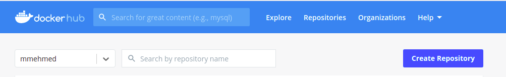
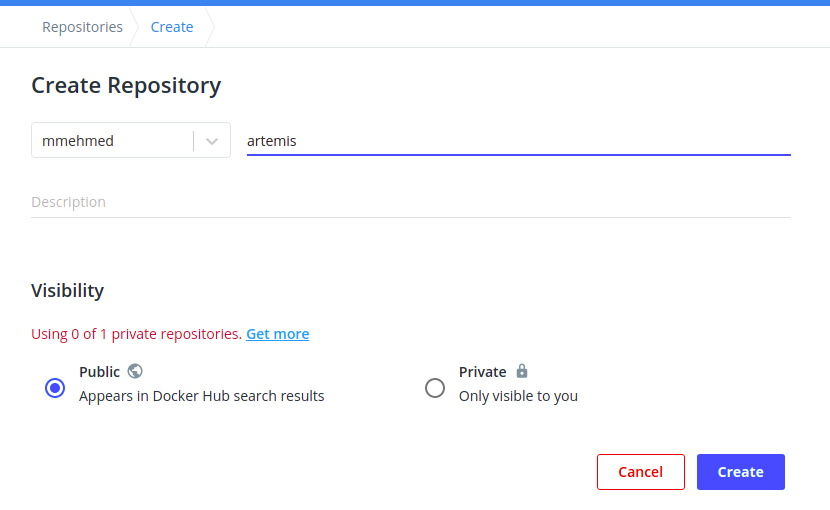
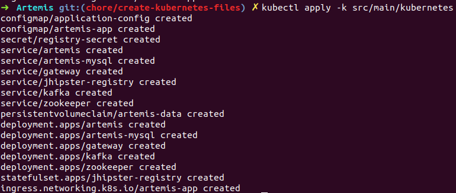
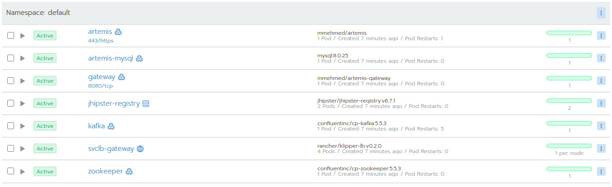

Setup Kubernetes and Kubernetes deployment
===============================================================

This page describes how to set up an environment deployed in Kubernetes.

**Prerequisites:**

* `Docker <https://docs.docker.com/install>`__
* `DockerHub Account <https://hub.docker.com/signup>`__
* `k3d <https://k3d.io/>`__
* `kubectl <https://kubernetes.io/docs/tasks/tools/#kubectl/>`__
* `helm <https://helm.sh/docs/intro/install/>`__

.. contents:: Content of this document
    :local:
    :depth: 1

Setup Kubernetes cluster
------------------------
1. Set environment variables

   ::

      $CLUSTER_NAME="k3d-rancher"
      $RANCHER_SERVER_HOSTNAME="rancher.localhost"
      $KUBECONFIG_FILE="$CLUSTER_NAME.yaml"

2. Create the cluster
   
   ::

      k3d cluster create $env:CLUSTER_NAME --api-port 6550 --servers 1 --agents 3 --port 443:443@loadbalancer --wait
      k3d cluster list
      k3d kubeconfig get $CLUSTER_NAME > $KUBECONFIG_FILE
      $KUBECONFIG=($KUBECONFIG_FILE)
      kubectl get nodes

3. Install cert-manager with helm
   
   ::

      helm repo add jetstack https://charts.jetstack.io
      helm repo update
      kubectl create namespace cert-manager
      helm install cert-manager jetstack/cert-manager --namespace cert-manager --version v1.0.4 --set
      installCRDs=true --wait
      kubectl -n cert-manager rollout status deploy/cert-manager

4. Install Rancher

   ::

      helm repo add rancher-latest https://releases.rancher.com/server-charts/latest
      helm repo update
      kubectl create namespace cattle-system
      helm install rancher rancher-latest/rancher --namespace cattle-system --set hostname=$RANCHER_SERVER_HOSTNAME --wait
      kubectl -n cattle-system rollout status deploy/rancher

Create DockerHub repository
---------------------------
Once you have logged in your DockerHub account you can create as many public repositories as you want.
In order to create a repository you need to select the ``Create repository`` button.

**DockerHub:**

Then fill in the repository name with ``artemis``. The use the ``Create`` button and you repository is created.

Configure Artemis resources
---------------------------
Make sure you have configured the ``src/main/resources/config/application-prod.yml`` or ``src/main/resources/config/application-artemis.yml`` file with the proper configuration. localhost connections to Jira, Bamboo, Bitbucket or Gitlab, Jenkins will not work. For this reason you should set the connection to existing servers or to local Kubernetes deployments.
Open the ``src/main/kubernetes/artemis-k8s/artemis-deployment.yml`` file and edit

    ::

      template:
         spec:
         containers:
            image: <DockerHubId>/artemis

and replace <DockerHubId> with your docker id in DockerHub

Build Artemis
-------------
Build the Artemis application for Docker using the following command:

::

   ./gradlew -Pprod -Pwar clean bootWar

Run Docker build
----------------
Run the Docker build using the following command:

::

   docker build  -t <DockerHubId>/artemis -f src/main/docker/Dockerfile .

This will create the Docker image by copying the war file which was generated by the previous command.

Push to Docker
--------------
Push the image to DockerHub:

::

   docker push <DockerHubId>/artemis

Deploy Kubernetes Resources
---------------------------
Once you have your Artemis image pushed to Docker you can use the ``kustomization.yml`` file in ``src/main/kubernetes`` to deploy all the Kubernetes resources.
You can do it by executing the following command: 

::

   kubectl apply -k src/main/kubernetes

In the console you will see that the resources are created.

Check the deployments in Rancher
--------------------------------
Open Rancher and navigate to your cluster.
It may take some time but at the end you should see that all the workloads have Active status. In case there is aa problem with some of the workloads you can check the logs to see what the issue is.

You can open the Artemis application using the link ``https://artemis-app.default.rancher.localhost/``
