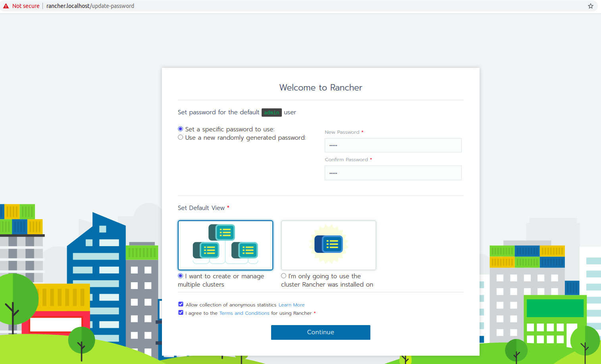
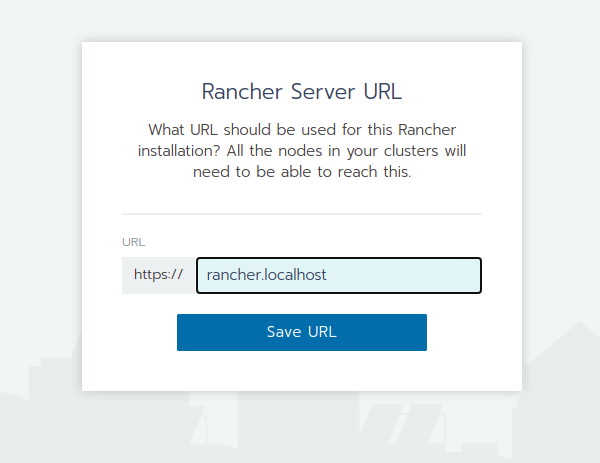
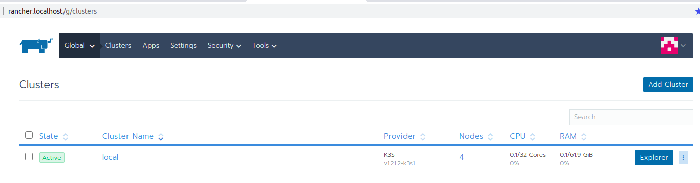
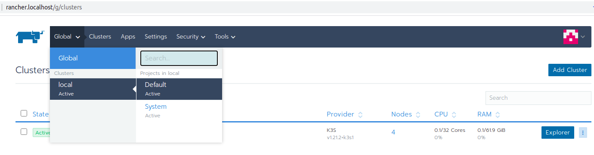
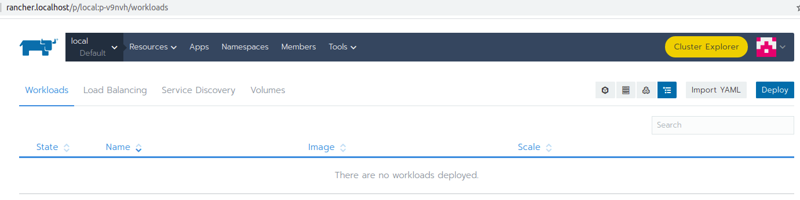
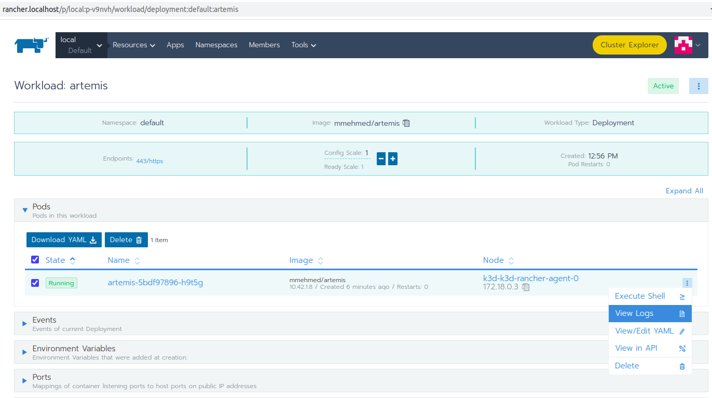

Setup Kubernetes and Kubernetes deployment
===============================================================

This page describes how to set up an environment deployed in Kubernetes.

**Prerequisites:**

* `Docker <https://docs.docker.com/install>`__ v20.10.7 - Docker is a platform for developing, shipping an running application. In our case we will use it to build the images which we will deploy
* `DockerHub Account <https://hub.docker.com/signup>`__ - DockerHub account is needed in order to push the Artemis image which will be used by Kubernetes
* `k3d <https://k3d.io/#installation>`__ v4.4.7 - Lightweght Kubernetes distribution, which will be used to create and manage clusters
* `kubectl <https://kubernetes.io/docs/tasks/tools/#kubectl/>`__ v1.21 - Kubernetes command-line tool, which will be used to create deployments
* `helm <https://helm.sh/docs/intro/install/>`__ v3.6.3 - Package manager for Kubernetes, which will be used to install cert-manager and Rancher

.. contents:: Content of this document
    :local:
    :depth: 1

Setup Kubernetes cluster
------------------------
In order to be able to deploy Artemis on Kubernetes, you need to setup a cluster.
With the following commands you will setup one cluster with 3 agents as well as Rancher which is a platform for cluster management with easy to use user interface.

**IMPORTANT: The following commands may differ for your OS, the examples are working for Linux machine.**

1. Set environment variables
   
   The CLUSTER_NAME, RANCHER_SERVER_HOSTNAME and KUBECONFIG_FILE environment variables need to be set so that they can be used in the following commands.
   If you don't want to set them you can replace their values in the commands. What you need to do is replace $CLUSTER_NAME with "k3d-rancher", $RANCHER_SERVER_HOSTNAME with "rancher.localhost" and $KUBECONFIG_FILE with "k3d-rancher.yml".
   
   ::

      export CLUSTER_NAME="k3d-rancher" 
      export RANCHER_SERVER_HOSTNAME="rancher.localhost"
      export KUBECONFIG_FILE="$CLUSTER_NAME.yaml"

2. Create the cluster

   With the help of the commands block below you can create a cluster with 1 server and 3 agents at total 4 nodes. Your deployments will be distributed almost equally among the 4 nodes.
   You will also write the cluster configuration into the KUBECONFIG_FILE. This configuration will be later needed when you are creating deployments. You can either set the path to the file as an environment variable or reaplce it with "<path-to-kubeconfig-file>" when needed.
   
   ::

      k3d cluster create $CLUSTER_NAME --api-port 6550 --servers 1 --agents 3 --port 443:443@loadbalancer --wait 
      k3d cluster list 
      kubectl get nodes 
      k3d kubeconfig get $CLUSTER_NAME > $KUBECONFIG_FILE 

3. Install cert-manager
   
   cert-manager is used to add certificates and certificate issuers as resource types in Kubernetes clusters.
   You can install it with one single command.

   ::

      helm repo add jetstack https://charts.jetstack.io 
      helm repo update
      kubectl create namespace cert-manager
      helm install cert-manager jetstack/cert-manager --namespace cert-manager --version v1.0.4 --set installCRDs=true --wait 
      kubectl -n cert-manager rollout status deploy/cert-manager

4. Install Rancher

   Rancher is a Kubernetes management tool which gives you the opportunity to create and manage Kubernetes deployments using in easier way than with the CLI tools.
   Using helm you can install it and then check it's status with the last command

   ::
      helm repo add rancher-latest https://releases.rancher.com/server-charts/latest
      helm repo update
      kubectl create namespace cattle-system
      helm install rancher rancher-latest/rancher --namespace cattle-system --set hostname=$RANCHER_SERVER_HOSTNAME --wait 
      kubectl -n cattle-system rollout status deploy/rancher

5. Open Rancher and update the password

Open Rancher on `<https://rancher.localhost/>`__.
You will be notified that the connection is not private. There is currently an issue with the certificate but it's not an problem if you are deploying on dev or test environment and you can just proceed to the website.
You will be prompted to set a password which later will be used to login to Rancher. The password will be used often, that's why you shouldn't forget it.

Then you should save the Rancher Server URL, please use the predefined name.  

After saving you be redirected to the main page of rancher, where you see your cluters. There will be one local cluster.

You can open the workloads using the menu, there will be no workloads deployed at the moment.

Create DockerHub repository
---------------------------
The Artemis image will be stored and managed in DockerHub. Kubernetes will pull it from there and deploy it afterwards.
After you log in to your `DockerHub <https://hub.docker.com/>`__ account you can create as many public repositories as you want.
In order to create a repository you need to select the ``Create repository`` button.

**DockerHub:**

.. figure:: kubernetes/dockerhub.png
   :align: center

Then fill in the repository name with ``artemis``. The use the ``Create`` button and you repository is created.

.. figure:: kubernetes/dockerhub_create_repository.png
   :align: center

Configure Docker ID (username)
------------------------------
The username in DockerHub is called Docker ID. You need to seet your Docker ID in the ``artemis-deployment.yml`` resource so that Kubernetes knows where to pull the image from.
Open the ``src/main/kubernetes/artemis-k8s/artemis-deployment.yml`` file and edit

    ::

      template:
         spec:
         containers:
            image: <DockerId>/artemis

and replace <DockerId> with your docker ID in DockerHub

Configure Artemis resources
---------------------------
Make sure you have configured the ``src/main/resources/config/application-prod.yml`` or ``src/main/resources/config/application-artemis.yml`` file with the proper configuration. localhost connections to Jira, Bamboo, Bitbucket or Gitlab, Jenkins will not work. For this reason you should set the connection to existing servers or to local Kubernetes deployments.

For more information check out the following documentations: 
`Bitbucket, Jira, Bamboo <https://docs.artemis.ase.in.tum.de/dev/setup/bamboo-bitbucket-jira/>`__ or
`Gitlab, Jenkins <https://docs.artemis.ase.in.tum.de/dev/setup/jenkins-gitlab/>`__

Build Artemis
-------------
Build the Artemis application for Docker using the following command:

::

   ./gradlew -Pprod -Pwar clean bootWar

Run Docker build
----------------
Run the Docker build using the following command:

::

   docker build  -t <DockerHubId>/artemis -f src/main/docker/Dockerfile .

This will create the Docker image by copying the war file which was generated by the previous command.

Push to Docker
--------------
Push the image to DockerHub:

::

   docker push <DockerHubId>/artemis

Configure Artemis profiles
--------------------------
You can configure the profiles for running Artemis in the ``src/main/kubernetes/artemis-k8s/artemis-configmap.yml`` file by changing ``SPRING_PROFILES_ACTIVE``.
The current ones are set to use Bitbucket, Jira and Bamboo. If you want to use Jenkins and Gitlab you should replace ``bamboo,bitbucket,jira`` with ``jenkins,gitlab``.
You can also change ``prod`` to ``dev`` if you want to run in development profile.

Deploy Kubernetes Resources
---------------------------
Once you have your Artemis image pushed to Docker you can use the ``kustomization.yml`` file in ``src/main/kubernetes`` to deploy all the Kubernetes resources.
You can do it by executing the following command: 

::

   kubectl apply -k src/main/kubernetes/artemis --kubeconfig "<path-to-kubeconfig-file>"

<path-to-kubeconfig-file> is the path where you created the KUBECONFIG_FILE.

In the console you will see that the resources are created. It will take a litte bit of time when you are doing this for the first time. Be patient!

.. figure:: kubernetes/kubectl_kustomization.png
   :align: center

Check the deployments in Rancher
--------------------------------
Open Rancher using `<https://rancher.localhost/>`__ and navigate to your cluster.
It may take some time but at the end you should see that all the workloads have Active status. In case there is aa problem with some of the workloads you can check the logs to see what the issue is.

.. figure:: kubernetes/rancher_workloads.png
   :align: center

You can open the Artemis application using the link `<https://artemis-app.default.rancher.localhost/>`__
In case that there is an error with the deployment you can check out the logs. 

Check out the logs
------------------
Open the workload which logs you need to check. There is a list of pods. Open the menu for one of the pods and select ``View Logs``. A popup with the logs will be opened.

