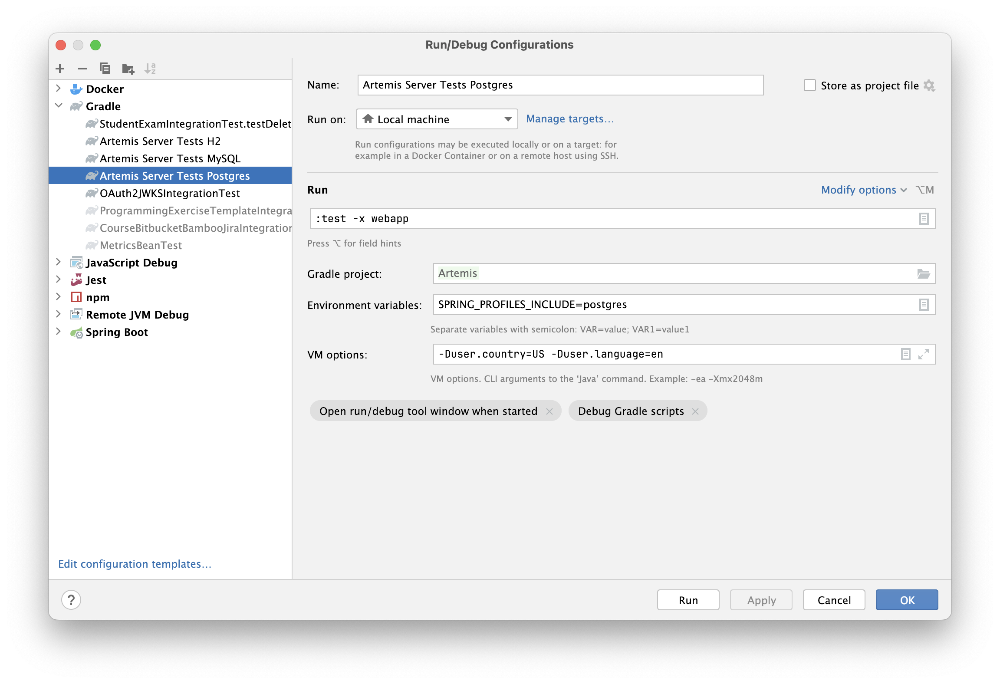

.. _local_database_tests:

Running database tests locally
---------------------------------

Prerequisites
^^^^^^^^^^^^^^^^^^^^^^^^^^^^^^^^^^^

Database tests are standard server integration tests executed against real database (MySQL or Postgres) started as Docker containers. Gradle test task will automatically pull necessary images and start Docker containers.

Before running those tests make sure that the following steps were executed:
1. Install `Docker Desktop <https://docs.docker.com/desktop/#docker-for-mac>`__ or
   `Docker Engine and Docker CLI with the Docker Compose Plugin <https://docs.docker.com/compose/install/>`__
   (``docker compose`` command).
2. Enable `remote access for Docker daemon <https://docs.docker.com/config/daemon/remote-access/>`__.

Executing tests from Intellij
^^^^^^^^^^^^^^^^^^^^^^^^^^^^^^^^^^^

Database tests can be executed by running of the run configurations provided in the repository:
- For MySQL tests: `Artemis Server Tests MySQL`.
- For Postgres tests: `Artemis Server Tests Postgres`.

Or by creating a custom configuration. Screenshot below presents an example of such run configuration:

Executing tests from console
^^^^^^^^^^^^^^^^^^^^^^^^^^^^^^^^^^^

Database tests can be executed by running the dedicated Gradle command:
- For MySQL tests: `SPRING_PROFILES_INCLUDE=mysql ./gradlew cleanTest test -x webapp`.
- For Postgres tests: `SPRING_PROFILES_INCLUDE=postgres ./gradlew cleanTest test -x webapp`.
