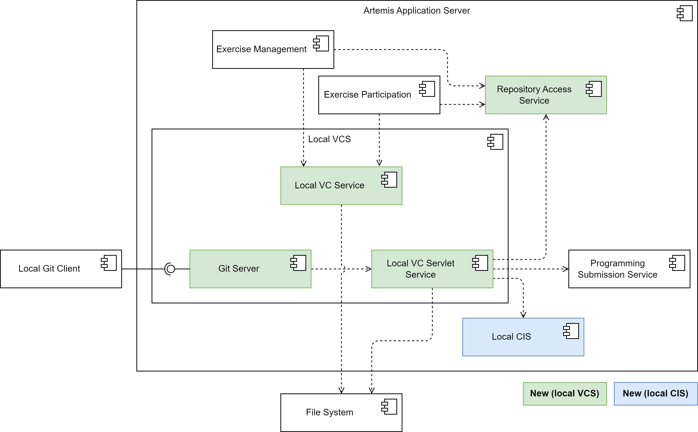

Artemis supports an integrated version control (VC) and continuous integration (CI) system.
If you use this local VC and local CI, the :ref:`top_level_design`, the :ref:`deployment`, and the :ref:`server_architecture` above do not hold.
Instead, the deployment (without using an external user management system) looks like this:

   Local VC and Local CI Deployment

See :ref:`Local CI and local VC Setup` on how to set the system up.

.. HINT::
   The system is still in an experimental state and not recommended for production. It currently only supports Java programming exercises built with Gradle and none of the advanced exercise configurations (like static code analysis).

The local VC subsystem
^^^^^^^^^^^^^^^^^^^^^^

The following diagram shows an overview of the components in the local VC subsystem:

   Local VC Subsystem

The ``Local VC Service`` implements the ``VersionControlService`` interface and thus contains methods that the exercise management subsystem and the exercise participation subsystem need to interact with the VC system. E.g. the ``createRepository()`` creates a repository on the file system.
For users to be able to access the repositories using their local Git client, the local VC subsystem contains a ``Git Server`` component.
It handles the implementation of the server-side Git HTTP protocol and delegates all logic connected to Artemis to the ``Local VC Servlet Service``.
This service resolves the repository from the file system depending on the repository URL. It also handles user authentication (only Basic Auth for now) and authorization.
For authorization (e.g. "is the requesting user the owner of the repository?", "has the due date already passed?"), it uses the logic outsourced to the ``RepositoryAccessService`` that the existing online editor also uses.
For push requests, the ``Local VC Servlet Service`` calls the ``processNewProgrammingSubmission()`` method of the ``Programming Submission Service`` to create a new submission and finally calls the local CI subsystem to trigger a new build.

The local CI subsystem
^^^^^^^^^^^^^^^^^^^^^^

The following diagram shows an overview of the components in the local CI subsystem:

..figure:: LocalCI_Subsystem.png
   :align: center
   :alt: Local CI Subsystem

   Local CI Subsystem

The ``Local CI Trigger Service`` contains the ``triggerBuild()`` method, that the exercise management subsystem, the exercise participation subsystem, and the local VC subsystem use to trigger builds in the CI system.
The local CI subsystem uses an ``Executor Service`` to manage a blocking queue for build tasks and a thread pool to execute the tasks.
The steps for running a build job are defined in the ``Local CI Build Job Execution Service`` and are as follows:

- Start Docker container.
- Run build script on the container.

  - Checkout assignment repository and solution repository.
  - Run tests.

- Retrieve build results from container.
- Stop container.
- Parse results.

The ``Local CI Container Service`` handles all interaction with the Docker containers like starting the container and retrieving the test results.
We use the ``docker-java`` library to interact with the Docker daemon.

