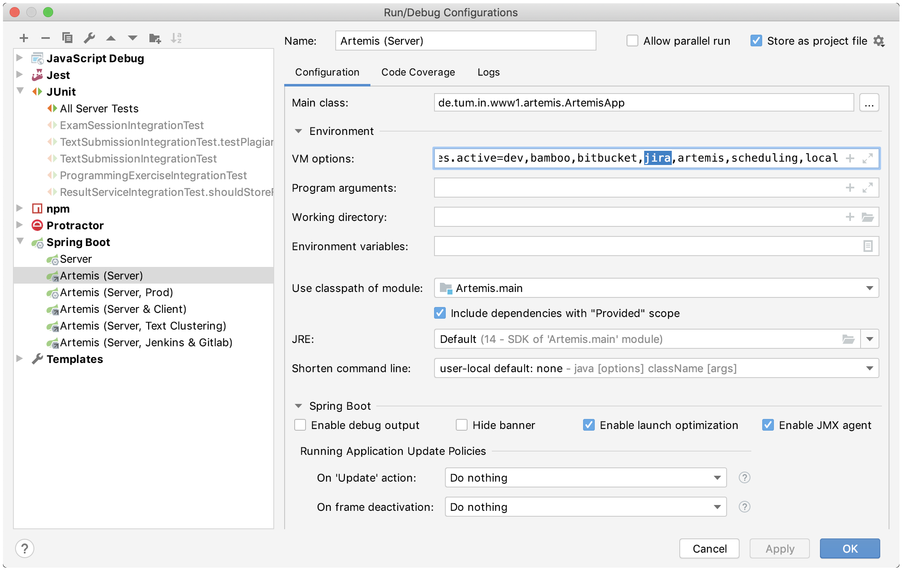

Using local user management
===========================

If you want to test in a local environment using different users, it makes sense to rely on local instead of
external user management.

1. Go to the ``application-artemis.yml`` file, and set ``use-external`` in the ``user-management`` section to ``false``.
2. Remove the ``jira`` profile from your local Run Configuration for the Server.

    Remove the ``jira`` profile from the list shown in IntelliJ
