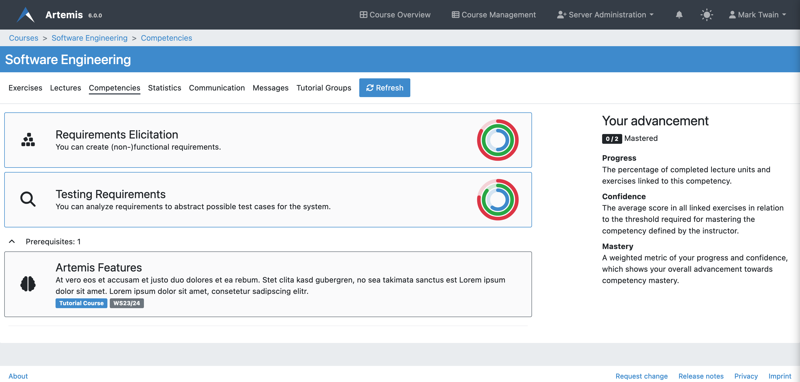
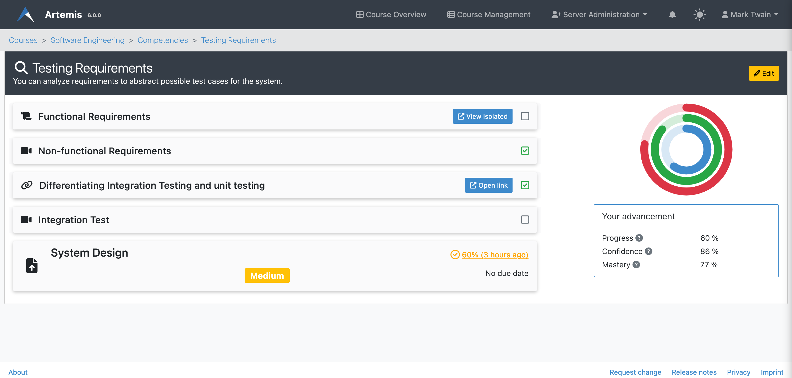

.. _adaptive-learning:

Adaptive Learning
=================

.. contents:: Content of this document
    :local:
    :depth: 2

Overview
--------
Artemis allows students and instructors to define and track competencies, which are overarching learning objectives that tie together various lectures and exercises. Adaptive Learning in Artemis is centered around these competencies, allowing users to customize their learning experience and objectives.

Competencies for Students
-------------------------
Competencies allow students to understand the learning goals of the course and measure their progress towards achieving them.

In Artemis, a competency is considered mastered by a student when they completed all linked learning objects (progress equals 100%) and have an adequate confidence level (average score greater or equal to mastery threshold set by the instructor).

In case competencies are defined, students can get an overview of their individual progress and confidence on the competencies tab.
The page lists all competencies with their title, description, and `taxonomy <https://en.wikipedia.org/wiki/Bloom%27s_taxonomy>`_.

Expanding the prerequisites section shows the student all competencies from previous courses the instructor has selected as a prerequisite for this course.

|students-learning-goals-statistics|

When clicking on a competency, a page opens and displays detailed statistics about the competency together with all linked lecture units and exercises.
The tripartite rings show the student's advancement:
The **blue ring describes the progress**, the percentage of completed lecture units and exercises.
The **green ring visualizes the confidence**, the average score in all linked exercises in relation to the threshold required for mastering the competency (set by the instructor).
The **red ring is a weighted metric of the student's progress and confidence**, which shows the overall advancement towards competency mastery.

|students-learning-goals-statistics-detail|

Competencies for Instructors
----------------------------
Instructors have the ability to define competencies for a course, linking various lectures and exercises together under overarching learning objectives. They also have the ability to set the mastery threshold for these competencies.

Competencies are overarching learning objectives that link together different course materials.

.. raw:: html

    <iframe src="https://live.rbg.tum.de/w/artemisintro/26313?video_only=1&t=0" allowfullscreen="1" frameborder="0" width="600" height="350">
        Watch this video on TUM-Live.
    </iframe>

An instructor can view and edit all competencies of a course on the competency management page.
The table shows the title, description, and percentage of students that mastered the respective competency.

On a side note, instructors can also select competencies from previous courses they taught as a prerequisite for this course.
Students can see these on the competencies page and during the course self-registration.

|instructors-learning-goals-manage|

An instructor can create or edit competencies using the following form.
Besides a title and description, they can optionally set a `taxonomy <https://en.wikipedia.org/wiki/Bloom%27s_taxonomy>`_.
The mastery threshold describes the minimum average score required for a student to reach 100% confidence in this competency.
The current average score of all linked exercises shown on this page can be used as a basis for defining a reasonable threshold value.
Instructors can link competencies to lecture units on this page by first choosing a lecture and then selecting desired lecture units.

|instructors-learning-goal-edit|

Alternatively, instructors can also link competencies to an exercise or lecture unit on the respective management page using the selection box shown below.

|instructors-learning-goals-link|

.. |instructors-learning-goals-manage| image:: adaptive-learning/instructors-learning-goals-manage.png
    :width: 1000
.. |instructors-learning-goal-edit| image:: adaptive-learning/instructors-learning-goal-edit.png
    :width: 1000
.. |instructors-learning-goals-link| image:: adaptive-learning/instructors-learning-goals-link.png
    :width: 600