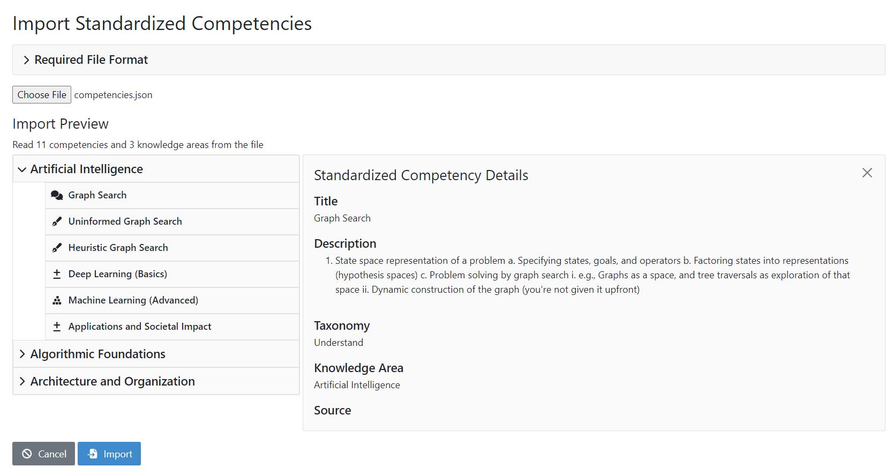
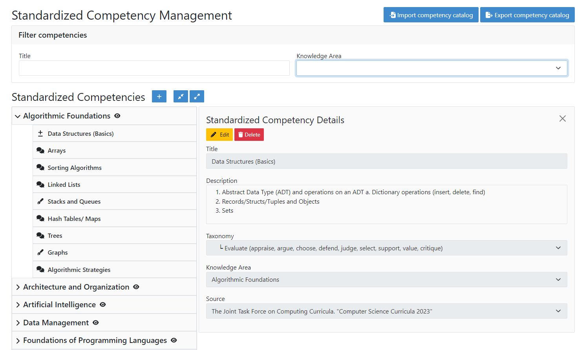

Manage Standardized Competencies (Administrator)
==================================================

.. contents:: Content of this document
    :local:
    :depth: 2

.. _standardized_competency_catalog:

Standardized Competencies
-------------------------

| The **Standardized Competency Catalog** is a catalog of competencies that is accessible to all instructors in an Artemis instance.
  Instructors may view this catalog and import competencies from it into their course.
| The competencies consist of a title, description and taxonomy. Instead of being part of courses, they are sorted under knowledge areas.
| Knowledge areas may also contain other knowledge areas, enabling a hierarchical structure (e.g., Artificial Intelligence -> Machine Learning).

Manage Standardized Competencies
--------------------------------

.. raw:: html

    <iframe src="https://live.rbg.tum.de/w/artemisintro/46942?video_only=1&t=0" allowfullscreen="1" frameborder="0" width="600" height="350">
        Watch this video on TUM-Live.
    </iframe>

| Administrators can manage the standardized competency catalog of their Artemis instance
  in the *Standardized Competency Management* view.

| They can filter the displayed content by by competency title and knowledge area.
  Clicking on a knowledge area expands it and clicking on the eye icon shows the knowledge area details on the right.
| From this detail view they can edit or delete the knowledge area, or create new knowledge areas and competencies under it.
  Likewise, clicking on a standardized competency opens its details, allowing administrators to edit or delete it.
| Finally, administrators can also import a standardized competency catalog from a JSON file,
  or export the standardized competency catalog of their Artemis instance into a JSON file.

|admin-manage-standardized-competencies|

Import a Standardized Competency Catalog
----------------------------------------

.. note::

    To obtain a file containing a standardized competency catalog, you can contact the Artemis developer team.

| When importing, administrators first view a collapsible example of the expected file structure.
  They can then select a file containing standardized competencies from their local system.
| Artemis displays a preview of the knowledge areas and competencies that will be imported
  and administrators can view the details for each competency by clicking on it.
| After clicking on import, the complete catalog will be imported into the Artemis instance.

|admin-import-standardized-competencies|

