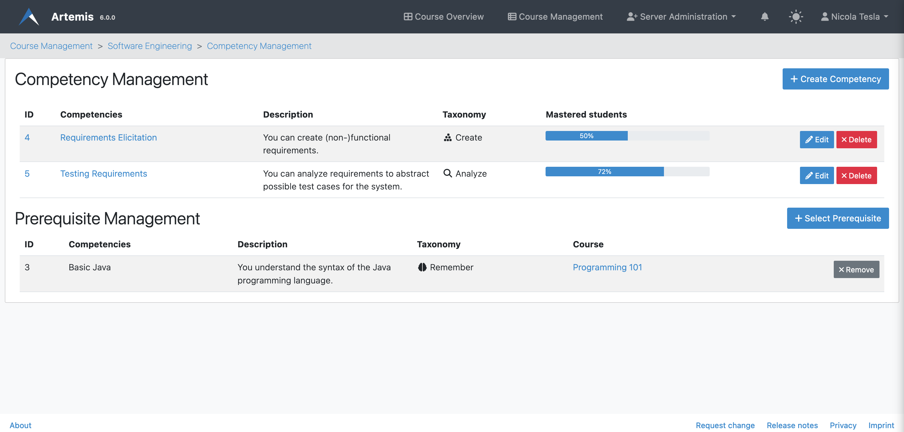
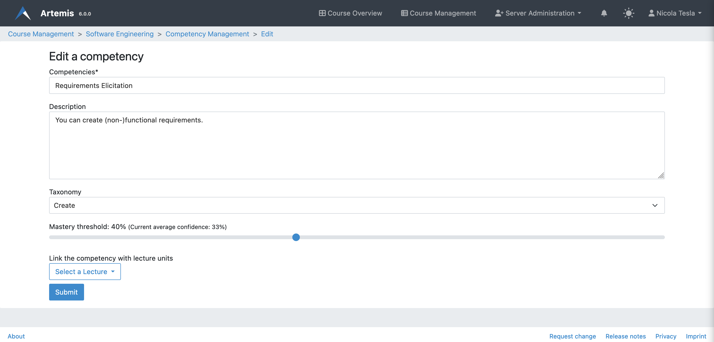
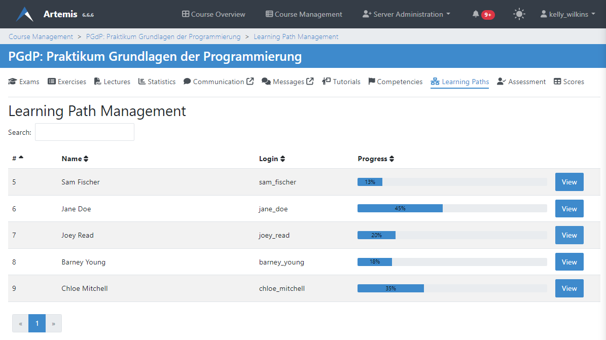

Manage Adaptive Learning (Instructor)
=======================================

.. contents:: Content of this document
    :local:
    :depth: 2

Competencies
------------
Instructors have the ability to define competencies for a course, linking various lectures and exercises together under overarching learning objectives.

An instructor can view and edit all competencies of a course on the competency management page.
The table shows the title, description, and percentage of students that mastered the respective competency.

On a side note, instructors can also select competencies from previous courses they taught as a prerequisite for this course.
Students can see these on the competencies page and during the course self-registration.

|instructors-learning-goals-manage|

An instructor can create or edit competencies using the following form.
Besides a title and description, they can optionally set a `taxonomy <https://en.wikipedia.org/wiki/Bloom%27s_taxonomy>`_.
The mastery threshold describes the minimum average score required for a student to reach 100% confidence in this competency.
The current average score of all linked exercises shown on this page can be used as a basis for defining a reasonable threshold value.
Instructors can link competencies to lecture units on this page by first choosing a lecture and then selecting desired lecture units.

|instructors-learning-goal-edit|

Alternatively, instructors can also link competencies to an exercise or lecture unit on the respective management page using the selection box shown below.

|instructors-learning-goals-link|

.. _generate_competencies:

Generate Competencies
^^^^^^^^^^^^^^^^^^^^^

.. raw:: html

    <iframe src="https://live.rbg.tum.de/w/artemisintro/46941?video_only=1&t=0" allowfullscreen="1" frameborder="0" width="600" height="350">
        Watch this video on TUM-Live.
    </iframe>

TODO

.. _import_competencies:

Import Competencies
^^^^^^^^^^^^^^^^^^^

TODO
three ways to import -> show button
- import all
- import from other courses
- import from srandardized -> link to admin guide

Learning Paths
--------------

Instructors can enable learning paths for their courses either by editing the course or on the dedicated learning path management page. This will generate individualized learning paths for all course participants.

Once the feature is enabled, instructors get access to each student's learning path. Instructors can search for students by login or name and view their respective learning path graph.

|instructors-learning-path-management|

.. |instructors-learning-goals-link| image:: instructors-learning-goals-link.png
    :width: 600

