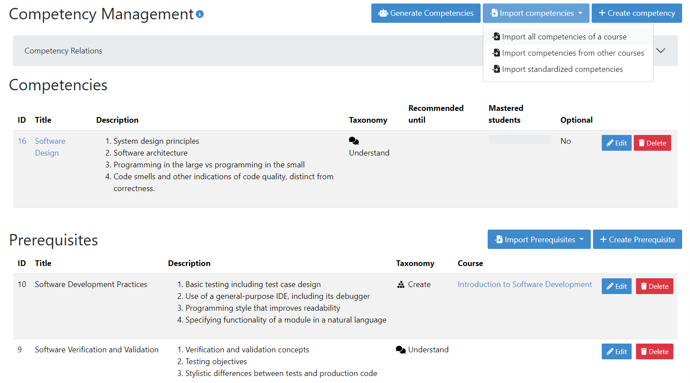
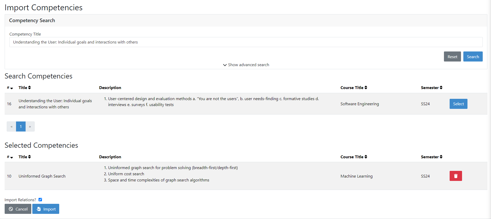
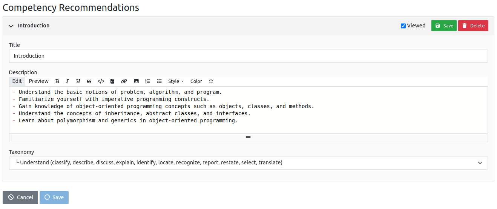
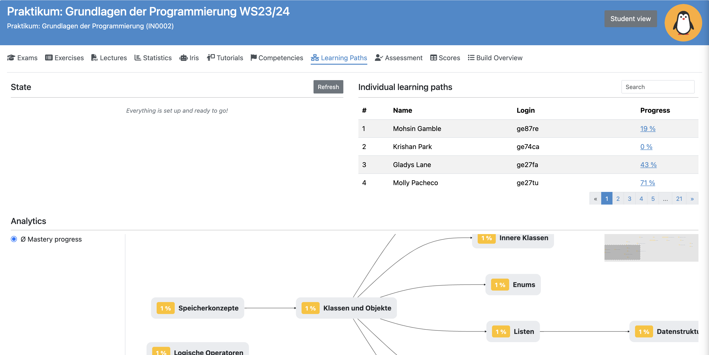

Manage Adaptive Learning (Instructor)
=======================================

.. contents:: Content of this document
    :local:
    :depth: 2

.. note::

    When introducing adaptive learning into a course for the first time, you can quickly create a competency model by:

    - :ref:`Generating competencies using an integrated LLM<generate_competencies>`
    - :ref:`Importing standardized competencies into your course<instructor_import_standardized_competencies>`

    (Given that these features are enabled on your Artemis instance)

Competencies
------------
A competency is an overarching learning objective that ties together various lectures and exercises. It has a title, description and a `taxonomy <https://en.wikipedia.org/wiki/Bloom%27s_taxonomy>`_.
By completing lectures and exercises, students gain mastery of a competency (see also :ref:`Competencies for Students<competencies_student>`).

A prerequisite is a competency that students are expected to have already mastered before the course. Instructors select competencies from previous courses they taught as a prerequisite, or create new ones.

Competencies measure two metrics for each student:
The progress starts at 0% and increases with every completed lecture unit and with the achieved score in exercises linked to the competency. The growth is linear, e.g. completing half of the lecture units and scoring 50% in all linked exercises results in 50% progress.
The mastery is a weighted metric and is influenced by the following heuristics:

* The mastery increases when the latest scores of the student are higher than the average score of all linked exercises and vice versa.
* The mastery increases when the student proportionally achieved more points in exercises marked as hard compared to the distribution of points in the competency and vice versa.
* A similar measurement applies to easy exercises, where the mastery is decreased for achieving proportionally more points in easy exercises.
* If the student quickly solves programming exercises with a score of at least 80% based on the amount of pushes, the mastery increases. There is no decrease in mastery for slower students!

Manage Competencies
^^^^^^^^^^^^^^^^^^^^
Instructors can manage competencies and prerequisites of a course in the *Competency Management* view. Here they can:

* View all competencies and prerequisites of their course
* Create, edit or delete competencies and prerequisites
* :ref:`manage_relations` between competencies
* :ref:`import_competencies` from other courses or the :ref:`standardized competency catalog<standardized_competency_catalog>`
* :ref:`generate_competencies` using LLMs

|instructor-competency-management|

.. _create_competencies:

Create/Edit Competencies
^^^^^^^^^^^^^^^^^^^^^^^^

| An instructor can create or edit competencies using the following form.
  Besides a title and description, they can set a `taxonomy <https://en.wikipedia.org/wiki/Bloom%27s_taxonomy>`_.
| The mastery threshold describes the minimum mastery required for a student to consider the competency as mastered.
  The current average mastery shown on this page can be used as a basis for defining a reasonable threshold value.
| Instructors can link competencies to lecture units on this page by first choosing a lecture and then selecting desired lecture units.

|instructor-competency-edit|

Alternatively, instructors can also link competencies to an exercise or lecture unit on the respective management page using the selection box shown below.

|instructor-competency-link|

.. _manage_relations:

Manage Relations
^^^^^^^^^^^^^^^^

| An Instructor can create relations between competencies by selecting a source and target competency from the dropdown menus.
  They can also set a relation type, which can be one of the following:

* *Assumes*: The head competency assumes the knowledge of the tail competency but does not deepen it. E.g. Class diagrams assume knowledge about object-oriented programming.
* *Extends*: The head competency builds upon the knowledge of the tail competency and deepens it. E.g. Inheritance deepens the knowledge about object-oriented programming.
* *Matches*: The knowledge of the head and tail competency match each other.

| The relations are displayed in a diagram below the form and can be deleted by clicking on them.

.. note::

    Relations are necessary for the learning path generation. Without them, Artemis cannot suggest a reasonable order of competencies for students.

|instructor-competency-relations|

.. _import_competencies:

Import Competencies
^^^^^^^^^^^^^^^^^^^

Instructors have three ways to import competencies: Import all competencies of another course, import from other courses or import standardized competencies.

**1. Import all Competencies of another Course**

| This option opens a modal in which instructors can select one of their previous courses, importing all competencies (and relations) into the current course.
| The purpose of this feature is to directly import the complete competency model of another course, e.g. when holding courses repeatedly.

|instructor-import-all-competencies|

**2. Import from other Courses**

| When importing from other courses, instructors can view a list of competencies from all courses they have access to.
  They can sort the list based on all fields except for competency description.
  They can also filter the list through the *Competency Search* at the top of the page, which can be expanded for advanced search options.
| All selected competencies are displayed in the *Selected Competencies* table and can be de-selected again by clicking on the trash bin icon.
  Finally, instructors can select if they also want to import the relations between the imported competencies.

|instructor-import-competencies|

.. _instructor_import_standardized_competencies:

**3. Import Standardized Competencies**

.. note::

    To use this feature, the *standardized competency feature toggle* needs to be enabled.
    If you have no access to the feature, contact your instance administrators.

| When importing standardized competencies, instructors can view the complete :ref:`standardized competency catalog<standardized_competency_catalog>` of their Artemis instance.
  They can filter the displayed competencies by title and knowledge area.
| Clicking on the name of a competency opens its details on the right side and clicking on the checkbox next to the name selects it for import.
  Again, selected competencies are displayed in a table and can be de-selected again by clicking on the trash bin icon.

|instructor-import-standardized-competencies|

.. _generate_competencies:

Generate Competencies
^^^^^^^^^^^^^^^^^^^^^

.. note::

    To use this feature, Iris needs to be enabled for your Artemis instance and *Competency Generation* needs to be enabled in the Iris global settings **as well as the Iris settings of your course** (see image below).
    If you cannot enable *Competency Generation* in your Iris course settings, contact your instance administrators.

|competency-generation-settings|

.. raw:: html

    <iframe src="https://live.rbg.tum.de/w/artemisintro/46941?video_only=1&t=0" allowfullscreen="1" frameborder="0" width="600" height="350">
        Watch this video on TUM-Live.
    </iframe>

| Instructors can use the integrated LLM subsystem of Artemis, to generate competencies for their course.
| Based on a course description, the LLM generates around 10 recommendations for possible competencies (the amount may vary depending on the description provided).

|instructor-generate-competencies|

| Instructors can view the details (title, description and taxonomy) of each recommendation by expanding it.
  They can then edit these details or delete the recommendation if it is unfit.
| After saving, the recommendations are saved as actual competencies into the course of the instructor.

|instructor-competency-recommendation|

Learning Paths
--------------

Instructors can enable learning paths for their courses either by editing the course or on the dedicated learning path management page. This will generate individualized learning paths for all course participants.

Once the feature is enabled, instructors get access to each student's learning path. Instructors can search for students by login or name and view their respective learning path graph.

|instructors-learning-path-management|

.. |instructor-import-all-competencies| image:: instructor/import-all-competencies.png
    :width: 600

.. |instructor-import-standardized-competencies| image:: instructor/import-standardized-competencies.png
    :width: 1000
.. |instructor-competency-edit| image:: instructor/competency-edit.png
    :width: 1000
.. |instructor-competency-link| image:: instructor/competency-link.png
    :width: 600

