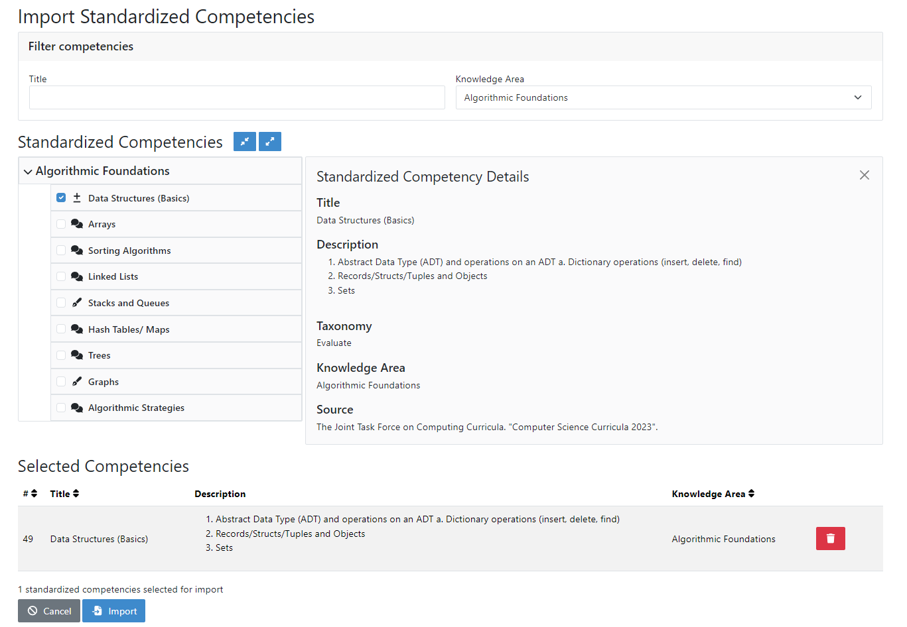
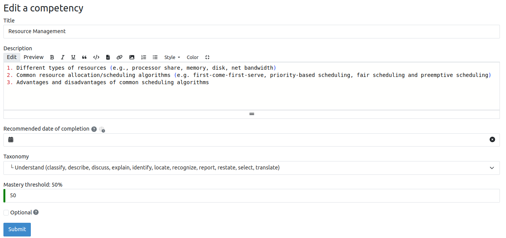
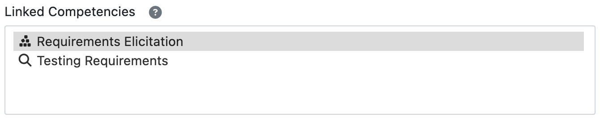

Manage Adaptive Learning (Instructor)
=======================================

.. contents:: Content of this document
    :local:
    :depth: 2

Competencies
------------
A competency is a overarching learning objective that ties together various lectures and exercises. It has a title, description and a `taxonomy <https://en.wikipedia.org/wiki/Bloom%27s_taxonomy>`_.
By completing lectures and exercises, students gain mastery of a competency (see also :ref:`Competencies for Students<competencies_student>`).

A prerequisite is a competency that students are expected to have already mastered before the course. Instructors select competencies from previous courses they taught as a prerequisite, or create new ones.

Manage Competencies
^^^^^^^^^^^^^^^^^^^^
Instructors can manage competencies and prerequisites of a course in the *Competency Management* view. Here they can:

* View all competencies and prerequisites of their course
* Create, edit or delete competencies and prerequisites
* Manage relations between competencies (which are necessary to build learning paths)
* :ref:`import_competencies` from other courses or the :ref:`standardized competency catalog<competencies_admin>`
* :ref:`generate_competencies` using Iris

|instructor-competency-management|

Create/Edit Competencies
^^^^^^^^^^^^^^^^^^^^^^^^

| An instructor can create or edit competencies using the following form.
  Besides a title and description, they can set a `taxonomy <https://en.wikipedia.org/wiki/Bloom%27s_taxonomy>`_.
| The mastery threshold describes the minimum average score required for a student to reach 100% confidence in this competency.
  The current average score of all linked exercises shown on this page can be used as a basis for defining a reasonable threshold value.
| Instructors can link competencies to lecture units on this page by first choosing a lecture and then selecting desired lecture units.

|instructor-competency-edit|

Alternatively, instructors can also link competencies to an exercise or lecture unit on the respective management page using the selection box shown below.

|instructor-competency-link|

.. _import_competencies:

Import Competencies
^^^^^^^^^^^^^^^^^^^

Instructors have three ways to import competencies: Import all competencies of another course, import from other courses or import standardized competencies.

**1. Import all Competencies of another Course**

| This option opens a modal in which instructors can select one of their previous courses, importing all competencies (and relations) into the current course.
| The purpose of this feature is to directly import the complete competency model of another course, e.g. when holding courses repeatedly.

|instructor-import-all-competencies|

**2. Import from other Courses**

| When importing from other courses, instructors can view a list of competencies from all courses they have access to.
  They can sort the list based on all fields except for competency description.
  They can also filter the list through the *Competency Search* at the top of the page, which can be expanded for advanced search options.
| All selected competencies are displayed in the *Selected Competencies* table and can be de-selected again by clicking on the trash icon.
  Finally, they can select if they also want to import the relations between the imported competencies.

|instructor-import-competencies|

**3. Import Standardized Competencies**

| When importing standardized competencies, instructors can view the complete standardized competency catalog (TODO: link! also fix other link) of their instance.
  They can filter the displayed competencies by title and knowledge area.

| Clicking on the name of a competency opens its details on the right side and clicking on the checkbox next to the name selects it for import.
  Again, selected competencies are displayed in a table and can be de-selected again by clicking on the trash icon.

|instructor-import-standardized-competencies|

.. _generate_competencies:

Generate Competencies
^^^^^^^^^^^^^^^^^^^^^

.. raw:: html

    <iframe src="https://live.rbg.tum.de/w/artemisintro/46941?video_only=1&t=0" allowfullscreen="1" frameborder="0" width="600" height="350">
        Watch this video on TUM-Live.
    </iframe>

TODO
* description
* screenshot

Learning Paths
--------------

Instructors can enable learning paths for their courses either by editing the course or on the dedicated learning path management page. This will generate individualized learning paths for all course participants.

Once the feature is enabled, instructors get access to each student's learning path. Instructors can search for students by login or name and view their respective learning path graph.

|instructors-learning-path-management|

.. |instructor-competency-management| image:: instructor/manage-competencies.png
    :width: 1000
.. |instructor-import-all-competencies|-all| image:: instructor/import-all-competencies.png
    :width: 600
.. |instructor-import-competencies| image:: instructor/import-course-competencies.png
    :width: 1000

.. |instructors-learning-path-management| image:: instructor/learning-path-management.png
    :width: 1000
