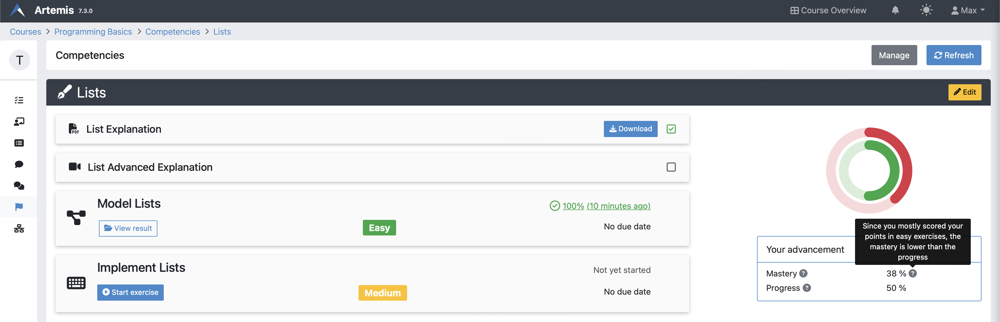
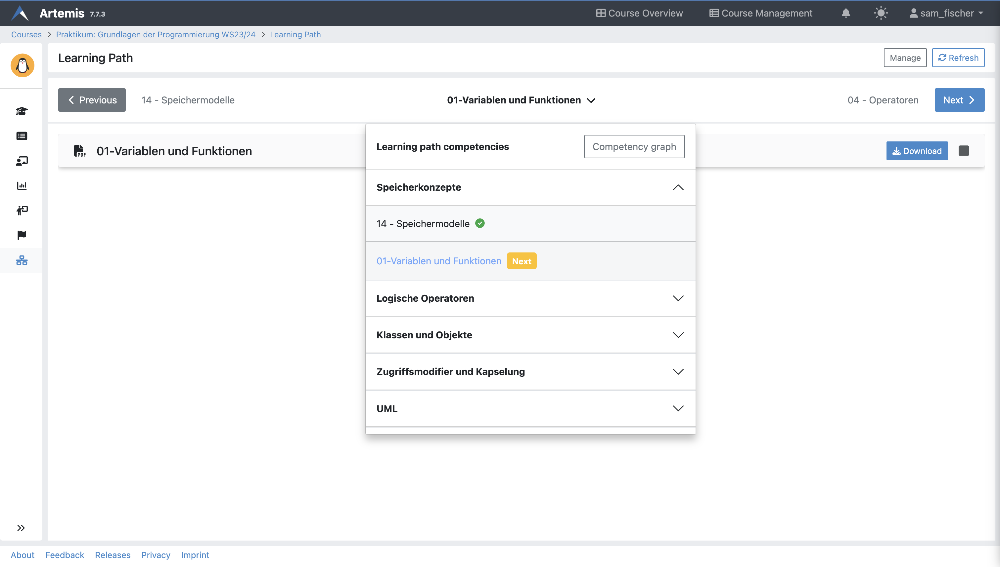
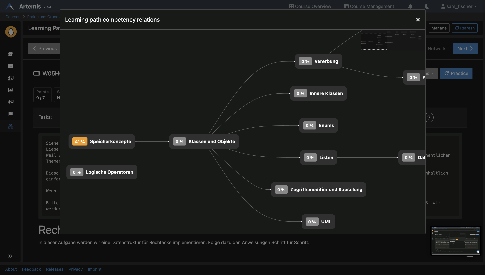
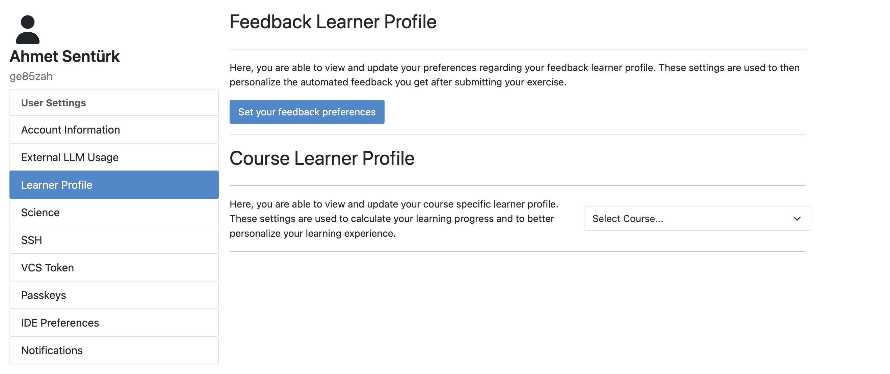
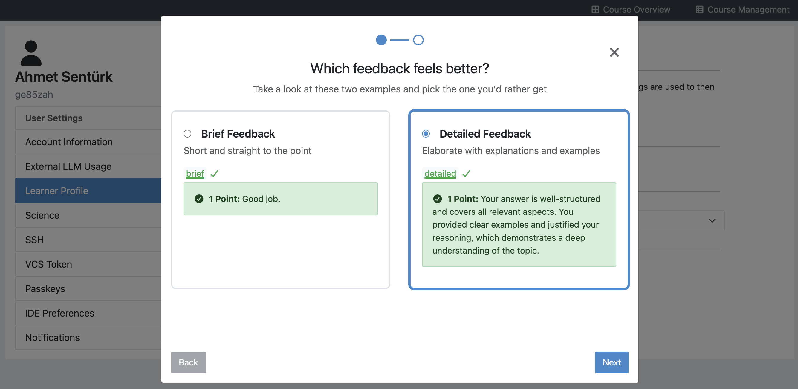
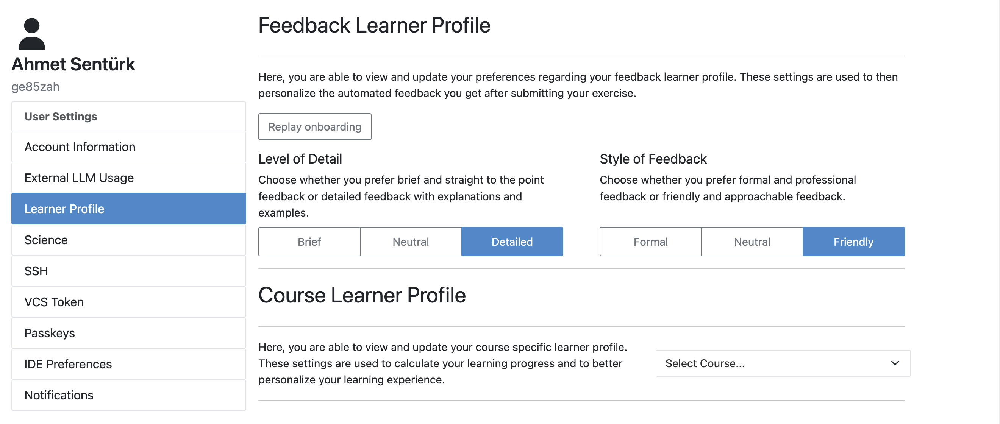
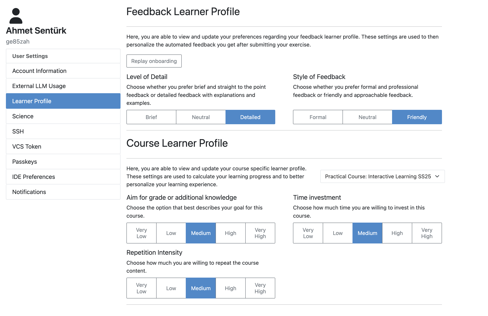

Adaptive Learning (Student)
===========================

.. contents:: Content of this document
    :local:
    :depth: 2

.. _competencies_student:

Competencies
------------
Competencies allow students to understand the learning goals of the course and measure their progress toward achieving them.

Artemis measures two metrics for each competency: **progress** and **mastery**.
The progress starts at 0% and increases with every completed lecture unit and score achieved in exercises linked to the competency.
The mastery is a weighted metric of the student's progress. It can be influenced by different factors, e.g., if the latest exercise scores are higher or lower than the student's average score in the competency.
In Artemis, a competency is considered mastered by a student when the mastery is greater than or equal to the threshold the instructor sets.

In case competencies are defined, students can get an overview of their individual progress and confidence on the competencies tab.
The page lists all competencies with their title, description, and `taxonomy <https://en.wikipedia.org/wiki/Bloom%27s_taxonomy>`_.

Expanding the prerequisites section shows the student all competencies the instructor has selected as a prerequisite for this course.

|students-learning-goals-statistics|

When clicking on a competency, a page displays detailed statistics about the competency and all linked lecture units and exercises.
The two rings show the student's advancement:
The **green ring describes the progress**, the percentage of completed lecture units, and the achieved exercise scores.
The **red ring indicates the mastery**, which shows the overall advancement toward competency completion.

If the mastery diverges from the progress, the student can see the main reason for this divergence as a tooltip next to the mastery value.

|students-learning-goals-statistics-detail|

.. _learning_paths_student:

Learning Paths
--------------

Students can access their learning path in the learning path tab. Here, they can access recommended lecture units and participate in exercises.
Recommendations are generated via an intelligent agent that accounts for multiple metrics, e.g., prior performance, confidence, relations, and due dates, to support students in selecting learning resources.
Students can use the "Previous" and "Next" buttons to navigate to the previous or next recommendation, respectively.

|students-learning-path-participation|

Students can access all scheduled competencies and prerequisites by clicking on the title of the learning object they are currently viewing. Expanding a competency or prerequisite in the list reveals its associated learning objects, each indicating whether it has been completed.
To navigate to a specific learning object, students can click on its title.
Students can open the course competency graph for a broader view of how competencies and prerequisites are interconnected. This graph starts with competencies that have no prerequisites and progresses to those that build upon earlier knowledge. To aid navigation, a mini-map is available in the top-right corner.

|students-learning-path-graph|

.. _learner_profile_student:

Learner Profile
---------------
**Learner Profiles** allow students to configure their personal learning preferences and motivations, making their experience in Artemis more tailored to their individual needs. 
Currently, there are two types of learner profiles available: **Feedback Learner Profile** and **Course Learner Profile**.

Feedback Learner Profile
^^^^^^^^^^^^^^^^^^^^^^^^
The Feedback Learner Profile contains the student's feedback preferences. Students can adjust how they would like to receive feedback along predetermined dimensions. The automatically generated feedback from Athena will respect these preferences whenever a student selects "request AI feedback" after submitting a solution to an exercise.
Currently, the available dimensions are:
* Detail of the feedback
* Formality of the feedback
Students can choose between binary options for each dimension or leave the setting as neutral.
When setting up the feedback preferences for the first time, students are guided by an onboarding wizard. This wizard presents examples from both ends of the spectrum for each dimension, helping students understand the impact of their choices.

The setup screen welcomes students with a button that directs them to an onboarding wizard.

|students-feedback-learner-profile-initial-screen|

The onboarding wizard displays example feedback for each dimension and aligns students' expectations with what the system actually generates.

|students-feedback-learner-profile-onboarding-modal|

Once students have completed the onboarding wizard, they can see their feedback preferences in the setup screen and change them anytime. Students can redo the onboarding at any time as well.

|students-feedback-learner-profile-setup|

Course Learner Profile
^^^^^^^^^^^^^^^^^^^^^^
The Course Learner Profile captures the student's explicit motivation for the course. These settings are used to calculate learning progress meaningfully and personalize the course experience further.
By indicating their goals and motivations, students enable Artemis to provide a more individualized learning journey that aligns with their personal expectations and the course's learning objectives.

Students can modify their course learner profile at the bottom of the Learner Profile settings page.

|students-course-learner-profile|

.. |students-learning-goals-statistics| image:: student/students-learning-goals-statistics.png
    :width: 1000

