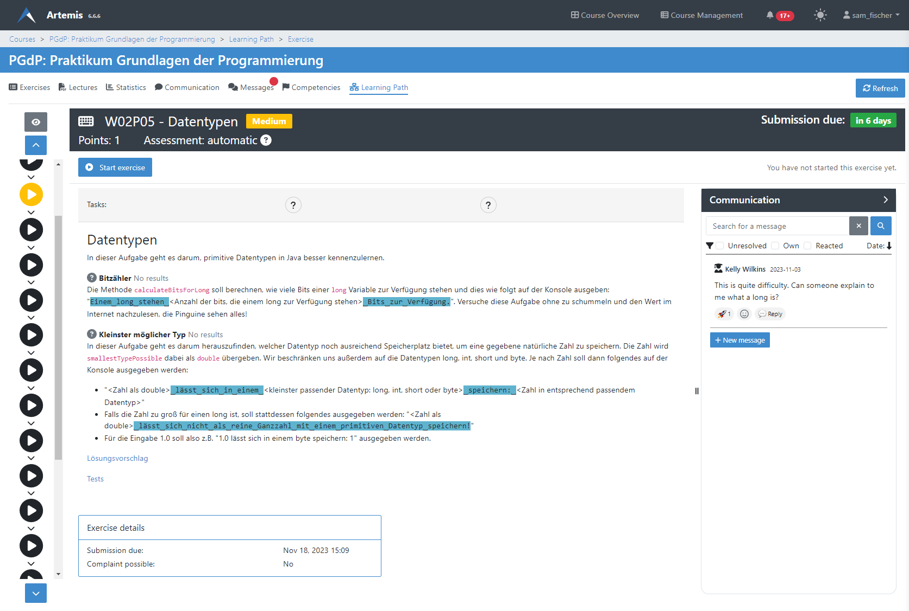
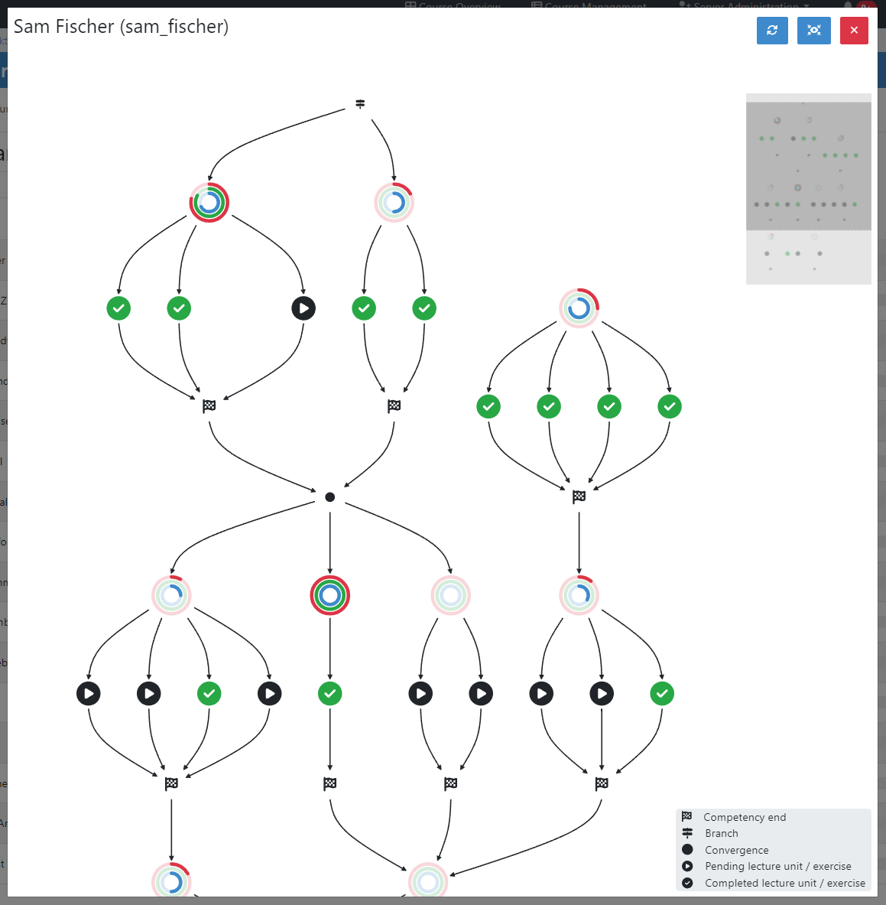

Adaptive Learning (Student)
===========================

.. contents:: Content of this document
    :local:
    :depth: 2

.. _competencies_student:

Competencies
------------
Competencies allow students to understand the learning goals of the course and measure their progress toward achieving them.

In Artemis, a competency is considered mastered by a student when they complete all linked learning objects (progress equals 100%) and have an adequate confidence level (average score greater or equal to the mastery threshold set by the instructor).

In case competencies are defined, students can get an overview of their individual progress and confidence on the competencies tab.
The page lists all competencies with their title, description, and `taxonomy <https://en.wikipedia.org/wiki/Bloom%27s_taxonomy>`_.

Expanding the prerequisites section shows the student all competencies the instructor has selected as a prerequisite for this course.

|students-learning-goals-statistics|

When clicking on a competency, a page opens and displays detailed statistics about the competency together with all linked lecture units and exercises.
The tripartite rings show the student's advancement:
The **blue ring describes the progress**, the percentage of completed lecture units and exercises.
The **green ring visualizes the confidence**, the average score in all linked exercises in relation to the threshold required for mastering the competency (set by the instructor).
The **red ring is a weighted metric of the student's progress and confidence**, which shows the overall advancement toward competency mastery.

|students-learning-goals-statistics-detail|

.. _learning_paths_student:

Learning Paths
--------------

Students can access their learning path in the learning path tab. Here, they can access recommended lecture units and participate in exercises.
Recommendations (visualized on the left) are generated via an intelligent agent that accounts for multiple metrics, e.g. prior performance, confidence, relations, and due dates, to support students in their selection of learning resources.
Students can use the up and down buttons to navigate to the previous or next recommendation respectively. Hovering over a node in the list will display more information about the learning resource.

|students-learning-path-participation|

Students can access their learning path graph via the eye icon on the top left. The graph displays all competencies, lecture units, exercises, and their relations. Each competency consists of a start node, visualized by the competency rings displaying progress, confidence, and overall mastery, and an end node represented by a checkered flag. Edges link learning resources to a competency via the respective start and end nodes. If the resource is still pending, it displays as a play symbol. Upon completion of the task, it appears as a checkmark.
Users can read the graph from top to bottom, starting with the competencies that have no prerequisites, continuing downwards toward competencies that build upon prior knowledge. Students can zoom, pan, and drag the graph to navigate. For better orientation, the top right corner contains a mini-map.
On the bottom right of the graph, users can view a legend describing the different types of nodes.
Hovering over any node, e.g. exercise or competency, opens a popover containing essential information about the item, e.g. the type of exercise and title, or for competencies, the details, including the description.

|students-learning-path-graph|

.. |students-learning-goals-statistics| image:: students-learning-goals-statistics.png
    :width: 1000
.. |students-learning-goals-statistics-detail| image:: students-learning-goals-statistics-detail.png
    :width: 1000

