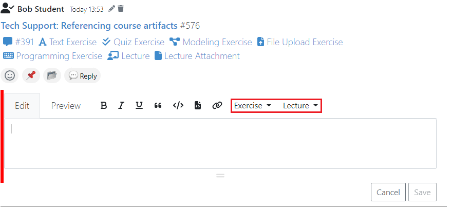

.. _communication:

Communication
=============

.. contents:: Content of this document
    :local:
    :depth: 3

Artemis enables students, tutors, and instructors to actively participate with its communication capabilities.
Various communication features allow students to engage with peers and ask all kinds of questions whereas moderators
(e.g., instructors and tutors) can provide general course information and answer content-related questions.
Communication can be made in different contexts, namely for lectures, exercises, or courses. Course participants can also
message each other to communicate in private. Below, you can find more information on specific features and how to use them.

Enabling Communication
----------------------

Artemis courses will by default enable all the communication features.
In case you do not want to provide users with these features, you can disable them on course creation by unchecking the
respective checkbox (``Enable communication features``) - it can also be edited afterwards.

|communication-toggle|

Lecture Posts
-------------

*Posts, that are specifically related to a certain lecture.*

These posts have to be created on the detail page of the lecture they belong to.

Exemplary lecture detail page with posts:

|lecture-posts|

Exercise Posts
--------------

*Posts, that are specifically related to a certain exercise.*

These posts have to be created on the detail page of the exercise they belong to.

Exemplary exercise detail page with posts:

|exercise-posts|

Course-wide Posts & Course Communication Overview
-------------------------------------------------

Besides lecture or exercise related questions, Artemis offers a third post type: posts with course-wide topics, such as
``Organization`` or ``Tech Support``. These posts can only be created on the course communication overview, which is shown
in the screenshot below.

The ``Communication`` space of an Artemis course serves as overview for *all* posts in a course.
Hence, course-wide posts as well as exercise posts and lecture posts are listed.
Here, users can easily query, sort, and filter existing posts.

|course-posts|

Private Communication
----------------------

Users of a course can communicate in private via the Messages page. (see image below) The page consists of a collapsible
Conversation sidebar on the left, where users can search for other participants of the current course and start a conversation
with them.

If the recipient is browsing another conversation when they receive a new message, an envelope icon appears in their
Conversation sidebar, next to the affiliated user who has sent the message. This way, users become aware of the new message
within that discussion.

The authorities of tutors and instructors are more restricted in the Messages Page compared to the Course Communication
Overview. Messages of a conversation are exclusive to its participants and are only editable or deletable by their respective
author.

Messages do not consist of titles. Users can continue a discussion around a specific message topic by clicking the messages’
“Reply in thread” button, which opens the Thread sidebar (see image below). The Thread sidebar is a collapsible sidebar
located on the right-hand side of the Messages Page when displayed.

|messages|

Features for Users
------------------

This section captures the most important features that are offered to any Artemis user.

Search, Filter, and Sort Posts
^^^^^^^^^^^^^^^^^^^^^^^^^^^^^^

On the course communication overview, a user can query *all* existing posts according to the following criteria and their
possible combinations:

* Text-based search
    * Post ID (prepend hashtag ``#`` to post identifier, i.e. #396)
    * Contents of Post Title
    * Contents of Post Context
    * Post Tag
* Context filters
    * Lecture
    * Exercise
    * Course-wide topic
        * Announcement
        * Organization
        * Random
        * Tech Support
* Other post characteristics
    * Unresolved Posts
    * Own (posts current user has authored)
    * Reacted (posts current user has reacted or replied to)
* Sorting Configurations (ASC/DESC)
    * Creation Date
    * Number of Votes
    * Number of Answers

A simplified version of this feature is available on the exercise and lecture details page as well.

Verify User Authority
^^^^^^^^^^^^^^^^^^^^^

To build trust between users utilizing the system's communication features, we prepend an icon to the author’s name in the
headers of posts and their replies. The icon we introduce differs according to the role of the author within the course
and reveals their highest authoritative role. Via tooltips that are shown as users hover over these icons (see images below),
the system displays a brief explanation of that specific role. This way, the system builds trust in the author, and readers
can tangibly confirm the origin of the shared information.

Instructor Authority

|instructor-user|

Tutor Authority

|tutor-user|

Student Authority

|student-user|

React on Posts
^^^^^^^^^^^^^^

To foster interaction between users, we integrate the well-known emoji reaction bar.
Each user in the course can react on any post by making use of the emoji selection button.
The ``+`` emoji serves as the up-voting reaction, which influences the display order of posts.

Reference Course Entities
^^^^^^^^^^^^^^^^^^^^^^^^^

Users can reference to different course entities within their posts, such as other posts, course exercises, course lectures,
and attachments of these lectures. All references are then prepended with icons which are unique to the reference's type,
to help users distinguish them conveniently. In the image below, we see all possible types of references that can be created
in an Artemis post.
|post-with-references|

Reference Posts
"""""""""""""""

If users want to refer to other posts, they can integrate a simple pattern including the hashtag (``#``) combined with
the post identifier. A post's identifier is appended to the post title (such as seen in the screenshots above).

When clicking a post reference used in a post's text, the user is navigated to the referenced post.

Reference Course Exercises
""""""""""""""""""""""""""
Users can refer to exercises of the current course, via the dropdown menu ``Exercise`` available on the posting markdown
editor (see image above). The following types of exercises are prepended unique icons to help distinguish the type of the
exercise being referenced.

* Text Exercise
* Quiz Exercise
* Modeling Exercise
* File Upload Exercise
* Programming Exercise

Reference Course Lectures
"""""""""""""""""""""""""

Users can refer to lectures of the current course, via the dropdown menu ``Lecture`` available on the posting markdown
editor (see image above).

Reference Lecture Attachments
"""""""""""""""""""""""""""""

Users can refer to lectures of the current course, via the dropdown menu ``Lecture`` available on the posting markdown
editor (see image above). Here, lecture attachments can be found in a nested structure.

Prevent Post Duplication
^^^^^^^^^^^^^^^^^^^^^^^^

In order to prevent duplicated questions from being posted, we integrate a duplication check that runs during post creation.
We strongly recommend users that create a post, to check the automatically provided list of similar posts to find out whether
the question in mind has already been asked and resolved in the best case.

Mark Your Post As Resolved
^^^^^^^^^^^^^^^^^^^^^^^^^^

Marking a post as resolved will indicate to other users that the posted question is resolved and does not need any further input.
This can be done by clicking the check mark next to the answer post. (see image below)
Note, that only the author of the post as well as a moderator can perform this action.
This is helpful for moderators to identify open questions, e.g., by applying the according filter in the course overview.
It also highlights the correct answer for other students that have a similar problem and search for a suitable solution.

|resolved-post|

Tag Your Post
^^^^^^^^^^^^^

When creating a post, users can choose to add arbitrary tags.
Tagging a post will further narrow down the post purpose or content in precise and descriptive keywords, that might follow a course-specific taxonomy.

Features for Moderators
-----------------------

The following features are only available for moderators, not for students.

Move Posts
^^^^^^^^^^

Tutors can change the context (lecture, exercise, course-wide topic) in the edit mode of the post.
By changing the context, for example from a certain exercise to a course-wide topic, the post is automatically moved.
In the example at hand, the post will not be shown on the according exercise page anymore, but rather only in the course-wide
communication overview, associated with that certain course-wide topic.

Pin Posts
^^^^^^^^^

By clicking the pushpin icon next to the reaction button of a post, a moderator can *pin* the post.
As a consequence, the post is displayed at the top of any post list to receive higher attention.

Archive Posts
^^^^^^^^^^^^^

As a complement to pinning, i.e., highlighting posts, a moderator can archive posts and thereby put them at the bottom of a post list.
This can be achieved by clicking the folder icon next to the reaction button.
Moderators should be aware that this reduces the visibility of the post.

Features for Instructors
------------------------

The following feature is only available for instructors that act as moderators.

Post Announcements
^^^^^^^^^^^^^^^^^^

Instructors can create course-wide posts that serve as *Announcements*.
They target every course participant and have higher relevance than normal posts.
Announcements can be created in the course communication overview by selecting the topic ``Announcement``.
As soon as the announcement is created, all participants, that did not actively refrain from being notified, will receive an email containing the announcement's content.
Additionally, announcements visually differ from normal posts and are always displayed on top of the communication overview.

.. |communication-toggle| image:: communication/communication-checkbox.png
    :width: 1000
.. |lecture-posts| image:: communication/lecture-posts.png
    :width: 1000
.. |exercise-posts| image:: communication/exercise-posts.png
    :width: 1000
.. |course-posts| image:: communication/course-posts.png
    :width: 900

.. |resolved-post| image:: communication/resolved-post.png
    :width: 300
.. |instructor-user| image:: communication/user-authorities/instructor.png
    :width: 600
.. |tutor-user| image:: communication/user-authorities/tutor.png
    :width: 600
.. |student-user| image:: communication/user-authorities/student.png
    :width: 600
.. |messages| image:: communication/messages.png
    :width: 1000
