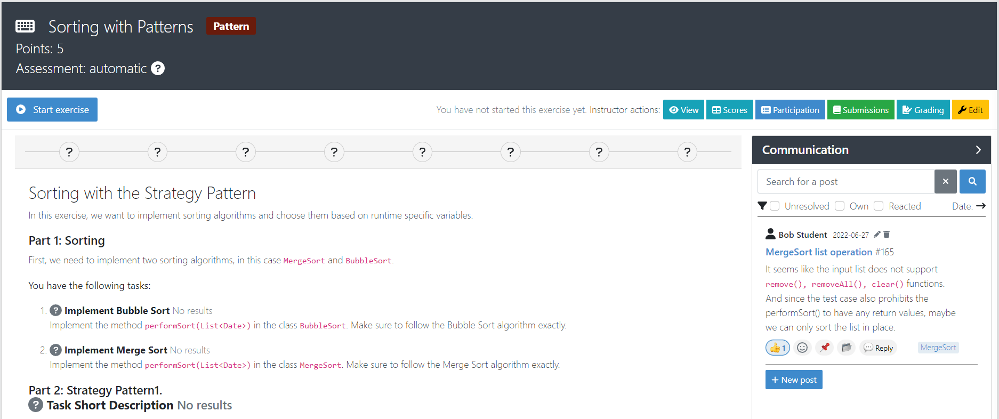
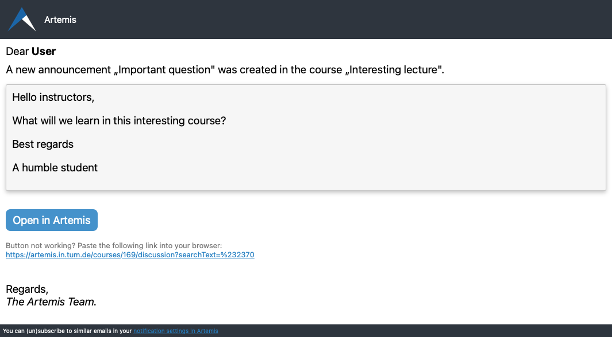

.. _communication:

Communication
=============

.. contents:: Content of this document
    :local:
    :depth: 2

Overview
--------

Artemis enables students, tutors, and instructors to actively participate with its communication feature.
Various communication features allow students to engage with peers and ask all kinds of questions whereas moderators (e.g., instructors and tutors) can provide general course information and answer content-related questions.
Communication can be made in different contexts, namely for lectures, exercises, or courses.
Below, you can find more information on specific features and how to use them.

Enabling Communication
^^^^^^^^^^^^^^^^^^^^^^

Artemis courses will by default enable all the communication features.
In case you do not want to provide users with these features, you can disable this feature on course creation by unchecking the respective checkbox (``Enable postings by students``) - it can also be edited afterwards.

Lecture Posts
^^^^^^^^^^^^^

*Posts, that are specifically related to a certain lecture.*

These posts have to be created on the detail page of the lecture they belong to.

Exemplary lecture detail page with posts:

|lecture-posts|

Exercise Posts
^^^^^^^^^^^^^^

*Posts, that are specifically related to a certain exercise.*

These posts have to be created on the detail page of the exercise they belong to.

Exemplary exercise detail page with posts:

|exercise-posts|

Course-wide Posts & Course Communication Overview
^^^^^^^^^^^^^^^^^^^^^^^^^^^^^^^^^^^^^^^^^^^^^^^^^

Besides lecture or exercise related questions, Artemis offers a third type of posts: posts with course-wide topics, such as ``Organization`` or ``Tech Support``.
These posts can only be created on the course communication overview which is shown in the screenshot below.

The ``Communication`` space of an Artemis course serves as overview for *all* posts in a course.
Hence, course-wide posts as well as exercise posts and lecture posts are listed.
Here, users can easily query, sort, and filter existing posts.

|course-posts|

Features for Users
------------------

This section captures the most important features that are offered to any Artemis user.

Search, Filter and Sort Posts
^^^^^^^^^^^^^^^^^^^^^^^^^^^^^

On the course communication overview, a user can query *all* existing posts by different criteria.
This can be a text-based search, context filters (i.e., a certain lecture, exercise or course-wide topic), or other post characteristics such as if it is already resolved.
By using different sort configurations, users can find the information they are looking for at the top of the list: for example the post that got the most votes, or the post that was created most recently.

React on Posts
^^^^^^^^^^^^^^

To foster interaction we integrate the well-known emoji reaction bar.
Each user in the course can react on every post by making use of the emoji selection button.
The ``+`` emoji serves as up-voting reaction, which influences the display order.

Reference Posts
^^^^^^^^^^^^^^^

If users want to refer to other posts, they can integrate a simple pattern including the hashtag (``#``) combined with the post identifier.
A post's identifier is appended to the post title (such as seen in the screenshots above).

When clicking a reference used in a post's text, the user is navigated to the referenced post.

Prevent Duplicated Posts
^^^^^^^^^^^^^^^^^^^^^^^^

In order to prevent duplicated questions from being posted, we integrate a duplication check that runs during post creation.
We strongly recommend users that create a post, to check the automatically provided list of similar posts to find out if the question in mind has already been asked and resolved in the best case.

Mark Your Post As Resolved
^^^^^^^^^^^^^^^^^^^^^^^^^^

Marking a post as resolved will indicate to other users that the posted question is resolved and does not need any further input.
This can be done by clicking the checkmark next to the answer post.
Note, that only the author of the post as well as a moderator can perform this action.
This is helpful for moderators to identify open questions, e.g., by applying the according filter in the course overview.
It also highlights the correct answer for other students that have a similar problem and search for a suitable solution.

Tag Your Post
^^^^^^^^^^^^^

When creating a post, users can choose to add arbitrary tags.
Tagging a post will further narrow down the post purpose or content in precise and descriptive keywords, that might follow a course-specific taxonomy.

Features for Moderators
-----------------------

The following features are only available for moderators, not for students.

Move Posts
^^^^^^^^^^

Tutors can change the context (lecture, exercise, course-wide topic) in the edit mode of the post.
By changing the context, for example from a certain exercise to a course-wide topic, the post is automatically moved.
In the example at hand, the post will not be shown on the according exercise page anymore, but rather only in the course-wide communication overview, associated with that certain course-wide topic.

Pin Posts
^^^^^^^^^^

By clicking the pushpin icon next to the reaction button of a post, a moderator can *pin* the post.
As a consequence, the post is displayed at the top of any post list to receive higher attention.

Archive Posts
^^^^^^^^^^^^^

As a complement to pinning, i.e., highlighting posts, a moderator can archive posts and thereby put them at the bottom of a post list.
This can be achieved by clicking the folder icon next to the reaction button.
Moderators should be aware that this reduces the visibility of the post.

Features for Instructors
------------------------

The following feature is only available for instructors that act as moderators.

Post Announcements
^^^^^^^^^^^^^^^^^^

Instructors can create course-wide posts that serve as *Announcements*.
They target every course participant and have higher relevance than normal posts.
Announcements can be created in the course communication overview by selecting the topic ``Announcement``.
As soon as the announcement is created, all participants, that did not actively refrain from being notified, will receive an email containing the announcement's content.
Additionally, announcements visually differ from normal posts and are always displayed on top of the communication overview.

Notifications
-------------

Artemis supports customizable web and email notifications. Users can enable and disable different notification types.

Web Notifications
^^^^^^^^^^^^^^^^^

The web notifications can be found on the top right of the page by clicking on the bell icon.
A red indicator shows the number of new messages.

|notification-top-bar|

|notification-side-bar|

Email Notifications
^^^^^^^^^^^^^^^^^^^

Artemis can also send out emails for certain notification types.
Additionally, Artemis can send out a weekly summary at Friday 5pm.

|notification-email|

Settings
^^^^^^^^

The user can change their preference for different types of notifications and decide if they want to receive emails, web notifications or no notification.
These settings can be found after opening the web notifications. The gear on the top left of the sidebar then leads to the settings.

|notification-settings|

.. |lecture-posts| image:: communication/lecture-posts.png
    :width: 1000

.. |course-posts| image:: communication/course-posts.png
    :width: 1000
.. |notification-top-bar| image:: communication/notification-top-bar.png
    :width: 500
.. |notification-side-bar| image:: communication/notification-side-bar.png
    :width: 500

.. |notification-settings| image:: communication/notification-settings.png
    :width: 1000
