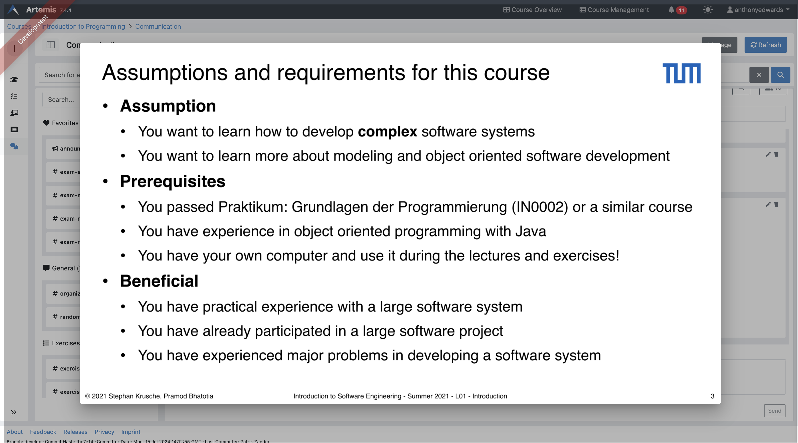

.. _communication:

Communication
=============

.. contents:: Content of this document
    :local:
    :depth: 3

Artemis enables students, tutors, and instructors to actively participate with its communication capabilities.
Various communication features allow students to engage with peers and ask all kinds of questions whereas moderators
(e.g., instructors and tutors) can provide general course information and answer content-related questions.
Communication can be made in different contexts, namely for lectures, exercises, or courses. Course participants can also
message each other to communicate in private. Below, you can find more information on specific features and how to use them.

Enabling Communication
----------------------

Artemis courses will by default enable all the communication features.
In case you do not want to provide users with these features, you can disable them on course creation by unchecking the
respective checkbox (``Communication Enabled``) - it can also be edited afterwards. Additionally, you can enable or disable group chats and direct messages by checking the (``Direct Messages Enabled / Group Chats``) checkbox.

|communication-toggle|

Course-Wide Messages
--------------------

Artemis automatically creates course-wide channels for course-wide topics, such as
``Organization`` or ``Tech Support``, and various elements of a course, namely lectures, exercises, and exams. Messages can be written within these channels on the course messaging overview, which is shown in the screenshot below.

|messaging-page|

This video provides an overview of the course-wide channel types existing in a course:

.. raw:: html

    <iframe src="https://live.rbg.tum.de/w/artemisintro/47622?video_only=1&t=0" allowfullscreen="1" frameborder="0" width="600" height="350">
        Watch this video on TUM-Live.
    </iframe>

Lecture Messages
^^^^^^^^^^^^^^^^

*Messages that are specifically related to a certain lecture.*

These messages can also be created on the detail page of the lecture they belong to.

Exemplary lecture detail page with messages:

|lecture-messages|

Exercise Messages
^^^^^^^^^^^^^^^^^

*Messages that are specifically related to a certain exercise.*

These messages can also be created on the detail page of the exercise they belong to.

Exemplary exercise detail page with messages:

|exercise-messages|

Private Communication
----------------------

Users of a course can communicate in private via the Messages page. (see image below) The page consists of a collapsible
Conversation sidebar on the left, where users can search for other participants of the current course and start a conversation
with them. Private communication is only available if the course instructor enables this feature.

If the recipient is browsing another conversation when they receive a new message, an icon with an unread-messages counter is displayed in their
conversation sidebar, next to the affiliated conversation that the new message was sent to. This way, users become aware of the new message
within that discussion.

The authorities of tutors and instructors are more restricted in the Messages Page compared to the Course Communication
Overview. Messages of a conversation are exclusive to its participants and are only editable or deletable by their respective
author.

Messages do not consist of titles. Users can continue a discussion around a specific message topic by clicking the messages’
“Reply in thread” button, which opens the Thread sidebar (see image below). The Thread sidebar is a collapsible sidebar
located on the right-hand side of the Messages Page when displayed.

|messages|

This video shows how link previews work in Artemis:

.. raw:: html

    <iframe src="https://live.rbg.tum.de/w/artemisintro/47626?video_only=1&t=0" allowfullscreen="1" frameborder="0" width="600" height="350">
        Watch this video on TUM-Live.
    </iframe>

If the message content contains links, a preview of the link will be shown under the message. This way, users will have a good understanding
of what that link is about. If they prefer not to have a preview, they can hover over the preview and click the appearing `X` button.
The preview will be removed.

|link-preview|

If the message contains more than one link, the preview will not have a preview image of the link to have more compact previews
for multiple links.

|link-preview-multiple|

Features for Users
------------------

This section captures the most important features that are offered to any Artemis user.

Search, Filter, and Sort Messages
^^^^^^^^^^^^^^^^^^^^^^^^^^^^^^^^^

On the course communication overview, a user can query *all* existing messages according to the following criteria and their
possible combinations:

* Text-based search
    * Contents of Announcement-Message Title
    * Contents of Message Context
* Message characteristics
    * Unresolved Messages
    * Own (messages current user has authored)
    * Reacted (messages current user has reacted or replied to)
* Sorting Configurations (ASC/DESC)
    * Creation Date

A simplified version of this feature is available on the exercise and lecture details page as well.

To search within a specific channel in the communications module, users can navigate to the desired channel and utilize the search bar located in that channel.

Verify User Authority
^^^^^^^^^^^^^^^^^^^^^

To build trust between users utilizing the system's communication features, we prepend a role badge to the author’s name in the
headers of messages and their replies. The badge we introduce differs according to the role of the author within the course
and reveals their highest authoritative role. Via tooltips that are shown as users hover over these badges (see images below),
the system displays a brief explanation of that specific role. This way, the system builds trust in the author, and readers
can tangibly confirm the origin of the shared information.

Instructor Authority

|instructor-user|

Tutor Authority

|tutor-user|

Student Authority

|student-user|

React on Messages
^^^^^^^^^^^^^^^^^

To foster interaction between users, we integrate the well-known emoji reaction bar.
Each user in the course can react on any message by making use of the emoji selection button.
The ➕ emoji serves as the up-voting reaction, which influences the display order of messages.

Reference Course Entities
^^^^^^^^^^^^^^^^^^^^^^^^^

Users can reference to different course entities within their messages, such as other messages, course exercises, course lectures,
and attachments of these lectures. All references are then prepended with icons which are unique to the reference's type,
to help users distinguish them conveniently. In the image below, we see all possible types of references that can be created
in an Artemis message.

|message-with-references|

Reference Course Exercises
""""""""""""""""""""""""""
Users can refer to exercises of the current course, via the dropdown menu ``Exercise`` available on the posting markdown
editor (see image above). The following types of exercises are prepended unique icons to help distinguish the type of the
exercise being referenced.

* Text Exercise
* Quiz Exercise
* Modeling Exercise
* File Upload Exercise
* Programming Exercise

Reference Course Lectures
"""""""""""""""""""""""""

Users can refer to lectures of the current course, via the dropdown menu ``Lecture`` available on the posting markdown
editor (see image above).

Reference Lecture Attachments
"""""""""""""""""""""""""""""

Users can refer to lectures of the current course, via the dropdown menu ``Lecture`` available on the posting markdown
editor (see image above). Here, lecture attachments can be found in a nested structure.

Reference Lecture Attachment Units
""""""""""""""""""""""""""""""""""

Users can refer to lecture attachment units of the current course, via the dropdown menu ``Lecture`` available on the posting markdown
editor, see image below. Here, lecture attachment units can be found when users hover over the specific lecture.

Reference Lecture Unit Slides
"""""""""""""""""""""""""""""

.. raw:: html

    <iframe src="https://live.rbg.tum.de/w/artemisintro/47625?video_only=1&t=0" allowfullscreen="1" frameborder="0" width="600" height="350">
        Watch this video on TUM-Live.
    </iframe>

Users can refer to lecture unit slides of the current course, via the dropdown menu ``Lecture``. Here, slides can be found when users
hover over a specific unit, see image below.

|slide-reference-menu|

After the user references a single slide they can see it as an image included in the message. Additionally, they can preview the slide
in order to easily read the content by clicking the image.

|slide-reference|

|referenced-slide-preview|

Reference other course members
""""""""""""""""""""""""""""""

Users can mention other course members within a message, by either typing an `@` character or clicking the `@` button available on the posting markdown editor. By typing in the name of a user to mention, the author of the message can search for a certain user they want to mention as demonstrated in the video below.

Reference channels
""""""""""""""""""

Similar to course members, users can reference public and course-wide channels of a course by either typing an `#` character or clicking the `#` button available on the posting markdown editor.

Mark Your Message As Resolved
^^^^^^^^^^^^^^^^^^^^^^^^^^^^^

Marking a message as resolved will indicate to other users that the posted question is resolved and does not need any further input.
This can be done by clicking the check mark next to the answer message. (see image below)
Note that only the author of the message as well as a moderator can perform this action.
This is helpful for moderators to identify open questions, e.g., by applying the according filter in the course overview.
It also highlights the correct answer for other students that have a similar problem and search for a suitable solution.

|resolved-post|

Features for Moderators
-----------------------

The following features are only available for moderators, not for students.

Pin Messages
^^^^^^^^^^^^

By clicking the pushpin icon next to the reaction button of a message, a moderator can *pin* the message.
As a consequence, the message is highlighted to receive higher attention.

Features for Instructors
------------------------

The following feature is only available for instructors that act as moderators.

Creating Course-Wide Channels
^^^^^^^^^^^^^^^^^^^^^^^^^^^^^

When creating a lecture, exercise, or exam, the creator can decide on a channel name as well. The name is automatically generated based on the lecture's/exercise's/exam's title but can be adapted if needed.

The video below provides a demonstration for the creation of a course-wide channel:

.. raw:: html

    <iframe src="https://live.rbg.tum.de/w/artemisintro/47623?video_only=1&t=0" allowfullscreen="1" frameborder="0" width="600" height="350">
        Watch this video on TUM-Live.
    </iframe>

Message Announcements
^^^^^^^^^^^^^^^^^^^^^

Instructors can create course-wide messages that serve as *Announcements*.
They target every course participant and have higher relevance than normal messages.
Announcements can be created in the course messaging overview by selecting the ``Announcement`` channel.
As soon as the announcement is created, all participants who did not actively refrain from being notified will receive an email containing the announcement's content.

.. |communication-toggle| image:: communication/communication-checkbox.png
    :width: 500
.. |messaging-page| image:: communication/messaging-page.png
    :width: 1000
.. |lecture-messages| image:: communication/lecture-messages.png
    :width: 1000
.. |exercise-messages| image:: communication/exercise-messages.png
    :width: 1000
.. |message-with-references| image:: communication/message-with-all-references.png
    :width: 750
.. |resolved-post| image:: communication/resolved-post.png
    :width: 400
.. |instructor-user| image:: communication/user-authorities/instructor.png
    :width: 500
.. |tutor-user| image:: communication/user-authorities/tutor.png
    :width: 500
.. |student-user| image:: communication/user-authorities/student.png
    :width: 500
.. |messages| image:: communication/messages.png
    :width: 1000
.. |slide-reference| image:: communication/slide-reference.png
    :width: 600
.. |slide-reference-menu| image:: communication/slide-reference-menu.png
    :width: 1000

.. |link-preview| image:: communication/link-preview.png
    :width: 600
.. |link-preview-multiple| image:: communication/link-preview-multiple.png
    :width: 600
