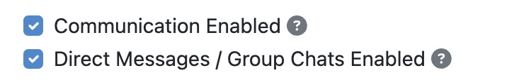
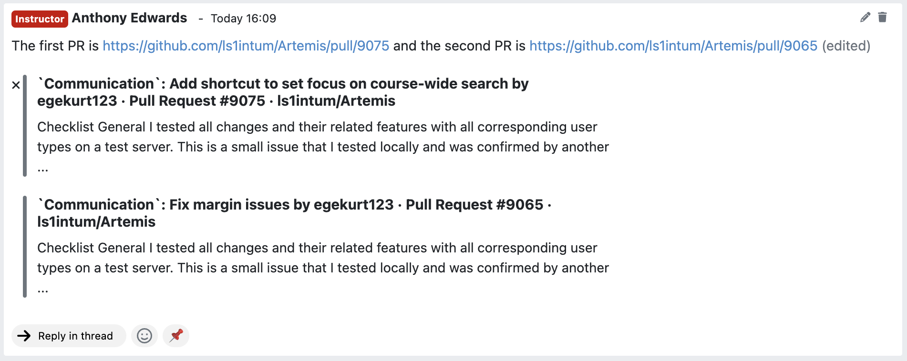

.. _communication:

Communication
=============

.. contents:: Content of this document
    :local:
    :depth: 3

Artemis enables students, tutors, and instructors to actively participate with its communication capabilities.
Various communication features allow students to engage with peers and ask all kinds of questions whereas moderators
(e.g., instructors and tutors) can provide general course information and answer content-related questions.
Communication can be made in different contexts, namely for lectures, exercises, or courses. Course participants can also
message each other to communicate in private. Below, you can find more information on specific features and how to use them.

Enabling Communication
----------------------

Artemis courses will by default enable all the communication features.
In case you do not want to provide users with these features, you can disable them on course creation by unchecking the
respective checkbox (``Communication Enabled``) - it can also be edited afterwards. Additionally, you can enable or disable group chats and direct messages by checking the (``Direct Messages Enabled / Group Chats``) checkbox.

|communication-toggle|

Course-Wide Messages
--------------------

Artemis automatically creates course-wide channels for course-wide topics, such as
``Organization`` or ``Tech Support``, and various elements of a course, namely lectures, exercises, and exams. Messages can be written within these channels on the course messaging overview, which is shown in the screenshot below.

|messaging-page|

This video provides an overview of the course-wide channel types existing in a course:

.. raw:: html

    <iframe src="https://live.rbg.tum.de/w/artemisintro/47622?video_only=1&t=0" allowfullscreen="1" frameborder="0" width="600" height="350">
        Watch this video on TUM-Live.
    </iframe>

Lecture Messages
^^^^^^^^^^^^^^^^

*Messages that are specifically related to a certain lecture.*

These messages can also be created on the detail page of the lecture they belong to.

Exemplary lecture detail page with messages:

|lecture-view|

Exercise Messages
^^^^^^^^^^^^^^^^^

*Messages that are specifically related to a certain exercise.*

These messages can also be created on the detail page of the exercise they belong to.

Exemplary exercise detail page with messages:

|exercise-view|

Private Communication
----------------------

Users of a course can communicate in private via the Messages page. (see image below) The page consists of a collapsible
Conversation sidebar on the left, where users can search for other participants of the current course and start a conversation
with them. Private communication is only available if the course instructor enables this feature.

If the recipient is browsing another conversation when they receive a new message, an icon with an unread-messages counter is displayed in their
conversation sidebar, next to the affiliated conversation that the new message was sent to. This way, users become aware of the new message
within that discussion.

The authorities of tutors and instructors are more restricted in the Messages Page compared to the Course Communication
Overview. Messages of a conversation are exclusive to its participants and are only editable or deletable by their respective
author.

Messages do not consist of titles. Users can continue a discussion around a specific message topic by clicking the messages’
“Reply in thread” button, which opens the Thread sidebar (see image below). The Thread sidebar is a collapsible sidebar
located on the right-hand side of the Messages Page when displayed.

|messages|

This video shows how link previews work in Artemis:

.. raw:: html

    <iframe src="https://live.rbg.tum.de/w/artemisintro/47626?video_only=1&t=0" allowfullscreen="1" frameborder="0" width="600" height="350">
        Watch this video on TUM-Live.
    </iframe>

If the message content contains links, a preview of the link will be shown under the message. This way, users will have a good understanding
of what that link is about. If they prefer not to have a preview, they can hover over the preview and click the appearing `X` button.
The preview will be removed.

|link-preview-view|

.. _communication features availability list:

Communication Features Availability
-----------------------------------

.. |AVAILABLE| raw:: html

    AVAILABLE

.. |UNAVAILABLE| raw:: html

    UNAVAILABLE

.. |PLANNED| raw:: html

    PLANNED

.. |WIP| raw:: html

    WIP

.. |NOT PLANNED| raw:: html

    NOT PLANNED

The following table represents the currently available communication features of Artemis on the different platforms. Note that not all
features are available to every user, which is why **Actor restrictions** have been added. The following sections will explore this in more
detail.

Status explained
^^^^^^^^^^^^^^^^

.. list-table::
   :widths: 15 74

   * - |AVAILABLE|
     - This feature has been released to production.
   * - |UNAVAILABLE|
     - This feature is currently not available and not planned yet.
   * - |PLANNED|
     - This feature is planned and implemented within the next 2-4 months.
   * - |WIP|
     - This feature is currently being worked on and will be released soon.
   * - |NOT PLANNED|
     - This feature will not be implemented due to platform restrictions, or it does not make sense to implement it.

Available features on each platform
^^^^^^^^^^^^^^^^^^^^^^^^^^^^^^^^^^^

+------------------------------------------------------+--------------------------------------+--------------------+---------------------+---------------------+
| Feature                                              | Actor Restrictions                   | Web App            | iOS                 | Android             |
+======================================================+======================================+====================+=====================+=====================+
| **General**                                                                                                                                                  |
+------------------------------------------------------+--------------------------------------+--------------------+---------------------+---------------------+
| Send Messages                                        |                                      | |AVAILABLE|        | |AVAILABLE|         | |AVAILABLE|         |
+------------------------------------------------------+--------------------------------------+--------------------+---------------------+---------------------+
| Receive Messages                                     |                                      | |AVAILABLE|        | |AVAILABLE|         | |AVAILABLE|         |
+------------------------------------------------------+--------------------------------------+--------------------+---------------------+---------------------+
|                                                                                                                                                              |
+------------------------------------------------------+--------------------------------------+--------------------+---------------------+---------------------+
| **Post Actions**                                                                                                                                             |
+------------------------------------------------------+--------------------------------------+--------------------+---------------------+---------------------+
| React to Messages                                    |                                      | |AVAILABLE|        | |AVAILABLE|         | |AVAILABLE|         |
+------------------------------------------------------+--------------------------------------+--------------------+---------------------+---------------------+
| Reply in Thread                                      |                                      | |AVAILABLE|        | |AVAILABLE|         | |AVAILABLE|         |
+------------------------------------------------------+--------------------------------------+--------------------+---------------------+---------------------+
| See who reacted to a post                            |                                      | |AVAILABLE|        | |AVAILABLE|         | |AVAILABLE|         |
+------------------------------------------------------+--------------------------------------+--------------------+---------------------+---------------------+
| Copy Text                                            |                                      | |NOT PLANNED|      | |AVAILABLE|         | |AVAILABLE|         |
+------------------------------------------------------+--------------------------------------+--------------------+---------------------+---------------------+
| Pin Messages                                         | | Groups: group creators             | |AVAILABLE|        | |AVAILABLE|         | |AVAILABLE|         |
|                                                      | | Channels: moderators               |                    |                     |                     |
|                                                      | | DM: members of DM                  |                    |                     |                     |
+------------------------------------------------------+--------------------------------------+--------------------+---------------------+---------------------+
| Delete Message                                       | Moderators and authors               | |AVAILABLE|        | |AVAILABLE|         | |AVAILABLE|         |
+------------------------------------------------------+--------------------------------------+--------------------+---------------------+---------------------+
| Edit Message                                         | Authors only                         | |AVAILABLE|        | |AVAILABLE|         | |AVAILABLE|         |
+------------------------------------------------------+--------------------------------------+--------------------+---------------------+---------------------+
| Save Message for later                               |                                      | |AVAILABLE|        | |AVAILABLE|         | |AVAILABLE|         |
+------------------------------------------------------+--------------------------------------+--------------------+---------------------+---------------------+
| Forward Messages                                     |                                      | |AVAILABLE|        | |AVAILABLE|         | |AVAILABLE|         |
+------------------------------------------------------+--------------------------------------+--------------------+---------------------+---------------------+
| Resolve Messages                                     | At least tutor and authors           | |AVAILABLE|        | |AVAILABLE|         | |AVAILABLE|         |
+------------------------------------------------------+--------------------------------------+--------------------+---------------------+---------------------+
| Post action bar (thread view)                        |                                      | |NOT PLANNED|      | |AVAILABLE|         | |AVAILABLE|         |
+------------------------------------------------------+--------------------------------------+--------------------+---------------------+---------------------+
| Get tutor suggestion (thread view)                   | At least tutor                       | |AVAILABLE|        | |UNAVAILABLE|       | |UNAVAILABLE|       |
+------------------------------------------------------+--------------------------------------+--------------------+---------------------+---------------------+
|                                                                                                                                                              |
+------------------------------------------------------+--------------------------------------+--------------------+---------------------+---------------------+
| **Markdown Text field Options**                                                                                                                              |
+------------------------------------------------------+--------------------------------------+--------------------+---------------------+---------------------+
| Tag other users                                      |                                      | |AVAILABLE|        | |AVAILABLE|         | |AVAILABLE|         |
+------------------------------------------------------+--------------------------------------+--------------------+---------------------+---------------------+
| Reference channels, lectures and exercises           |                                      | |AVAILABLE|        | |AVAILABLE|         | |AVAILABLE|         |
+------------------------------------------------------+--------------------------------------+--------------------+---------------------+---------------------+
| Tag FAQ                                              |                                      | |AVAILABLE|        | |AVAILABLE|         | |AVAILABLE|         |
+------------------------------------------------------+--------------------------------------+--------------------+---------------------+---------------------+
| Basic formatting (underline, bold, italic)           |                                      | |AVAILABLE|        | |AVAILABLE|         | |AVAILABLE|         |
+------------------------------------------------------+--------------------------------------+--------------------+---------------------+---------------------+
| Strikethrough formatting                             |                                      | |AVAILABLE|        | |AVAILABLE|         | |AVAILABLE|         |
+------------------------------------------------------+--------------------------------------+--------------------+---------------------+---------------------+
| Preview                                              |                                      | |AVAILABLE|        | |UNAVAILABLE|       | |AVAILABLE|         |
+------------------------------------------------------+--------------------------------------+--------------------+---------------------+---------------------+
| Code Block and inline code formatting                |                                      | |AVAILABLE|        | |AVAILABLE|         | |AVAILABLE|         |
+------------------------------------------------------+--------------------------------------+--------------------+---------------------+---------------------+
| Reference formatting                                 |                                      | |AVAILABLE|        | |AVAILABLE|         | |AVAILABLE|         |
+------------------------------------------------------+--------------------------------------+--------------------+---------------------+---------------------+
| Link formatting                                      |                                      | |AVAILABLE|        | |AVAILABLE|         | |PLANNED|           |
+------------------------------------------------------+--------------------------------------+--------------------+---------------------+---------------------+
|                                                                                                                                                              |
+------------------------------------------------------+--------------------------------------+--------------------+---------------------+---------------------+
| **Messages**                                                                                                                                                 |
+------------------------------------------------------+--------------------------------------+--------------------+---------------------+---------------------+
| Profile pictures                                     |                                      | |AVAILABLE|        | |AVAILABLE|         | |AVAILABLE|         |
+------------------------------------------------------+--------------------------------------+--------------------+---------------------+---------------------+
| Show if message was edited, resolved or pinned       |                                      | |AVAILABLE|        | |AVAILABLE|         | |AVAILABLE|         |
+------------------------------------------------------+--------------------------------------+--------------------+---------------------+---------------------+
| | Render links to exercises, lectures, other chats,  |                                      | |AVAILABLE|        | |AVAILABLE|         | |AVAILABLE|         |
| | lecture-units, slides, lecture-attachment with     |                                      |                    |                     |                     |
| | correct icon                                       |                                      |                    |                     |                     |
+------------------------------------------------------+--------------------------------------+--------------------+---------------------+---------------------+
| Render FAQ links                                     |                                      | |AVAILABLE|        | |AVAILABLE|         | |AVAILABLE|         |
+------------------------------------------------------+--------------------------------------+--------------------+---------------------+---------------------+
| Mark unread messages                                 |                                      | |UNAVAILABLE|      | |UNAVAILABLE|       | |UNAVAILABLE|       |
+------------------------------------------------------+--------------------------------------+--------------------+---------------------+---------------------+
| Render images                                        |                                      | |AVAILABLE|        | |AVAILABLE|         | |AVAILABLE|         |
+------------------------------------------------------+--------------------------------------+--------------------+---------------------+---------------------+
| Show link previews                                   |                                      | |AVAILABLE|        | |UNAVAILABLE|       | |AVAILABLE|         |
+------------------------------------------------------+--------------------------------------+--------------------+---------------------+---------------------+
| Render links to uploaded files                       |                                      | |AVAILABLE|        | |AVAILABLE|         | |AVAILABLE|         |
+------------------------------------------------------+--------------------------------------+--------------------+---------------------+---------------------+
| Filter messages (unresolved, own, reacted)           |                                      | |AVAILABLE|        | |AVAILABLE|         | |AVAILABLE|         |
+------------------------------------------------------+--------------------------------------+--------------------+---------------------+---------------------+
| Sort messages (ascending, descending)                |                                      | |AVAILABLE|        | |NOT PLANNED|       | |NOT PLANNED|       |
+------------------------------------------------------+--------------------------------------+--------------------+---------------------+---------------------+
| Search for messages in a specific chat               |                                      | |AVAILABLE|        | |UNAVAILABLE|       | |AVAILABLE|         |
+------------------------------------------------------+--------------------------------------+--------------------+---------------------+---------------------+
| Search for messages across all chats                 |                                      | |AVAILABLE|        | |PLANNED|           | |UNAVAILABLE|       |
+------------------------------------------------------+--------------------------------------+--------------------+---------------------+---------------------+
| Apply filters while searching across all chats       |                                      | |AVAILABLE|        | |PLANNED|           | |UNAVAILABLE|       |
+------------------------------------------------------+--------------------------------------+--------------------+---------------------+---------------------+
| Open Profile info by clicking profile picture        |                                      | |PLANNED|          | |AVAILABLE|         | |AVAILABLE|         |
+------------------------------------------------------+--------------------------------------+--------------------+---------------------+---------------------+
| Start a conversation from Profile                    |                                      | |AVAILABLE|        | |AVAILABLE|         | |AVAILABLE|         |
+------------------------------------------------------+--------------------------------------+--------------------+---------------------+---------------------+
| Draft messages                                       |                                      | |AVAILABLE|        | |AVAILABLE|         | |AVAILABLE|         |
+------------------------------------------------------+--------------------------------------+--------------------+---------------------+---------------------+
|                                                                                                                                                              |
+------------------------------------------------------+--------------------------------------+--------------------+---------------------+---------------------+
| **Link/Attachment Handling**                                                                                                                                 |
+------------------------------------------------------+--------------------------------------+--------------------+---------------------+---------------------+
| | Open lecture, exercise, chat links correctly in    |                                      | |AVAILABLE|        | |AVAILABLE|         | |AVAILABLE|         |
| | the appropriate view                               |                                      |                    |                     |                     |
+------------------------------------------------------+--------------------------------------+--------------------+---------------------+---------------------+
| Open sent images full-screen                         |                                      | |AVAILABLE|        | |AVAILABLE|         | |PLANNED|           |
+------------------------------------------------------+--------------------------------------+--------------------+---------------------+---------------------+
| Download sent images                                 |                                      | |AVAILABLE|        | |AVAILABLE|         | |UNAVAILABLE|       |
+------------------------------------------------------+--------------------------------------+--------------------+---------------------+---------------------+
| View and download attachments                        |                                      | |AVAILABLE|        | |AVAILABLE|         | |AVAILABLE|         |
+------------------------------------------------------+--------------------------------------+--------------------+---------------------+---------------------+
|                                                                                                                                                              |
+------------------------------------------------------+--------------------------------------+--------------------+---------------------+---------------------+
| **Conversation Management**                                                                                                                                  |
+------------------------------------------------------+--------------------------------------+--------------------+---------------------+---------------------+
| Search for chats                                     |                                      | |AVAILABLE|        | |AVAILABLE|         | |AVAILABLE|         |
+------------------------------------------------------+--------------------------------------+--------------------+---------------------+---------------------+
| Filter chats (all, unread, favorites)                |                                      | |UNAVAILABLE|      | |AVAILABLE|         | |AVAILABLE|         |
+------------------------------------------------------+--------------------------------------+--------------------+---------------------+---------------------+
| Mark unread chats                                    |                                      | |AVAILABLE|        | |AVAILABLE|         | |AVAILABLE|         |
+------------------------------------------------------+--------------------------------------+--------------------+---------------------+---------------------+
| Mute, hide, favorite chat                            |                                      | |AVAILABLE|        | |AVAILABLE|         | |AVAILABLE|         |
+------------------------------------------------------+--------------------------------------+--------------------+---------------------+---------------------+
| Edit Chat information (name, topic, description)     |                                      | |AVAILABLE|        | |AVAILABLE|         | |AVAILABLE|         |
+------------------------------------------------------+--------------------------------------+--------------------+---------------------+---------------------+
| Archive Chat                                         |                                      | |AVAILABLE|        | |AVAILABLE|         | |AVAILABLE|         |
+------------------------------------------------------+--------------------------------------+--------------------+---------------------+---------------------+
| Delete Chat                                          |                                      | |AVAILABLE|        | |AVAILABLE|         | |PLANNED|           |
+------------------------------------------------------+--------------------------------------+--------------------+---------------------+---------------------+
| View Members                                         |                                      | |AVAILABLE|        | |AVAILABLE|         | |AVAILABLE|         |
+------------------------------------------------------+--------------------------------------+--------------------+---------------------+---------------------+
| Search Members                                       |                                      | |AVAILABLE|        | |UNAVAILABLE|       | |AVAILABLE|         |
+------------------------------------------------------+--------------------------------------+--------------------+---------------------+---------------------+
| | Filter Members (All Members, Instructors,          |                                      | |AVAILABLE|        | |UNAVAILABLE|       | |UNAVAILABLE|       |
| | Tutors, Students, Moderators)                      |                                      |                    |                     |                     |
+------------------------------------------------------+--------------------------------------+--------------------+---------------------+---------------------+
| Add Members to existing chat                         | | Group: members of group            | |AVAILABLE|        | |AVAILABLE|         | |AVAILABLE|         |
|                                                      | | Channel: at least instructor       |                    |                     |                     |
|                                                      | | or moderator                       |                    |                     |                     |
|                                                      | | DM: not possible                   |                    |                     |                     |
+------------------------------------------------------+--------------------------------------+--------------------+---------------------+---------------------+
| | Filter Members while adding (Students, Tutors,     |                                      | |AVAILABLE|        | |UNAVAILABLE|       | |AVAILABLE|         |
| | Instructors)                                       |                                      |                    |                     |                     |
+------------------------------------------------------+--------------------------------------+--------------------+---------------------+---------------------+
| | Add whole groups (All Students, All Tutors, All    |                                      | |AVAILABLE|        | |PLANNED|           | |UNAVAILABLE|       |
| | Instructors)                                       |                                      |                    |                     |                     |
+------------------------------------------------------+--------------------------------------+--------------------+---------------------+---------------------+
| | Grant moderator roles in channels / revoke         | Moderators only                      | |AVAILABLE|        | |UNAVAILABLE|       | |AVAILABLE|         |
| | moderation roles                                   |                                      |                    |                     |                     |
+------------------------------------------------------+--------------------------------------+--------------------+---------------------+---------------------+
| Create direct chat                                   | Everyone                             | |AVAILABLE|        | |AVAILABLE|         | |AVAILABLE|         |
+------------------------------------------------------+--------------------------------------+--------------------+---------------------+---------------------+
| | Create channel (public/private,                    | At least teaching assistant          | |AVAILABLE|        | |AVAILABLE|         | |AVAILABLE|         |
| | announcement/unrestricted)                         |                                      |                    |                     |                     |
+------------------------------------------------------+--------------------------------------+--------------------+---------------------+---------------------+
| | Update channel information (name, topic,           | Moderators                           | |AVAILABLE|        | |AVAILABLE|         | |AVAILABLE|         |
| | description)                                       |                                      |                    |                     |                     |
+------------------------------------------------------+--------------------------------------+--------------------+---------------------+---------------------+
| Create group chat                                    | Everyone                             | |AVAILABLE|        | |AVAILABLE|         | |AVAILABLE|         |
+------------------------------------------------------+--------------------------------------+--------------------+---------------------+---------------------+
| Remove users from group chat                         | Members of group chat                | |AVAILABLE|        | |AVAILABLE|         | |AVAILABLE|         |
+------------------------------------------------------+--------------------------------------+--------------------+---------------------+---------------------+
| Browse channels                                      |                                      | |AVAILABLE|        | |AVAILABLE|         | |AVAILABLE|         |
+------------------------------------------------------+--------------------------------------+--------------------+---------------------+---------------------+
| | Show info in chat overview                         |                                      | |AVAILABLE|        | |AVAILABLE|         | |AVAILABLE|         |
| | (created by, created on)                           |                                      |                    |                     |                     |
+------------------------------------------------------+--------------------------------------+--------------------+---------------------+---------------------+
| Leave chat                                           | For groups only                      | |AVAILABLE|        | |AVAILABLE|         | |AVAILABLE|         |
+------------------------------------------------------+--------------------------------------+--------------------+---------------------+---------------------+
| Delete channel                                       | | Creators with moderation           | |AVAILABLE|        | |AVAILABLE|         | |AVAILABLE|         |
|                                                      | | rights and instructors             |                    |                     |                     |
+------------------------------------------------------+--------------------------------------+--------------------+---------------------+---------------------+
| Archive channel                                      | Moderators                           | |AVAILABLE|        | |AVAILABLE|         | |AVAILABLE|         |
+------------------------------------------------------+--------------------------------------+--------------------+---------------------+---------------------+
|                                                                                                                                                              |
+------------------------------------------------------+--------------------------------------+--------------------+---------------------+---------------------+
| **Notifications**                                                                                                                                            |
+------------------------------------------------------+--------------------------------------+--------------------+---------------------+---------------------+
| | Notification overview for past                     |                                      | |AVAILABLE|        | |AVAILABLE|         | |UNAVAILABLE|       |
| | course specific notifications                      |                                      |                    |                     |                     |
+------------------------------------------------------+--------------------------------------+--------------------+---------------------+---------------------+
| | Notification settings (unsubscribe/subscribe       |                                      | |AVAILABLE|        | |AVAILABLE|         | |AVAILABLE|         |
| | to various course specific notification types)     |                                      |                    |                     |                     |
+------------------------------------------------------+--------------------------------------+--------------------+---------------------+---------------------+

.. note::
    - Leave chat option is available on the web app for groups only, on iOS for groups and non course-wide channels, and on Android for channels, groups, and DMs.
    - Creating a group chat on iOS and Android can be achieved via the 'Create Chat' option. It becomes a group when more than one user is added.
    - Starting a conversation on the web app from a profile is available when clicking on the user's name in the chat.
    - Downloading sent images in the chat is only available through the browser option on the web app.
    - Seeing who reacted to a post is available when hovering over a reaction on the web app.

Features for Users
------------------

This section captures the most important features that are offered to any Artemis user.

Search, Filter, and Sort Messages
^^^^^^^^^^^^^^^^^^^^^^^^^^^^^^^^^

Global Search

In the course communication, users can search for messages across all channels and conversations. The global search can be accessed anytime.
To only receive results from a a specific conversation or a specific author, filters can be applied by using the keywords *in:* or *from:*
or by selecting the respective filters from the dropdown menu. When accessing the global search from a conversation by clicking on the
search icon in the top right corner, this conversation is automatically selected as filter.

|global-search|

On the course communication overview, a user can query *all* existing messages according to the following criteria and their
possible combinations:

* Text-based Search using the Global Search
    * Contents of Announcement-Message Title
    * Contents of Message Context
* Message Characteristics
    * Unresolved Messages
    * Own (messages current user has authored)
    * Reacted (messages current user has reacted or replied to)
* Sorting Configurations (ASC/DESC)
    * Creation Date

A simplified version of this feature is available on the exercise and lecture details page as well.

Filter Pinned Messages within a Conversation
^^^^^^^^^^^^^^^^^^^^^^^^^^^^^^^^^^^^^^^^^^^^

If there are any pinned messages in a conversation, a button labeled "*x* pinned messages", where *x* is the number of pinned messages,
appears at the top right of the conversation view. By clicking this button, users can filter and view only the pinned messages
within that conversation. Clicking the button again returns the view to the regular conversation.

Pinned Messages Button

|pinned-messages-button|

Applied Pinned Messages Filtering

|applied-pinned filter|

Verify User Authority
^^^^^^^^^^^^^^^^^^^^^

To build trust between users utilizing the system's communication features, we display the user's role below their name in the headers of messages and their replies.
When hovering over the displayed role, a tooltip appears showing a brief explanation of that specific role. This way, the system builds trust in the author, and readers
can tangibly confirm the origin of the shared information.

Instructor Authority

|instructor-role|

Tutor Authority

|tutor-role|

Student Authority

|student-role|

React on Messages
^^^^^^^^^^^^^^^^^

To foster interaction between users, we integrate the well-known emoji reaction bar.
Each user in the course can react on any message by making use of the emoji selection button.
The ➕ emoji serves as the up-voting reaction, which influences the display order of messages.

Reference Course Entities
^^^^^^^^^^^^^^^^^^^^^^^^^

Users can reference to different course entities within their messages, such as other messages, course exercises, course lectures,
and attachments of these lectures. All references are then prepended with icons which are unique to the reference's type,
to help users distinguish them conveniently. In the image below, we see all possible types of references that can be created
in an Artemis message.

|message-references|

Reference Course Exercises
""""""""""""""""""""""""""
Users can refer to exercises of the current course, via the dropdown menu ``Exercise`` available on the posting markdown
editor (see image above). The following types of exercises are prepended unique icons to help distinguish the type of the
exercise being referenced.

* Text Exercise
* Quiz Exercise
* Modeling Exercise
* File Upload Exercise
* Programming Exercise

Reference Course Lectures
"""""""""""""""""""""""""

Users can refer to lectures of the current course, via the dropdown menu ``Lecture`` available on the posting markdown
editor (see image above).

Reference Lecture Attachments
"""""""""""""""""""""""""""""

Users can refer to lectures of the current course, via the dropdown menu ``Lecture`` available on the posting markdown
editor (see image above). Here, lecture attachments can be found in a nested structure.

Reference Lecture Attachment Units
""""""""""""""""""""""""""""""""""

Users can refer to lecture attachment units of the current course, via the dropdown menu ``Lecture`` available on the posting markdown
editor, see image below. Here, lecture attachment units can be found when users hover over the specific lecture.

Reference Lecture Unit Slides
"""""""""""""""""""""""""""""

.. raw:: html

    <iframe src="https://live.rbg.tum.de/w/artemisintro/47625?video_only=1&t=0" allowfullscreen="1" frameborder="0" width="600" height="350">
        Watch this video on TUM-Live.
    </iframe>

Users can refer to lecture unit slides of the current course, via the dropdown menu ``Lecture``. Here, slides can be found when users
hover over a specific unit, see image below.

|slide-menu|

After the user references a single slide they can see it as an image included in the message. Additionally, they can preview the slide
in order to easily read the content by clicking the image.

|slide-preview|

|slide-view|

Reference other course members
""""""""""""""""""""""""""""""

Users can mention other course members within a message, by either typing an `@` character or clicking the `@` button available on the posting markdown editor. By typing in the name of a user to mention, the author of the message can search for a certain user they want to mention as demonstrated in the video below.

Reference channels
""""""""""""""""""

Similar to course members, users can reference public and course-wide channels of a course by either typing an `#` character or clicking the `#` button available on the posting markdown editor.

Mark Your Message As Resolved
^^^^^^^^^^^^^^^^^^^^^^^^^^^^^

Marking a message as resolved will indicate to other users that the posted question is resolved and does not need any further input.
This can be done by clicking the check mark next to the answer message. (see image below)
Note that only the author of the message as well as a moderator can perform this action.
This is helpful for moderators to identify open questions, e.g., by applying the according filter in the course overview.
It also highlights the correct answer for other students that have a similar problem and search for a suitable solution.

|resolved-post|

Forward Messages
^^^^^^^^^^^^^^^^

Users can forward any message to another conversation within the same course. In the forward message dialog, they can add
additional content using the input field. At the top of the dialog, users can search for channels or users by typing into
the input bar and selecting from the auto-suggestions. They can select multiple conversations at once to forward the message
to several destinations simultaneously. On the forwarded message view, users can navigate to the exact location of the original
message by clicking the *View Conversation* button.

Forward Message Dialog

|forward-message-dialog|

Forwarded Message View

|forwarded-message|

Save Messages
^^^^^^^^^^^^^

Users can save messages and access them later from the Saved Messages section in the sidebar. Saved messages are
organized into three categories: *In Progress*, *Completed*, and *Archived*. Messages initially appear in the *In Progress*
section and can be marked as done to move them to *Completed*, or archived to move them to the *Archived* section.
Clicking on a saved message navigates the user directly to its exact location within the conversation.

|save-messages|

Expand Thread to Full-Screen
^^^^^^^^^^^^^^^^^^^^^^^^^^^^

Users can expand a thread to cover the entire conversation view by clicking the expand button located at the top right
corner of the answer thread. Clicking the same button again returns the thread to its original size.

|expanded-thread|

Profile Pictures
^^^^^^^^^^^^^^^^

Users can upload a profile picture in their account settings to enhance personal recognition. Once set, the profile picture will appear alongside any messages they post. The following video provides a step-by-step guide on how to upload a profile picture:

.. raw:: html

    <iframe src="https://live.rbg.tum.de/w/artemisintro/61336?video_only=1&t=0" allowfullscreen="1" frameborder="0" width="600" height="350">
        Watch this video on TUM-Live.
    </iframe>

Draft Messages
^^^^^^^^^^^^^^^

When composing a message or replying in a thread on the WebApp, Artemis automatically saves your input as a **draft**. This ensures that unfinished messages are not lost when navigating between conversations or accidentally closing the tab.

Draft messages are:

* Stored locally (not synced across devices)
* Associated with the user and the corresponding conversation or thread
* Automatically restored when reopening the same context
* Removed once the message is sent
* Automatically deleted after 7 days if not submitted

.. raw:: html

    <iframe src="https://live.rbg.tum.de/w/artemisintro/61870?video_only=1&t=0" allowfullscreen="1" frameborder="0" width="600" height="350">
            Watch this video on TUM-Live.
        </iframe>

Features for Tutors
-----------------------

The following features are only available for tutors, not for students.

Tutor Suggestions
^^^^^^^^^^^^^^^^^

*Suggestions provided by Iris to support tutors in formulating context-aware replies.*

Tutor Suggestions appear in the thread view whenever a tutor opens a discussion post. These suggestions are short, bullet-point messages generated by Iris based on the context of the current discussion, the course content, and linked lecture or exercise materials. Their purpose is to guide tutors toward pedagogically meaningful answers without providing direct solutions. Once Iris completes the analysis, the suggestions appear beneath the message input field. A status bar shows the loading state while the Tutor Suggestions are generated.

Exemplary thread view with tutor suggestions:

|tutor-suggestions-view|

If tutors require more detailed clarification or want to refine the Tutor Suggestions, they can initiate a direct conversation with Iris in the integrated chat window. This chat appears directly below the suggestions in the thread view.
Tutors can ask questions such as:

* What part of the example solution relates to this question?
* What misconception might the student have based on their message?

Iris will respond based on available context, such as exercise content, example solutions, and previous messages. The tutor can use these answers to formulate more informed replies.

Example tutor–Iris conversation:

|iris-chat-view|

If the tutor's question leads to a refined understanding of the discussion, Iris may automatically regenerate and update the Tutor Suggestions. Additionally, tutors can trigger an automated regeneration.
A “View history” button lets them inspect previously generated suggestions.
Viewing previous suggestions:

|tutor-suggestions-history|

Tutor Suggestions are only available to users with the tutor role. The feature is disabled by default and must be explicitly enabled by the administrators. Students' messages are processed and stored locally within Artemis to generate suggestions. No external services are contacted, and no content is sent to GPT models.

.. important::
   **Privacy and activation at a glance**

   - **Local processing**: Students' messages are processed locally inside Artemis to create Tutor Suggestions. There is no transfer of personal data to third parties.
   - **Opt‑in**: The feature is not active by default and must be explicitly enabled by the administrators.
   - **No external AI**: No content is sent to GPT models or other external AI services.
   - **GDPR**: Processing is purpose‑limited to assisting tutors (purpose limitation, data minimisation). If your institution requires consent as the legal basis, activation must be preceded by explicit **consent** (Art. 6(1)(a) GDPR).

.. raw:: html

    <iframe src="https://live.rbg.tum.de/w/artemisintro/61869?video_only=1&t=0" allowfullscreen="1" frameborder="0" width="600" height="350">
        Watch this video on TUM-Live.
    </iframe>

Features for Moderators
-----------------------

The following features are only available for moderators, not for students.

Pin Messages
^^^^^^^^^^^^

By using the "Pin message" button, either from the right-click dropdown menu or from the action bar that appears at the top right corner
of a message when hovering over it, a moderator can *pin* the message. As a consequence, the message is highlighted to receive higher attention.

Toggle Channel Privacy
^^^^^^^^^^^^^^^^^^^^^^

Moderators have the ability to seamlessly toggle a channel’s privacy between private and public using
the toggle button in the channel settings.

|channel-settings|

Features for Instructors
------------------------

The following feature is only available for instructors that act as moderators.

Creating Course-Wide Channels
^^^^^^^^^^^^^^^^^^^^^^^^^^^^^

When creating a lecture, exercise, or exam, the creator can decide on a channel name as well. The name is automatically generated based on the lecture's/exercise's/exam's title but can be adapted if needed.

The video below provides a demonstration for the creation of a course-wide channel:

.. raw:: html

    <iframe src="https://live.rbg.tum.de/w/artemisintro/47623?video_only=1&t=0" allowfullscreen="1" frameborder="0" width="600" height="350">
        Watch this video on TUM-Live.
    </iframe>

Besides automatic creation during lecture, exercise, or exam setup, moderators can also manually create new channels later
if needed. When creating a channel, they must choose between a *selective* channel (default option) and a *course-wide* channel.
In a *selective* channel, users are added manually after the channel is created. In a *course-wide* channel, all users
enrolled in the course are automatically added as members.

|channel-creation|

Message Announcements
^^^^^^^^^^^^^^^^^^^^^

Instructors can create course-wide messages that serve as *Announcements*.
They target every course participant and have higher relevance than normal messages.
Announcements can be created in the course messaging overview by selecting the ``Announcement`` channel.
As soon as the announcement is created, all participants who did not actively refrain from being notified will receive an email containing the announcement's content.

.. |exercise-view| image:: communication/exercise-page.png
    :width: 1000

.. |applied-pinned filter| image:: communication/applied-pinned-filtering.png
    :width: 1000

