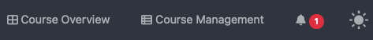
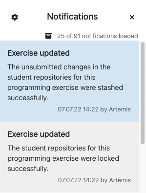
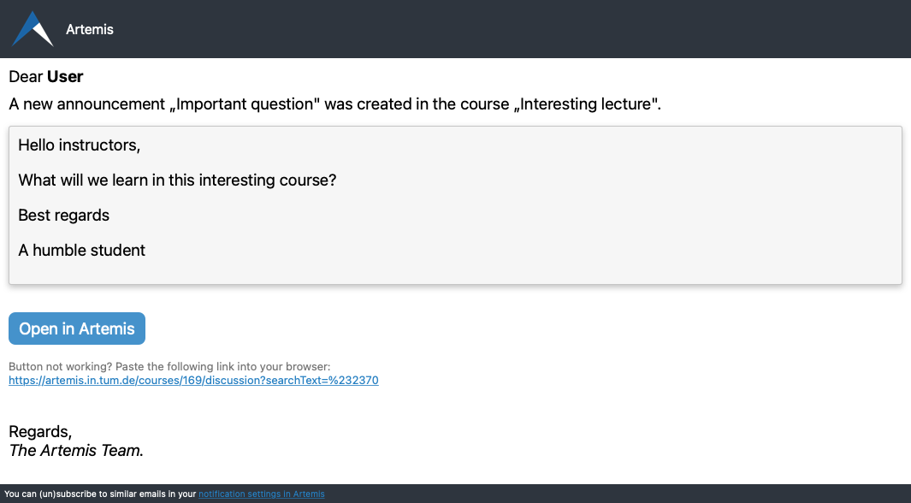
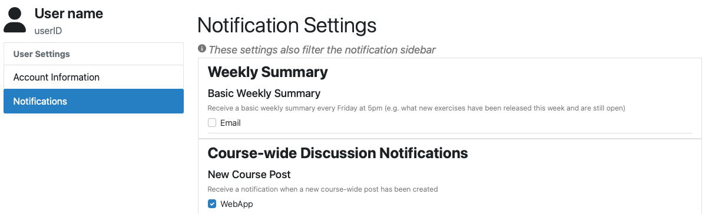

Notifications
=============

.. contents:: Content of this document
    :local:
    :depth: 2

Artemis supports customizable web and email notifications. Users can enable and disable different notification types.

Web Notifications
^^^^^^^^^^^^^^^^^

The web notifications can be found on the top right of the page by clicking on the bell icon.
A red indicator shows the number of new messages.

|notification-top-bar|

|notification-side-bar|

Email Notifications
^^^^^^^^^^^^^^^^^^^

Artemis can also send out emails for certain notification types.
Additionally, Artemis can send out a weekly summary at Friday 5pm.

|notification-email|

Settings
^^^^^^^^

The user can change their preference for different types of notifications and decide if they want to receive emails, web notifications or no notification.
These settings can be found after opening the web notifications. The gear on the top left of the sidebar then leads to the settings.

|notification-settings|

