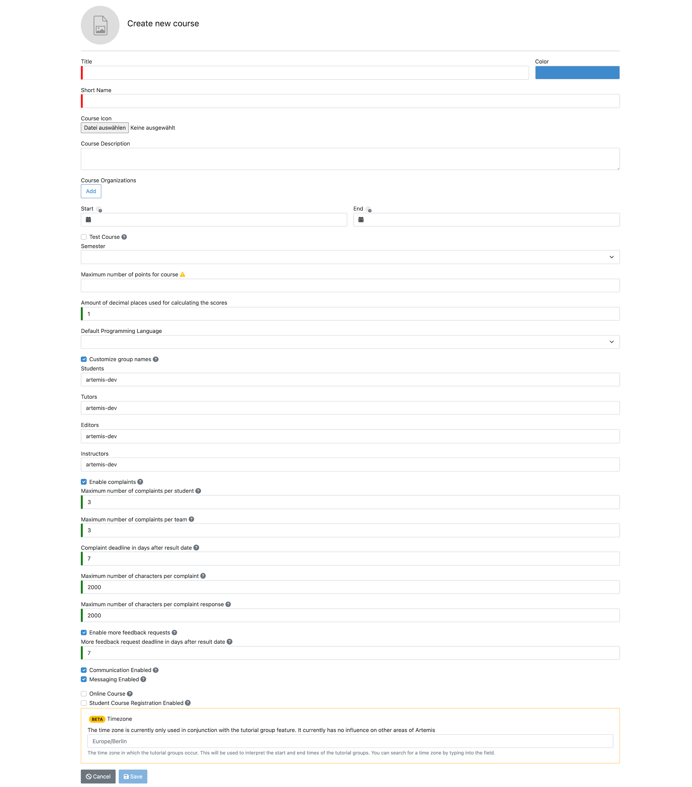
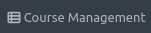

Customizing Courses
===================
.. contents:: Content of this document
    :local:
    :depth: 2

Courses contain `exercises </user/exercises>`_,  `exams </user/exam_mode>`_ and lectures.
Different roles can be attached to different sets of course participants: Instructors, Editors, Tutors and Users.
You can find a detailed listing of the different roles and their corresponding permissions `here </admin/accessRights>`_.

Creating courses
----------------

Administrators can create new courses by clicking on |course_management| in the header and then clicking on |course_create|.

Administrators can then specify options in the creation form, Instructors can later change these values:

- **Title**: Name of the course that is shown to users e.g. in the |course_overview|. Can be changed later.
- **Short Name**: Unique identifier of the course. Can **not** be changed later as it is included in resources of external systems such as build plans.
- **Color**: Color of the course that will be used e.g. in the |course_overview|.
- **Course Description**: Description of the course that will e.g. be shown in the Course Registration table and in the header of the course (once a user clicks on the course in their dashboard).
- **Course Organizations**: Users and Courses can be grouped into different organizations (e.g. based on the email-address of users). Users will then only see courses from their organizations, allowing multiple organizations to use the same Artemis environment without interfering with each other.
  If no course organization is set, all users can interact with the course.
- **Start/End**: Start and End Date of the course. Users can only self-register to a course between the Start and End Date.
- **Test Course**: Whether this course should be used for testing. Upcoming exams and exercises within Test Courses are not displayed to users.
- **Semester**: The semester in which the course is conducted. Courses are grouped by semesters to simplify the search in Artemis environments with a large number of courses.
- **Maximum number of points for course**: This number is used for the grading key calculation. Updating the maximum number will recalculate the grading key, if it has been set up before.
- **Amount of decimal places used for calculating the scores**: Specify the granularity for score calculations. You might have to increase this value if you create exercises with a small number of maximum points and a large number of tests.
- **Default Programming Language**: The programming language that should be preselected when a new programming exercise is created in this course.
- **Customize group names**: Allows specifying custom group names that should be used in external user management systems. Default group names (based on the course short name) will be used if not specified. **Note**: Only administrators can change this setting. Instructors can not change it.
- **Enable complaints**: Whether complaints should be enabled in this course. Details regarding complaints can be found `here </user/exercises/general#complaints>`_.
- **Enable more feedback requests**: Whether more feedback requests should be enabled in this course. Details regarding more feedback requests can be found `here </user/exercises/general#more-feedback-requests>`_.
- **Enable postings by students**: Whether the posting sections should be enabled for lectures and exercises. More details regarding this can be found `here </user/communication>`_.
- **Online Course**: Whether this course should be part of an external online course using the LTI interface (e.g. on edX). This requires additional setup by administrators. **Note:** Online Course and Student Course Registration Enabled are mutually exclusive.
- **Student Course Registration Enabled**: Whether students should be able to register themselves. If enabled, students can register for the course by clicking |course_register| in their |course_overview|. An optional confirmation message can be specified, it will be shown to students during the registration and can be used e.g. to inform students about examination rules. **Note:** Online Course and Student Course Registration Enabled are mutually exclusive.
- **Presentation Score**: Whether students have to hold presentations in this course, e.g. to be eligible for an exam bonus. The required minimum number of presentations can be defined if this option is enabled. Note that you can define for every exercise whether it should be eligible for the presentation score within the exercise settings.

    Course Settings

Managing courses
----------------

After a course has been created, it can be accessed within the |course_management|. Courses are grouped by the semesters (or in the `Semester: Unset` group if no semester is specified). Test Courses are also in a separate group.

.. figure:: customizable/course_overview.png
    :align: center
    :alt: Course Overview

    Course Overview

    Course Header

Clicking on the course header opens the course management and allows to |course_edit| or |course_delete| the course and shows statistics as well as other functionality.

Students, Tutors, Editors and Instructors can be added to the course by clicking on the corresponding group name in the `Course Details`.

    Course Management

.. |course_edit| image:: customizable/buttons/course_edit.png

.. |course_overview| image:: customizable/buttons/course_overview.png
.. |course_register| image:: customizable/buttons/course_register.png
