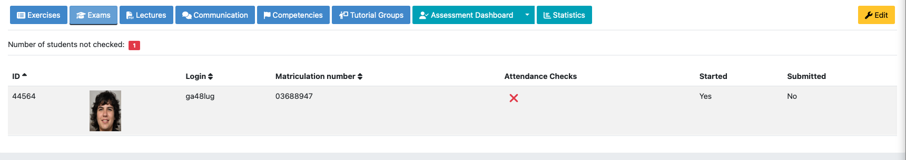
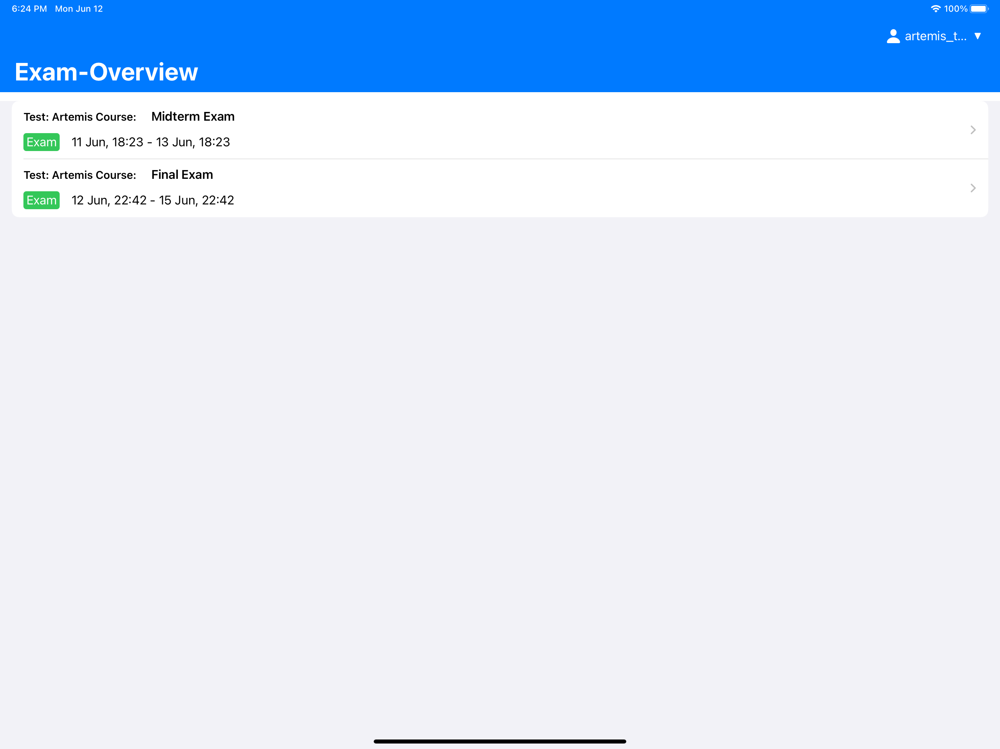
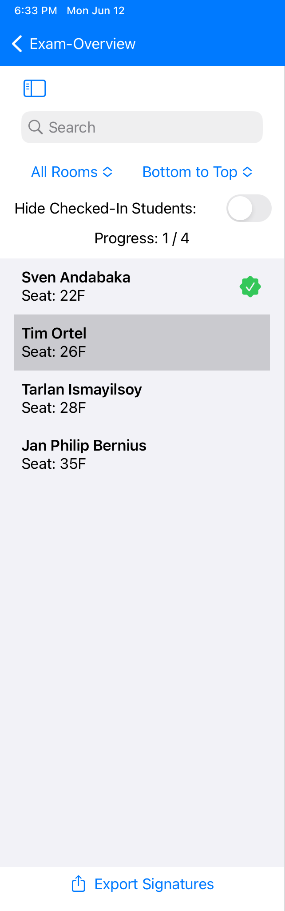
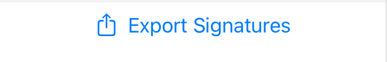
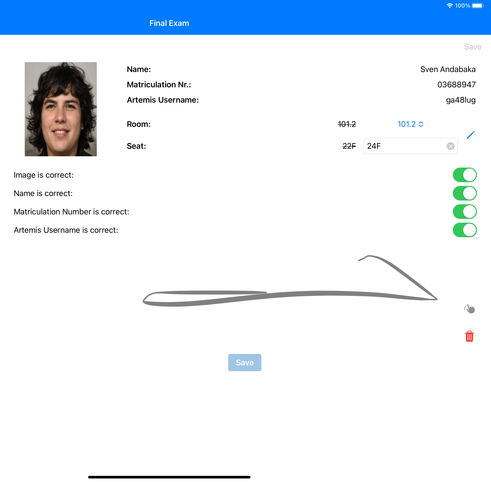

**************************
Exam Participation Checker
**************************

.. _exam_participation_checker:

What is it?
===========
The Artemis Exam Participation Checker iPad application streamlines the process of checking student attendance during on-site exams conducted with the Artemis platform. The application replaces the traditional paper-based method with a digitalized process, making tracking and managing student attendance easier. Using the app allows the exam supervisor to walk around, go to each student and directly control if the part-taking student is logged in with his rightful account by comparing the information on the iPad with the student's browser Artemis information. The application includes features such as student identification, digital signing, and attendance tracking. The Artemis web platform was adapted to additionally support exam management tasks, such as uploading seating arrangements and images for students.

Requirements and Web Functionality
==================================

.. note::
    For information regarding creating the exam, it's exercises and how to register students, please follow the instructions as described in :ref:`exam configuration <exam_creation_and_configuration>`.

Using the Artemis Exam Participation Checker iPad application requires additional setup on the *Students* page before the exam.

1. To upload images, click on the |upload_images| button and provide a ``pdf`` file in the Upload Images dialog. This ``pdf`` file should include a box for each student with its image and two text boxes next to it. The upper text box needs to include the ``registrationNumber``, and the lower text box needs to include the ``login``. An exemplary file can be found here: :download:`pdf <instructor/example_upload_images.pdf>`.
2. Setting up the room and seating information via the ``CSV`` import. For more information, see: :ref:`register students <register_students>`.

.. note::
 Each student must have a matriculation number assigned to upload the images. The matriculation number is needed to match the image with the according student.

.. note::
 Seats and rooms can currently only be assigned via the ``CSV`` import of students by defining the ``seat`` and ``room`` in the ``CSV`` file.

You can also verify the attendance in the web application by pressing the |verify_attendance| button. This button opens a new view that shows which students have started the exam in Artemis but still need to complete the check-in with a teaching assistant.

   Verify Attendance View: One student did not complete the check-in

.. figure:: instructor/verify_attendance_verification_successful.png
   :alt: Verify Attendance View: All students have been successfully checked in
   :align: center

   Verify Attendance View: All students have been successfully checked in

Download App
============
The App is currently only available via TestFlight. It can be downloaded via the following link: https://testflight.apple.com/join/hlwcUa0b

App Usage
=========

1.1 Login
^^^^^^^^^
You can log in to the app with your usual Artemis credentials. Via the 'Select University' button at the bottom, you can select your respective University instance or a custom Artemis instance of your choice.

1.2 Exam Overview
^^^^^^^^^^^^^^^^^
The Exam Overview consists of a list of all currently available exams. The overview only shows exams where the start date is +/- one week from now, and your account has the right to access the exam. Each list cell consists of basic exam information, like the name and the start and end date of the respective exam. A tap on the cell opens up the Student List View.

|exam_overview|

1.3 Student List View
^^^^^^^^^^^^^^^^^^^^^
The sidebar hosts a list of all registered students. The list can easily be filtered by room with a clickable picker or by typing a custom search query into the search bar. Further, already checked-in students can be easily filtered out by the respective toggle. The sorting can be quickly changed from "Bottom to Top" to "Top to Bottom" by a picker. A simple counter shows the progress of the already checked-in students directly above the student list. The student list consists of one cell per student, containing the name and the seat, to enable quick identification of the student. The tutor can quickly switch between different students by clicking the respective cell. Below the list is an 'Export Signatures' button to export all local signatures taken on this device for the selected exam.

|student_list_view|
|student_list_view_export_signatures|

1.4 Student Detail View
^^^^^^^^^^^^^^^^^^^^^^^
The detail view contains all given information about the student. The upper part of the screen displays these information. The left side shows the student image, while the right side of the screen displays all other information. Clicking the small pen icon allows the user to edit the room and seat. In this case, the user can choose between all the available rooms through a picker. The user can change the seat by typing in the respective seat in the text field.

The options below the information section allow the user to verify the information via toggles.

The lower part of the screen is a large canvas that supports signing with the help of the Apple Pencil or simple input with the finger. On the right of the canvas are two small buttons. The upper button, symbolized by a swiping finger icon, enables a better signing experience with the finger when toggled on. The lower button, a trash symbol, deletes the current signing to restart the process. By clicking the save button, the server saves the data. Additionally, the device saves the signing locally, allowing the export, as mentioned above.

|student_detail_view|

