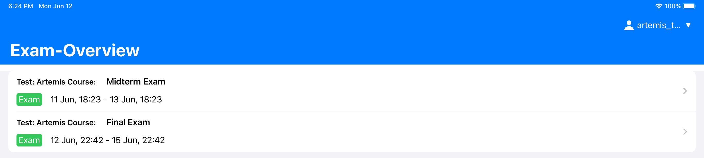
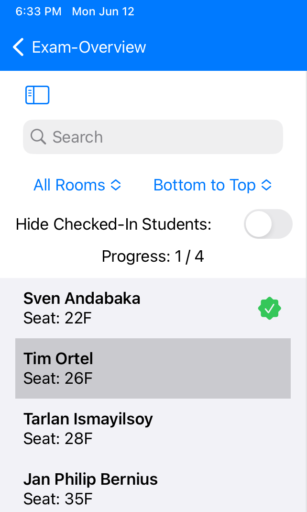
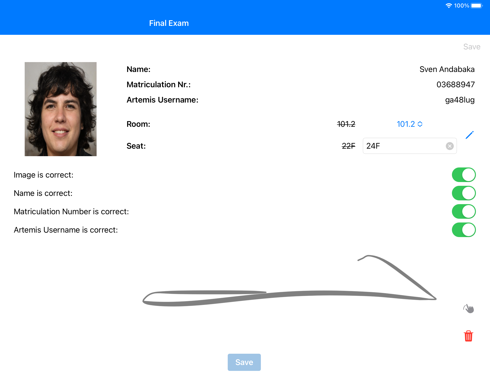

**************************
Exam Participation Checker
**************************

For information regarding creating the exam, it's exercises and register students, please follow the instructions as described in :ref:`exam configuration <exam_creation_and_configuration>`.

.. _exam_participation_checker:

Download
========
The App is currently only available via TestFlight. It can be downloaded via the following link: https://testflight.apple.com/join/hlwcUa0b 

Usage
=====

1.1 Login
^^^^^^^^^
- You can login to the app with your usual Artemis credentials. 
- Via the 'Select University' button at the bottom you select another University instance or a custom Artemis instance of you own choice.

1.2 Exam Overview
^^^^^^^^^^^^^^^^^
- The Exam Overview consists of a list of all currently available exams.
- The overview only shows exams where the start date is +/- one week from now and your account has the correct rights to access the exam.
- Each list cell consists of basic exam information, like the name and the start and end date of the respective exam.
- A tap on the cell opens up the Student Detail View.

|exam_overview|

1.3 Student List View
^^^^^^^^^^^^^^^^^^^^^
- The sidebar hosts a list of all registered students.
- The list can easily be filtered by room with a clickable picker or by typing a custom search query into the search bar. Further, already checked-in students can be easily filtered out by the respective toggle. 
- The sorting can be quickly changed from "Bottom to Top" to "Top to Bottom" by a picker. 
- A simple counter shows the progress of the already checked-in students directly above the student list.
- The student list itself consists of one cell per student, which contains the name and the seat, to enable quick identification of the student. 
- The tutor can quickly switch between different students by clicking the respective cell.
- Below the list is an 'Export Signatures' button to quickly export all local signatures taken on this device for the selected exam.

|student_list_view|

1.4 Student Detail View
^^^^^^^^^^^^^^^^^^^^^
- The detail view contains all the given information about the student. This information is displayed in the upper part of the screen. 
  - The student image is shown on the left side, while all other information is displayed right next to it.
  - Clicking the small pen icon edits the room and seat quickly. In this case, the user can choose between all the available rooms through a picker. The user can change the seat by typing in the respective seat in the text field. 
- Below the information section, a second section starts, where the user can verify that the given information is correct. A toggle quickly does this.
- The lower part of the screen is a large canvas that supports signing with the help of the Apple Pencil or simple input with the finger.
  - On the right of the canvas are two small buttons. The upper button, symbolized by a swiping finger icon, enables a better signing experience with the finger when toggled on. The lower button, a trash symbol, deletes the current signing to restart the process.
- By clicking the save button the data is persisted on the server. Additionally, the signing is persisted locally on the device, which can be exported as mentioned above.

|student_detail_view|

