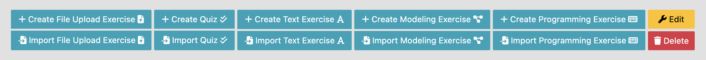
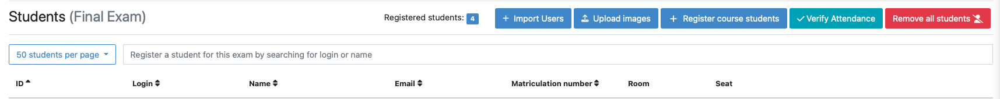

===================
Instructors’ Guide
===================

.. _timeline:

Timeline of an Artemis Online Exam
^^^^^^^^^^^^^^^^^^^^^^^^^^^^^^^^^^

    .. _exam_creation_and_configuration:

- **Exam Creation and Configuration**
    During the exam creation and configuration, you can create your exam and configure it to fit your needs. Add exercises with different variants, register students, generate student exams. For more information see `Create and Configure Exam`_.

    .. _exam_conduction:

- **Exam Conduction**
    The exam conduction starts when the exam becomes visible to the students and ends when the latest working time is over. When the exam conduction begins, you cannot make any changes anymore to the exam configuration or individual student exams. 

    .. _exam_assessment:

- **Exam Assessment**
    The assessment begins as soon as the latest student exam working time is over. During this period, your team can assess the submissions of the students and provide results. The testing suites for programming exercises are executed and you can evaluate the quiz exercises automatically, see `Assess Student Exams and Complaints`_. The exam assessment ends when the results are published, see `Create and Configure Exam`_.

    .. _student_review:

- **Student Review**
    The student review period can be set in the exam configuration, see `Create and Configure Exam`_. During the review period, students have the oppertunity to submit complaints about perceived mistakes made in the assessment. A second assessor, other than the original one can review the complaint and respond to it. The results are then updated automatically. 

Accessing the Exam Management Page
^^^^^^^^^^^^^^^^^^^^^^^^^^^^^^^^^^
- Log in to Artemis with your account credentials.
- Head to ``Course Management``.
- Click on ``Exams`` for your course. It will open the *Exam Management Screen*.

    - Here you have access to all the exams of your course. All aspects of the exam are managed from the management screen. 

- You can create an exam by clicking on ``Create new Exam``. 

Create and Configure Exam
^^^^^^^^^^^^^^^^^^^^^^^^^
- When you click on ``create an exam`` you are presented with the *Create Exam* view. Here you can set the basic information such as ``title``, ``examiner`` etc. The :ref:`timeline of the exam <timeline>` is defined by the dates: ``visible from``, ``start of working time``, ``end of working time``, ``release date of results``, ``begin of student review``, ``end of student review``. 
- The first three dates are mandatory when you create an exam. The rest can be set when required. 
- The ``grace period`` defines the amount of time the students have at their disposal to hand in their exam after the ``working time`` is over. This is set to 3 minutes by default. 
- You can also define the ``number of exercises`` in the exam. You can leave this out initally, however it must be set before you can generate the student exams. For more information, see `Exercise Groups`_. 
- If you activate ``randomize order of exercise groups``, the order of the exercises will be random for each student. 
- Finally, you can fill out the ``exam start-`` and ``end texts``. These will be displayed during the :ref:`exam conduction <exam_conduction>` to the students, at the *Start-* and *End* page respectively.

.. figure:: instructor/exam_configuration.png
   :alt: Create and Configure
   :align: center

   Create and Configure the Exam

Exercise Groups
^^^^^^^^^^^^^^^
- Artemis exam mode allows you to define multiple exercise variants so that each student can receive a unique exam. This is done through the exercise groups. Exercise groups represent an individual exercise slot for each student exam. Within one exercise group you can define different exercises. 
- Artemis selects one exercise per exercise group randomly to generate the individual student exams. 
- You can distinguish between ``mandatory`` exercise groups and ``non-mandatory`` exercise groups. By default, every exercise group is mandatory. You can set the ``mandetory`` flag when you add a exercise group initially, or later by clicking ``edit`` on the exercise group.

.. figure:: instructor/exercise_variants.png
   :alt: Exercise Groups with different Exercise Variants
   :align: center

   Exercise Groups with different Exercise Variants

Add Exercises
^^^^^^^^^^^^^
- Exercises are grouped by exercise groups. For every student exam, one exercise per exercise group will be chosen, see `Exercise Groups`_. 

     - **Hint:** If you want all student to have the same exam, define only one exercise per exercise group.

- To add exercises navigate to the *Exercise Groups* of the exam. On the header of each exercise group you will find the available exercise types. You can choose between ``creating a new exercise`` or ``importing an existing one`` from your courses. 

    - **Hint:** For programming exercises you can check the option to ``allow manual assessment``. If you do not set this flag, your assessors will not be able to manually assess the student's submissions during the :ref:`assessment process <exam_assessment>`.

- For exercise types ``text``, ``programming``, and ``modeling``, you can also define example submissions and example assessments to guide your assessor team.

   Add different Exercises

Registering Students
^^^^^^^^^^^^^^^^^^^^
- To register students to the exam, navigate from the exam management to the *Students* page. Here you are presented with two options to register students. You can: 

    1. Add students manually my searching via the search bar
    2. Bulk import students using a ``.csv`` file. You can do this by pressing the ``Import students`` button.

- You can also remove students from the exam. When you do so, you have the option to also delete their participations and submissions linked to the user’s student exam. 
    
    - **Hint:** Just registering the students to the exam will not allow them to participate in the exam. First, individual student exams must be generated. For more information see `Manage Student Exams`_.

   Register Students Page

Manage Student Exams
^^^^^^^^^^^^^^^^^^^^
-  The student exams are managed via the *Student Exams* page. 
- Here you can have an overview of all student exams. When you press ``View`` on a student exam, you can view the ``details of the student``, the allocated ``working time``, his/her ``participation status``, their ``summary`` as well as their ``scores``. Additionally, you will also be able to view which assessor is responsible for each exercise. 

    - **Hint:** You can change the individual ``working time`` of students from here. 

- To generate the student exams, you must click on ``Generate individual exams``. This will automatically create a student exam for every registered user. The number of exercises will be determined by the flag set in the exam configuration, see `Create and Configure Exam`_. The exercises itself will be randomly selected from the available exercise variants per exercise group, see `Exercise Groups`_.
- The ``Generate individual exams`` button will be locked once the exam becomes visible to the students. You cannot perform changes to the student exams once the :ref:`exam conduction <exam_conduction>` has started. 
- If you have added more students recently, you can choose to ``Generate missing individual exams``. 
- ``Prepare exercise start`` creates a participation for each exercise for every registered user, based on their assigned exercises. It also creates the individual repositories and build plans for programming exercises. This action can take a while if there are many registered students due to the communication between the VC and CI server. 

    - **Warning:** ``Prepare exercise start`` must be executed before the :ref:`exam conduction <exam_conduction>` begins. 

- On the *Student Exams* page, you can also maintain the repositories of the student exams. You can choose to ``lock the repositories`` and ``unlock`` them.
- Additionally, once the :ref:`exam conduction <exam_conduction>` is over, you can click on ``Evaluate quizzes``. This action will evaluate all student exam submissions for all quiz exercises and assign an automatic result. 

   - **Hint:** If you do not press this button, the students quiz exercise will not be graded.

.. figure:: instructor/student_exams.png
   :alt: Student Exam Page
   :align: center

   Student Exam Page

Assess Student Exams and Complaints
^^^^^^^^^^^^^^^^^^^^^^^^^^^^^^^^^^^
- Once the :ref:`exam conduction <exam_conduction>` is over and the latest individual ``working time`` has passed, your team can begin the :ref:`assessment <exam_assessment>` process. 
- This is done through the *Tutor Exam Dashboard*. 

    - **Hint:** If the :ref:`exam conduction <exam_conduction>` is not over, you will not be able to access this page.

- The :ref:`assessment <exam_assessment>` process is anonymised. All student information will not be displayed to the assessors.
- The ´*Tutor Exam dashboard* provides an overview over the current assessment progress per exercise. For each exercise, you can view how many submissions have already been assessed and how many are still left. The status of the student complaints is also displayed here. 

    - **Hint:** To check for plagiarism, you must navigate to the individual exercise. This can be done by navigating to:

     *Exam Management* -> *Exercise Groups* -> *View* on the specific exercise.

     At the bottom of the page you will find the option ``check for plagiarism``.

.. figure:: instructor/tutor_dashboard.png
   :alt: Tutor Exam Dashboard
   :align: center

   Tutor Exam Dashboard

- To assess a submission for an exercise, you can click on ``Exercise Dashboard``.
- First you must go through the example submissions and assessments to review how a specific exercise should be evaluated. 
- If there is a submission which has not been assessed yet, you can click ``Start new assessment``. This will fetch a random student submission of this exercise which you can then assess.
- Programming exercises are graded automatically but if ``manual assessment`` is allowed, see `Add Exercises`_, you can review and enhance the automatic results. 

.. figure:: instructor/programming_assessment.png
   :alt: Programming Submission Assessment
   :align: center

   Manually Assessing a Programming Submission

- Quiz exercises are graded automatically via the student exam page, see `Manage Student Exams`_, and therefore do not appear in the *Tutor Exam Dashboard*.
- Students can complain about their results during the :ref:`student review <student_review>` period. You can evaluate these complaints also in the *Tutor Exam Dashboard*. 
- The original assessor may not respond to the complaint about his assessment, this must be done by a second assessor. 

Exam Scores
^^^^^^^^^^^
- You can view the exam scores from the *Scores* page. This view aggregates the results of the students and combines them to provide an overview over the students’ performance. 
- You can view the spread between different achieved scores, the average results per exercise as well as the individual students' results.
- Additionally, you can choose to modify the dataset by selecting ``only include submitted exams`` or ``only include exercises with at least one non-empty submission``.
- The exam scores can also be exported via ``Export Results as CSV``.

.. figure:: instructor/exam_statistics.png
   :alt: Exam Scores page
   :align: center

   Exam Scores Page

Conducting Test Runs
^^^^^^^^^^^^^^^^^^^^
- Test runs are designed to offer the instructors confidence that the :ref:`exam conduction <exam_conduction>` will run smoothly. They allow you to experience the exam from the student’s perspective. A ``test run`` is distinct from a ``student exam`` and is not taken into consideration during the calculation of the exam scores. 
- You can manage your test runs from the *Test Run* page.
- To create a new test run you can press ``Create a Test Run``. This will open a modal where you can select an exercise for each exercise group. You can also set the ``working time``. A test run will have as many exercises, as there are exercise groups. It does not take the ``number of exercises`` set in the exam configuration under consideration.

    - **Hint:** Exercise groups with no exercises are ignored.

- When you start the test run, you conduct the exam similar to how a student would. You can create submissions for the different exercises and end the test run. 
- An instructor can also assess his test run submissions. To do this, you must have completed at least one test run. To navigate to the assessment screen of the test runs click ``Assess your Test Runs``. 

    - **Hint:** Only the creator of the test run is able to assess his submissions.

- You can view the results of the assessment of the test run by clicking on ``Summary``. This page simulates the *Student Exam Summary* where the students can view their submissions and the results once they are published. 
- Here instructors can also use the ``complaint`` feature and respond to it to conclude the full  :ref:`exam timeline <timeline>`.