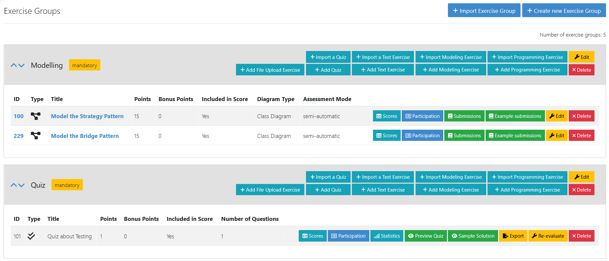
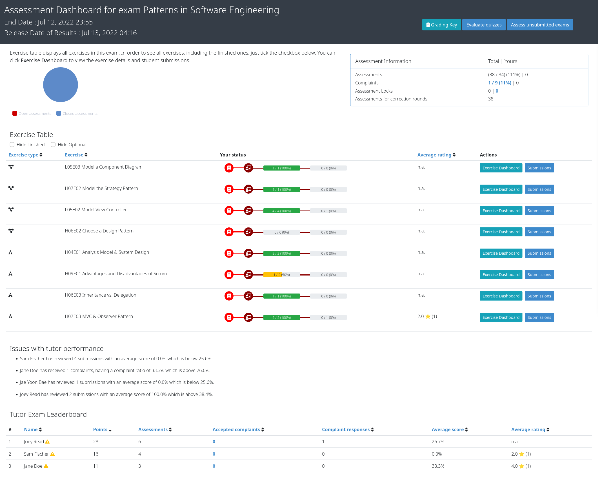

******************
Instructors’ Guide
******************

    .. _timeline:

Timeline of an Artemis Online Exam
==================================

.. figure:: instructor/timeline.png
   :alt: Timeline of an Artemis Exam
   :align: center

   Timeline of an Artemis Online Exam

    .. _exam_creation_and_configuration:

1. **Creation and Configuration**
---------------------------------
During the exam creation and configuration, you can create your exam and configure it to fit your needs. Add exercises with different variants, register students, generate :ref:`student exams <student_exams>` and conduct test runs. For more information see `1.2 Create and Configure Exam`_.

1.1 Accessing the Exam Management Page
^^^^^^^^^^^^^^^^^^^^^^^^^^^^^^^^^^^^^^
- Log in to Artemis with your account credentials.
- Head to ``Course Management``.
- Click on ``Exams`` for your course. It will open the *Exam Management Screen*.

    - Here you have access to all the exams of your course. All aspects of the exam are managed from the management screen. 

- You can create an exam by clicking on ``Create new Exam``. 

1.2 Create and Configure Exam
^^^^^^^^^^^^^^^^^^^^^^^^^^^^^
- When you click on ``create an exam`` you are presented with the *Create Exam* view. Here you can set the basic information such as ``title``, ``examiner`` etc. The :ref:`timeline of the exam <timeline>` is defined by the dates: ``visible from``, ``start of working time``, ``end of working time``, ``release date of results``, ``begin of student review``, ``end of student review``. 
- The first three dates are mandatory when you create an exam. The rest can be set when required. 
- The ``grace period`` defines the amount of time the students have at their disposal to hand in their exam after the ``working time`` is over. This is set to 3 minutes by default. 
- You can also define the ``number of exercises`` in the exam. You can leave this out initally, however it must be set before you can generate the :ref:`student exams <student_exams>`. For more information, see `1.3 Exercise Groups`_. 
- Artemis will randomize the order of the exercises for each student if you you activate ``randomize order of exercise groups``.
- Finally, you can fill out the exam ``start text`` and ``end text``. Artemis will present these texts to the students during the :ref:`exam conduction <exam_conduction>`, at the *Start-* and *End* page respectively.

.. figure:: instructor/exam_configuration.png
   :alt: Create and Configure
   :align: center

   Create and Configure the Exam

    .. _exercise_groups:

1.3 Exercise Groups
^^^^^^^^^^^^^^^^^^^
- Artemis exam mode allows you to define multiple exercise variants so that each student can receive a unique exam. Artemis achieves this through exercise groups. Exercise groups represent an individual exercise slot for each :ref:`student exam <student_exams>`. Within one exercise group you can define different exercises. 
- Artemis selects one exercise per exercise group randomly, to generate the individual :ref:`student exams <student_exams>`. 
- You can distinguish between ``mandatory`` exercise groups and ``non-mandatory`` exercise groups. 
- Artemis always includes ``mandatory`` exercise groups in the individual exam of a student. 
- ``non-mandatory`` exercise groups can be left out, if there are more exercise groups than the ``number of exercises`` defined in the :ref:`exam configuration <exam_creation_and_configuration>`.
- By default, every exercise group is mandatory. You can set the ``mandetory`` flag when you add a exercise group initially, or later by clicking ``edit`` on the exercise group.

   Exercise Groups with different Exercise Variants

1.4 Add Exercises
^^^^^^^^^^^^^^^^^
- Exercise groups can contain multiple exercises. For every :ref:`student exam <student_exams>`, Artemis will randomly pick one exercise per :ref:`exercise group <exercise_groups>`. 

    .. note::
        If you want all student to have the same exam, define only one exercise per :ref:`exercise group <exercise_groups>`.

- To add exercises navigate to the *Exercise Groups* of the exam. On the header of each :ref:`exercise group <exercise_groups>` you will find the available exercise types. You can choose between ``creating a new exercise`` or ``importing an existing one`` from your courses. 

.. figure:: instructor/add_exercises.png
   :alt: Add different Exercises
   :align: center

   Add different Exercises

.. _manual_assessment:

- For programming exercises you can check the option to ``allow manual assessment``. 

    .. note::
        If you do not set this flag, your assessors will not be able to manually assess the student's submissions during the :ref:`assessment process <exam_assessment>`.

- For exercise types ``text``, ``programming``, and ``modeling``, you can also define example submissions and example assessments to guide your assessor team.
- Assessors will review the example submissions and assessments in order to familiarise themselves with the exercise and assessment instructions, before they can assess the real submissions.

1.5 Register Students
^^^^^^^^^^^^^^^^^^^^^
- To register students to the exam, navigate from the exam management to the *Students* page. Artemis offers two options to register students. You can: 

    1. Add students manually my searching via the search bar.
    2. Bulk import students using a ``CSV`` file. You can do this by pressing the ``Import students`` button.

    .. note::    
        Just registering the students to the exam will not allow them to participate in the exam. First, individual :ref:`student exams <student_exams>` must be generated.

- You can also remove students from the exam. When you do so, you have the option to also delete their participations and submissions linked to the user’s :ref:`student exam <student_exams>`. 

    

.. figure:: instructor/add_students.png
   :alt: Register Students
   :align: center

   Register Students Page

.. _student_exams:

1.6 Manage Student Exams
^^^^^^^^^^^^^^^^^^^^^^^^
- Student exams represent the exam of a student. It consists of an individual set of exercises based on the configured :ref:`exercise groups <exercise_groups>`.
- Student exams are managed via the *Student Exams* page. 
- Here you can have an overview of all student exams. When you press ``View`` on a student exam, you can view the ``details of the student``, the allocated ``working time``, his/her ``participation status``, their ``summary`` as well as their ``scores``. Additionally, you will also be able to view which assessor is responsible for each exercise. 

    .. note::
        You can change the individual working time of students from here. 

- To generate student exams, you must click on ``Generate individual exams``. This will trigger Artemis to create a student exam for every registered user. 
- Artemis determines the number of exercises from the :ref:`exam configuration <exam_creation_and_configuration>` and randomly selects one exercise per :ref:`exercise group <exercise_groups>`.

    .. note::
        The ``Generate individual exams`` button will be locked once the exam becomes visible to the students. You cannot perform changes to student exams once the :ref:`exam conduction <exam_conduction>` has started. 

- If you have added more students recently, you can choose to ``Generate missing individual exams``. 
- ``Prepare exercise start`` creates a participation for each exercise for every registered user, based on their assigned exercises. It also creates the individual repositories and build plans for programming exercises. This action can take a while if there are many registered students due to the communication between the VC and CI server. 

    .. warning::
        You must execute ``Prepare exercise start`` before the :ref:`exam conduction <exam_conduction>` begins. 

- On the *Student Exams* page, you can also maintain the repositories of student exams. This functionality only affects programming exercises. You can choose to ``lock`` and ``unlock`` all student repositories.

    .. note::
        Artemis locks and unlocks the student repositories automatically based on the individual exam start and end date. These buttons are typically not necessary unless something went wrong.

.. _evaluate_quiz_exercises:

- Additionally, once the :ref:`exam conduction <exam_conduction>` ends, you can click on ``Evaluate quizzes``. This action will evaluate all student exam submissions for all quiz exercises and assign an automatic result. 

    .. note::
       If you do not press this button, the students quiz exercises will not be graded.

.. figure:: instructor/student_exams.png
   :alt: Student Exam Page
   :align: center

   Student Exam Page

1.7 Conducting Test Runs
^^^^^^^^^^^^^^^^^^^^^^^^

.. figure:: instructor/test_run_management.png
   :alt: Delete Test Run
   :align: center

   Test Run Management 

- Test runs are designed to offer the instructors confidence that the :ref:`exam conduction <exam_conduction>` will run smoothly. They allow you to experience the exam from the student’s perspective. A test run is distinct from a :ref:`student exam <student_exams>` and is not taken into consideration during the calculation of the exam scores. 
- You can manage your test runs from the *Test Run* page.
- To create a new test run you can press ``Create a Test Run``. This will open a modal where you can select an exercise for each :ref:`exercise group <exercise_groups>`. You can also set the ``working time``. A test run will have as many exercises, as there are :ref:`exercise groups <exercise_groups>`. It does not take the ``number of exercises`` set in the exam configuration under consideration.

    .. note::
        Exercise groups with no exercises are ignored.

.. figure:: instructor/create_test_run.png
   :alt: Create Test Run
   :align: center

   Create test run modal with one exercise variant selected for each exercise group.

- When you start the test run, you conduct the exam similar to how a student would. You can create submissions for the different exercises and end the test run. 
- An instructor can also assess his test run submissions. To do this, you must have completed at least one test run. To navigate to the assessment screen of the test runs click ``Assess your Test Runs``. 

.. figure:: instructor/test_run_conduction.png
   :alt: Conduct Test Run
   :align: center

   Test run conduction marked with the banner on the top left. 

    .. note::
        Only the creator of the test run is able to assess his submissions.

- You can view the results of the assessment of the test run by clicking on ``Summary``. This page simulates the *Student Exam Summary* where the students can view their submissions and the results once they are published. 
- Here instructors can also use the ``complaint`` feature and respond to it to conclude the full  :ref:`exam timeline <timeline>`. 

.. note::
        You should delete test runs before the actual exam conduction takes place.

.. _exam_conduction:

2. **Conduction**
-----------------
The exam conduction starts when the exam becomes visible to the students and ends when the latest working time is over. When the exam conduction begins, you cannot make any changes anymore to the exam configuration or individual :ref:`student exams <student_exams>`.

    .. _exam_assessment:

3. **Assessment**
-----------------
The assessment begins as soon as the latest :ref:`student exam <student_exams>` working time is over. During this period, your team can assess the submissions of the students and provide results. Artemis executes the test suites for programming exercises automatically and grades these. You can enhance the automatic grading with a :ref:`manual review <manual_assessment>`. You can also trigger the :ref:`automatic grading of the quiz exercises <evaluate_quiz_exercises>` via the *Manage Student Exams Screen*.

3.1 Assess Student Exams
^^^^^^^^^^^^^^^^^^^^^^^^
- Once the :ref:`exam conduction <exam_conduction>` is over and the latest individual working time has passed, your team can begin the :ref:`assessment <exam_assessment>` process. 
- This is done through the *Assessment Dashboard*. 

    .. note::
        If the :ref:`exam conduction <exam_conduction>` is not over, you will not be able to access this page.

- The :ref:`assessment <exam_assessment>` process is anonymised. Artemis omits personal student data from the assessors.
- The *Assessment Dashboard* provides an overview over the current assessment progress per exercise. For each exercise, you can view how many submissions have already been assessed and how many are still left. The status of the student complaints is also displayed here. 

   Assessment Dashboard

- To assess a submission for an exercise, you can click on ``Exercise Dashboard``.
- Your assessors must first complete the example submissions and assessments, if you have attached those to the exercise, see `1.4 Add Exercises`_. 
- If there is a submission which has not been assessed yet, you can click ``Start new assessment``. This will fetch a random student submission of this exercise which you can then assess.
- Artemis grades programming exercises automatically. However if :ref:`manual assessment <manual_assessment>` is allowed, you can review and enhance the automatic results. 
- You can trigger Artemis to :ref:`automatically grade quiz exercises <evaluate_quiz_exercises>` via the *Manage Student Exams Screen*. Therefore, quiz exercises do not appear in the *Assessment Dashboard*. 

.. figure:: instructor/programming_assessment.png
   :alt: Programming Submission Assessment
   :align: center

   Manually Assessing a Programming Submission

- Artemis also allows you to detect plagiarism attempts. 
- Artemis conducts this by analyzing the similarities between all student submissions and flagging those which exceed a given threshold. You can compare all flagged submissions side by side and confirm plagiarism attempts.
- Instructors can download a ``CSV`` report of accepted and rejected plagiarism attempts for further processing on external systems.
- To apply the plagiarism check, you must navigate to the individual exercise. This can be done by navigating to:

     *Exam Management* -> *Exercise Groups* -> *View* on the specific exercise.

.. figure:: instructor/plagiarism.png
   :alt: Plagiarism Editor
   :align: center

   Detecting Plagiarism attempts on Modeling Exercises

- At the bottom of the page you will find the option ``check for plagiarism``.

4. **Publication of Results**
-----------------------------

You can specify the moment when Artemis publishes the results of the exam, see `1.2 Create and Configure Exam`_. This is usually when the :ref:`exam assessment <exam_assessment>` ends, but you can specify this at any point in time. During the publication of the results, the student can view their results from their summary page. You can also view the exam statistics from the exam *Scores* page and export the data into external platforms such as `TUM Online <https://campus.tum.de>`_ as a ``CSV`` file, see `4.1 Exam Scores`_.

4.1 Exam Scores
^^^^^^^^^^^^^^^
- You can view the exam scores from the *Scores* page. This view aggregates the results of the students and combines them to provide an overview over the students’ performance. 
- You can view the spread between different achieved scores, the average results per exercise as well as the individual students' results.
- Additionally, you can choose to modify the dataset by selecting ``only include submitted exams`` or ``only include exercises with at least one non-empty submission``.

.. note::
        Unsubmitted exams are not eligable for the assessment process.

- By eliminating unsubmitted exams and exercises which were not part of the exam conduction, see `1.3 Exercise Groups`_, you can gain a more realistic overview of the performance of the students.
- The exam scores can also be exported via ``Export Results as CSV``. This is useful to upload the results into university systems such as `TUM Online <https://campus.tum.de>`_ as a ``CSV`` file, see `4.1 Exam Scores`_.

- The exported ``CSV`` file includes the ``students name``, ``username``, ``email``, ``registration number``, their assigned ``exercises`` as well as their ``score`` for every exercise. 
- The exported ``CSV`` file also contains the aggregated statistics of the exam conduction such as the ``number of participations`` and the ``average score`` per exercise. 

.. figure:: instructor/exam_statistics.png
   :alt: Exam Scores page
   :align: center

   Exam Scores Page

    .. _student_review:

5. **Student Review**
---------------------
You can set the the student review period in the exam configuration, see `1.2 Create and Configure Exam`_. During the review period, students have the opportunity to review the assessment of their exam. If they find inconsistencies, they can submit complaints about perceived mistakes made in the :ref:`assessment <exam_assessment>`.

    .. _complaint_assessment:

6. **Complaint Assessment**
---------------------------
During the complaint assessment, your assessors can review the complaints made by the students in the :ref:`student review <student_review>`. A second assessor must review the complaint and respond to it. You can access the complaints from the *Assessment Dashboard*. Artemis updates the results automatically when changes occur. After the complaint assessment, you can view the updated exam scores in the *Scores* page. There you can also export the data in ``CSV`` format, see `4.1 Exam Scores`_. 