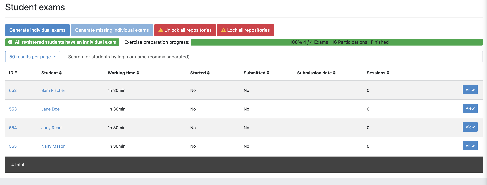
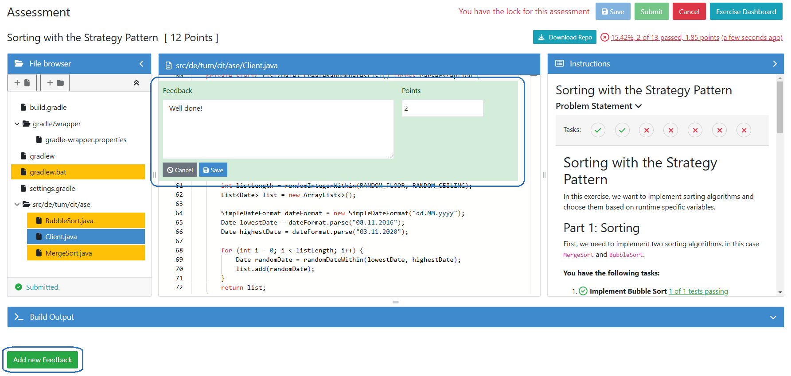
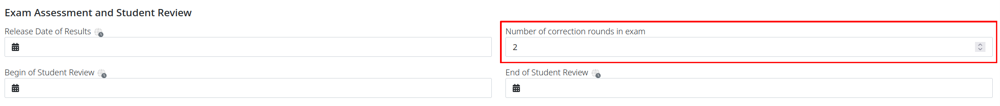
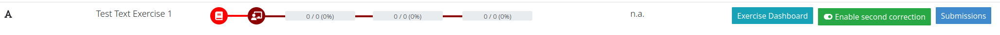
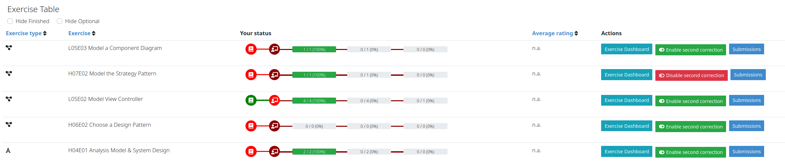
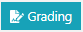

******************
Instructors’ Guide
******************

.. contents:: Content of this document
    :local:
    :depth: 2

|

Timeline of an Artemis Online Exam
==================================
.. _timeline:

.. figure:: instructor/timeline.png
   :alt: Timeline of an Artemis Exam
   :align: center

   Timeline of an Artemis Online Exam

    .. _exam_creation_and_configuration:

1. **Creation and Configuration**
---------------------------------
During the exam creation and configuration, you can create your exam and configure it to fit your needs. Add exercises with different variants, register students, generate :ref:`student exams <student_exams>` and conduct test runs. For more information see `1.2 Create and Configure Exam`_.

1.1 Accessing the Exam Management Page
^^^^^^^^^^^^^^^^^^^^^^^^^^^^^^^^^^^^^^
- Log in to Artemis with your account credentials.
- Click on |course_management|.

- Click on |exams| for your course. It will open the *Exam Management Screen*.

- Here you have access to all the exams of your course. All aspects of the exam are managed from the management screen.

- You can create an exam by clicking on |create_new_exam|.

1.2 Create and Configure Exam
^^^^^^^^^^^^^^^^^^^^^^^^^^^^^
- When you click on |create_new_exam| you are presented with the *Create Exam* view. Here you can set the basic information such as ``title``, ``examiner`` etc. The :ref:`timeline of the exam <timeline>` is defined by the dates: ``visible from``, ``start of working time``, ``end of working time``, ``release date of results``, ``begin of student review``, ``end of student review``.
- The first three dates are mandatory when you create an exam. The rest can be set when required.
- The ``grace period`` defines the amount of time the students have at their disposal to hand in their exam after the ``working time`` is over. This is set to 3 minutes by default.
- _`Before the exam's assessment` you can choose the ``Number of correction rounds in exam``. If you want two tutors to assess a student's exam subsequently, set the number to two here. This enables the :ref:`second correction <second_correction_explanation>`.
- You can also define the ``number of exercises`` in the exam. You can leave this out initially, however it must be set before you can generate the :ref:`student exams <student_exams>`. For more information, see `1.3 Exercise Groups`_.
- Artemis will randomize the order of the exercises for each student if you activate ``randomize order of exercise groups``.
- Finally, you can fill out the exam ``start text`` and ``end text``. Artemis will present these texts to the students during the :ref:`exam conduction <exam_conduction>`, at the *Start-* and *End* page respectively.

.. figure:: instructor/exam_configuration.png
   :alt: Create and Configure
   :align: center

   Create and Configure the Exam

   Exam Conduction

   Exam Exercises

   Exam Assessment and Student Review

    .. _exercise_groups:

1.3 Exercise Groups
^^^^^^^^^^^^^^^^^^^
- Artemis exam mode allows you to define multiple exercise variants so that each student can receive a unique exam. Artemis achieves this through exercise groups. Exercise groups represent an individual exercise slot for each :ref:`student exam <student_exams>`. Within one exercise group you can define different exercises.
- Artemis selects one exercise per exercise group randomly, to generate the individual :ref:`student exams <student_exams>`.
- You can distinguish between mandatory exercise groups and non-mandatory exercise groups.
- Artemis always includes mandatory exercise groups in the individual exam of a student.
- Non-mandatory exercise groups can be left out, if there are more exercise groups than the ``number of exercises`` defined in the :ref:`exam configuration <exam_creation_and_configuration>`.
- By default, every exercise group is mandatory. You can set the ``mandatory`` flag when you add an exercise group initially, or later by clicking |edit| on the exercise group.

.. figure:: instructor/exercise_variants.png
   :alt: Exercise Groups with different Exercise Variants
   :align: center

   Exercise Groups with different Exercise Variants

1.4 Add Exercises
^^^^^^^^^^^^^^^^^
- Exercise groups can contain multiple exercises. For every :ref:`student exam <student_exams>`, Artemis will randomly select one exercise per :ref:`exercise group <exercise_groups>`.

.. note::
    If you want all student to have the same exam, define only one exercise per :ref:`exercise group <exercise_groups>`.

- To add exercises navigate to the *Exercise Groups* of the exam. On the header of each :ref:`exercise group <exercise_groups>` you will find the available exercise types. You can choose between ``creating a new exercise`` or ``importing an existing one`` from your courses.

.. figure:: instructor/add_exercises.png
   :alt: Add different Exercises
   :align: center

   Add different Exercises

- For exercise types ``text`` and ``modeling`` you can also define example submissions and example assessments to guide your assessor team.
- Assessors will review the example submissions and assessments in order to familiarise themselves with the exercise and assessment instructions, before they can assess the real submissions.

**1.4.1 Programming Exercises**

- Programming exercises have multiple special options to adjust their behaviour:

.. _manual_assessment:

    - You can check the option to ``allow manual assessment``.

    .. note::
        If you do not set this flag, your assessors will not be able to manually assess the student's submissions during the :ref:`assessment process <exam_assessment>`.

    - You can activate ``Run Tests once after Due Date``. This will compile and run the test suite on all the student submissions once after the set date.
    - After you add a programming exercise you can configure the grading via |configure_grading_button|.

    - In the *Configure Grading* screen, you can tweak the ``weight`` of the tests, the ``bonus multiplier`` and add ``bonus points``.
    - You can hide tests so that they are not executed during the exam conduction. Students can not receive feedback from hidden tests during the exam conduction.

    .. note::
        If you hide all tests, the students will only be able to see if their submission compiles during the conduction. Set the ``Run Tests once after Due Date`` after the
        exam end date to achieve this effect.

    .. figure:: instructor/configure_grading.png
        :alt: Configure Grading
        :align: center

        Configure the Grading of a Programming Exercise

1.5 Register Students
^^^^^^^^^^^^^^^^^^^^^
- To register students to the exam, navigate from the exam management to the *Students* page. Artemis offers two options to register students. You can:

    1. Add students manually by searching via the search bar.
    2. Bulk import students using a ``CSV`` file. You can do this by pressing the |import_students| button.
    3. Register every student in the course. You can do this by pressing the |register_course_students| button.

.. note::
    Just registering the students to the exam will not allow them to participate in the exam. First, individual :ref:`student exams <student_exams>` must be generated.

- You can also remove students from the exam. When you do so, you have the option to also delete their participations and submissions linked to the user’s :ref:`student exam <student_exams>`.

.. figure:: instructor/add_students.png
   :alt: Register Students
   :align: center

   Register Students Page

.. _student_exams:

1.6 Manage Student Exams
^^^^^^^^^^^^^^^^^^^^^^^^
- Student exams represent the exam of a student. It consists of an individual set of exercises based on the configured :ref:`exercise groups <exercise_groups>`.
- Student exams are managed via the *Student Exams* page.
- Here you can have an overview of all student exams. When you press ``View`` on a student exam, you can view the ``details of the student``, the allocated ``working time``, their ``participation status``, their ``summary``, as well as their ``scores``. Additionally, you will also be able to view which assessor is responsible for each exercise.

.. note::
    You can change the individual working time of students from here. The screenshot *Individual Working Time* below shows where you can do that.

- To generate student exams you must click on |generate_individual_exams|. This will trigger Artemis to create a student exam for every registered user.
- Artemis determines the number of exercises from the :ref:`exam configuration <exam_creation_and_configuration>` and randomly selects one exercise per :ref:`exercise group <exercise_groups>`.

.. note::
    |generate_individual_exams| button will be locked once the exam becomes visible to the students. You cannot perform changes to student exams once the :ref:`exam conduction <exam_conduction>` has started.

- If you have added more students recently, you can choose to |generate_missing_exams|.
- |prepare_exercise_start| creates a participation for each exercise for every registered user, based on their assigned exercises. It also creates the individual repositories and build plans for programming exercises. This action can take a while if there are many registered students due to the communication between the version control (VC) and continuous integration (CI) server.

.. warning::
    You must trigger |prepare_exercise_start| before the :ref:`exam conduction <exam_conduction>` begins.

- On the *Student Exams* page, you can also maintain the repositories of student exams. This functionality only affects programming exercises. You can choose to |lock_repo| and |unlock_repo| all student repositories.

.. note::
    Artemis locks and unlocks the student repositories automatically based on the individual exam start and end date. These buttons are typically not necessary unless something went wrong.

   Student Exam Page

.. figure:: instructor/individual_working_time.png
   :alt: Individual Working Time
   :align: center

   Individual Working Time

1.7 Conducting Test Runs
^^^^^^^^^^^^^^^^^^^^^^^^

.. figure:: instructor/test_run_management.png
   :alt: Delete Test Run
   :align: center

   Test Run Management

- Test runs are designed to offer the instructors confidence that the :ref:`exam conduction <exam_conduction>` will run smoothly. They allow you to experience the exam from the student’s perspective. A test run is distinct from a :ref:`student exam <student_exams>` and is not taken into consideration during the calculation of the exam scores.
- You can manage your test runs from the *Test Run* page.
- To create a new test run you can press |create_test_run_button|. This will open a popup where you can select an exercise for each :ref:`exercise group <exercise_groups>`. You can also set the ``working time``. A test run will have as many exercises as there are :ref:`exercise groups <exercise_groups>`. It does consider the ``number of exercises`` set in the :ref:`exam configuration <exam_creation_and_configuration>`.

.. note::
    Exercise groups with no exercises are ignored.

.. figure:: instructor/create_test_run.png
   :alt: Create Test Run
   :align: center
   :scale: 50%

   Create test run popup with one exercise variant selected for each exercise group.

- When you start the test run, you conduct the exam similar to how a student would. You can create submissions for the different exercises and end the test run.
- An instructor can also assess his test run submissions. To do this, you must have completed at least one test run. To navigate to the assessment screen of the test runs click |assess_test_runs|.

.. figure:: instructor/test_run_conduction.png
   :alt: Conduct Test Run
   :align: center

   Test run conduction marked with the banner on the top left.

.. note::
    Only the creator of the test run is able to assess his submissions.

- You can view the results of the assessment of the test run by clicking on |summary|. This page simulates the *Student Exam Summary* where the students can view their submissions and the results once they are published.
- Here instructors can also use the ``complaint`` feature and respond to it to conclude the full  :ref:`exam timeline <timeline>`.

.. note::
        You should delete test runs before the actual exam conduction takes place.

1.8 Exam Checklist
^^^^^^^^^^^^^^^^^^
- After you create an exam, the exam checklist appears at the top of the exam's detail page.
- The exam checklist helps you oversee and ensure every step of the exam is executed correctly.
- You can track the progress of the steps mentioned in this document and spot missed steps easily.
- Each row of the checklist includes the name of the task, description and short summary where it is applicable and the page column which navigates the instructors to the relevant action.
- Going through each task from the start until the current task and making sure the description column contains no warnings or errors can help instructors conduct the exam smoothly.

   In Progress Exam Checklist

- The exam list page displays a more concise overview of the exam steps in the ``Exam Status`` column.
- You can glance over the preparation, conduction and correction status of the exams in the list.

   Exam Status Overview

1.9 Live Statistics
^^^^^^^^^^^^^^^^^^^

Artemis can collect live statistics about the student behaviour during the exam.
For more details, please visit the :ref:`live statistics <live_statistics>` page.

.. _exam_conduction:

2. **Conduction**
-----------------
The exam conduction starts when the exam becomes visible to the students and ends when the latest working time is over. When the exam conduction begins, you cannot make any changes anymore to the :ref:`exam configuration <exam_creation_and_configuration>` or individual :ref:`student exams <student_exams>`. When the conduction starts, the students can access and start their exam. They can submit their solutions to the exercises within the given individual working time. When a student submits the exam, they cannot make any changes anymore to his exercise submissions. For more information, see :ref:`participating in the online exam <participation_guide>`.

    .. _exam_assessment:

3. **Assessment**
-----------------
The assessment begins as soon as the latest :ref:`student exam <student_exams>` working time is over.
During this period, your team can assess the submissions of the students and provide results.
Artemis executes the test suites for programming exercises automatically and grades these.
You can enhance the automatic grading with a :ref:`manual review <manual_assessment>`.
You can also trigger the :ref:`automatic grading of the quiz exercises <evaluate_quiz_exercises>` via the *Manage Student Exams Screen*.
If you want you can also enable the :ref:`second correction <Before the exam's assessment>` feature for the exam.

3.1 Assess Student Exams
^^^^^^^^^^^^^^^^^^^^^^^^
- Once the :ref:`exam conduction <exam_conduction>` is over and the latest individual working time has passed, your team can begin the :ref:`assessment <exam_assessment>` process.
- This is done through the *Assessment Dashboard*.

.. note::
    If the :ref:`exam conduction <exam_conduction>` is not over, you will not be able to access this page.

- The :ref:`assessment <exam_assessment>` process is anonymized. Artemis omits personal student data from the assessors.
- The *Assessment Dashboard* provides an overview over the current assessment progress per exercise. For each exercise, you can view how many submissions have already been assessed and how many are still left. The status of the student complaints is also displayed here.

.. _evaluate_quiz_exercises:

- Additionally, once the :ref:`exam conduction <exam_conduction>` ends, you can click on |evaluate_quizzes|. This action will evaluate all student exam submissions for all quiz exercises and assign an automatic result.

.. note::
    If you do not press this button, the students quiz exercises will not be graded.

- After the :ref:`exam conduction <exam_conduction>` ends, you can click on |assess_unsubmitted_student_exams|. This action will automatically evaluate all submissions with 0 points for unsubmitted student exams. Additionally, empty submissions will be automatically graded with 0 points.

.. note::
    If you do not press this button, the unsubmitted student submissions and the empty submissions will appear in the assessment dashboard of the exam, which leads to unnecessary effort during grading.

.. figure:: instructor/assessment_dashboard.png
   :alt: Assessment Dashboard
   :align: center

   Assessment Dashboard

- To assess a submission for an exercise, you can click on |exercise_dashboard|.
- Your assessors must first complete the example submissions and assessments, if you have attached those to the exercise, see `1.4 Add Exercises`_.
- If there is a submission which has not been assessed yet, you can click |start_new_assessment|. This will fetch a random student submission of this exercise which you can then assess.
- Artemis grades programming exercises automatically. However, if the exercise allows :ref:`a manual assessment <manual_assessment>`, you can review and enhance the automatic results.
- You can trigger Artemis to :ref:`automatically grade quiz exercises <evaluate_quiz_exercises>` via the *Manage Student Exams Screen*. Therefore, quiz exercises do not appear in the *Assessment Dashboard*.

   Manually Assessing a Programming Submission

.. _second_correction_explanation:

3.2 Assessment with Second Correction Round
^^^^^^^^^^^^^^^^^^^^^^^^^^^^^^^^^^^^^^^^^^^

- Set the number of correction rounds of the exam to 2.

- When the second correction is enabled, the assessment progress can be observed in the Assessment Dashboard.
- There you can see the state of the individual correction rounds, and the state of the complaints.

- You can toggle if tutors can assess specific exercises in the second round. Disabling the second correction again, does not affect already created second assessments.
- Correction in the second round can be enabled/disabled anytime.

- To assess a submission a second time go to the exercise assessment dashboard. When it is enabled, a |start_new_assessment| button will be visible in the second correction round.
- The new second assessment will have all the feedback copied from the first assessment. Those can be overridden, and new feedback can be added as well. This does not override the original result, but saves a separate second result.
- Within the second correction round review instructors and tutors can highlight which feedback was created for which correction round. This is displayed as a badge at the bottom of every feedback. This view can be enabled or disabled any time during the second correction round review by pressing the button at the top of the page. The feature is currently available for text, modeling and file-upload exercises.
- You can access each assessment of both rounds by going to the exam's |exercise_groups| -> |submissions|

.. figure:: instructor/submissions.png
    :alt: Submissions
    :align: center

3.3 Plagiarism detection
^^^^^^^^^^^^^^^^^^^^^^^^

- Artemis also allows you to detect plagiarism attempts.
- Artemis conducts this by analyzing the similarities between all student submissions and flagging those which exceed a given threshold. You can compare all flagged submissions side by side and confirm plagiarism attempts.
- Instructors can download a ``CSV`` report of accepted and rejected plagiarism attempts for further processing on external systems.
- To apply the plagiarism check, you must navigate to the individual exercise. This can be done by navigating to:

     |exams| -> |exercise_groups| -> exercise-title

.. figure:: instructor/plagiarism.png
   :alt: Plagiarism Editor
   :align: center

   Detecting Plagiarism attempts on Modeling Exercises

- At the bottom of the page you will find the option |check_plagiarism|.

.. _exam_grading_key:

3.4 Grading Key
^^^^^^^^^^^^^^^
- Optionally, you can create a grading key for your exam by clicking |grade_key| at the top of the exam's detail page.
- Defining a grading key allows the exam score to be converted to a grade automatically by Artemis, students are then able to see their own grades after the specified `Release Date of Results`.
- Using a grading key also enhances the generated statistics so that the instructor is able to view grade distributions.
- For an easy out-of-the-box configuration, you can click |generate_default_grade_key| and then click ``Save``.
- By default, grades are defined as percentages of the total obtainable score. You can also display their point equivalent if you specify ``Maximum number of points for exam``.
- If you would like to define custom grade steps, you can use the |add_grade_step| button and modify the grade step intervals.

.. note::
    Keep an eye out for the warnings at the bottom of the page to ensure that the grading key is valid.

- ``Inclusivity`` field allows you to decide which grade should be assigned if the student's score is exactly equal to a boundary value between two grades.
- There are two grade types you can use: ``Grade`` and ``Bonus``. The ``Grade`` type allows you to set a final grade for the exam with custom grade step names, while the ``Bonus`` type allows you to assign bonus points to each grade step so they can contribute to the grade of another course or exam.

.. note::
    If the ``Grade Type`` is ``Grade`` you should set ``First Passing Grade``.

- For more fine grained control, you can switch to ``Detailed`` editing mode and set grade step bounds manually.
- |import_export| buttons enable you to save the grading key as a CSV file and re-use it in other courses and exams.

   Default Grading Key

4. **Publication of Results**
-----------------------------

You can specify the moment when Artemis publishes the results of the exam, see `1.2 Create and Configure Exam`_. This is usually when the :ref:`exam assessment <exam_assessment>` ends, but you can specify this at any point in time. During the publication of the results, the student can view their results from their summary page. You can also view the exam statistics from the exam *Scores* page and export the data into external platforms such as `TUM Online <https://campus.tum.de>`_ as a ``CSV`` file, see `4.1 Exam Scores`_.

4.1 Exam Scores
^^^^^^^^^^^^^^^
- You can access the exam scores by clicking on |scores|. This view aggregates the results of the students and combines them to provide an overview over the students’ performance.
- You can view the spread between different achieved scores, the average results per exercise, as well as the individual students' results.
- Additionally, you can choose to modify the dataset by selecting ``only include submitted exams`` or ``only include exercises with at least one non-empty submission``.

.. note::
    Unsubmitted exams are not eligible for the assessment process.

- Review student performance using various metrics such as average, median and standard deviation.
- Unsubmitted exams are not eligible for assessment and thereby appear as having no score. It can happen that an exercise is not part of any :ref:`student exam <student_exams>`. This is the case when Artemis selects a different exercise of the same exercise group for every :ref:`student exam <student_exams>`. Similarly to the unsubmitted exams, they can warp the results and statistics of the exam. By eliminating unsubmitted exams and exercises which were not part of the :ref:`exam conduction <exam_conduction>`, you can gain a more realistic overview of the performance of the students.
- Review the students perceived difficulty of every exercise to improve exams in the future.
- The exam scores can also be exported via |export|. This is useful to upload the results into university systems like `TUM Online <https://campus.tum.de>`_ as a ``CSV`` file.

- The exported ``CSV`` file includes the ``students name``, ``username``, ``email``, ``registration number``, their assigned ``exercises``, and their ``score`` for every exercise.
- The exported ``CSV`` file also contains the aggregated statistics of the :ref:`exam conduction <exam_conduction>` such as the ``number of participations`` and the ``average score`` per exercise.

.. figure:: instructor/exam_statistics.png
   :alt: Exam Scores page
   :align: center

   Exam Scores Page

    .. _student_review:

5. **Student Review**
---------------------
During the review period, students have the opportunity to review the assessment of their exam. If they find inconsistencies, they can submit complaints about perceived mistakes made in the :ref:`assessment <exam_assessment>`. Students can provide their reasoning through a text message to clarify their objections. You can set the student review period in the :ref:`exam configuration <exam_creation_and_configuration>`, see `1.2 Create and Configure Exam`_.

- Students can submit complaints about their assessment in the *Summary* page.
- During the student review, a complaint button will appear for every manually assessed exercise.
- Students cannot submit complaints for automatically assessed exercises like quiz and programming exercises.
- Students will be able to submit a complaint for programming exercises, if the automatic result has been reviewed manually by an assessor. This is only possible if :ref:`manual assessment <manual_assessment>` is enabled for the programming exercise.

.. note::
    If you have found a mistake in the automatic assessment of quiz and programming exercises, you can edit those and re-trigger the evaluation for all participants.

- For more information on how students can participate in the student review and submit complaints, see :ref:`student summary guide <summary_guide>`.

    .. _complaint_assessment:

6. **Complaint Assessment**
---------------------------
Artemis collects the complaints submitted by the students during the :ref:`student review <student_review>`. You can access and review the complaints similar to the :ref:`submissions <exam_assessment>` from the *Assessment Dashboard*. Every assessor can evaluate a complaint about the assessment of their peers and either accept or reject the complaint. Artemis will automatically update the results of accepted complaints. You can view the updated scores immediately in the *Scores* page. There you can also export the updated data in ``CSV`` format, see `4.1 Exam Scores`_.

- The complaints appear below the exercise submissions.
- The original assessor of an assessment cannot respond to the complaint. A second assessor must review the complaint and respond to it.
- Artemis tracks the progress of the complaint assessment and displays a progress bar in the *Assessment Dashboard*. This allows you to keep track of the complaint assessment and see how many open complaints are left.

.. figure:: instructor/complaint_response.png
   :alt: Complaint Response
   :align: center

   Assessor responding to a Complaint

.. |assess_test_runs| image:: instructor/buttons/assess_test_runs.png
.. |assess_unsubmitted_student_exams| image:: instructor/buttons/assess_unsubmitted_student_exams.png
.. |check_plagiarism| image:: instructor/buttons/check_plagiarism.png

.. |course_management| image:: instructor/buttons/course_management.png
.. |create_new_exam| image:: instructor/buttons/create_new_exam.png
.. |create_test_run_button| image:: instructor/buttons/create_test_run.png

.. |evaluate_quizzes| image:: instructor/buttons/evaluate_quizzes.png
.. |exams| image::  instructor/buttons/exams.png
.. |exercise_dashboard| image::  instructor/buttons/exercise_dashboard.png
.. |exercise_groups| image::  instructor/buttons/exercise_groups.png
.. |export| image::  instructor/buttons/export.png
.. |generate_individual_exams| image:: instructor/buttons/generate_individual_exams.png
.. |generate_missing_exams| image:: instructor/buttons/generate_missing_exams.png
.. |lock_repo| image:: instructor/buttons/lock_repo.png
.. |prepare_exercise_start| image:: instructor/buttons/prepare_exercise_start.png
.. |scores| image:: instructor/buttons/scores.png
.. |start_new_assessment| image:: instructor/buttons/start_new_assessment.png
.. |summary| image:: instructor/buttons/summary.png
.. |unlock_repo| image:: instructor/buttons/unlock_repo.png
.. |view| image:: instructor/buttons/view.png
.. |submissions| image:: instructor/buttons/submissions.png

