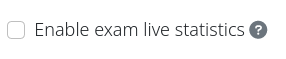
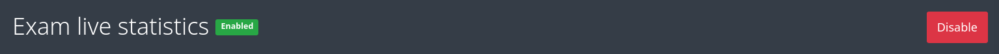
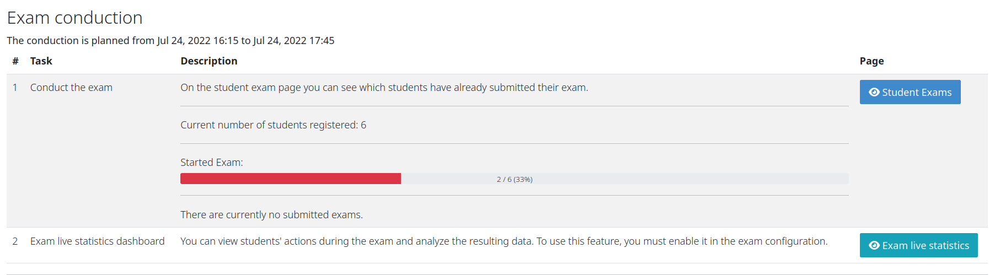
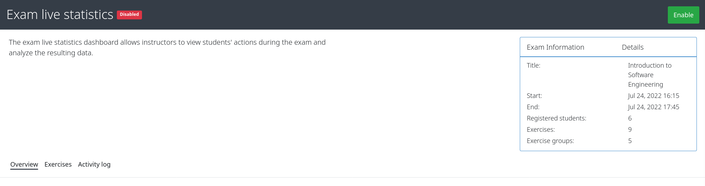
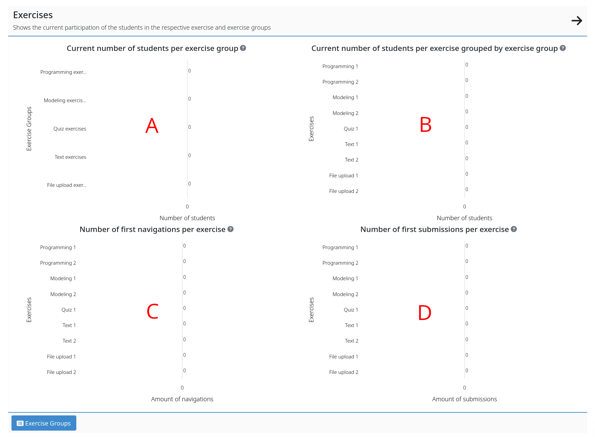
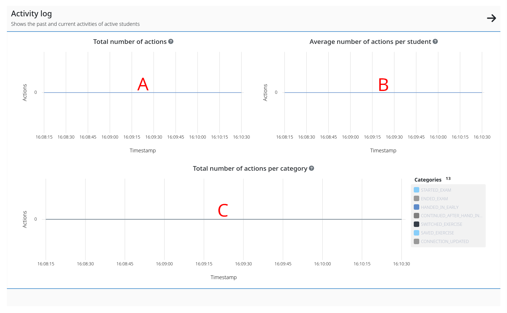
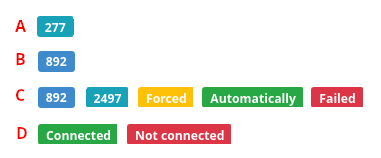

***************
Live Statistics
***************

1. Enable/Disable
=================

Artemis provides several ways to enable the exam live statistic dashboard. Instructors can enable the exam live statistics dashboard on the exam creation page.

   Checkbox to enable the exam live statistics during the exam configuration

In the exam live statistics dashboard, instructors can see the current status of this feature. In addition, they can then deactivate or activate it.

   The exam live statistics status indicator indicates that the exam live statistics is enabled

   The exam live statistics status indicator indicates that the exam live statistics is disabled

2. Navigate to the Dashboard
============================

There are two ways to access the exam live statistics dashboard. First, the instructor can directly enter the dashboard's corresponding URL. Second, he/she can navigate to the exam checklist and find the button in the exam checklist.

   The exam conduction section of the exam checklist contains a button to navigate to the exam live statistics dashboard

3. Live Statistics Header
=========================
The exam live statistics header displays the essential information about the exam. It includes the title of the exam, its start and end date, and the registered participants. Additionally, it presents the number of planned exercises and the exercise groups.
Below the short description of the dashboard, there are three sections. These sections allow the instructor to see the collected information in multiple variants without reloading or switching the page.

   The header of the exam live statistics dashboard contains the exam title, the start and end date, the registered students, the number of exercises, and exercise groups. In addition, it describes the functionality of the dashboard.

4. Section: Overview
=========================
This section provides a user-friendly overview of the exam live statistics dashboard. Instructors can summarize essential information in the overview section. In particular, it provides all the information on one page without the user having to switch between multiple pages. The overview contains the following main components:

4.1 Exercises
^^^^^^^^^^^^^

The header of the box contains the title of the respective subsection. In addition, there is a short description of the exercise details that instructors can see. To get more details, instructors can click on the right arrow and navigate to the exercises section, which provides detailed statistics about the current progress of each exercise. The box contains multiple charts:

   The exercise section is the first component of the overview section, which provides additional statistics about the current progress per exercise.

On the top left **(A)**, the chart shows the current number of students grouped by the exercise groups. Since each exercise group can contain multiple exercises probably of only one type, an instructor can get more details of the student's progress per exercise type. In addition, on the top right **(B)**, a bar chart shows the current number of students per exercise. In those numbers, we do not include who is on the exam overview page or who will hand in their exam.

At the bottom left **(C)**, the diagram shows the number of initial navigations per exercise, providing the possibility for instructors to track how many students have viewed each exercise. Last, at the bottom right **(D)**, instructors can see the number of first submissions per exercise, providing the option for instructors to get details on the individual progress per exercise.

4.2 Activity log
^^^^^^^^^^^^^^^^

The header of the box contains the title of the activity log section. In addition, there is a short description of the activities that instructors can see. Similar to the previous section, instructors can click on the arrow to get more details and navigate to the activity log section, which provides detailed statistics about the performed actions and the current progress of each student. The box also contains multiple charts:

   The activity log section is the second component of the overview section, which provides additional details about the performed actions.

At the top left **(A)**, the chart shows the current number of actions performed by all students during the exam. It provides a overview of how many interactions are performed during the exam. For example, whether there are more interactions at the beginning or more at the end. Additionally, on the top right **(B)**, the bar chart shows the current average number of performed actions. Since students have different habits, and some switch or hand in assignments more often than others, it is interesting to see how they compare to the average.

Last, at the bottom **(C)**, the diagram shows the number of initial actions performed per category, which allows instructors to track precisely when and how many actions students performed. Thus, we provide the possibility to observe how many students start the exam on time or delayed, or whether students often visit the hand-in early page during the exam but then decide to do not so.

5. Section: Exercises
=====================

This section is the second section of a total of three sections. Similar to the overview page, the exercise page contains the four previously mentioned diagrams. In addition to the charts, this page also contains a table that provides details for each exercise.

The table shows the exercise id, the corresponding group id, and the title of the exercise per column. In addition, it highlights the respective type with an icon. In order to provide important information in the most space-saving way, each column is clickable. Additionally, instructors can unfold the column and receive detailed information on the current progress per exercise via three charts.

Like the general exercise overview, an instructor can see the respective initial navigations and first submission per student. In order to see the current activity progress per exercise, instructors can see the current students at this exercise. In addition, we use doughnut charts as opposed to bar charts to provide more variety.

.. figure:: instructor/exam_live_statistics_section_exercise_table.png
   :alt: Table of exercises
   :align: center

   The table of exercises shows the first navigations, first submissions, and current participants per exercise.

6. Section: Activity log
========================

Similar to the overview page, the activity log page contains the three previously mentioned diagrams. In addition to the charts, this page also contains a table that provides a log of the performed actions. The table shows the student exam id, the timestamp, and the action category per column. In addition, it provides different badges based on the category.

.. figure:: instructor/exam_live_statistics_section_activity_table.png
   :alt: Table of actions
   :align: center

   The table of actions shows the first timestamp, type, and additional details per action. Depending on the type of action, we display different details.

Since each start or restart of the exam creates a unique session, we show the assigned session id **(A)**. This information is only available for the *started* exam actions. Furthermore, users can switch through exercises or to the exam overview page. For each *switched* exercise action, we show either the badge containing the exercise id or nothing, which means that the user switched to the overview page **(B)**.

Each time a student *saves* the current exercise state, we display the associated exercise id and submission id. Depending on the details of the performed action, we show the Automatically badge. If the user or the system forces a save, we extend the states of the save by the fact of whether it was successful or not **(C)**. In some scenarios, the server may be unreachable during the exam, or the student may lose his/her internet connection. The *connection updated* actions contain the current connection status, which we display with two badges **(D)**.

    The activity log table contains details per action. We display different action detail badges containing relevant information depending on the received action.

