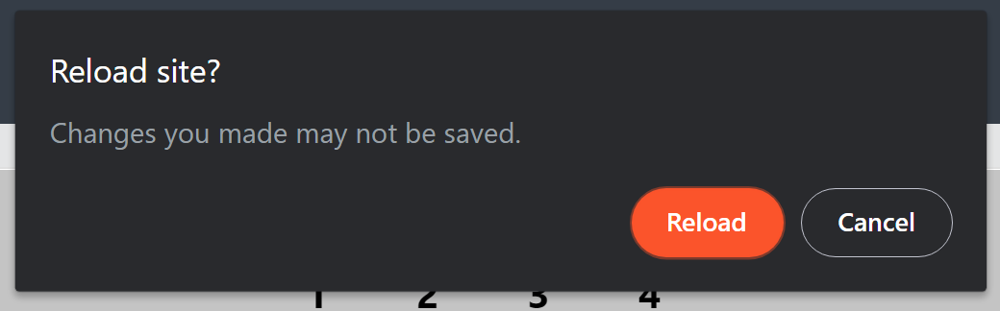

===================
Students’ Guide
===================

General Information
-------------------

Prerequisites
^^^^^^^^^^^^^
- **Stable internet connection**

    **Recommendation:** Use a LAN connection if possible.

- **Browser**
    
    **Recommendation:** Chromium (based), e.g. Google Chrome, newest version.

- The following prerequisites are only required if your exam contains programming exercises: 

    - **Java IDE with JDK 15**
        
        **Recommendation:** Eclipse IDE 2020‑09.
    
    - **Git Client**
        
        **Recommendation:** SourceTree

Offline Mode
^^^^^^^^^^^^
- The exam mode in Artemis tolerates issues with the Internet connection.
- In case you are not connected, you can continue working on text-, quiz- and modeling exercises, but you might get warnings that your solutions cannot be saved.
- If your Internet connection recovers, Artemis will save your solution.
- Artemis tries to save your solution every 30 seconds, when you navigate between exercises and when you click ``Save`` or ``Save & Continue``.
- Programming exercises have 2 modes.

    1. **Online code editor:** can only be used when you are online. 

        .. note::
            You have to click on Submit! Otherwise your solution will *not* be pushed to the VC server and no build will be triggered.

    2. **Local IDE:** you only need to be online when you clone the repository and when you push your commits (i.e. submit your solution)

- At the end of the online exercise, you must be online within a given ``grace period`` and submit your exam, otherwise it will not be graded

Suggestions
^^^^^^^^^^^
1. Do **NOT** reload the browser

    - If you reload the browser, the `Welcome Screen`_ screen opens and you must enter your name and confirm the checkbox again.
    - You should only reload if an error occurs that cannot be recovered otherwise!
2. Participate in **ONE** browser window!

    - Working in multiple browser windows at the same time is **not** allowed!
    - It will lead to synchronization issues and is seen as suspicious behaviour that can be flagged as cheating.

   Do not reload, you will receive a warning

Participating in the Artemis Online Exam
----------------------------------------

Accessing the Exam
^^^^^^^^^^^^^^^^^^
- Log in to Artemis with your account credentials.
- The current exam should be displayed at the top of the *Course Overview* screen.
- You can also access the exam by navigating to the course and then clicking on ``Exams``.

    .. note::
        The exam will become visible shortly before the working time starts.

.. figure:: student/access_exam.png
   :alt: Access Exam
   :align: center

   Access Exam

Welcome Screen
^^^^^^^^^^^^^^
- The welcome screen gives you an overview of all the important information you need about the exam. 
- Carefully read through the instructions.
- Once you have read them, ``confirm`` that you will follow the rules and sign with your full name.

    .. note::
        Your full name represents your signature. You can find your full name as registered on Artemis below the input field.

- After you confirm, if the exam working time has started, the `Exam Conduction`_ screen will automatically appear. 
- Otherwise, you must wait until the exam begins. A popup will appear which will notify you how much time is left before the planned start.

.. figure:: student/welcome_screen.png
   :alt: Welcome Screen
   :align: center

   Welcome Screen, waiting for exam start

Exam Conduction
^^^^^^^^^^^^^^^
- Once the exam working time starts and you have confirmed your participation, the *Conduction* screen will appear. 
- On the header, you will find the *Exam Navigation Bar*. You can use this bar to navigate between different exercises. For each exercise an icon will display your current status.

    - When there are ``unsaved`` **or** ``unsubmitted``, the exercise representation on the navigation bar will become ``yellow``. 
    - When your changes have been ``saved`` **and** ``submitted``, it's background with turn ``blue`` and a ``checkmark`` icon will be shown. 
    - A blue background without a checkmark indicates that you have not started this exercise.

- You can also navigate through the exercises when you are done with one by clicking ``Save & Continue``. This action will save and submit your changes and move to the next exercise. 

    .. warning::
        For programming exercises, you must manually press ``submit`` otherwise your solution will **not** be counted!

- On the header, you will also find the ``Hand in early`` button. If you press this, you will be sent to the exam `End Screen`_. 
- The *time left* until the end of the exam is also shown next to the action buttons, or below, depending on your screen size.

    .. note::
        When the time is about to run out, the background of the timer will turn yellow to warn you.

.. figure:: student/exam_navigation.png
   :alt: Exam Navigation
   :align: center

   Exam Navigation Bar

Participating in Quiz Exercises
^^^^^^^^^^^^^^^^^^^^^^^^^^^^^^^
- Various question types can be included in quiz exam exercises. These are: 

    1. Multiple choice questions
    2. Short Answer questions
    3. Drag and Drop questions

- All questions are listed in the main screen below one another.
- To navigate between them you can either scroll or use the ``question overview`` on the left. When you click on one of the question representations, your view will automatically scroll to the respective question.
- To submit your solution, simply press ``Save & Continue``.

    .. note::
        Your submission will automatically be saved every 30 seconds. 

.. figure:: student/quiz_exercises.png
   :alt: Participating in Quiz Exercises
   :align: center

   Participating in Quiz Exercises

Participating in Text Exercises
^^^^^^^^^^^^^^^^^^^^^^^^^^^^^^^
- The text exercise view is divided into two sections, the text editor, and the problem statement. The problem statement is docked to the right.

    .. note::
        On small screens, the problem statement is shown above the text editor.

- If you want to focus only on the text editor, you can collapse the problem statement by pressing on the ``right arrow``. This can be reverted by pressing the arrow again.

    .. note::
        You can also choose to resize the problem statement by dragging the ``outline box``.

- Within the editor you can type out your solution. The editor will automatically track your number of words and number of characters.

.. figure:: student/text_exercises.png
   :alt: Participating in Text Exercises
   :align: center

   Participating in Text Exercises

Participating in Modeling Exercises
^^^^^^^^^^^^^^^^^^^^^^^^^^^^^^^^^^^
- The modeling exercise view is divided into two sections, the modeling editor, and the problem statement. The problem statement is docked to the right.

    .. note::
        On small screens, the problem statement is shown above the modeling editor.

- If you want to focus only on the modeling editor, you can collapse the problem statement by pressing on the ``right arrow``. This can be reverted by pressing the arrow again.

    .. note::
        You can also choose to resize the problem statement by dragging the ``outline box``.

- Within the editor you can model your solution. Depending on the diagram type, you will find the available elements on the right side of the editor. Simply drag and drop them into the editing field.
- When you click on a dropped element, you can configure it by setting it's ``name``, it's ``attributes``, ``methods`` etc. 
- To connect elements you can simply drag an element's edges to another element. The editor will then automatically connect those two. 
- If you are unclear about how to use the modeling editor, you can click on ``Help``. It will provide further information about how to use the modeling editor. 

    .. note::
        If you need more space, you can work in fullscreen by clicking on ``Fullscreen``. This mode will use your whole screen for the modeling exercise thereby giving you more space to model your solution. To exit the fullscreen mode simply click ``Exit Fullscreen``.

.. figure:: student/modeling_exercises.png
   :alt: Participating in Modeling Exercises
   :align: center

   Participating in Modeling Exercises

Participating in Programming Exercises
^^^^^^^^^^^^^^^^^^^^^^^^^^^^^^^^^^^^^^
- Depending on your exam, programming exercises can come in three forms: 

    1. Online Code Editor + support for local IDE
    2. Online Code Editor
    3. Support for local IDE

- If your exercise allows the use of the code editor your screen will be divided into three sections, from left to right: 

   1. The file browser
   2. the code Editor
   3. The instructions

- The file browser displays the structure of the assignment. You can access any file within the assignment. The files content will then be displayed on the code editor where you can edit the file's content. 

    - You can add new files and directories using the ``Add File``  and ``Add Folder`` buttons.
    - You also have the ability to rename and delete files and folders, therefore **caution** is advised. 

        .. note::
            If you accidentally delete or remove a file, you can use ``Refresh files``, to load the last saved version from the server.

- The code editor allows you to edit the content of specific files. It shows the line numbers and will also annotate the appropriate line, if a compilation error occurs. 
- The instructions are docked to the right.
- If you want to focus only on the code editor, you can collapse the instructions by pressing on the ``right arrow``. This can be reverted by pressing the arrow again. Similarly, if you want to collapse the file browser, you can press the ``left arrow`` above the file browser. 

    .. note::
        You can also choose to resize any of the three sections by dragging the ``outline box``.

- When you press ``Save``, your files are saved on the Artemis server. However, you must press ``Submit`` for your solution to be counted!
- When you press ``Submit``, your changes are pushed to the VC server and a build is started on the CI server. This is indicated by the results changing from ``No results found`` to ``Building and testing``.

    .. warning::
        There is no auto-submit!

.. figure:: student/programming_exercises.png
   :alt: Participating in Programming Exercises
   :align: center

   Participating in Programming Exercises with the online code editor and local IDE enabled

- If your exercise allows the use of the local IDE you will have access to the button ``Clone Repository``.
- When you click it you can choose to clone the exercise via ``HTTPS`` or ``SSH``, if you have configured your private key.

    .. note::
        You must link a public key to your account in advance if you want to use ``SSH``. 

- To work offline follow these steps: 

    1. Clone the Exercise
    2. Import the project in your IDE
    3. Work on the code
    4. Commit and push the code. A push is equivalent to pressing the ``Submit`` button.

.. figure:: student/clone_repository.png
   :alt: Clone Repository
   :align: center

   Clone the Repository

    .. warning::
        You are responsible for pushing/submitting your code. Your instructors **cannot** help you if you have saved, but did not submit.

- Real-time feedback in programming exercises during the online exam is limited.
- You will only see if your code compiles or not

    1. **0%, Build failed** means that your code does **not** compile!
    2. **0%, 0 of 0 passed** means that your code compiles but provides no further information about your final score. 

    .. warning::
        Edit a programming exercise **EITHER** in the online editor **OR** in your local IDE! Otherwise, conflicts can occur that are hard to resolve.

End Screen
^^^^^^^^^^
- When you are finished with the exercises, or the time runs out you navigate to the *End Screen*.
- This is done either by clicking on ``Hand in early`` or automatically when the exam conduction time is over. 

    .. note::
        If you navigated to this screen via ``Hand in early``, you have the option to return to the conduction by clicking on ``Continue``.

- In this screen you should confirm that you followed all the rules and sign with your full name, similar to the `Welcome Screen`_.
- You are given an additional ``grace period`` to submit the exam after the conduction is over. This additional time is added to the timer shown on the top right.

    .. warning::
        Your exam will not be graded, should you fail to submit!

- Once you submit your exam, no further changes can be made to any exercise. 

.. figure:: student/end_screen.png
   :alt: End Screen
   :align: center

   End Screen after Early Hand in

Summary
^^^^^^^
- After you hand in, you can view the summary of your exam.
- You always have access to the summary. You can find it by following the steps displayed in: `Accessing the Exam`_.
- The summary contains an aggregated view of all your submissions. For programming exercises, it also contains the latest commit hash and repository URL so you can review your code.

.. figure:: student/summary.png
   :alt: Summary
   :align: center

   Summary before the results are published

- Once the results have been published, you can view your score in the summary.
- Additionally, if within the student review period, you have the option to complain about manual assessments made. To do this, simply click on ``complain`` and explain your rationale.
- A second assessor, different from the original one will have the opportunity to review your complaint and respond to it.
        
    .. note::
        The results will automatically be updated, if your complaint was successful.

.. figure:: student/complaint.png
   :alt: Complaint
   :align: center

   Complaining about the Assessment of a Text Exercise
