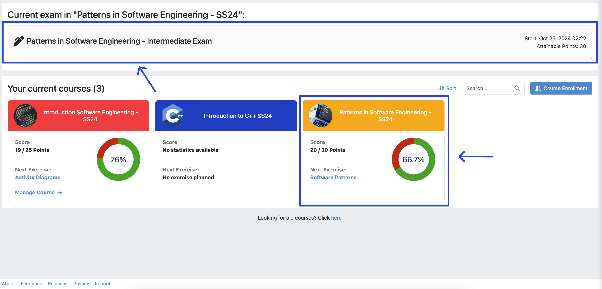
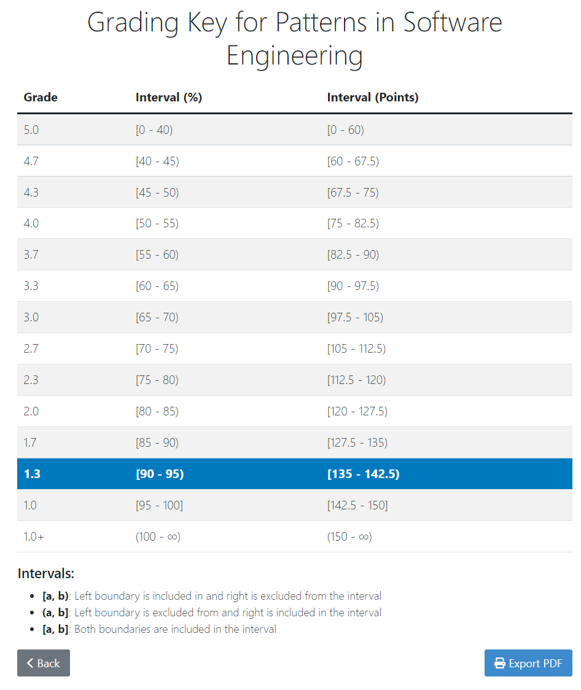
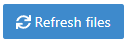
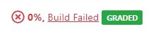
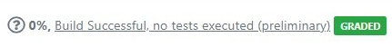

===================
Students’ Guide
===================

.. contents:: Content of this document
    :local:
    :depth: 2

|

General Information
-------------------

Prerequisites
^^^^^^^^^^^^^
- **Stable internet connection**

    **Recommendation:** Use a LAN connection if possible.

- **Browser**

    **Recommendation:** Chromium (based), e.g. Google Chrome, newest version.

- The following prerequisites are only required if your exam contains Java programming exercises:

    - **Java IDE with JDK 17**

        **Recommendation:** IntelliJ IDEA 2022.1.3 or Eclipse IDE 2022-06.

    - **Git Client**

        **Recommendation:** Use the git client integrated into IntelliJ and Eclipse! (Alternative: SourceTree or GitKraken)

Offline Mode
^^^^^^^^^^^^
- The exam mode in Artemis tolerates issues with the Internet connection.
- If you lose your connection, you can continue working on text-, quiz- and modeling exercises, but you might get warnings that your solutions cannot be saved.
- If your Internet connection recovers, Artemis will save your solution.
- Artemis tries to save your solution every 30 seconds, when you navigate between exercises, and when you click |save| or |save_continue|.
- Programming exercises have 2 modes.

    1. **Online code editor:** can only be used when you are online.

        .. note::
            You have to click on |submit|! Otherwise your solution will *not* be pushed to the VC server and no build will be triggered.

    2. **Local IDE:** you only need to be online when you clone the repository and when you push your commits (i.e. submit your solution).

- At the end of the online exam, you must be online within a given ``grace period`` and submit your exam, otherwise it will not be graded.

Suggestions
^^^^^^^^^^^
1. Do **NOT** reload the browser

    - If you reload the browser, the `Welcome Screen`_ screen opens and you must enter your name and confirm the checkbox again.
    - You should only reload if an error occurs that cannot be recovered otherwise!
2. Participate in **ONE** browser window and only one browser tab!

    - Working in multiple browser windows or tabs at the same time is **not** allowed! Having multiple Artemis windows or tabs open is ok, as long as only one of them accesses the exam.
    - It will lead to synchronization issues and is seen as suspicious behaviour that can be flagged as cheating.

    .. figure:: student/reload.png
       :alt: Reload
       :align: center

       Do not reload, you will receive a warning

.. _participation_guide:

Participating in the Artemis Online Exam
----------------------------------------

Accessing the Exam
^^^^^^^^^^^^^^^^^^
- Log in to Artemis with your account credentials.
- The current exam should be displayed at the top of the *Course Overview* screen.
- You can also access the exam by navigating to the course and then to the exams.

    .. note::
        The exam will become visible shortly before the working time starts.

   Access Exam

Welcome Screen
^^^^^^^^^^^^^^
- The welcome screen gives you an overview of all the important information you need about the exam.
- Carefully read through the instructions.
- Once you have read them, confirm that you will follow the rules by ticking the corresponding checkbox, sign with your full name and click |start|.

    .. note::
        Your full name represents your signature. You can find your full name as registered on Artemis below the input field.

- After you confirm, if the exam working time has started, the `Exam Conduction`_ screen will automatically appear.
- Otherwise, you must wait until the exam begins. This wont be longer than 5 minutes. A popup will appear which will notify you how much time is left before the planned start.

.. figure:: student/welcome_screen.png
   :alt: Welcome Screen
   :align: center

   Welcome Screen, waiting for exam start

Exam Conduction
^^^^^^^^^^^^^^^
- Once the exam working time starts and you have confirmed your participation, the *Exercise Overview* screen will appear. This screen lists all exercises that are part of your exam with their respective amount of points, title and exercise type. The status column indicates the status of each exercise and whether you have a submission in them or not.

.. figure:: student/exercise_overview_after_start.png
   :alt: Exercise Overview Screen
   :align: center

- On the header, you will find the *Exam Navigation Bar*. You can use this bar to navigate between different exercises. For each exercise an icon will display your current status.

    - When there are unsaved **or** unsubmitted changes, the exercise representation on the navigation bar becomes |unsaved|.
    - When your changes are saved **and** submitted, the exercise representation on the navigation bar becomes |saved|.
    - |started| indicates that you have not started this exercise.

- You can also navigate through the exercises when you are done with one by clicking |save_continue|. This action will save and submit your changes and move to the next exercise.

    .. warning::
        For programming exercises, there is no save button. You must manually press |submit| otherwise your solution will **not** be graded!

- On the header, you will also find the |hand_in_early| button. If you press this, you will be sent to the exam `End Screen`_.
- The *time left* until the end of the exam is also shown next to the action buttons, or below, depending on your screen size.

    .. note::
        When the time is about to run out, the background of the timer will turn yellow to warn you.

.. figure:: student/exam_navigation.png
   :alt: Exam Navigation
   :align: center

   Exam Navigation Bar

Participating in Quiz Exercises
^^^^^^^^^^^^^^^^^^^^^^^^^^^^^^^
- Various question types can be included in quiz exam exercises. These are:

    1. Multiple choice questions
    2. Short Answer questions
    3. Drag and Drop questions

- All questions are listed in the main screen below one another.
- To navigate between them you can either scroll or use the ``question overview`` on the left. When you click on one of the question representations, your view will automatically scroll to the respective question.
- To submit your solution, press |save_continue|.

    .. note::
        Your submission will automatically be saved every 30 seconds.

.. figure:: student/quiz_exercises.png
   :alt: Participating in Quiz Exercises
   :align: center

   Participating in Quiz Exercises

Participating in Text Exercises
^^^^^^^^^^^^^^^^^^^^^^^^^^^^^^^
- The text exercise view is divided into two sections, the text editor, and the problem statement. The problem statement is docked to the right.

    .. note::
        On small screens, the problem statement is shown above the text editor.

- If you want to focus only on the text editor, you can collapse the problem statement by pressing on |right_arrow| in the top right of the image below. This can be reverted by pressing the arrow again.

    .. note::
        You can also choose to resize the problem statement by dragging the outline box |outline_box|.

- Within the editor you can type out your solution. The editor will automatically track your number of words and number of characters.

.. figure:: student/text_exercises.png
   :alt: Participating in Text Exercises
   :align: center

   Participating in Text Exercises

Participating in Modeling Exercises
^^^^^^^^^^^^^^^^^^^^^^^^^^^^^^^^^^^
- The modeling exercise view is divided into two sections, the modeling editor, and the problem statement. The problem statement is docked to the right.

    .. note::
        On small screens, the problem statement is shown above the modeling editor.

- If you want to focus only on the modeling editor, you can collapse the problem statement by pressing on |right_arrow|. This can be reverted by pressing the arrow again.

    .. note::
        You can also choose to resize the problem statement by dragging the outline box |outline_box|.

- Within the editor you can model your solution. Depending on the diagram type, you will find the available elements on the right side of the editor. Simply drag and drop them into the editing field.
- When you click on a dropped element, you can configure it by setting it's ``name``, it's ``attributes``, ``methods`` etc.
- To connect elements you can drag an element's edges to another element. The editor will then automatically connect those two.
- If you are unclear about how to use the modeling editor, you can click on |help|. It will provide further information about how to use the modeling editor.

    .. note::
        If you need more space, you can work in fullscreen by clicking on |fullscreen|. This mode will use your whole screen for the modeling exercise thereby giving you more space to model your solution. To exit the fullscreen mode, click |exit_fullscreen|.

.. figure:: student/modeling_exercises.png
   :alt: Participating in Modeling Exercises
   :align: center

   Participating in Modeling Exercises

Participating in Programming Exercises
^^^^^^^^^^^^^^^^^^^^^^^^^^^^^^^^^^^^^^
- Depending on your exam, programming exercises can come in three forms:

    1. Online Code Editor + support for local IDE
    2. Online Code Editor
    3. Support for local IDE

- If your exercise allows the use of the code editor your screen will be divided into three sections, from left to right:

   1. The file browser
   2. The code Editor
   3. The instructions

- The file browser displays the file structure of the assignment. You can access any file within the assignment. Artemis will display the selected file's content in the code editor where you can edit it.

    - You can add new files and directories using the |add_file|  and |add_folder| buttons.
    - You also have the ability to rename |rename| and delete |delete| files and folders, therefore **caution** is advised.

- The code editor allows you to edit the content of specific files. It shows the line numbers and will also annotate the appropriate line, if a compilation error occurs.
- The instructions are docked to the right.
- If you want to focus only on the code editor, you can collapse the instructions by pressing on the |right_arrow|. This can be reverted by pressing the arrow again. Similarly, if you want to collapse the file browser, you can press the |left_arrow| above the file browser.

    .. note::
        You can also choose to resize any of the three sections by dragging the |outline_box|.

- When you press |refresh_files| all unsaved changes are overwritten in the online code editor. Your changes are auto-saved every 30 seconds by Artemis in the code editor.

- When you press |submit|, your changes are pushed to the version control (VC) server and a build is started on the continuous integration (CI) server. This is indicated by the results changing from |no_results_found| to |building_and_testing|. You need to first press |submit| to get feedback on your submissions build status.

    .. warning::
        There is no auto-submit!

.. figure:: student/programming_exercises.png
   :alt: Participating in Programming Exercises
   :align: center

   Participating in Programming Exercises with the online code editor and local IDE enabled

- If your exercise allows the use of the local IDE you will have access to the button |clone_repo|.
- When you click it you can choose to clone the exercise via ``HTTPS`` or ``SSH``, if you have configured your private key.

    .. note::
        You must link a public key to your account in advance if you want to use ``SSH``.

- To work offline follow these steps:

    1. Clone the Exercise
    2. Import the project in your IDE
    3. Work on the code
    4. Commit and push the code. A push is equivalent to pressing the |submit| button.

.. figure:: student/clone_repository.png
   :alt: Clone Repository
   :align: center

   Clone the Repository

    .. warning::
        You are responsible for pushing/submitting your code. Your instructors **cannot** help you if you did not submit.

- Your instructors can decide to limit the real-time feedback in programming exercises during the online exam.
- In that case, you will only see if your code compiles or not:

    1. |build_failed| means that your code does **not** compile!
    2. |build_passed| means that your code compiles but provides no further information about your final score.

    .. warning::
        Edit a programming exercise **EITHER** in the online editor **OR** in your local IDE! Otherwise, conflicts can occur that are hard to resolve.

    If you work in the online code editor and a merge conflict occurs, the file browser will display the conflict state |conflict_state|.
    You can use the |resolve_conflict| button, which is then displayed instead of the submit button, to resolve the conflict within the online code editor.
    This will reset your changes to the latest commit. Manual merging is not possible with the online code editor.

End Screen
^^^^^^^^^^
- When you are finished with the exercises, or the time runs out you navigate to the *End Screen*.
- This is done either by clicking on |hand_in_early| or automatically when the exam conduction time is over.

    .. note::
        If you navigated to this screen via |hand_in_early|, you have the option to return to the conduction by clicking on |continue|.

- In this screen you should confirm that you followed all the rules and sign with your full name, similar to the `Welcome Screen`_.
- You are given an additional ``grace period`` to submit the exam after the conduction is over. This additional time is added to the timer shown on the top right.

    .. warning::
        Your exam will not be graded, should you fail to submit!

- Once you submit your exam, no further changes can be made to any exercise.

.. figure:: student/end_screen.png
   :alt: End Screen
   :align: center

   End Screen after Early Hand in

.. _summary_guide:

Summary
^^^^^^^
- After you hand in, you can view the summary of your exam.
- You always have access to the summary. You can find it by following the steps displayed in: `Accessing the Exam`_.
- Further you have the opportunity to export the summary as a PDF file by clicking on |export_pdf|.
- The summary contains an aggregated view of all your submissions. For programming exercises, it also contains the latest commit hash and repository URL so you can review your code.

.. figure:: student/summary.png
   :alt: Summary
   :align: center

   Summary before the results are published

- Once the results have been published, you can view your score in the summary.
- Additionally, if within the student review period, you have the option to complain about manual assessments made. To do this, click on |complain| and explain your rationale.
- A second assessor, different from the original one will have the opportunity to review your complaint and respond to it.
- The complaint response will become visible to you as soon as it has been assessed.
- Again, you can export the summary including your score as a PDF file by clicking on |export_pdf|. The PDF will also contain any complaints and complaint assessments.

    .. note::
        The results will automatically be updated, if your complaint was successful.

.. figure:: student/complaint.png
   :alt: Complaint
   :align: center

   Complaining about the Assessment of a Text Exercise

.. _exam_grades:

Grades
^^^^^^
- When your exam has been graded, you can view your result on the exam scores page.
- You will see your obtained points along with the maximum achievable points for each individual exercise.
- If the instructor defined a grading key for your exam, you will also see your grade.

   Exam Grade

    .. note::
        The grades below the ``First Passing Grade`` are shown in red, and the passing grades are shown in green.

- For more information about all the grading intervals, you can click the |view_grade_key| button to view all grade step boundaries with their bound inclusivity.
- A square bracket ``[`` or ``]`` in the interval of a grade step means the bound is included in the current grade step, and a parenthesis ``(`` or ``)`` means it is excluded.
- For example, if the grade step for ``2.0`` shows the percentage interval as ``[80 - 85)`` this means that a student achieving ``80%`` has the grade ``2.0``, whereas a student achieving ``85%`` receives the grade right above ``2.0`` (i.e. ``1.7`` if the default grading key is used).

   Exam Grading Key for a student receiving 135 points out of 150

|

.. |add_file| image:: student/buttons/add_file.png
.. |add_folder| image:: student/buttons/add_folder.png
.. |delete| image:: student/buttons/delete_file.png
.. |rename| image:: student/buttons/rename_file.png

.. |submit| image:: student/buttons/submit.png

.. |save| image:: student/buttons/save.png
.. |save_continue| image:: student/buttons/save_continue.png
.. |start| image:: student/buttons/start.png
.. |unsaved| image:: student/buttons/unsaved_changes.png
.. |saved| image:: student/buttons/saved_changes.png
.. |started| image:: student/buttons/started.png

.. |left_arrow| image:: student/buttons/left_arrow.png
.. |outline_box| image:: student/buttons/outline_box.png

.. |clone_repo| image:: student/buttons/clone_repo.png
.. |hand_in_early| image:: student/buttons/hand_in_early.png
.. |help| image:: student/buttons/help.png
.. |continue| image:: student/buttons/continue.png
.. |complain| image:: student/buttons/complain.png
.. |fullscreen| image:: student/buttons/fullscreen.png
.. |exit_fullscreen| image:: student/buttons/exit_fullscreen.png
.. |building_and_testing| image:: student/buttons/building_and_testing.png
.. |no_results_found| image:: student/buttons/no_results_found.png
.. |export_pdf| image:: student/buttons/export_pdf.png

