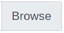

File Upload Exercise
====================

.. contents:: Content of this document
    :local:
    :depth: 2

Overview
--------

Conducting a file exercise consists of 3 steps distributed among
instructor, Artemis and students:

1. **Instructor prepares exercise:** Creates and configures the exercise in Artemis.
2. **Student solves exercise:** Creates a submission file, and uploads it.
3. **Instructor assesses submissions:** Review the handed in files and create manual results for the students.

Setup
--------

The following sections describe the supported features and the process of creating a new file upload exercise.

- Open |course-management|
- Navigate into **Exercises** of your preferred course

    .. figure:: programming/course-management-course-dashboard.png
              :align: center

- Click on **Create new file upload exercise**

    .. figure:: file-upload/create-new-file-upload-exercise.png
              :align: center

- Fill out all mandatory values and click on |save|
- The exercise specific ``File Pattern`` defines which file types students can upload as solution.

    .. figure::  file-upload/file_upload_exercise_creation.png
              :align: center

  Result: **File Upload Exercise**

    .. figure:: file-upload/course-dashboard-exercise-file-upload.png
              :align: center

- Click the |edit| button of the file upload exercise and adapt the interactive problem statement. There you can also set release and due dates.
- You can get an overview of the exercise by clicking on the title.

Student Submission
------------------

- When the exercise is released the students can upload the requested file.
- They can choose a file with |browse| and then submit the file with |submit|.

    .. figure:: file-upload/file_upload_exercise_student_view.png
              :align: center

- After a file was uploaded it can then be downloaded again with the link below.

    .. figure:: file-upload/file_upload_exercise_student_submitted.png
              :align: center

Assessment
----------

- When the due date is over you can assess the submissions. Go to the

.. |edit| image:: programming/edit.png
.. |course-management| image:: programming/course-management.png
.. |save| image:: file-upload/save_button.png

