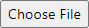

File Upload Exercise
====================

.. contents:: Content of this document
    :local:
    :depth: 2

Overview
--------

Conducting a file upload exercise consists of 3 steps:

1. Setup of the exercise in Artemis
2. Submission by a student
3. Assessment by the staff

Setup
--------

The following sections describe the supported features and the process of creating a new file upload exercise.

- Open |course-management|.
- Navigate into **Exercises** of your preferred course.

    .. figure:: general/course-management-course-dashboard-exercises.png
              :align: center

- Click on **Create a new file upload exercise**.

    .. figure:: file-upload/create-new-file-upload-exercise.png
              :align: center

- Fill out all mandatory values and click on |save|.
- The exercise-specific **File Pattern** defines which file types students can upload as solution. The input field accepts all file endings without leading dot separated by commas.

    .. figure::  file-upload/file-upload-exercise-creation-pattern.png
              :align: center

- Result: **File Upload Exercise**.

    .. figure:: file-upload/course-dashboard-exercise-file-upload.png
              :align: center

- Click the |edit| button of the file upload exercise to update the configuration and assessment instructions.
- You can get an overview of the exercise by clicking on the title.

Student Submission
------------------

- When the exercise is released, the students can upload the requested file.
- They can choose a file with |browse| and then submit the file with |submit|.

    .. figure:: file-upload/file-upload-exercise-student-view.png
              :align: center

- After a file is uploaded it can then be downloaded again by clicking on **Download file**.

    .. figure:: file-upload/file-upload-exercise-student-view-submitted.png
              :align: center

Assessment
----------

- When the due date is over, you can assess the submissions. From the assessment dashboard, go to exercise the assessment dashboard of the file upload exercise.
- There you can assess the submitted student submissions, by first downloading the file, and then adding feedback with points.

    .. figure:: file-upload/file-upload-exercise-assessment.png
              :align: center

.. |course-management| image:: general/course-management.png

