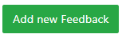
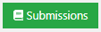
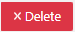

Modeling exercise
=================
.. contents:: Content of this document
    :local:
    :depth: 2

Overview
--------

Conducting a Modeling exercise consists of 3 steps:

1. **Instructor prepares exercise:** Creates and configures the modeling exercise in Artemis.
2. **Student solves exercise:** Student works on the exercise and submits the solution
3. **Instructor assesses submissions:** Reviews the submitted exercises and creates results for the students.

Setup
--------

The following sections describe the supported features and the process of creating a new modeling exercise.

- Open |course-management|
- Navigate into **Exercises** of your preferred course

    .. figure:: modeling/course-management-course-dashboard.png
              :align: center

- Click on **Create new modeling exercise**

    .. figure:: modeling/create-new-modeling-exercise.png
              :align: center

Following screenshot illustrates the first section of the form. It consists of:

- *Title*: Title of an exercise
- *Categories*: Category of an exercise
- *Difficulty*: Difficulty of an exercise. (No level, Easy, Medium or Hard)
- *Mode*: Solving mode of an exercise. *This cannot be changed afterwards* (Individual or Team)
- *Release Date*: Date after which students can access the exercise
- *Due Date*: Date till when students can access the exercise
- *Assessment Due Date*: Date till when instructors can assess the exercise submitted by students
- *Inclusion in course score calculation*: Option that determines whether or not to include exercise in course score calculation
- *Points*: Total point of an exercise
- *Bonus Points*: Bonus points of an exercise
- *Diagram Type*: Type of diagram that is used throughout an exercise

    .. figure:: modeling/create-modeling-exercise-form-1.png
              :align: center

.. note::
   Fields marked with red are mandatory to be filled.

.. note::
   - Field **Diagram Type** determines the components that students/instructors can use while working on the exercise.
   - For example: If the instructor selects Class diagram as its Diagram Type, users (instructors/students) will now only be able to use components of class diagram throughout the exercise.

    .. figure:: modeling/class-diagram-diagram-type.png
              :align: center

Following screenshot illustrates the second section of the form. It consists of:

- *Enable automatic assessment suggestions*: Option that determines whether or not to enable assessment suggestions automatically
- *Problem Statement*: Field to state problem statement of an exercise
- *Assessment Instructions*: Instructions for instructor while assessing the submission

    .. figure:: modeling/create-modeling-exercise-form-2.png
              :align: center

.. note::
    If you are not clear about any of the fields, you can access to the field hints by hovering on |hint| icon, when available.

    .. figure:: modeling/create-modeling-exercise-form-hint.png
              :align: center

Following screenshot illustrates the last section of the form. It consists of:

- *Example Solution*: Example solution of an exercise
- *Example Solution Explanation*: Explanation of example solution of an exercise
- *Example Solution Publication Date*: Date after which example solution is accessible for students

    .. figure:: modeling/create-modeling-exercise-form-3.png
              :align: center

Once you are done defining the schema of an exercise, you can now create an exercise by clicking on |save| button.
You will then be redirected to **Example Submissions for Assessment Training** Page

    .. figure:: modeling/example-submission-for-assessment-training.png
              :align: center

In this page, you can either *Create Example Submission* or *Use as Example Submission* for Assessment Training.

- Select |create-example-submission| if you want to create Example submission from scratch.
- Alternatively, you can also use the submission submitted by Students as an Example Submission. For that, click on |use-as-example-submission|

Example Submission can be used to assess the submissions of students by instructors manually or automatically via Assessment Training feature.

.. note::
    Artemis uses semi-automatic grading of modeling exercises using Machine Learning.
    You can hence train the model by selecting *Use in Assessment Training* checkbox while creating an Example Submission.

    .. figure:: modeling/use-in-assessment-training.png
              :align: center

- Alternatively, you can also import modeling exercise from the existing one by clicking on **Import Modeling Exercise**

    .. figure:: modeling/import-modeling-exercise.png
              :align: center

  Result: **Modeling Exercise**

    .. figure:: modeling/course-dashboard-exercise-modeling.png
              :align: center

- Click the |edit| button of the modeling exercise and adapt the interactive problem statement. There you can also set release and due dates.
- Click the |scores| button to see the scores achieved by the students.
- Click the |participation| button to see the list of students participated in the exercise.
- Click the |submission| button to see the list of submission submitted by students.
- Click the |example-submission| button to modify/add example submission of the exercise.
- Click the |delete| button to delete the exercise.
- You can get an overview of the exercise by clicking on the title.

Student Submission
------------------

- When the exercise is released students can work on the exercise.

    .. figure:: modeling/modeling-exercise-card-student-view.png
              :align: center

- They can start the exercise by clicking the |start| button.

- Once they start the exercise, they will now have the option to work on it in an online modeling editor by clicking on  the |open-modeling-editor| button.

- The screenshot below depicts the online modeling exercise interface for students. They can read the Problem Statement, work on the online editor and also provide an explanation to their solutions, if needed.

    .. figure:: modeling/modeling-exercise-students-interface.png
              :align: center

Assessment
----------

When the due date is over you can assess the submissions.

- To assess the submissions, first click on Assessment Dashboard

    .. figure:: modeling/assessment-dashboard.png
              :align: center

- Then click on Submissions of the modeling exercise

    .. figure:: modeling/exercise-dashboard.png
              :align: center

- You will then be redirected to *Submissions* Dashboard

    .. figure:: modeling/submissions-dashboard.png
              :align: center

- Click on |assess-submission| button of specific student. You will then be redirected to the assessment page where you will be able to assess submission of that student.

- You can now start assessing the elements of the model by double clicking it. Once you double click, you will get an assessment modal where you can assign points and feedback.

    .. figure:: modeling/assessment-modal.png
              :align: center

- Alternatively, you can also assess the diagram by dragging and dropping assessment instructions from *Assessment Instructions* section.

    .. figure:: modeling/assessment-instruction.png
              :align: center

- Feedback to the entire submission can also be added by clicking on |add-new-feedback| button.

    .. figure:: modeling/feedback-modal.png
              :align: left

.. |edit| image:: modeling/edit.png
    :scale: 75
.. |course-management| image:: modeling/course-management.png

.. |start| image:: modeling/start.png

.. |hint| image:: modeling/hint.png
.. |create-example-submission| image:: modeling/create-example-submission.png
.. |use-as-example-submission| image:: modeling/use-as-example-submission.png

.. |assess-submission| image:: modeling/assess-submission.png
.. |scores| image:: modeling/scores.png

.. |example-submission| image:: modeling/example-submission.png

