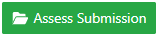
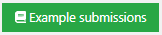
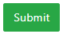

Modeling exercise
=================
.. contents:: Content of this document
    :local:
    :depth: 3

Overview
--------

Conducting a Modeling exercise consists of 3 steps:

1. **Instructor prepares exercise:** Creates and configures the modeling exercise in Artemis.
2. **Student solves exercise:** Student works on the exercise and submits the solution.
3. **Tutors assesses submissions:** Reviews the submitted exercises and creates results for the students.

Setup
-----

The following sections describe the supported features and the process of creating a new modeling exercise.

- Open |course-management|.
- Navigate into **Exercises** of your preferred course.

    .. figure:: general/course-management-course-dashboard-exercises.png
              :align: center

Create new modeling exercise
^^^^^^^^^^^^^^^^^^^^^^^^^^^^

- Click on **Create new modeling exercise**.

    .. figure:: modeling/create-new-modeling-exercise.png
              :align: center

The following screenshot illustrates the first section of the form. It consists of:

- **Title**: Title of an exercise.
- **Categories**: Category of an exercise.
- **Difficulty**: Difficulty of an exercise. (No level, Easy, Medium or Hard).
- **Mode**: Solving mode of an exercise. *This cannot be changed afterwards* (Individual or Team).
- **Release Date**: Date after which students can access the exercise.
- **Due Date**: Date till when students can work on the exercise.
- **Assessment Due Date**: Date after which students can view the feedback of the assessments from the instructors.
- **Inclusion in course score calculation**: Option that determines whether or not to include exercise in course score calculation.
- **Points**: Total points of an exercise.
- **Bonus Points**: Bonus points of an exercise.
- **Diagram Type**: Type of diagram that is used throughout an exercise.

    .. figure:: modeling/create-modeling-exercise-form-1.png
              :align: center

.. note::
   Fields marked with red are mandatory to be filled.

.. note::
   - The field **Diagram Type** determines the components that students/instructors can use while working on the exercise.
   - This option cannot be changed after creating the exercise.
   - For example: If the instructor selects class diagram as its diagram type, users (instructors/students) will now only be able to use components of class diagrams throughout the exercise.

    .. figure:: modeling/class-diagram-diagram-type.png
              :align: center

The following screenshot illustrates the second section of the form. It consists of:

- **Enable automatic assessment suggestions**: When enabled, Artemis tries to automatically suggest assessments for diagram elements based on previously graded submissions for this exercise.
- **Problem Statement**: The task description of the exercise as seen by students.
- **Assessment Instructions**: Instructions for instructors while assessing the submission.

    .. figure:: modeling/create-modeling-exercise-form-2.png
              :align: center

.. note::
    If you are not clear about any of the fields, you can access additional hints by hovering over the |hint| icon for many of them.

    .. figure:: modeling/create-modeling-exercise-form-hint.png
              :align: center

The following screenshot illustrates the last section of the form. It consists of:

- **Example Solution**: Example solution of an exercise.
- **Example Solution Explanation**: Explanation of the example solution.
- **Example Solution Publication Date**: Date after which the example solution is accessible for students. If you leave this field empty, the solution will only be published to tutors.

    .. figure:: modeling/create-modeling-exercise-form-3.png
              :align: center

Once you are done defining the schema of an exercise, you can now create an exercise by clicking on |save| button.
You will then be redirected to **Example Submissions for Assessment Training** Page.

    .. figure:: modeling/example-submission-for-assessment-training.png
              :align: center

In this page, you can either *Create Example Submission* or *Use as Example Submission* for Assessment Training.
Example submissions can be used to assess the submissions of students semi-automatically.
Artemis uses those submissions to automatically apply the known assessment comments to similar model elements in other submissions as well.

- Select |create-example-submission| if you want to create an example submission from scratch.
- Alternatively, after the exercise already started, you can also use some submissions submitted by students as an example submission. For that, click on |use-as-example-submission|.

.. note::
    Artemis uses semi-automatic grading of modeling exercises using machine learning.
    You can hence train the model by selecting *Use in Assessment Training* checkbox while creating an example submission.

    .. figure:: modeling/use-in-assessment-training.png
              :align: center

Import Modeling Exercise
^^^^^^^^^^^^^^^^^^^^^^^^

- Alternatively, you can also import modeling exercise from the existing one by clicking on **Import Modeling Exercise**.

    .. figure:: modeling/import-modeling-exercise.png
              :align: center

- An import modal will prompt up, where you will have an option to select and import previous modeling exercises from the list by clicking on |import| button.

    .. figure:: modeling/import-modeling-exercise-modal.png
              :align: center

- Once you import one of the exercise, you will then be redirected to a form which is similar to *Create new modeling exercise* form with all the fields filled from imported exercise. You can now modify the fields as per your necessity to create a new Modeling Exercise.

Result
^^^^^^

    .. figure:: modeling/course-dashboard-exercise-modeling.png
              :align: center

- Click the |edit| button of the modeling exercise and adapt the interactive problem statement. There you can also set release and due dates.
- Click the |scores| button to see the scores achieved by the students.
- Click the |participation| button to see the list of students participated in the exercise.
- Click the |submission| button to see the list of submission submitted by students.
- Click the |example-submission| button to modify/add example submission of the exercise.
- Click the |delete| button to delete the exercise.
- You can get an overview of the exercise by clicking on the title.

Student Submission
------------------

- When the exercise is released students can work on the exercise.

    .. figure:: modeling/modeling-exercise-card-student-view.png
              :align: center

- They can start the exercise by clicking the |start| button.

- Once they start the exercise, they will now have the option to work on it in an online modeling editor by clicking on  the |open-modeling-editor| button.

- The screenshot below depicts the online modeling exercise interface for students. They can read the Problem Statement, work on the online editor and also provide an explanation to their solutions, if needed.

    .. figure:: modeling/modeling-exercise-students-interface.png
              :align: center

Assessment
----------

When the due date is over you can assess the submissions.

- To assess the submissions, first click on Assessment Dashboard.

    .. figure:: modeling/assessment-dashboard.png
              :align: center

- Then click on Submissions of the modeling exercise.

    .. figure:: modeling/exercise-dashboard.png
              :align: center

- You will then be redirected to *Submissions and Assessments* Page.

    .. figure:: modeling/submissions-dashboard.png
              :align: center

- Click on |assess-submission| button of specific student. You will then be redirected to the assessment page where you will be able to assess submission of that student.

- You can now start assessing the elements of the model by double clicking it. Once you double click, you will get an assessment dialog where you can assign points, feedback and navigate through all other assessable components.

    .. figure:: modeling/assessment-modal.png
              :align: center

- Alternatively, you can also assess the diagram by dragging and dropping assessment instructions from the *Assessment Instructions* section.

    .. figure:: modeling/assessment-instruction.png
              :align: center

- Feedback to the entire submission can also be added by clicking on the |add-new-feedback| button.

    .. figure:: modeling/feedback-modal.png
              :align: center

Once you're done assessing the solution, you can either:

- Click on |save| to save the incomplete assessment so that you can continue it afterwards.

- Click on |submit| to submit the assessment.

- Click on |cancel| to cancel and release the lock of the assessment.

- Click on |exercise-dashboard-button| to navigate to exercise dashboard page.

.. |edit| image:: modeling/edit.png
    :scale: 75
.. |course-management| image:: general/course-management.png
.. |save| image:: modeling/save.png

.. |open-modeling-editor| image:: modeling/open-modeling-editor.png
.. |hint| image:: modeling/hint.png
.. |create-example-submission| image:: modeling/create-example-submission.png
.. |use-as-example-submission| image:: modeling/use-as-example-submission.png
.. |add-new-feedback| image:: modeling/add-new-feedback.png

.. |scores| image:: modeling/scores.png
.. |participation| image:: modeling/participation.png
.. |submission| image:: modeling/submission.png

.. |delete| image:: modeling/delete.png

.. |cancel| image:: modeling/cancel.png

.. |import| image:: modeling/import.png
