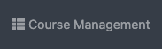

Features
^^^^^^^^
Artemis and its version control and continuous integration infrastructure is independent of the programming language and thus supports
teaching and learning with any programming language that can be compiled and tested on the command line.
Instructors have a lot of freedom in defining the environment (e.g. using build agents and Docker images) in which student code is executed and tested.
To simplify the setup of programming exercises, Artemis supports several ``templates`` that show how the setup works.
Instructors can still use those templates to generate programming exercises and then adapt and customize the settings in the repositories and build plans.

- The support for a specific programming language ``templates`` depends on the used ``continuous integration`` system. The table below gives an overview:

  +----------------------+--------+---------+
  | Programming Language | Bamboo | Jenkins |
  +======================+========+=========+
  | Java                 | yes   | yes      |
  +----------------------+--------+---------+
  | Python               | yes   | yes      |
  +----------------------+--------+---------+
  | C                    | yes   | yes      |
  +----------------------+--------+---------+
  | Haskell              | yes   | yes      |
  +----------------------+--------+---------+
  | Kotlin               | yes   | no       |
  +----------------------+--------+---------+
  | VHDL                 | yes   | no       |
  +----------------------+--------+---------+
  | Assembler            | yes   | no       |
  +----------------------+--------+---------+
  | Swift                | yes   | no       |
  +----------------------+--------+---------+

- Not all ``templates`` support the same feature set.
  Depending on the feature set, some options might not be available during the creation of the programming exercise.
  The table below provides an overview of the supported features:

  +----------------------+----------------------+----------------------+------------------+--------------+------------------------------+
  | Programming Language | Sequential Test Runs | Static Code Analysis | Plagiarism Check | Package Name | Solution Repository Checkout |
  +======================+======================+======================+==================+==============+==============================+
  | Java                 | yes                  | yes                  | yes              | yes          | no                           |
  +----------------------+----------------------+----------------------+------------------+--------------+------------------------------+
  | Python               | yes                  | no                   | yes              | no           | no                           |
  +----------------------+----------------------+----------------------+------------------+--------------+------------------------------+
  | C                    | no                   | no                   | yes              | no           | no                           |
  +----------------------+----------------------+----------------------+------------------+--------------+------------------------------+
  | Haskell              | yes                  | no                   | no               | no           | yes                          |
  +----------------------+----------------------+----------------------+------------------+--------------+------------------------------+
  | Kotlin               | yes                  | no                   | no               | yes          | no                           |
  +----------------------+----------------------+----------------------+------------------+--------------+------------------------------+
  | VHDL                 | no                   | no                   | no               | no           | no                           |
  +----------------------+----------------------+----------------------+------------------+--------------+------------------------------+
  | Assembler            | no                   | no                   | no               | no           | no                           |
  +----------------------+----------------------+----------------------+------------------+--------------+------------------------------+
  | Swift                | no                   | no                   | no               | no           | no                           |
  +----------------------+----------------------+----------------------+------------------+--------------+------------------------------+

  - *Sequential Test Runs*: ``Artemis`` can generate a build plan which first executes structural and then behavioral tests. This feature can help students to better concentrate on the immediate challenge at hand.
  - *Static Code Analysis*: ``Artemis`` can generate a build plan which additionally executes static code analysis tools.
    ``Artemis`` categorizes the found issues and provides them as feedback for the students. This feature makes students aware of code quality issues in their submissions.
  - *Plagiarism Checks*: ``Artemis`` is able to automatically calculate the similarity between student submissions. A side-by-side view of similar submissions is available to confirm the plagiarism suspicion.
  - *Package Name*: A package name has to be provided
  - *Solution Repository Checkout*: Instructors are able to compare a student submission against a sample solution in the solution repository

.. note::
  Only some ``templates`` for ``Bamboo`` support ``Sequential Test Runs`` at the moment.

.. note::
  Instructors are still able to extend the generated programming exercises with additional features that are not available in one specific template.

We encourage instructors to contribute improvements to the existing ``templates`` or to provide new templates. Please contact Stephan Krusche and/or create Pull Requests in the Github repository.

Exercise Creation
^^^^^^^^^^^^^^^^^

1. **Open Course Management**

- Open |course-management|
- Navigate into **Exercises** of your preferred course

    .. figure:: programming/course-management-course-dashboard.png
              :align: center

2. **Generate programming exercise**

- Click on **Generate new programming exercise**

    .. figure:: programming/course-management-exercise-dashboard.png
              :align: center

- Fill out all mandatory values and click on |generate|

    .. figure:: programming/create-programming-1.png
              :align: center

    .. figure:: programming/create-programming-2.png
              :align: center

  Result: **Programming Exercise**

    .. figure:: programming/course-dashboard-exercise-programming.png
              :align: center

  Artemis creates the repositories:

  - **Template:** template code, can be empty, all students receive this code at the beginning of the exercises
  - **Test:** contains all test cases, e.g. based on JUnit and optionally static code analysis configuration files. The repository is hidden for students
  - **Solution:** solution code, typically hidden for students, can be made available after the exercise

  Artemis creates two build plans

  - **Template:** also called BASE, basic configuration for the test + template repository, used to create student build plans
  - **Solution:** also called SOLUTION, configuration for the test + solution repository, used to manage test cases and to verify the exercise configuration

  .. figure:: programming/programming-view-1.png
            :align: center
  .. figure:: programming/programming-view-2.png
            :align: center
  .. figure:: programming/programming-view-3.png
            :align: center

3. **Update exercise code in repositories**

- **Alternative 1:** Clone the 3 repositories and adapt the code on your local computer in your preferred development environment (e.g. Eclipse).

  - To execute tests, copy the template (or solution) code into a folder **assignment** in the test repository and execute the tests (e.g. using maven clean test)
  - Commit and push your changes |submit|

  - **Notes for Haskell:** In addition to the assignment folder, the executables of the build file expect the solution repository checked out in the **solution** subdirectory of the test folder and also allow for a **template** subdirectory to easily test the template on your local machine.
    You can use the following script to conveniently checkout an exercise and create the right folder structure:

    .. code-block:: bash

      #!/bin/sh
      # Arguments:
      # $1: exercise short name as specified on Artemis
      # $2: (optional) output folder name
      #
      # Note: you might want to adapt the `BASE` variable below according to your needs

      if [ -z "$1" ]; then
        echo "No exercise short name supplied."
        exit 1
      fi

      EXERCISE="$1"

      if [ -z "$2" ]; then
        # use the exercise name if no output folder name is specified
        NAME="$1"
      else
        NAME="$2"
      fi

      # default base URL to repositories; change this according to your needs
      BASE="ssh://git@bitbucket.ase.in.tum.de:7999/$EXERCISE/$EXERCISE"

      # clone the test repository
      git clone "$BASE-tests.git" "$NAME" && \
        # clone the template repository
        git clone "$BASE-exercise.git" "$NAME/template" && \
        # clone the solution repository
        git clone "$BASE-solution.git" "$NAME/solution" && \
        # create an assignment folder from the template repository
        cp -R "$NAME/template" "$NAME/assignment" && \
        # remove the .git folder from the assignment folder
        rm -r "$NAME/assignment/.git/"

- **Alternative 2:** Open |edit-in-editor| in Artemis (in the browser) and adapt the code in online code editor

  - You can change between the different repos and submit the code when needed

- **Alternative 3:** Use IntelliJ with the Orion plugin and change the code directly in IntelliJ

  **Edit in Editor**

  .. figure:: programming/instructor-editor.png
            :align: center

- Check the results of the template and the solution build plan
- They should not have the status |build_failed|
- In case of a |build_failed| result, some configuration is wrong, please check the build errors on the corresponding build plan.
- **Hints:** Test cases should only reference code, that is available in the template repository. In case this is **not** possible, please try out the option **Sequential Test Runs**

4. **Optional:** Adapt the build plans

- The build plans are preconfigured and typically do not need to be adapted
- However, if you have additional build steps or different configurations, you can adapt the BASE and SOLUTION build plan as needed
- When students start the programming exercise, the current version of the BASE build plan will be copied. All changes in the configuration will be considered

5. **Optional:** Configure static code analysis tools

- The **Test** repository contains files for the configuration of static code analysis tools, if static code analysis was activated during the creation/import of the exercise
- The folder *staticCodeAnalysisConfig* contains configuration files for each used static code analysis tool
- On exercise creation, Artemis generates a default configuration for each tool, which contains a predefined set of parameterized activated/excluded rules. The configuration files serve as a documented template that instructors can freely tailor to their needs.
- On exercise import, Artemis copies the configuration files from the imported exercise
- The following table depicts the supported static code analysis tools for each programming language, the dependency mechanism used to execute the tools and the name of their respective configuration files

+----------------------+-------------------------+-------------------------------+------------------------------+
| Programming Language | Execution Mechanism     | Supported Tools               | Configuration File           |
+======================+=========================+===============================+==============================+
| Java                 | Maven plugins (pom.xml) | Spotbugs                      | spotbugs-exclusions.xml      |
|                      |                         +-------------------------------+------------------------------+
|                      |                         | Checkstyle                    | checkstyle-configuration.xml |
|                      |                         +-------------------------------+------------------------------+
|                      |                         | PMD                           | pmd-configuration.xml        |
|                      |                         +-------------------------------+------------------------------+
|                      |                         | PMD Copy/Paste Detector (CPD) |                              |
+----------------------+-------------------------+-------------------------------+------------------------------+
| Swift                | Script                  | SwiftLint                     | .swiftlint.yml               |
+----------------------+-------------------------+-------------------------------+------------------------------+

.. note::
  The Maven plugins for the Java static code analysis tools provide additional configuration options.

- The build plans use a special task/script for the execution of the tools

.. note::
  Instructors are able to completely disable the usage of a specific static code analysis tool by removing the plugin/dependency from the execution mechanism.
  In case of Maven plugins, instructors can remove the unwanted tools from the *pom.xml*.
  Alternatively, instructors can alter the task/script that executes the tools in the build plan.
  PMD and PMD CPD are a special case as both tools share a common plugin. To disable one or the other, instructors must delete the execution of a tool from the build plan.

6. Adapt the interactive problem statement

  .. figure:: programming/course-dashboard-programming-edit.png
            :align: center

- Click the |edit| button of the programming exercise or navigate into |edit-in-editor| and adapt the interactive problem statement.
- The initial example shows how to integrate tasks, link tests and integrate interactive UML diagrams

7. Configure Grading

- **General Actions**

  - |grading-save| Save the current grading configuration of the open tab
  - |grading-reset| Reset the current grading configuration of the open tab to the default values. For **Test Case Tab**, all test cases are set to weight 1, bonus multiplier 1 and bonus points 0. For the **Cody Analysis Tab**, the default configuration depends on the selected programming language.
  - |grading-reevaluate-all| Re-evaluates all scores according to the currently saved settings using the individual feedback stored in the database
  - |grading-trigger-all| Trigger all build plans. This leads to the creation of new results using the updated grading configuration
  - Two badges display if the current configuration has been saved yet and if the grading was changed. The following graphic visualizes how each action affects the grading page state:

  .. figure:: programming/configure-grading-update-information.png
            :align: center

  .. warning::
    Artemis always grades new submissions with the latest configuration but existing submissions might have been graded with an outdated configuration. Artemis warns instructors about grading inconsistencies with the **Updated grading** badge.

- **Test Case Tab**: Adapt the contribution of each test case to the overall score

  .. figure:: programming/configure-grading-test-cases.png
            :align: center

  .. note::
    Artemis registers the test cases defined in the **Test** repository using the results generated by **Solution** build plan. The test cases are only shown after the first execution of the **Solution** build plan.

  - On the left side of the page, instructors can configure the test case settings:

    - **Test Name**: Name of the test case as defined in **Test** repository
    - **Weight**: The points for a test case are proportional to the weight (sum of all weights as the denominator) and are calculated as a fraction of the maximum points

    .. note::
      Bonus points for an exercise (implied by a score higher than 100%) are only achievable if at least one bonus multiplier is greater than 1 or bonus points are given for a test case

    - **Bonus multiplier**: Allows instructors to multiply the points for passing a test case without affecting the points rewarded for passing other test cases
    - **Bonus points**: Adds a flat point bonus for passing a test case
    - **After Due Date**: Select test cases that should only be executed after the due date passed. This option is only available if the *Timeline of the whole programming exercise* (available during exercise creation, edit, import option) includes *Run Tests once after Due Date*
    - **Is Active**: Displays whether the test case is currently part of the grading configuration. The *Show inactivate test cases* controls whether inactive test cases are displayed
    - **Passed %**: Displays statistics about the percentage of participating students that passed or failed the test case

    .. note::
      **Example 1**: Given an exercise with 3 test cases, maximum points of 10 and 10 achievable bonus points. The highest achievable score is :math:`\frac{10+10}{10}*100=200\%`. Test Case (TC) A has weight 2, TC B and TC C have weight 1 (bonus multipliers 1 and bonus points 0 for all test cases). A student that only passes TC A will receive 50% of the maximum points (5 points).

    .. note::
      **Example 2**: Given the configuration of **Example 1** with an additional bonus multiplier of 2 for TC A. Passing TC A accounts for :math:`\frac{2*2}{2+1+1}*100=100\%` of the maximum points (10). Passing TC B or TC C accounts for :math:`\frac{1}{4}*100=25%` of the maximum points (2.5). If the student passes all test cases he will receive a score of 150%, which amounts to 10 points and 5 bonus points.

    .. note::
      **Example 3**: Given the configuration of **Example 2** with additional bonus points of 5 for TC B. The points achieved for passing TC A and TC C do not change. Passing TC B now accounts for 2.5 points plus 5 bonus points (7.5). If the student passes all test cases he will receive 10 (TC A) + 7.5 (TC B) + 2.5 (TC C) points, which amounts to 10 points and 10 bonus points and a score of 200%.

  - On the right side of the page, charts display statistics about the current test case configuration. If changes are made to the configuration, a |grading-preview| of the statistics is shown.

    - **Weight Distribution**: The distribution of test case weights. Visualizes the impact of each test case for the score calculation
    - **Total Points**: The percentage of points given to students according to a specific test case. 100% in the chart represents full scores (100%) of **all** students

- **Cody Analysis Tab**: Configure the visibility and grading of code quality issues on a category-level

  .. figure:: programming/configure-grading-code-analysis.png
            :align: center

  .. note::
    The Code Analysis Tab is only available if static code analysis was activated for the exercise.

  - Code quality issues found during the automatic assessment of a submission are grouped into categories. Artemis maps categories defined by the static code analysis tools to Artemis categories according to the following table:

+-----------------+----------------------------------------+--------------------------+-----------------------+
|                 |                                        | Mapping                                          |
+-----------------+----------------------------------------+--------------------------+-----------------------+
| Category        | Description                            | Java                     | Swift                 |
+=================+========================================+==========================+=======================+
| Bad Practice    | Code that violates recommended         | Spotbugs BAD_PRACTICE    |                       |
|                 | and essential coding practices         +--------------------------+                       |
|                 |                                        | Spotbugs I18N            |                       |
|                 |                                        +--------------------------+                       |
|                 |                                        | PMD Best Practices       |                       |
+-----------------+----------------------------------------+--------------------------+-----------------------+
| Code Style      | Code that is confusing                 | Spotbugs STYLE           | Swiftlint (all rules) |
|                 | and hard to maintain                   +--------------------------+                       |
|                 |                                        | Checkstyle blocks        |                       |
|                 |                                        +--------------------------+                       |
|                 |                                        | Checkstyle coding        |                       |
|                 |                                        +--------------------------+                       |
|                 |                                        | Checkstyle modifier      |                       |
|                 |                                        +--------------------------+                       |
|                 |                                        | PMD Code Style           |                       |
+-----------------+----------------------------------------+--------------------------+-----------------------+
| Potential Bugs  | Coding mistakes, error-prone           | Spotbugs CORRECTNESS     |                       |
|                 | code or threading errors               +--------------------------+-----------------------+
|                 |                                        | Spotbugs MT_CORRECTNESS  |                       |
|                 |                                        +--------------------------+-----------------------+
|                 |                                        | PMD Error Prone          |                       |
|                 |                                        +--------------------------+-----------------------+
|                 |                                        | PMD Multithreading       |                       |
+-----------------+----------------------------------------+--------------------------+-----------------------+
| Duplicated Code | Code clones                            | PMD CPD                  |                       |
+-----------------+----------------------------------------+--------------------------+-----------------------+
| Security        | Vulnerable code, unchecked             | Spotbugs MALICIOUS_CODE  |                       |
|                 | inputs and security flaws              +--------------------------+-----------------------+
|                 |                                        | Spotbugs SECURITY        |                       |
|                 |                                        +--------------------------+-----------------------+
|                 |                                        | PMD Security             |                       |
+-----------------+----------------------------------------+--------------------------+-----------------------+
| Performance     | Inefficient code                       | Spotbugs PERFORMANCE     |                       |
|                 |                                        +--------------------------+-----------------------+
|                 |                                        | PMD Performance          |                       |
+-----------------+----------------------------------------+--------------------------+-----------------------+
| Design          | Program structure/architecture         | Checkstyle design        |                       |
|                 | and object design                      +--------------------------+-----------------------+
|                 |                                        | PMD Design               |                       |
+-----------------+----------------------------------------+--------------------------+-----------------------+
| Code Metrics    | Violations of code complexity          | Checkstyle metrics       |                       |
|                 | metrics or size limitations            +--------------------------+-----------------------+
|                 |                                        | Checkstyle sizes         |                       |
+-----------------+----------------------------------------+--------------------------+-----------------------+
| Documentation   | Code with missing or flawed            | Checkstyle javadoc       |                       |
|                 | documentation                          +--------------------------+-----------------------+
|                 |                                        | Checkstyle annotation    |                       |
|                 |                                        +--------------------------+-----------------------+
|                 |                                        | PMD Documentation        |                       |
+-----------------+----------------------------------------+--------------------------+-----------------------+
| Naming & Format | Rules that ensure the readability      | Checkstyle imports       |                       |
|                 | of the source code (name conventions,  +--------------------------+-----------------------+
|                 | imports, indentation, annotations,     | Checkstyle indentation   |                       |
|                 | white spaces)                          +--------------------------+-----------------------+
|                 |                                        | Checkstyle naming        |                       |
|                 |                                        +--------------------------+-----------------------+
|                 |                                        | Checkstyle whitespace    |                       |
+-----------------+----------------------------------------+--------------------------+-----------------------+
| Miscellaneous   | Uncategorized rules                    | Checkstyle miscellaneous |                       |
+-----------------+----------------------------------------+--------------------------+-----------------------+

  .. note::
    For Swift, only the category Code Style can contain code quality issues currently. All other categories displayed on the grading page are dummies.

  - On the left side of the page, instructors can configure the static code analysis categories.

    - **Category**: The name of category defined by Artemis
    - **State**:
      - ``INACTIVE``: Code quality issues of an inactive category are not shown to students and do not influence the score calculation
      - ``FEEDBACK``: Code quality issues of a feedback category are shown to students but do not influence the score calculation
      - ``GRADED``: Code quality issues of a graded category are shown to students and deduct points according to the Penalty and Max Penalty configuration
    - Penalty: Artemis deducts the selected amount of points for each code quality issue from points achieved by passing test cases
    - Max Penalty: Limits the amount of points deducted for code quality issues belonging to this category
    - Detected Issues: Visualizes how many students encountered a specific number of issues in this category

8. Verify the exercise configuration

- Open the |view| page of the programming exercise

    .. figure:: programming/solution-template-result.png
              :align: center

- The template result should have a score of **0%** with **0 of X passed** or **0 of X passed, 0 issues** (if static code analysis is enabled)
- The solution result should have a score of **100%** with **X of X passed** or **X of X passed, 0 issues** (if static code analysis is enabled)

.. note::
  If static code analysis is enabled and issues are found in the template/solution result, instructors should improve the template/solution or disable the rule, which produced the unwanted/unimportant issue.

- Click on |edit|

  - Below the problem statement, you should see **Test cases** ok and **Hints** ok

  .. figure:: programming/programming-edit-status.png
            :align: center

Exercise Import
^^^^^^^^^^^^^^^

On exercise import, Artemis copies the repositories, build plans, interactive problem statement and grading configuration from the imported exercise.

1. **Open Course Management**

- Open |course-management|
- Navigate into **Exercises** of your preferred course

    .. figure:: programming/course-management-course-dashboard.png
              :align: center

2. **Import programming exercise**

- Click on **Import Programming Exercise**

    .. figure:: programming/course-management-exercise-dashboard-import.png
              :align: center

- Select an exercise to import

    .. figure:: programming/course-management-exercise-dashboard-import-modal.png
              :align: center

.. note::
  Instructors can import exercises from courses, where they are registered as instructors

- Artemis provides special options to update the assessment process

    .. figure:: programming/programming-import-options.png
              :align: center

    - **Recreate Build Plans**: Create new build plans instead of copying them from the imported exercise
    - **Update Template**: Update the template files in the repositories. This can be useful if the imported exercise is old and contains outdated dependencies.
      For Java, Artemis replaces JUnit4 by Ares (which includes JUnit5) and updates the dependencies and plugins with the versions found in the latest template. Afterwards you might need to adapt the test cases.

- Instructors are able to activate/deactivate static code analysis. Changing this option from the original value, requires the activation of **Recreate Build Plans** and **Update Template**.

.. note::
  **Recreate Build Plans** and **Update Template** are automatically set if the static code analysis option changes compared to the imported exercise. The plugins, dependencies and static code analysis tool configurations are added/deleted/copied depending on the new and the original state of this option.

- Fill out all mandatory values and click on |import|

.. note::
  The interactive problem statement can be edited after finishing the import. Some options such as **Sequential Test Runs** cannot be changed on exercise import.

.. |build_failed| image:: ../exams/student/buttons/build_failed.png

.. |grading-reevaluate-all| image:: programming/configure-grading-reevaluate-all.png
.. |grading-trigger-all| image:: programming/configure-grading-trigger-all.png
.. |import| image:: programming/programming-exercise-import-button.png
