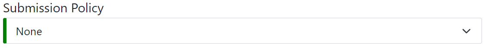
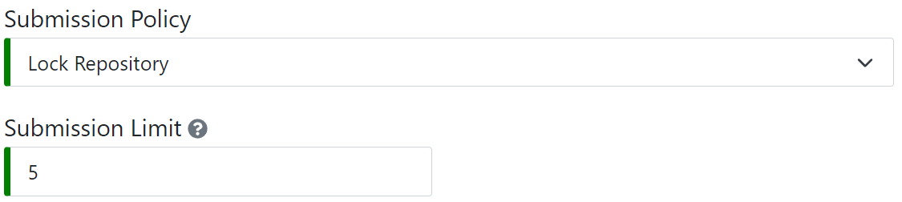
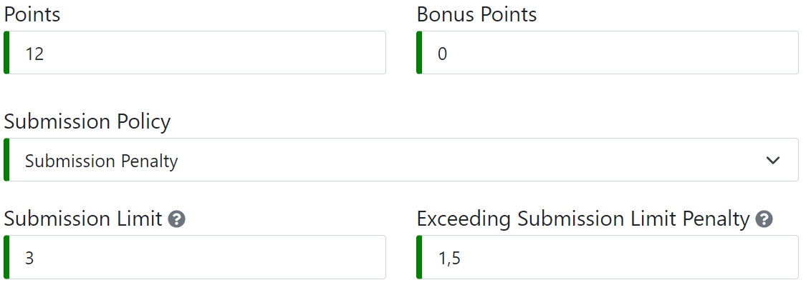
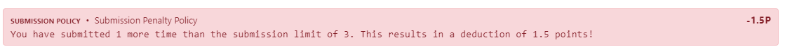
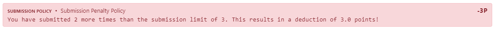
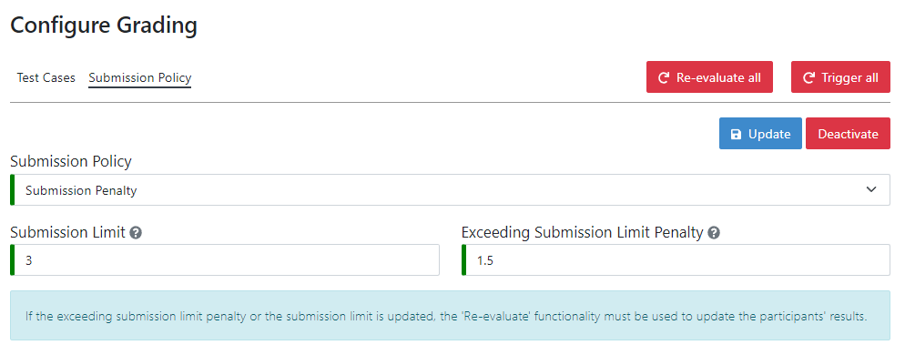
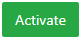

.. _configure_submission_policies:

The submission policy defines the effect that a submission has on the participation of one participant in a programming exercise.
A programming exercise might have no submission policy at all, or one submission policy, but never more than one. Submission policies are initially specified
in the creation process of a programming exercise and can later be adjusted in the grading configuration of the particular programming exercise.

.. note::
    One submission is defined by one push to the exercise participation repository by the participant themself that triggers the
    automatic tests resulting in feedback for the participant. Automatic test runs triggered by instructors are not considered submissions.

Submission Policy Configuration & General Information
^^^^^^^^^^^^^^^^^^^^^^^^^^^^^^^^^^^^^^^^^^^^^^^^^^^^^

Choosing the right submission policy configuration depends on the exercise and your teaching style.
In general, lock repository and submission penalty policies combat trial-and-error solving approaches.

**1. None**
When selecting no submission policy, exercise participants can submit their solution as often as they want until the deadline.

**2. Lock Repository**
Participants can submit a fixed number of times within the submission period of a programming exercise. Once the participant reaches the submission limit,
further participation in the exercise is prevented by locking the participation repository. The participant may still work on their solution locally, but
cannot submit it to Artemis to receive feedback.

With the example configuration shown in the figure above, participants can submit their solution 5 times and receive feedback 5 times.
After that, Artemis locks the participation repository, so the participant can no longer push their solutions to their repository.

.. note::
    When locking the participation repository upon reaching the submission limit fails for any reason and the participant submits again,
    Artemis attempts to lock the repository again and sets the newly generated result to |not-graded|.

**3. Submission Penalty**
Participants can submit as often as they want until the deadline, however, for each submission exceeding the submission limit,
the *exceeding submission limit penalty* is deducted from the participant's score. The exceeding submission limit penalty must be
provided as a positive number of points.

With the example configuration shown in the figure above, participants can submit their solution 3 times regularly. For every
submission exceeding the limit of 3, 1.5 points are deducted from the participant's score. The score cannot be negative.
For example, when the participant reaches 6 out of 12 points on the 4th submission, 1.5 points are deducted for the one submission exceeding
the limit of 3, resulting in a participation score of 4.5 instead of 6 out of 12. On the 5th submission, 3 points are deducted
for 2 submissions exceeding the limit. The student receives feedback that explains the deduction.

Updating Submission Policies
^^^^^^^^^^^^^^^^^^^^^^^^^^^^

After generating a programming exercise initially, submission policies can be updated and toggled on the grading page
of the programming exercise.

**1. (De)activating Submission Policies**
When the submission policy of a programming exercise is active, the |deactivate| button is displayed.
When the policy is inactive, the |activate| button is displayed instead. The active submission policy of an exercise can
be deactivated by pressing |deactivate|. When the policy is deactivated, Artemis will no longer enforce the policy. Repositories that were
locked due to the enforcement of the submission policy, get unlocked. Submission policies can be activated again by pressing |activate|.
When (de)activating a submission penalty policy, |re-evaluate| must be pressed in order to apply the effect.

**2. Updating Submission Policies**
Submission policies can be updated during the exercise by modifying the configuration and pressing |update|. When updating a policy,
the effect of the former policy is removed and the effect of the new policy is applied. When the new policy is a submission penalty policy,
|re-evaluate| must be pressed to update the latest results of all participants.

**3. Deleting Submission Policies**
Submission policies can be deleted by selecting *None* as submission policy type and pressing |update|. When deleting submission policies,
their effect on participations is removed. Every repository that is locked due to a lock repository policy is unlocked and the
participant can continue working on the exercise. When deleting a submission penalty policy, |re-evaluate| must be pressed in order
to revert the submission policy effect.

