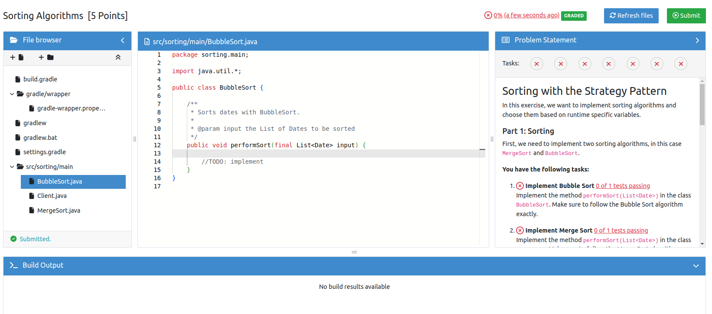
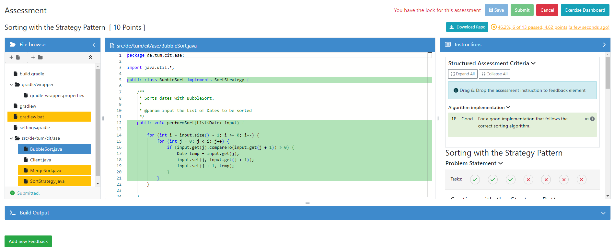
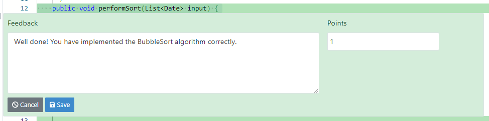
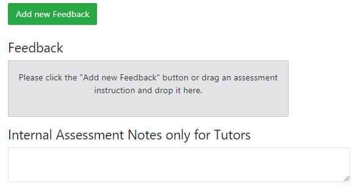
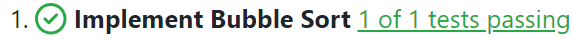

.. _programming:

Programming Exercise
====================

.. contents:: Content of this document
    :local:
    :depth: 2

|

Overview
--------

Conducting a programming exercise consists of 7 steps distributed among
instructor, Artemis and students:

1. **Instructor prepares exercise:** Set up a repository containing the
   exercise code and test cases, build instructions on the CI server,
   and configures the exercise in Artemis.
2. **Student starts exercise:** Click on start exercise on Artemis which
   automatically generates a copy of the repository with the exercise
   code and configures a build plan accordingly.
3. **Optional: Student clones repository:** Clone the personalized
   repository from the remote VCS to the local machine.
4. **Student solves exercise:** Solve the exercise with an IDE of choice
   on the local computer or in the online editor.
5. **Student uploads solution:** Upload changes of the source code to
   the VCS by committing and pushing them to the remote server (or by
   clicking submit in the online editor).
6. **CI server verifies solution:** verify the student’s submission by
   executing the test cases (see step 1) and provide feedback which
   parts are correct or wrong.
7. **Student reviews personal result:** Reviews build result and
   feedback using Artemis. In case of a failed build, reattempt to solve
   the exercise (step 4).
8. **Instructor reviews course results:** Review overall results of all
   students, and react to common errors and problems.

The following activity diagram shows this exercise workflow.

.. figure:: programming/ExerciseWorkflow.png
   :alt: Exercise Workflow
   :align: center

   Exercise Workflow

Exercise Templates
------------------

The subsequent sections describe the programming-related features that Artemis supports.

.. include:: programming-exercise-features.inc

Exercise Creation
-----------------

.. include:: programming-exercise-setup.inc

Exercise Import
---------------

.. include:: programming-exercise-import.inc

Static Code Analysis Default Configuration
------------------------------------------

The following sections list the rules that are active for the default static code analysis configuration.

.. include:: programming-sca-default-configuration.inc

Submission Policy Configuration
-------------------------------

The following sections explain the configuration options for submission policies:

.. include:: programming-submission-policy-configuration.inc

Online Editor
-------------

The following screenshot shows the online code editor with interactive
and dynamic exercise instructions on the right side. Tasks and UML
diagram elements are referenced by test cases and update their color
from red to green after students submit a new version and all test cases
associated with a task or diagram element pass. This allows the students
to immediately recognize which tasks are already fulfilled and is
particularly helpful for programming beginners.

   Online Editor

Display of hidden files
^^^^^^^^^^^^^^^^^^^^^^^

The online editor displays only visible files, to avoid showing for example ``.git`` and ``.gitignore`` config files.
This also means that other config files, like SwiftLint's ``.swiftlint.yml`` file, are not shown. Those files currently
can only be accessed via your own IDE.

Manual Assessment
-----------------

There are two ways to manually assess programming exercises: with the Orion plugin, you can assess the student's code directly in your JetBrains IDE. Refer to the :ref:`Orion plugin documentation <orion>` for more information.
Alternatively, you can use the online editor within Artemis to assess the students' submissions directly in the browser.

   Manual assessment in the online editor

For manual assessment, the online editor provides the following features tailored to the assessment process:

1. **File browser**: The file browser shows the files in the student's submission and allows you to navigate between them. Changed files are highlighted in yellow.
2. **Build output**: The build output shows the output of the build process, if any. This is useful in case of build errors.
3. **Read-only editor**: The read-only editor allows you to view the student's code. It highlights all changed lines.
4. **Instructions**: The instructions provide the structured grading criteria and the problem statement, including the tasks the student has solved successfully as determined by the test cases of the exercise. You can review the test cases associated with each task by clicking on the number of passing tests next to the task, e.g. |problem-statement-task|
5. **Result**: The top right corner holds the current result of the student's submission. By clicking on it, you can review the test cases and feedback currently attached to the submission.

You can add feedback directly in the source code by first hovering over the line you want to comment on and then clicking the |add-feedback-button| that appears next to the line number. Students will be able to see feedback added this way in the same location when viewing their assessed submission in the online editor.

   Editing feedback in the online editor

After clicking the |add-feedback-button| button, you can enter a feedback comment and assign a score for the selected line. Alternatively, you can drag one of the structured assessment criteria from the instructions to the feedback area to apply it to the feedback widget.
When you are done, click the |save-button| button to save your feedback or the |cancel-feedback-button| button to discard it.

   General feedback in the online editor

You can also add general feedback by scrolling to the bottom of the page and clicking |add-general-feedback-button|. Feedback given this way is not tied to any specific file or line of code.

To save your changes, click the |save-button| button at the top right of the page. To finalize the assessment, click the |submit-assessment-button| button. Note that you can save your assessment multiple times before submitting it.
Once submitted, you cannot make any further changes to the assessment unless you are an instructor.

.. |save-button| image:: general/save-button.png

Repository Access
-----------------

.. include:: programming-repository-access.inc

Testing with Ares
--------------------------------------

Ares is a JUnit 5 extension for easy and secure Java testing on Artemis.

Its main features are

* a security manager to prevent students crashing the tests or cheating
* more robust tests and builds due to limits on time, threads and io
* support for public and hidden Artemis tests, where hidden ones obey a custom due date
* utilities for improved feedback in Artemis like processing multiline error messages
  or pointing to a possible location that caused an Exception
* utilities to test exercises using System.out and System.in comfortably

**For more information see** `Ares GitHub <https://github.com/ls1intum/Ares>`__

.. _best_practices_for_test_cases:

Best practices for writing test cases
-------------------------------------

The following sections describe best practices for writing test cases.
The examples and explanations are specifically written for Java (using Ares/JUnit5), but the practices can also be generalized
for other programming languages.

.. include:: test-case-best-practices.inc

Sending Feedback back to Artemis
--------------------------------

Per default the results of all unit tests are extracted and sent back to Artemis without any further manual interaction needed.
Only for some custom setups a semi-automatic approach might be necessary.

Jenkins
^^^^^^^

In the Jenkins CI-System the test case feedbacks are extracted from XML-Files in the JUnit format.
The Jenkins plugins reads all such files from a folder ``results`` in the top level of the Jenkins workspace.
The files resulting from the execution of regular executed unit tests are copied to this folder automatically.

To add additional custom test case feedbacks another mechanism is provided by creating a folder
``customFeedbacks`` also on the top level of the workspace.
In this folder an arbitrary number of JSON-Files can be created.
Each one represents a single test case feedback and should have the format:
``{ "name": string, "successful": boolean, "message": string }``

* ``name``: This is the name of the test case as it will be shown for example on the ‘Configure Grading’ page.
  It should therefore have a for this exercise uniquely identifiable name and **has to be non-null and not empty**.
* ``successful``: Indicates if the test case execution for this submission should be marked as successful or failed.
  Defaults to ``false`` if not present.
* ``message``: The message shown as additional information to the student.
  **Required for non-successful tests/feedback**, optional otherwise.

Integrated Code Lifecycle
-------------------------

The Artemis Integrated Code Lifecycle system allows you to use programming exercises fully integrated within Artemis, without the need of any external tools.
Find more information on it :ref:`here<integrated code lifecycle>`.
