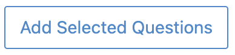

Quiz exercise
=============
.. contents:: Content of this document
    :local:
    :depth: 2

Overview
--------

1. Prepare a quiz exercise (Instructor)
2. Resolve a quiz exercise (Student)
3. Assess the submissions (Instructor)

1. Prepare a quiz exercise
--------
This section describes the process to create a quiz exercise.

- In the home page, click on Course Management button |CourseManagementButton|
- Navigate into **Exercises** of your preferred course clicking in the exercise button.

    .. figure:: quiz/course-dashboard.png
            :align: center

- In the quiz exercises part click on the create a quiz button

    .. figure:: quiz/buttons-to-create-a-quiz.png
            :align: center

- The following form will be open for create the quiz.

    .. figure:: quiz/create-a-quiz-form.png
            :align: center

    - **Title**: Title of the quiz exercise
    - **Categories**: Category of the quiz exercise
    - **Difficulty**: Difficulty of the quiz exercise: No level, Easy, Medium or Hard
    - **Duration**: Time to solve of the quiz exercise
    - **Options**: To chose between present the questions in Random order or not.
    - **Batch Mode**: Batch Mode controls how students can participate in the quiz.

        - Synchronized: There is exactly opportunity for all students to participate in the quiz at once.
        - Batched: There are multiple opportunities for students to participate in the quiz by using a password.
        - Individual: Students can participate in the quiz by themselves at any time while it is released..

    - **Visible from**: The date when the quiz becomes visible to students. Students can start working on the quiz from this time onward.
    - **Schedule Quiz Start**: To make available the start working time to solve teh quiz.

        - **Start of working time**: Set the time when the students are able to see the questions and start answering.
    - **Should this exercise be included in the course score calculation?**:
        - Yes: the points will be included in the course score calculation
        - No: the points will be included in the course score calculation.
        - Bonus: the points will be bonus points.
    - **Questions**:
        - Add Multiple-Choice Question

            .. figure:: quiz/multiple-choice-question.png
                :align: center

            - Short question title
            - Points
            - Scoring type
            - Present answer Options in Ransom order
            - Single Choice Mode
            - Delete icon
            - Edit View
            - Preview View
            - Format bar
            - Text editor

        - Add Drag-And-Drop Question

            .. figure:: quiz/drag-and-drop-question.png
                :align: center

            - Short question title
            - Points
            - Scoring type
            - Present Drag Items in Ransom order
            - Delete icon
            - Edit View
            - Format bar
            - Text editor
            - Upload Background
            - Add Drag Items
            - Preview View

        - Add Short-Answer Question

            .. figure:: quiz/short-answer-question.png
                :align: center

            - Short question title
            - Points
            - Scoring type
            - Match Letter Case
            - Match Answers Exactly
            - Delete icon
            - Add Spot and Answer Option
            - Edit Text Field
            - Text and Preview View Buttons

        - Add Existing Questions
            This option allows to insert questions from: a course, an exam and a file.

            .. figure:: quiz/existing-question.png
                :align: center

            - List picker to select the course, exam or file
            - Searching bar
            - Filter options according the type of questions
            - Apply filter button
            - List of questions

            Select in the add column the questions to be added and and the end of the list click the Add selected Questions Button |AddSelectedQuestionsButton|.

    - **Footer**: In the footer of the page it is visible:

            .. figure:: quiz/footer.png
                :align: center
                :scale: 50

        - Error messages
        - Warning messages
        - Cancel Button
        - Save Button

.. |CourseManagementButton| image:: quiz/CourseManagementButton.png
    :scale: 50

