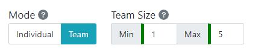
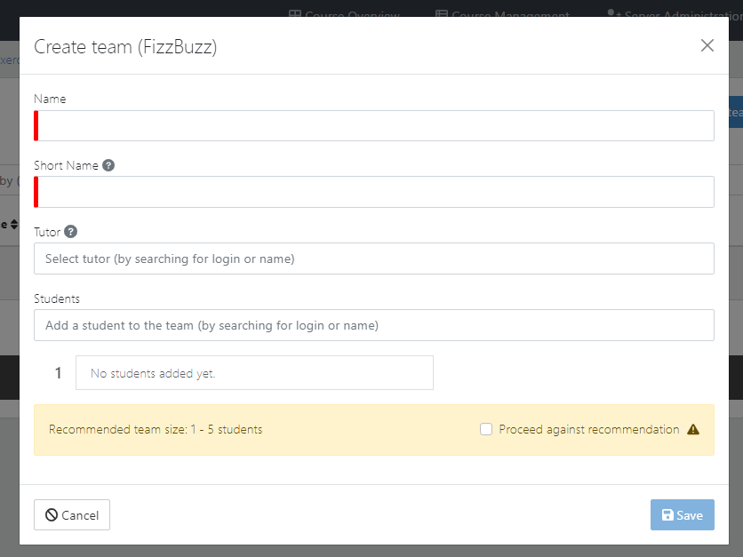
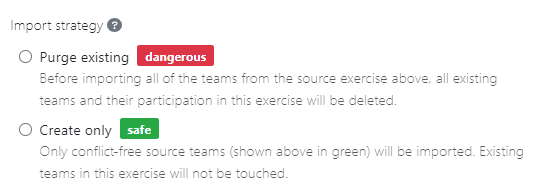
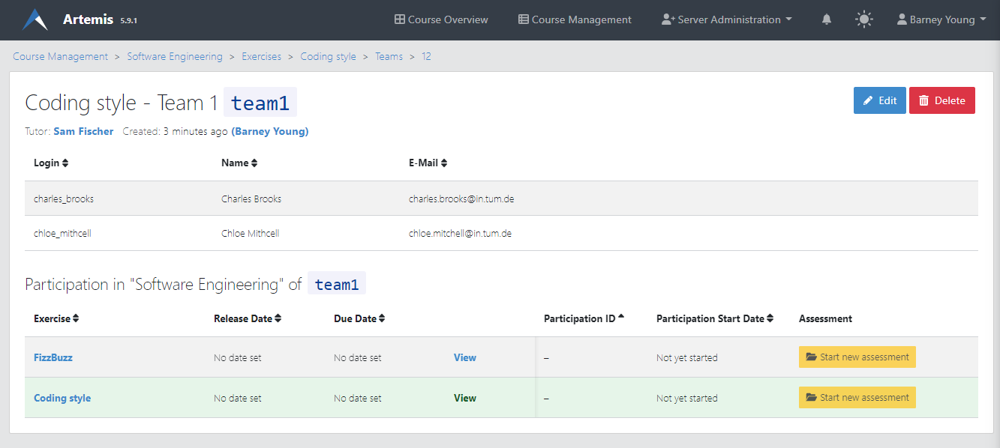

Team exercises
==============

.. contents:: Content of this document
    :local:
    :depth: 2

Overview
--------

Team exercises are supported for:

* :doc:`Programming exercises <programming>`
* :doc:`Modeling exercises <modeling>`
* :doc:`Textual exercises <textual>`
* :doc:`File upload exercises <file-upload>`

There are three important aspects to team exercises:

1. **Instructor sets up exercises and teams:** Creates and configures the exercises to use **Team mode**, assigns students and tutors to teams.
2. **Students work in teams:** Collaboratively work on the exercises.
3. **Tutors overview the teams:** Review the handed in files and create manual results for the students.

Setup
-----

When creating an exercise, the instructor needs to configure the exercise to use **Team mode**. This is only available during the creation of the exercise, as it **can not be changed later on**.
The team size can also be configured, but it is just a recommendation that can be overridden when creating the actual teams.

    Set Team Mode

Instructors can click on the |teams_button| button in the course exercises page to navigate to the team management page.

.. figure:: team-exercises/manage_teams.png
    :align: center
    :alt: Manage teams

    Manage teams

Clicking |create_team_button| opens the dialog shown below. To manually create a team instructors must define the name, short name and students for the team. Optionally, a
tutor can also be assigned to the team.

    Create team dialog

Instructors can also edit and delete already existing teams.

To facilitate the process of creating teams, instructors can use the |export_teams_button| button to export the teams in an exercise to a file, which can then be imported in other exercises.

To import teams into an exercise, instructors can use the |import_teams_button| button. This allows them to choose between importing from a file, or importing directly from
another exercise in the course. In both cases, instructors must choose if they want to delete all the existing teams, or only create new teams, as shown below:

    Import strategy

The same team can be shared for multiple exercises. Viewing the page for a single teams allows both students, tutors and instructors to get an overview of all the
exercises for that team along with their current status. To access the team overview page, users can click on |team_button| or on the team's short name.

    Team overview

Collaboration
-------------

Users can see their team
Show shared text editor
Users can see the live status of the other teams

Tutor overview
--------------

Show the tutor overview for the team for multiple exercises

.. |teams_button| image:: team-exercises/teams_button.png

.. |team_button| image:: team-exercises/team_button.png

